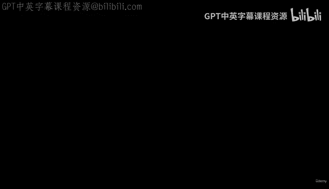
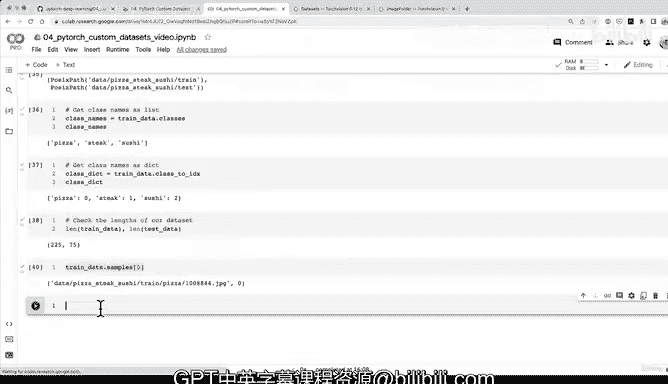

# 139：使用 ImageFolder 加载图像并转换为张量 📸➡️🔢



## 概述
在本节课中，我们将学习如何使用 PyTorch 的 `torchvision.datasets.ImageFolder` 类，将存储在标准图像分类格式文件夹中的图像数据加载并转换为模型所需的张量格式。我们将结合之前学到的数据变换（transforms）知识，创建一个可直接用于训练的数据集。

---

上一节我们介绍了如何使用 `transforms` 对图像进行预处理和转换为张量。本节中，我们来看看如何利用 PyTorch 内置的工具，自动加载整个文件夹的图像并应用这些变换。

观察这个可视化结果。我们有一些原始图像和一些经过变换的图像。经过变换的图像的优势在于，它们已经是张量格式，这正是我们的模型所需要的。这是我们逐步努力的目标。我们有了数据集，现在也有了将其转换为模型就绪张量的方法。

我们再可视化一些图像。这里将关闭随机种子，以便查看更多随机图像。

效果不错。我们看到牛排图像因为调整尺寸到 64x64 而像素化了，这张图片也进行了水平翻转，披萨图像也做了同样处理。我们再完成最后一张图像的展示。

很好，这就是 `transforms` 的核心：将图像转换为张量，并且可以根据需要操作这些图像。

现在，我们进入第四部分，这是第一种数据加载方式。

## 选项一：使用 ImageFolder 加载图像数据

`torchvision.datasets` 模块包含了许多内置函数来帮助加载数据。回想一下，PyTorch 视觉领域的每个主要库都有自己的数据模块。在本例中，我们将使用 `ImageFolder` 类，它可以帮助我们加载符合通用图像分类格式的数据。这是一个预构建的数据集函数，就像有预构建的数据集一样，我们可以使用预构建的数据集加载函数。

> **提示**：选项二（后续课程的剧透）是我们将创建自己的自定义数据集加载器，这会在后面的视频中看到。

现在，让我们看看如何使用 `ImageFolder` 将我们所有的自定义图像加载为张量。这正是 `transforms` 将发挥作用的地方。

以下是使用 `ImageFolder` 加载图像分类数据的步骤：

首先，从 `torchvision` 导入 `datasets` 模块，因为 `ImageFolder` 类位于其中。

```python
from torchvision import datasets
```

接着，为训练目录创建数据集。我们将传入根目录路径（我们的 `train_dir`）和一个 `transform` 参数，该参数将等于我们之前定义的 `data_transform`。

```python
train_data = datasets.ImageFolder(root=train_dir,
                                  transform=data_transform,
                                  target_transform=None)
```

`transform` 参数用于对图像数据进行变换，而 `target_transform` 参数用于对标签（或目标）进行变换。在我们的案例中，不需要对标签进行变换，因为标签将由图像所在的目标目录推断出来。披萨图像所在的目录将使它们获得“pizza”标签，因为我们的数据集是标准图像分类格式。

现在，对测试数据执行相同的操作。

```python
test_data = datasets.ImageFolder(root=test_dir,
                                 transform=data_transform)
```

在幕后，我们所有的图像都将通过这些变换步骤，这正是它们被转换为数据集时的样子。

让我们打印出我们的数据集，看看它们的具体信息。

```python
print(train_data)
print(test_data)
```

我们将得到一个 PyTorch 数据集对象（一个 `ImageFolder` 实例），其中包含数据点数量、根目录位置以及应用的变换信息。

使用 PyTorch 预构建数据加载器（或数据集加载器）的好处之一是它附带了许多有用的属性。

以下是我们可以从 `ImageFolder` 实例获取的一些关键信息：

*   **获取类别名称列表**：`train_data.classes` 将返回一个包含所有类别名称（如 ‘pizza‘, ‘steak‘, ‘sushi‘）的列表。这在后续绘图或预测时用于标注图像非常有用。
*   **获取类别到索引的映射字典**：`train_data.class_to_idx` 返回一个将字符串类别名称映射到其整数索引的字典（例如 {‘pizza‘: 0, ‘steak‘: 1, ‘sushi‘: 2}）。如果需要对标签本身进行某种形式的转换，可以在此处传入 `target_transform` 参数。
*   **检查数据集的长度**：使用 `len(train_data)` 和 `len(test_data)` 可以获取训练集和测试集的样本数量。
*   **探索其他属性**：你还可以查看 `.samples`（所有图像路径和标签）、`.targets`（所有标签列表）等属性。

现在我们已经完成了数据加载。让我们延续一直以来的做法，从训练数据集中可视化一个样本及其标签。

---



## 总结
本节课中，我们一起学习了如何使用 `ImageFolder` 将图像加载为张量。由于我们的数据已经是标准图像分类格式，因此可以利用 `torchvision.datasets` 中的一个预构建函数来简化流程。在下一视频中，我们将进行更多的可视化操作。