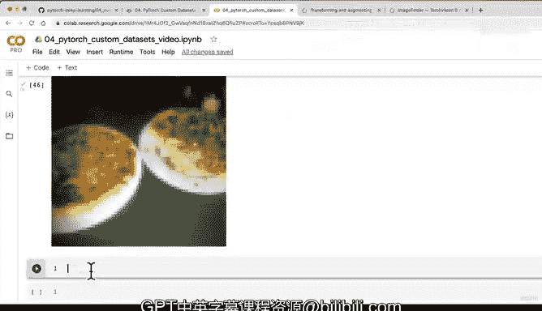

# 140：可视化训练集加载图像 🖼️


在本节课中，我们将学习如何从已转换为张量的训练数据集中加载和可视化单个图像样本。我们将检查图像的形状、数据类型和标签，并使用Matplotlib将其正确显示出来。

---

## 从数据集中获取样本

上一节我们使用`ImageFolder`和转换管道将图像数据转换成了张量。现在，我们来看看如何从这个数据集中提取样本。

我们可以通过索引`train_data`数据集来获取单个图像及其标签。

```python
# 获取训练数据集的第一个样本
image, label = train_data[0]
```

执行上述代码后，`image`变量将包含一个图像张量，`label`变量则包含其对应的数字标签（例如，披萨类别的标签可能是0）。

---

## 检查样本信息

在可视化之前，了解数据的格式至关重要。以下是检查图像和标签信息的方法。

```python
# 打印图像张量及其信息
print(f"Image tensor:\n{image}")
print(f"Image shape: {image.shape}")
print(f"Image datatype: {image.dtype}")

# 打印标签及其信息
print(f"Label: {label}")
print(f"Label datatype: {type(label)}")
```

输出结果可能如下：
*   **图像形状**：`torch.Size([3, 64, 64])`，表示3个颜色通道，高度和宽度均为64像素。
*   **图像数据类型**：`torch.float32`，这是PyTorch的默认浮点类型。
*   **标签数据类型**：`int`，整数类型。

了解这些信息有助于在后续建模过程中调试常见的形状、设备或数据类型不匹配错误。

---

## 将数字标签转换回文本

我们的标签目前是数字格式。为了便于理解，我们可以使用之前创建的`class_names`列表将其转换回文本标签。

```python
# 将数字标签转换为人类可读的文本
label_str = class_names[label]
print(f"Label as string: {label_str}")
```

例如，如果`label`是0，`label_str`将是“pizza”。

---

## 可视化图像样本

Matplotlib库期望图像的维度顺序为（高度，宽度，颜色通道）。然而，PyTorch图像张量的默认顺序是（颜色通道，高度，宽度）。因此，我们需要使用`.permute()`方法调整维度顺序。

以下是调整维度并绘制图像的完整步骤：

```python
import matplotlib.pyplot as plt

# 1. 调整图像维度顺序以适应Matplotlib
# 将形状从 [C, H, W] 调整为 [H, W, C]
image_permuted = image.permute(1, 2, 0)

# 打印形状变化以确认
print(f"Original image shape: {image.shape}") # [color_channels, height, width]
print(f"Permuted image shape: {image_permuted.shape}") # [height, width, color_channels]

# 2. 绘制图像
plt.figure(figsize=(10, 7))
plt.imshow(image_permuted)
plt.axis(False) # 关闭坐标轴
plt.title(class_names[label], fontsize=14)
plt.show()
```

执行代码后，你将看到一张（可能有些像素化的）披萨图片。图像像素化是因为我们将原始图像（例如512x512）调整为了64x64的大小。

---

## 练习与探索建议

为了加深理解，我鼓励你尝试以下操作：

*   **随机查看不同样本**：修改索引（如`train_data[10]`）来查看数据集中的其他图像。
*   **调整转换管道**：尝试修改`transforms.Compose`中的参数，例如将`Resize`调整为`(128, 128)`，观察图像质量的变化。
*   **探索更多变换**：查阅`torchvision.transforms`文档，尝试添加其他变换（如色彩抖动、旋转），看看它们如何影响图像。

---

## 下节预告

本节课我们一起学习了如何从自定义数据集中加载、检查并可视化图像样本。我们确认了数据已处于适合输入PyTorch模型的张量格式。



目前，我们拥有的是数据集（Dataset）。在下一节课中，我们将把这些数据集转换为**数据加载器（DataLoader）**。数据加载器能够批量加载数据，并支持随机打乱，这对于高效训练模型至关重要。我建议你先尝试自己创建`train_data_loader`和`test_data_loader`，我们将在下个视频中一起完成这个步骤。