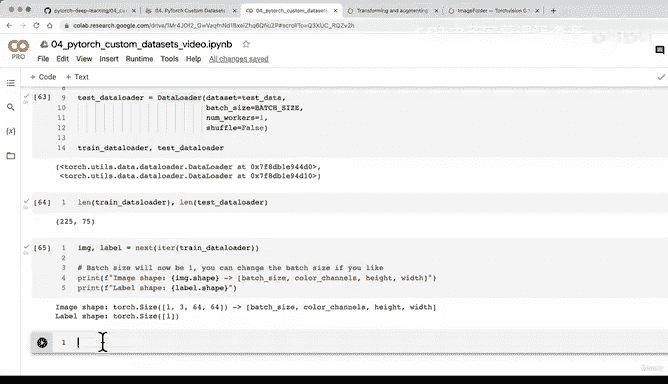

# 141：将图像数据集转换为PyTorch DataLoader 🚀


在本节课中，我们将学习如何将已加载的图像数据集转换为PyTorch的DataLoader。DataLoader是训练深度学习模型的关键组件，它能高效地批量处理数据，并帮助我们更好地管理内存。

---

## 概述

上一节我们介绍了如何使用`torchvision.datasets.ImageFolder`将图像数据加载为PyTorch数据集。本节中，我们来看看如何将这些数据集转换为DataLoader，以便在模型训练时进行批处理和迭代。

---

## DataLoader的作用

DataLoader能帮助我们将数据集转换为可迭代对象。我们可以自定义批次大小，让模型每次处理一批图像。

**核心概念**：`batch_size`参数决定了模型每次看到的图像数量。这对于处理大型数据集至关重要，因为一次性加载所有数据可能导致内存不足。

例如，如果我们的GPU只有16GB内存，尝试一次性加载10万张图像并进行计算，很可能会耗尽内存。通过使用DataLoader，我们可以让模型每次只处理32张图像，从而更有效地利用硬件资源。

---

## 创建DataLoader

以下是创建训练和测试DataLoader的步骤。

首先，导入必要的模块并设置批次大小：

```python
import torch
from torch.utils.data import DataLoader

# 设置批次大小
BATCH_SIZE = 32
```

接下来，创建训练DataLoader。我们将设置`shuffle=True`来打乱训练数据，防止模型学习到数据中的顺序。

```python
# 创建训练DataLoader
train_dataloader = DataLoader(dataset=train_data,
                              batch_size=BATCH_SIZE,
                              num_workers=1,
                              shuffle=True)
```

然后，创建测试DataLoader。对于测试数据，我们通常不进行打乱，以便评估结果的一致性。

```python
# 创建测试DataLoader
test_dataloader = DataLoader(dataset=test_data,
                             batch_size=BATCH_SIZE,
                             num_workers=1,
                             shuffle=False)
```

**参数说明**：
- `num_workers`：用于加载数据的CPU核心数。通常，数值越高，数据加载越快。可以使用`os.cpu_count()`获取可用的CPU核心数。
- `shuffle`：是否打乱数据顺序。训练数据需要打乱，测试数据则保持固定顺序。

---

## 检查DataLoader

创建DataLoader后，我们可以检查其长度和数据结构。

```python
# 检查DataLoader长度
print(f"训练DataLoader长度: {len(train_dataloader)}")
print(f"测试DataLoader长度: {len(test_dataloader)}")
```

当`BATCH_SIZE=1`时，DataLoader的长度与原始数据集相同。如果增大批次大小，长度会相应减少。

---

## 可视化DataLoader中的数据

我们可以从DataLoader中提取一批数据，并查看其形状。

```python
# 从训练DataLoader中获取一批数据
for images, labels in train_dataloader:
    print(f"图像形状: {images.shape}")  # 形状为 [batch_size, color_channels, height, width]
    print(f"标签形状: {labels.shape}")  # 形状为 [batch_size]
    break
```

**输出示例**：
- 当`BATCH_SIZE=1`时，图像形状为`[1, 3, 64, 64]`，标签形状为`[1]`。
- 当`BATCH_SIZE=32`时，图像形状为`[32, 3, 64, 64]`，标签形状为`[32]`。

---

## 总结

本节课中，我们一起学习了如何将PyTorch数据集转换为DataLoader。我们了解了DataLoader的作用、如何设置批次大小和`num_workers`参数，以及如何检查和处理DataLoader中的数据。

通过使用DataLoader，我们可以高效地批量处理图像数据，为后续的模型训练做好准备。下一节，我们将探讨如何在不使用`torchvision.datasets.ImageFolder`的情况下，自定义数据加载流程。

---



我们下节课再见！👋