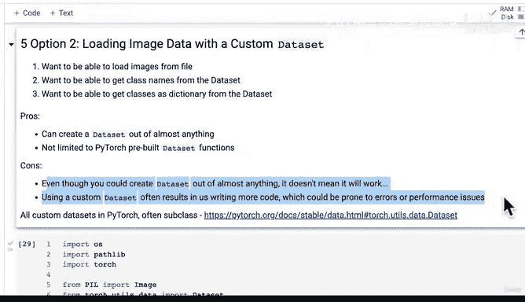

# 142：自定义数据集类高层概览 🧠


在本节课中，我们将学习如何为PyTorch创建自定义的数据集类。我们将从零开始构建一个类，用于从文件目录中加载图像数据，并将其转换为PyTorch可用的张量格式。通过这个过程，你将理解PyTorch数据加载的核心机制，并掌握处理非标准数据集的技能。

## 课程概述

在之前的课程中，我们学习了如何使用PyTorch内置的`ImageFolder`类来加载图像数据。然而，在实际项目中，你可能会遇到没有现成数据加载函数可用的情况。因此，掌握如何创建自定义数据集类是一项非常重要的技能。

## 自定义数据集类的目标

我们的目标是创建一个自定义类，它需要实现以下核心功能：

1.  从文件路径加载图像数据。
2.  能够从数据集中获取类别名称列表。
3.  能够将类别名称映射为字典（例如，`{‘pizza’: 0, ‘steak’: 1, ‘sushi’: 2}`）。

最终，这个类应该能够与PyTorch的`DataLoader`类无缝协作，就像我们之前使用`ImageFolder`一样。

## 创建自定义数据集的优缺点

在开始编码之前，让我们先分析一下创建自定义数据集的利弊。

以下是创建自定义数据集的主要优点：

*   **灵活性高**：你可以为几乎任何格式的数据创建数据集，只要编写相应的加载代码。
*   **不受限制**：你不必局限于PyTorch官方库中预置的数据集函数。

当然，自定义数据集也存在一些缺点：

*   **需要更多测试**：即使代码能运行，也不代表它能完美工作。你需要进行充分的测试，以确保数据加载方式符合预期，并且模型能够正常训练。
*   **代码量更大**：自定义实现通常意味着需要编写更多代码，这可能会引入更多潜在的错误或性能问题。

通常，被纳入PyTorch标准库或领域库（如TorchVision）的功能都经过了大量测试和验证，具有很高的稳健性。而我们自己编写的代码则需要从头开始建立这种稳健性。尽管如此，理解如何构建自定义数据集仍然至关重要。

## 准备工作：导入必要的库

为了构建我们的自定义数据集类，我们需要导入一些Python和PyTorch模块。

```python
import os
from pathlib import Path
import torch
from PIL import Image
from torch.utils.data import Dataset
from torchvision import transforms
from typing import Tuple, Dict, List
```

**代码解释**：
*   `os` 和 `pathlib.Path`：用于处理文件系统和路径操作。
*   `torch`：PyTorch核心库。
*   `PIL.Image`：用于打开和操作图像文件。
*   `torch.utils.data.Dataset`：所有PyTorch数据集的基类。我们的自定义类将继承（子类化）这个类。
*   `torchvision.transforms`：用于将图像数据转换为张量并进行其他预处理。
*   `typing`：用于为函数和类添加类型提示，使代码更清晰。

## 核心概念：继承Dataset基类

在PyTorch中，所有自定义数据集通常都是通过继承（子类化）`torch.utils.data.Dataset`这个**抽象基类**来实现的。

这个基类要求子类必须重写（override）两个关键方法：
1.  `__getitem__(self, index)`：根据索引`index`返回一个数据样本（例如，一个图像张量和其对应的标签）。
2.  `__len__(self)`：返回数据集的总样本数。

在接下来的课程中，我们将详细实现这些方法。本节课我们先搭建好整体的框架。

## 构建辅助函数

在创建完整的自定义数据集类之前，我们先构建一个辅助函数。这个函数的目标是模仿`ImageFolder`的一个功能：给定一个包含分类子文件夹的目录路径，它能自动提取出类别名称。

具体来说，这个函数需要：
*   接收一个目标目录路径（例如，`data/pizza_steak_sushi`）。
*   遍历该目录下的子文件夹，每个子文件夹名代表一个类别（例如，`pizza`, `steak`, `sushi`）。
*   返回一个包含所有类别名称的列表。
*   （可选）返回一个将类别名称映射到数字索引的字典。

这个功能将为我们后续构建数据集类打下基础。

## 本节总结

本节课我们一起学习了创建PyTorch自定义数据集类的高层概览。我们明确了自定义数据集的目标和需要实现的功能，分析了其优缺点，并准备好了编码环境。最重要的是，我们了解到所有自定义数据集都应继承自`torch.utils.data.Dataset`基类，并需要实现`__getitem__`和`__len__`方法。



在下一节课中，我们将开始动手编码，首先实现那个能从目录中提取类别信息的辅助函数。