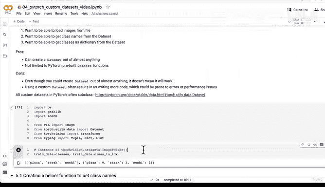

# 143：创建获取类名的辅助函数 📂


在本节课中，我们将学习如何编写一个辅助函数，用于从目录结构中自动获取图像分类任务的类别名称。这个函数将是我们后续构建自定义数据集类的基础。

在上一节视频中，我们讨论了创建自定义数据集的激动人心的概念，并列出了一些我们想要实现的功能。我们了解到，许多自定义数据集类都继承自 `torch.utils.data.Dataset`，这也是我们稍后要做的。本节中，我们将专注于编写一个辅助函数来重现 `torchvision.datasets.ImageFolder` 自动获取类名的功能。

## 5.1 创建辅助函数

我们的目标是创建一个函数，给定一个标准图像分类格式的目录，它能返回类别名称列表和一个将类别名映射到整数的字典。

以下是实现此功能的主要步骤：

1.  **获取类别名称**：使用 `os.scandir()` 遍历目标目录。
2.  **错误处理**：如果未找到任何类别，则引发错误以提示目录结构可能存在问题。
3.  **创建映射字典**：将类别名称列表转换为字典，以便计算机可以使用数字（而非字符串）作为标签。

让我们开始编写代码。首先，我们导入必要的模块。

```python
import os
from typing import Tuple, List, Dict
```

接下来，我们定义函数 `find_classes`。它接收一个目录路径字符串，并返回一个包含类别列表和映射字典的元组。

```python
def find_classes(directory: str) -> Tuple[List[str], Dict[str, int]]:
    """
    在目标目录中查找类别文件夹名称。

    参数:
        directory (str): 目标目录路径。

    返回:
        Tuple[List[str], Dict[str, int]]: (类别列表, 类别名到索引的字典)。
    """
```

现在，我们来实现上述步骤。

**步骤一：扫描目录获取类别名**

我们使用 `os.scandir()` 来遍历目录，并筛选出其中的文件夹条目。

```python
    # 1. 通过扫描目标目录获取类别名称
    classes = sorted(entry.name for entry in os.scandir(directory) if entry.is_dir())
```

**步骤二：添加错误检查**

如果 `classes` 列表为空，说明在指定目录中未找到任何类别文件夹，此时我们抛出一个 `FileNotFoundError`。

```python
    # 2. 如果未找到类别名则引发错误
    if not classes:
        raise FileNotFoundError(f"在目录 ‘{directory}’ 中找不到任何类别。请检查文件结构。")
```

**步骤三：创建类别名到索引的映射字典**

计算机处理数字标签比字符串标签更高效。我们使用 `enumerate()` 函数为每个类别名分配一个唯一的整数索引。

```python
    # 3. 创建索引标签的字典
    class_to_idx = {cls_name: i for i, cls_name in enumerate(classes)}
```

最后，函数返回这两个结果。

```python
    return classes, class_to_idx
```

让我们测试一下这个函数。假设我们的数据目录结构如下：

```
data/train/
    pizza/
    steak/
    sushi/
```

我们可以这样调用函数：

```python
# 示例：使用训练目录
target_dir = "data/train"
class_names, class_dict = find_classes(target_dir)

print(f"类别名称: {class_names}")
print(f"类别映射字典: {class_dict}")
```

运行上述代码，你将得到类似以下的输出：

```
类别名称: [‘pizza‘, ‘steak‘, ‘sushi‘]
类别映射字典: {‘pizza‘: 0, ‘steak‘: 1, ‘sushi‘: 2}
```

至此，我们已经成功复制了 `torchvision.datasets.ImageFolder` 自动获取类别信息的核心功能。这个辅助函数 `find_classes` 将成为我们下一节构建自定义 `Dataset` 类的重要组件。

## 总结



本节课中，我们一起学习了如何创建一个辅助函数 `find_classes`。该函数能够自动扫描指定目录，提取符合标准图像分类格式的类别文件夹名称，并将其转换为列表和映射字典。我们实现了三个关键步骤：目录遍历、错误处理以及创建标签映射。在下一节课中，我们将利用这个函数，通过子类化 `torch.utils.data.Dataset` 来完整地复现一个自定义的图像数据集类。