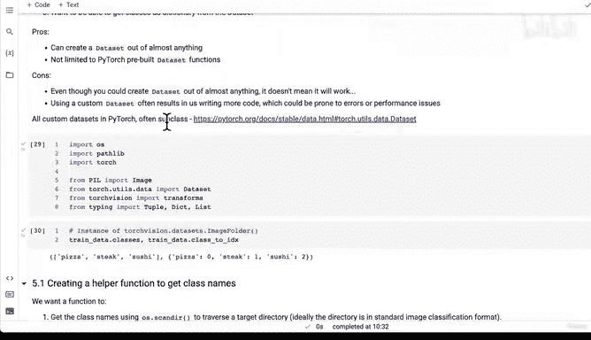

# 144：从零编写PyTorch自定义数据集类 📁


在本节课中，我们将学习如何通过继承 `torch.utils.data.Dataset` 类，从零开始构建一个自定义的PyTorch数据集类。我们将复现 `torchvision.datasets.ImageFolder` 的核心功能，并理解其内部工作机制。

## 概述

上一节我们编写了一个名为 `find_classes` 的辅助函数，它接收一个目标目录并返回一个类名列表以及一个将类名映射到整数的字典。本节中，我们来看看如何利用这个函数，创建一个完整的自定义数据集类。

## 创建自定义数据集的步骤

要创建一个自定义数据集，我们需要遵循几个关键步骤。以下是构建过程的核心要点：

1.  **继承基类**：我们的自定义类需要继承自 `torch.utils.data.Dataset`。
2.  **初始化方法**：在 `__init__` 方法中，我们需要接收目标目录和可选的图像变换函数。
3.  **定义属性**：创建必要的属性，例如图像路径列表、变换函数、类名列表和类名到索引的映射字典。
4.  **创建图像加载函数**：编写一个函数，用于根据索引加载并返回图像。
5.  **重写 `__len__` 方法**：此方法应返回数据集中样本的总数。
6.  **重写 `__getitem__` 方法**：这是核心方法，它接收一个索引，并返回对应的（图像，标签）元组。

## 代码实现详解

现在，让我们一步步将这些概念转化为代码。

### 1. 导入与类定义

首先，我们需要导入必要的模块并定义我们的自定义数据集类。

```python
import torch
from torch.utils.data import Dataset
import pathlib
from PIL import Image

class ImageFolderCustom(Dataset):
    # 后续代码将写在这里
```

### 2. 初始化方法 `__init__`

在 `__init__` 方法中，我们设置数据集的基本参数和属性。

```python
    def __init__(self, targ_dir: str, transform=None):
        # 获取所有图像文件的路径
        self.paths = list(pathlib.Path(targ_dir).glob("*/*.jpg"))
        # 设置图像变换函数
        self.transform = transform
        # 获取类名列表和类名到索引的映射字典
        self.classes, self.class_to_idx = find_classes(targ_dir)
```

### 3. 图像加载函数 `load_image`

这个辅助函数负责打开指定索引的图像。

```python
    def load_image(self, index: int) -> Image.Image:
        """根据索引打开图像并返回。"""
        image_path = self.paths[index]
        return Image.open(image_path)
```

### 4. 重写 `__len__` 方法

此方法返回数据集中样本的数量。

```python
    def __len__(self) -> int:
        """返回数据集中样本的总数。"""
        return len(self.paths)
```

### 5. 重写 `__getitem__` 方法

这是数据集类的核心，它定义了如何通过索引获取一个数据样本。

```python
    def __getitem__(self, index: int) -> tuple[torch.Tensor, int]:
        """返回一个数据样本（图像，标签）。"""
        # 1. 加载图像
        img = self.load_image(index)
        # 2. 从文件路径中提取类名
        # 假设路径格式为：data_folder/class_name/image.jpg
        class_name = self.paths[index].parent.name
        # 3. 将类名转换为索引（标签）
        class_idx = self.class_to_idx[class_name]

        # 4. 如果提供了变换函数，则应用变换
        if self.transform:
            return self.transform(img), class_idx
        # 否则，返回原始图像和标签
        else:
            return img, class_idx
```

## 总结



本节课中我们一起学习了如何从零构建一个PyTorch自定义数据集类。我们通过继承 `torch.utils.data.Dataset` 并重写 `__len__` 和 `__getitem__` 方法，成功复现了 `ImageFolder` 的基本功能。这个自定义类 `ImageFolderCustom` 现在可以像官方数据集一样，与 `DataLoader` 配合使用，用于训练深度学习模型。掌握创建自定义数据集的能力，是处理非标准或特定领域数据的关键步骤。在下一节，我们将测试这个自定义类，确保它能正确工作。