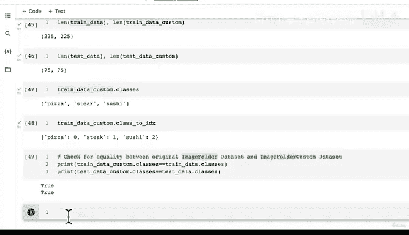

# 145：对比自定义数据集类与原始ImageFolder类 📊


在本节课中，我们将学习如何创建一个自定义的数据集类，并验证其功能是否与PyTorch内置的`ImageFolder`类一致。我们将通过设置数据转换、实例化自定义类并进行一系列对比测试来完成这一目标。

---

## 设置数据转换

上一节我们介绍了自定义数据集类的基本结构。本节中，我们来看看如何为数据准备转换流程，以便将图像转换为PyTorch可处理的张量格式。

我们需要创建两个转换管道：一个用于训练数据（包含数据增强），另一个用于测试数据（仅进行基础转换）。

```python
import torchvision.transforms as transforms

train_transforms = transforms.Compose([
    transforms.Resize(size=(64, 64)),
    transforms.RandomHorizontalFlip(),
    transforms.ToTensor()
])

test_transforms = transforms.Compose([
    transforms.Resize(size=(64, 64)),
    transforms.ToTensor()
])
```

训练转换流程将图像尺寸调整为64x64像素，并随机进行水平翻转以增强数据多样性。测试转换流程仅调整尺寸并转换为张量，不对测试数据进行数据增强操作。

---

## 实例化自定义数据集类

现在，我们将使用自定义的`ImageFolderCustom`类来加载我们的训练和测试数据。

以下是实例化过程的代码：

```python
train_data_custom = ImageFolderCustom(tdir=train_dir,
                                      transform=train_transforms)

test_data_custom = ImageFolderCustom(tdir=test_dir,
                                     transform=test_transforms)
```

我们分别传入了训练和测试数据的目录路径，以及对应的转换流程。

---

## 验证自定义类的功能

接下来，我们将从多个维度对比自定义数据集类与原始`ImageFolder`类的输出，以确保功能一致。

以下是需要验证的几个关键点：

1.  **数据集长度**：检查两个类加载的数据样本数量是否相同。
2.  **类别属性**：检查`classes`和`class_to_idx`属性是否一致。
3.  **数据样本**：尝试获取单个样本，确认其格式（图像张量和标签）是否正确。

让我们执行这些检查：

```python
# 1. 检查数据集长度
print(len(train_data_custom) == len(train_data))
print(len(test_data_custom) == len(test_data))

# 2. 检查类别属性
print(train_data_custom.classes == train_data.classes)
print(train_data_custom.class_to_idx == train_data.class_to_idx)

# 3. 检查单个样本
sample_image, sample_label = train_data_custom[0]
print(f"Image shape: {sample_image.shape}, Label: {sample_label}")
```

如果所有比较结果都为`True`，并且样本格式正确，则证明我们的自定义类成功复制了原始`ImageFolder`类的核心功能。

---

## 核心概念与总结

本节课中我们一起学习了如何构建并验证一个自定义的PyTorch数据集类。关键在于继承`torch.utils.data.Dataset`基类，并重写`__len__`和`__getitem__`这两个核心方法。

**核心公式**可以概括为：
**自定义数据集类 = `Dataset`基类 + `__len__`方法 + `__getitem__`方法**

通过这种方式，无论你的数据以何种格式存储，都可以创建一个与之交互的数据加载器，从而无缝地集成到PyTorch的训练流程中。



在下一讲中，我们将创建一个可视化函数，从我们自定义的数据集中随机显示一些图像，以更直观地验证数据加载的正确性。