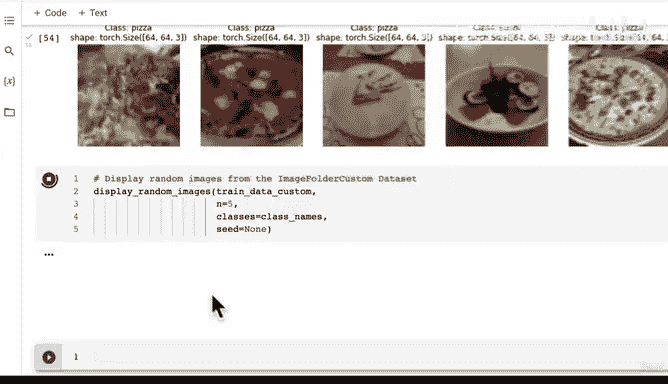

# 146：编写自定义数据集随机图像可视化函数 📊


在本节课中，我们将学习如何编写一个辅助函数，用于从自定义数据集中随机选取并可视化图像。通过可视化，我们可以直观地检查数据加载和预处理是否正确。

---

## 概述

上一节我们介绍了如何创建自定义数据集。本节中，我们来看看如何编写一个函数来可视化数据集中的随机图像，以验证数据加载过程是否正常。

## 创建可视化函数

以下是创建 `display_random_images` 函数的步骤。

### 步骤一：定义函数参数

首先，我们需要定义一个函数，它接收一个数据集、类别名称列表以及要显示的图像数量等参数。

```python
def display_random_images(dataset: torch.utils.data.Dataset,
                          classes: list[str] = None,
                          n: int = 10,
                          display_shape: bool = True,
                          seed: int = None):
```

### 步骤二：限制显示图像数量

为了防止显示过多图像导致布局混乱，我们将最大显示数量限制为10张。如果传入的 `n` 大于10，则进行调整。

```python
    if n > 10:
        n = 10
        display_shape = False
        print("For display purposes, n shouldn't be larger than 10, setting to 10 and removing shape display.")
```

### 步骤三：设置随机种子

为了确保结果可复现，我们可以设置一个随机种子。

```python
    if seed:
        random.seed(seed)
```

### 步骤四：获取随机样本索引

接下来，我们需要从数据集中随机抽取 `n` 个样本的索引。

```python
    random_samples_idx = random.sample(range(len(dataset)), k=n)
```

### 步骤五：设置绘图区域

在绘制图像之前，我们需要设置 Matplotlib 的图形和轴。

```python
    plt.figure(figsize=(16, 8))
```

### 步骤六：遍历并绘制图像

现在，我们遍历随机选取的索引，获取对应的图像和标签，并将它们绘制出来。

```python
    for i, target_sample in enumerate(random_samples_idx):
        target_image, target_label = dataset[target_sample][0], dataset[target_sample][1]
```

### 步骤七：调整张量维度以匹配 Matplotlib

PyTorch 图像的默认维度顺序是 `(C, H, W)`（通道、高度、宽度），但 Matplotlib 期望的顺序是 `(H, W, C)`。因此，我们需要使用 `permute` 方法调整维度。

```python
        target_image_adjusted = target_image.permute(1, 2, 0)  # 将形状从 (C, H, W) 改为 (H, W, C)
```

### 步骤八：创建子图并设置标题

为每个图像创建一个子图，并根据是否提供类别名称来设置标题。

```python
        plt.subplot(1, n, i+1)
        plt.imshow(target_image_adjusted)
        plt.axis(False)
        if classes:
            title = f"Class: {classes[target_label]}"
            if display_shape:
                title = title + f"\nshape: {target_image_adjusted.shape}"
            plt.title(title)
```

## 使用函数可视化数据

我们已经定义了函数，现在可以将其应用于不同的数据集进行可视化。

### 可视化 ImageFolder 创建的数据集

首先，让我们使用 `torchvision.datasets.ImageFolder` 创建的数据集进行测试。

```python
display_random_images(dataset=train_data,
                      classes=class_names,
                      n=5,
                      seed=42)
```

### 可视化自定义数据集

接下来，使用我们之前创建的自定义数据集进行可视化。

```python
display_random_images(dataset=train_data_custom,
                      classes=class_names,
                      n=10,
                      seed=42)
```

运行上述代码后，你将看到从数据集中随机选取的图像，每张图像都标有其对应的类别。如果设置了 `display_shape=True`，还会显示图像的形状。



---

## 总结

本节课中我们一起学习了如何编写一个用于可视化数据集中随机图像的辅助函数。我们涵盖了从定义函数参数、限制显示数量、设置随机种子，到调整张量维度以匹配 Matplotlib 要求的全过程。通过这个函数，我们可以直观地检查数据加载和预处理的效果，为后续的模型训练打下坚实基础。

在下一节中，我们将探讨如何将自定义数据集转换为 DataLoader，以便更高效地进行批量训练。