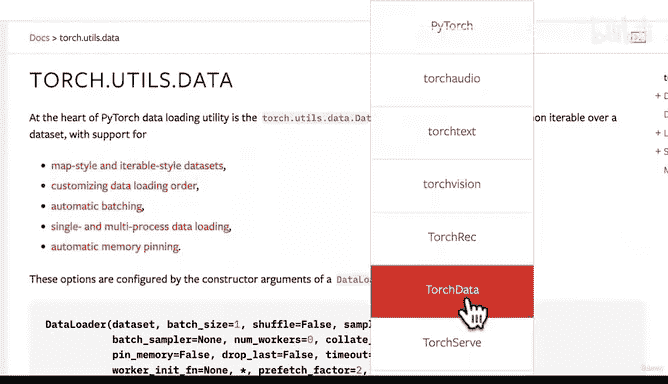

# 147：将自定义数据集转换为DataLoader 🚀


在本节课中，我们将学习如何将自定义数据集转换为PyTorch的DataLoader，以便能够以批量的形式高效地加载数据，供模型训练使用。

---

上一节我们介绍了如何创建自定义数据集类，本节中我们来看看如何将其转换为DataLoader。

首先，我们需要导入必要的模块。

```python
from torch.utils.data import DataLoader
```

接下来，我们将创建训练数据的DataLoader。

```python
BATCH_SIZE = 32

train_dataloader_custom = DataLoader(
    dataset=train_data_custom,
    batch_size=BATCH_SIZE,
    num_workers=0,
    shuffle=True
)
```

以下是DataLoader关键参数的说明：
*   **`dataset`**：传入我们之前创建的自定义数据集实例。
*   **`batch_size`**：设置每个批次包含的样本数量，这里设为32。
*   **`num_workers`**：设置用于加载数据的子进程数量。默认值为0。更高的数值通常能加快数据加载速度，但需要根据你的硬件配置进行调整。
*   **`shuffle`**：在训练时，通常需要打乱数据顺序，以避免模型学习到数据顺序带来的偏差。

同样地，我们为测试数据创建DataLoader。

```python
test_dataloader_custom = DataLoader(
    dataset=test_data_custom,
    batch_size=BATCH_SIZE,
    num_workers=0,
    shuffle=False
)
```

创建完成后，我们可以检查一下DataLoader是否工作正常。

```python
img_custom, label_custom = next(iter(train_dataloader_custom))
print(f"Image batch shape: {img_custom.shape}")
print(f"Label batch shape: {label_custom.shape}")
```

代码执行后，输出应为 `[32, 3, 64, 64]`。这表示我们成功加载了一个批次，包含32张图像，每张图像有3个颜色通道，尺寸为64x64像素。这个尺寸与我们之前定义的图像变换（`transforms`）是一致的。

如果需要调整批次大小，只需修改 `BATCH_SIZE` 参数即可。一个好的实践是将批次大小设置为8的倍数，这有助于计算优化。



---

本节课中我们一起学习了将自定义数据集转换为DataLoader的完整流程。我们了解到，虽然PyTorch的领域库（如TorchVision）提供了许多现成的数据加载功能，但当我们需要处理特殊格式的数据时，可以通过子类化 `torch.utils.data.Dataset` 来创建自定义数据集类，并依然能方便地使用 `DataLoader` 进行批量加载。这种代码通常具有可复用性，可以封装成工具函数以供后续项目使用。

在下一节，我们将探讨数据增强（Data Augmentation）技术，了解如何通过对训练图像进行变换来人工增加数据集的多样性，从而提升模型的泛化能力。