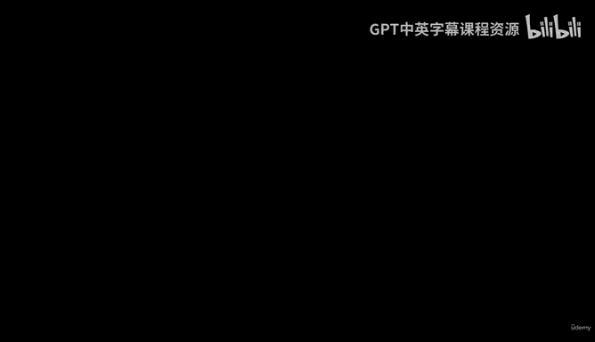
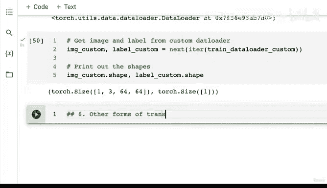
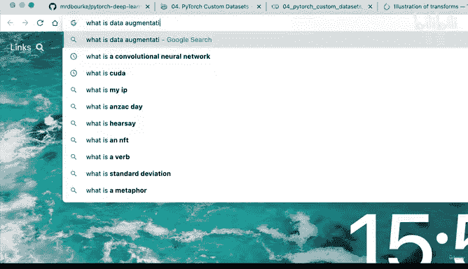
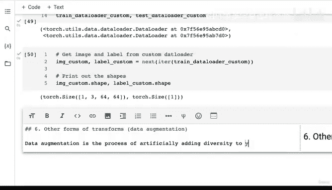
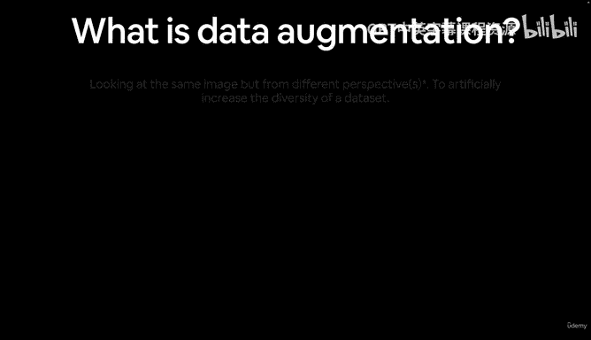
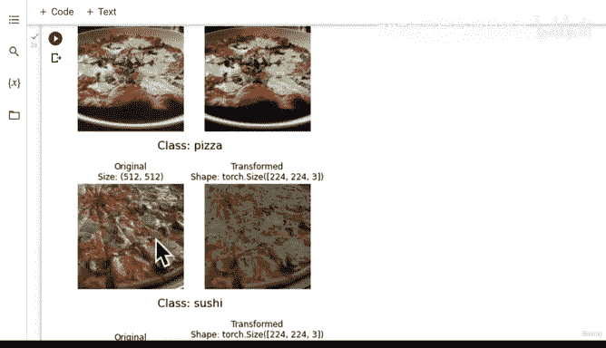
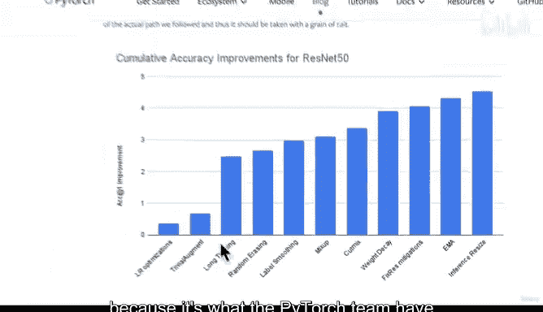

# 148：探索Torchvision最先进的数据增强技术 🚀



在本节课中，我们将学习数据增强的概念，并探索如何使用PyTorch的Torchvision库，特别是其最先进的`TrivialAugment`技术，来人为地增加训练数据的多样性，从而提升模型的泛化能力。

---

## 数据加载与转换回顾

在之前的课程中，我们创建了函数和类来加载自定义数据。加载自定义数据最关键的一步是数据转换，尤其是将目标数据转换为张量。

我们也初步了解了Torchvision的`transforms`模块，发现它提供了多种转换数据的方式。其中一种重要的方式就是**数据增强**。

如果我们查看`transforms`的图示，可以看到许多不同的方法：`Resize`可以改变图像尺寸，`CenterCrop`和`FiveCrop`可以进行裁剪，`Grayscale`可以转换色彩，还有各种随机变换，如`RandomRotation`、`RandomAffine`和`RandomCrop`等。实际上，我鼓励你亲自查看所有可用的选项。





但请注意，这里还有`AutoAugment`和`RandomAugment`。这正是我之前提到的**数据增强**。你注意到原始图像是如何以不同方式被增强的吗？图像被人为地改变：轻微旋转、变暗或变亮、向上平移，或者颜色发生改变。这个过程就是数据增强。

---



## 什么是数据增强？ 🤔

那么，如何了解数据增强呢？你可以搜索相关资料。维基百科的定义是：在数据分析中，数据增强是通过添加已有数据的略微修改副本，或从现有数据中新创建的合成数据来增加数据量的技术。



因此，我们可以这样定义：
**数据增强是通过人为方式为训练数据增加多样性的过程。**

对于图像数据，这可能意味着对训练图像应用各种图像变换。我们在Torchvision的`transforms`包中看到了许多这样的变换。现在，让我们特别关注一种类型的数据增强：`TrivialAugment`。

为了说明这一点，我准备了一张幻灯片。它展示了从不同视角观察同一张图像。我们这样做，正如我所说，是为了人为地增加数据集的多样性。

想象我们的原始图像在左侧。如果我们想旋转它，可以应用旋转变换。如果想在垂直和水平轴上平移，可以应用平移变换。如果想放大图像，可以应用缩放变换。变换的种类很多，例如裁剪、替换、剪切等，这张幻灯片只演示了少数几种。

---

## 为什么要使用数据增强？ 🎯

我想重点介绍另一种数据增强类型，它被用来将PyTorch Torchvision图像模型训练到最先进的水平。

让我们看看这种用于将PyTorch视觉模型训练到最先进水平的特定数据增强类型。

你可能不确定我们为什么要这样做。我们希望通过增加训练数据的多样性，使图像对模型来说更难学习，或者让模型有机会从不同视角观察同一图像。这样，当你在实践中使用图像分类模型时，它就已经见过许多不同角度的同类图像。

希望这能让模型学习到可泛化到不同角度的模式。因此，这种做法有望**得到一个对未见数据更具泛化能力的模型**。

---

## 探索最先进的训练方法

如果我们访问Torchvision的“最先进”部分，会发现PyTorch团队最近的一篇博客文章：《如何使用Torchvision的最新原语训练最先进的模型》。这正是我们想做的。“最先进”意味着业内最佳，通常缩写为SOTA，你会经常看到这个缩写。

Torchvision是我们处理视觉数据所使用的包，它包含一系列“原语”，换句话说，就是能帮助我们训练出高性能模型的函数。

在这篇博客文章中，如果我们向下滚动，会看到一些改进。例如，原始的ResNet-50模型（一种常见的计算机视觉架构）的准确率。通过添加所有使用的改进，准确率从76%左右提升到了近81%，提高了近5个百分点，这非常不错。

我们将要关注的是`TrivialAugment`。博客中提到了许多不同的改进项，如学习率优化、延长训练时间、随机擦除图像数据、标签平滑（可作为交叉熵损失函数的参数添加）、MixUp和CutMix、权重衰减调整、FixRes缓解、指数移动平均（EMA）、推理尺寸调整等。这里有一整套不同的“配方”项目。

但我们将重点分解其中一个：`TrivialAugment`。

---

## 动手实现TrivialAugment 🛠️

让我们在自己的数据上看看它的效果。

首先，我们导入必要的模块并创建一个训练转换管道：

```python
from torchvision import transforms

# 创建训练转换管道
train_transform = transforms.Compose([
    transforms.Resize(size=(224, 224)), # 将图像大小调整为常见的224x224
    transforms.TrivialAugmentWide(num_magnitude_bins=31), # 应用TrivialAugment，强度设为最大31
    transforms.ToTensor() # 最后转换为张量
])
```

我们刚刚就实现了`TrivialAugment`。这多棒啊！它来自PyTorch Torchvision的`transforms`库。`TrivialAugmentWide`被用来训练PyTorch Torchvision模型库中最新的最先进视觉模型。

如果你想了解`TrivialAugment`，可以搜索相关论文阅读。它巧妙地利用了随机性的力量。不过，我更倾向于先在我们的数据上尝试并可视化它。

---

## 测试我们的增强流程

接下来，我们测试这个增强流程。首先获取所有图像路径（虽然之前做过，但为了重申，我们再做一次）：

```python
# 获取图像路径列表
image_path_list = list(image_path.glob("*/*/*.jpg"))

# 使用我们之前创建的函数绘制随机增强后的图像
plot_transformed_images(
    image_paths=image_path_list,
    transform=train_transform, # 使用包含TrivialAugment的转换
    n=3, # 绘制3张图像
    seed=None
)
```

观察结果：第一张是“披萨”类图像。`TrivialAugment`调整了它的大小，颜色可能被以某种方式操作了。第二张图像看起来被调整了大小，但变化不大。第三张图像的颜色似乎被以某种形式操纵了。

`TrivialAugment`的工作原理是：它从所有其他增强类型中随机选择，并以一定的强度级别（我们设置为0到31）应用它们。所以，这些图像中的每一张都被随机选择和随机强度地应用了某种变换。

再看另一组三张图像：这张看起来被切掉了一点；那张颜色又以某种方式改变了；另一张变暗了。



你看到我们是如何人为地为训练数据集增加多样性的吗？我们不再让所有图像都保持单一视角，而是添加了许多不同的角度，并告诉模型：“即使图像被处理过，你也必须尝试学习这些模式。”

再试一次：看那张，它被处理得相当多了，对吧？但它仍然是一张“牛排”图像。我们正试图让模型即使在被处理过后，仍然能识别出这是一张牛排图像。

这会有效吗？可能有效，也可能无效。但这就是实验的本质。我鼓励你像我们刚才做的那样，进入`transforms`文档，将这里的`TrivialAugmentWide`换成你能找到的另一种增强类型，看看它会对我们的随机图像产生什么效果。

我之所以重点介绍`TrivialAugment`，是因为PyTorch团队在他们最近的博客文章中，将其作为训练最先进视觉模型的“配方”的一部分。

说到训练模型，让我们继续前进，构建我们的第一个模型。

---

## 总结 📝

本节课中，我们一起学习了：
1.  **数据增强**是通过人为应用变换（如旋转、平移、缩放、颜色调整）来增加训练数据多样性的过程。
2.  数据增强的目的是提高模型对未见数据的**泛化能力**。
3.  Torchvision的`transforms`模块提供了丰富的内置数据增强方法。
4.  我们重点探索了**TrivialAugment**，这是一种被用于训练最先进PyTorch视觉模型的增强技术，它随机选择和应用多种变换。
5.  我们通过代码`transforms.TrivialAugmentWide(num_magnitude_bins=31)`实现了它，并可视化了对图像的影响。



记住，选择哪种数据增强方式是一个需要根据具体问题和实验来回答的问题。从社区已验证有效的方法（如`TrivialAugment`）开始尝试是一个很好的策略。