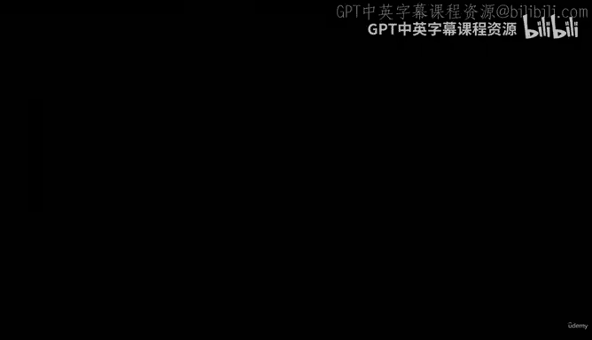
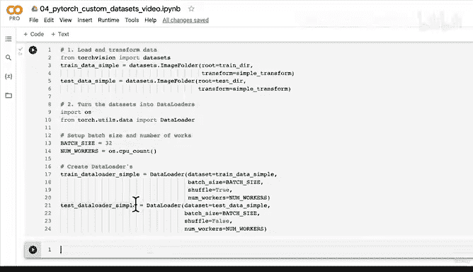

# 149：构建基线模型（第一部分）：数据加载与转换 🚀



## 概述

在本节课中，我们将学习如何为自定义数据集加载和转换数据，这是构建计算机视觉模型的第一步。我们将创建一个简单的数据转换流程，并使用PyTorch的`ImageFolder`和`DataLoader`类来准备数据，为后续构建和训练基线模型打下基础。

---

## 回顾与过渡

上一节我们介绍了PyTorch团队如何使用当时最先进的“TrivialAugment Wide”数据增强技术来训练其最新的计算机视觉模型。我们看到，借助Torchvision的`transforms`模块，可以轻松应用这种增强技术。

为了更清楚地展示数据增强的效果，我们再来看一个例子。虽然增强后的图像看起来变化不大，但我们可以看到这张图片被移动了，留下了一些黑色空间；另一张图片则被轻微旋转，同样产生了黑色空间。

---

## 构建基线模型

现在，是时候在我们自己的自定义数据集上构建第一个计算机视觉模型了。让我们开始吧。我们将这个模型称为**Model 0**。

我们将复用之前在计算机视觉部分介绍过的TinyVGG架构。我们的第一个实验是构建一个**基线模型**，这正是Model 0的目标。

我们将**不使用数据增强**来构建它。这意味着，我们将不使用上面提到的、PyTorch团队用来训练其最先进模型的TrivialAugment。我们先从训练一个没有数据增强的计算机视觉模型开始。这样，在后续实验中，我们可以尝试使用数据增强，以观察它是否有效。

以下是TinyVGG架构的简要说明。我们不会在此深入探讨，你只需要知道：模型的输入尺寸是`64x64x3`，它会经过多个不同的层（如卷积层、ReLU层、最大池化层），最后是一个适合我们类别数量的输出层。

在我们的案例中，数据集有3个不同的类别：披萨、牛排和寿司。现在，让我们根据CNN Explainer网站上的图示来复现TinyVGG架构。这是一个很好的练习。

当然，在训练模型之前，我们必须做什么呢？让我们进入**7.1节：创建数据转换与加载**。

---

## 为Model 0加载数据

我们将为Model 0加载数据。虽然我们可以使用已经加载好的变量，但为了练习，我们将重新创建它们。

首先，创建一个简单的数据转换流程。为Model 0加载数据的核心前提是：从`data`文件夹下的`pizza_steak_sushi`目录中，分别读取`train`和`test`文件夹内的图像，并将它们转换为张量。

我们已经做过几次了。其中一种方法是创建一个`transform`：

```python
simple_transform = transforms.Compose([
    transforms.Resize((64, 64)),
    transforms.ToTensor()
])
```

我们使用`transforms.Resize`将图像大小调整为TinyVGG架构所需的`64x64`。然后，使用`transforms.ToTensor`将图像转换为张量，张量中的值将被归一化到0到1之间。

现在，我们来加载数据。如果你想暂停视频自己尝试，我鼓励你试试**选项1：使用ImageFolder类加载图像数据**，然后将该数据集转换为`DataLoader`，以便与PyTorch模型一起使用。

如果你准备好了，我们就一起操作。

首先，导入必要的模块：

```python
from torchvision import datasets
```

然后，创建训练数据集。我称之为“simple”，因为我们首先使用的是没有数据增强的简单转换：

```python
train_data_simple = datasets.ImageFolder(root=train_dir,
                                         transform=simple_transform)
```

接着，创建测试数据集：

```python
test_data_simple = datasets.ImageFolder(root=test_dir,
                                        transform=simple_transform)
```

我们对训练数据和测试数据应用相同的转换。

下一步是将这些数据集转换为数据加载器。首先导入相关模块：

```python
import os
from torch.utils.data import DataLoader
```

然后设置批大小和工作进程数：

```python
BATCH_SIZE = 32
NUM_WORKERS = os.cpu_count()
```

现在，创建数据加载器：

```python
train_dataloader_simple = DataLoader(dataset=train_data_simple,
                                     batch_size=BATCH_SIZE,
                                     shuffle=True,
                                     num_workers=NUM_WORKERS)

test_dataloader_simple = DataLoader(dataset=test_data_simple,
                                    batch_size=BATCH_SIZE,
                                    shuffle=False,
                                    num_workers=NUM_WORKERS)
```

我希望你已经尝试过了。但你是否看到，如果数据格式正确，我们可以多快地加载数据？虽然我们花了很多时间通过多个视频和大量代码来逐步讲解这些步骤，但实际设置数据加载就是这么迅速：创建一个简单的转换，同时加载并转换数据，然后像这样将数据集转换为数据加载器。

现在，我们已经准备好将这些数据加载器与模型一起使用了。

---

## 下一步：构建模型

说到模型，我们将在下一个视频中构建TinyVGG架构。事实上，我们已经在之前的3号笔记本中做过这件事。如果你想参考我们当时构建的模型（即那里的Model 2），我鼓励你回顾那个部分并自己尝试一下。否则，我们将在下一个视频中一起构建TinyVGG架构。

---

## 总结

本节课中，我们一起学习了为自定义计算机视觉项目准备数据的关键步骤：
1.  我们回顾了数据增强技术。
2.  我们定义了构建基线模型（Model 0）的目标，并决定初始阶段不使用数据增强。
3.  我们创建了一个简单的数据转换流程，将图像调整大小并转换为张量。
4.  我们使用`torchvision.datasets.ImageFolder`类加载了训练和测试数据集。
5.  我们使用`torch.utils.data.DataLoader`类将数据集批量化，为模型训练做好了准备。



现在，数据已经就绪，我们将在下一节课中构建TinyVGG模型架构。