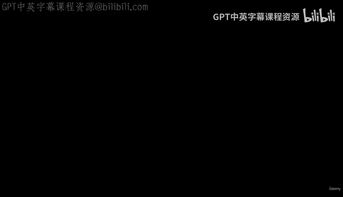
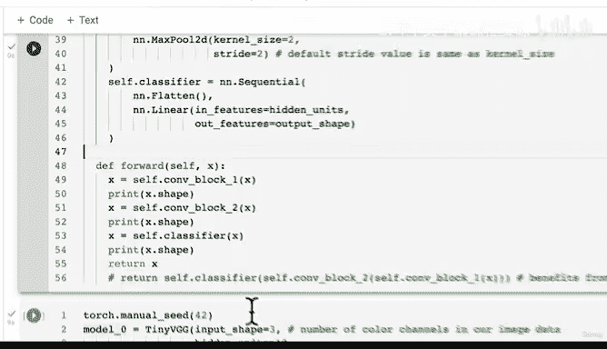

# 150：从零构建TinyVGG模型 🧠



在本节课中，我们将学习如何从零开始复现一个名为TinyVGG的卷积神经网络架构。我们将遵循一个常见的机器学习实践：找到一个适用于类似问题的模型，然后复制并尝试将其应用于我们自己的问题。

---

## 概述

上一节我们开始为自定义数据建模做准备。本节我们将一起快速构建TinyVGG模型。这个架构源自CNN Explainer网站，我们在之前的笔记本中已经介绍过。现在，让我们看看如何用代码实现它。

## 7.2 创建TinyVGG模型类

我们将创建一个继承自`nn.Module`的模型类。虽然我们之前在第三部分已经编写过类似的模型，但有一个重要的区别：之前的模型处理的是黑白图像，而我们现在要处理的是彩色图像。这意味着输入通道数将从1变为3。此外，在分类器层，我们可能需要一些技巧来确定正确的输入形状。

以下是构建模型的步骤：

1.  **定义模型类**：创建一个名为`TinyVGG`的类，继承自`nn.Module`。
2.  **初始化参数**：接收输入形状、隐藏单元数和输出形状作为参数。
3.  **构建卷积块**：按照TinyVGG架构，构建两个卷积块，每个块包含卷积层、ReLU激活层和最大池化层。
4.  **构建分类器层**：添加一个展平层和一个线性层，将卷积特征映射到最终的类别输出。
5.  **实现前向传播**：定义数据如何通过网络层流动。

让我们开始编写代码。

```python
import torch
from torch import nn

class TinyVGG(nn.Module):
    """
    模型架构复制自CNN Explainer网站的Tiny VGG。
    """
    def __init__(self, input_shape: int, hidden_units: int, output_shape: int):
        super().__init__()
        # 第一个卷积块
        self.conv_block_1 = nn.Sequential(
            nn.Conv2d(in_channels=input_shape,
                      out_channels=hidden_units,
                      kernel_size=3,
                      stride=1,
                      padding=1),
            nn.ReLU(),
            nn.Conv2d(in_channels=hidden_units,
                      out_channels=hidden_units,
                      kernel_size=3,
                      stride=1,
                      padding=1),
            nn.ReLU(),
            nn.MaxPool2d(kernel_size=2,
                         stride=2)
        )
        # 第二个卷积块
        self.conv_block_2 = nn.Sequential(
            nn.Conv2d(in_channels=hidden_units,
                      out_channels=hidden_units,
                      kernel_size=3,
                      stride=1,
                      padding=1),
            nn.ReLU(),
            nn.Conv2d(in_channels=hidden_units,
                      out_channels=hidden_units,
                      kernel_size=3,
                      stride=1,
                      padding=1),
            nn.ReLU(),
            nn.MaxPool2d(kernel_size=2,
                         stride=2)
        )
        # 分类器层
        self.classifier = nn.Sequential(
            nn.Flatten(),
            nn.Linear(in_features=hidden_units, # 注意：这里需要修正
                      out_features=output_shape)
        )

    def forward(self, x):
        # 打印形状以进行调试
        x = self.conv_block_1(x)
        print(f"卷积块1后形状: {x.shape}")
        x = self.conv_block_2(x)
        print(f"卷积块2后形状: {x.shape}")
        x = self.classifier(x)
        print(f"分类器后形状: {x.shape}")
        return x
```

> **注意**：在分类器的线性层中，我们暂时将`in_features`设置为`hidden_units`。实际上，这个值应该是经过两个卷积块和展平层后的特征数量。我们稍后会通过程序化的方式来确定正确的值。

## 关于前向传播的优化技巧

在上面的`forward`方法中，我们逐步将数据传递到每一层。然而，有一种更高效的方式可以重写整个前向传播过程，利用**操作符融合**技术。

操作符融合可以将多个计算步骤合并为一个，减少数据在GPU内存和计算单元之间的传输次数，从而加速计算。虽然这个主题超出了本课程的范围，但了解其基本思想是有益的。

我们可以将前向传播重写为：
```python
def forward(self, x):
    return self.classifier(self.conv_block_2(self.conv_block_1(x)))
```
这种写法在幕后更高效。如果你对此感兴趣，可以阅读Horace He的博客文章《Making Deep Learning Go Brrr From First Principles》，其中详细讨论了如何优化深度学习计算。

## 实例化模型并检查

现在，让我们创建一个模型实例，看看它是否能够正常工作。

```python
# 实例化模型
model_0 = TinyVGG(input_shape=3,      # 彩色图像的通道数
                  hidden_units=10,    # 与原始TinyVGG相同的隐藏单元数
                  output_shape=len(class_names)) # 输出类别数（例如披萨、牛排、寿司为3）

# 将模型发送到GPU（如果可用）
device = "cuda" if torch.cuda.is_available() else "cpu"
model_0.to(device)
```

请注意，将模型移动到GPU内存可能需要几秒钟时间。当你构建大型神经网络时，使用操作符融合等技术可以帮助加速计算。

## 下一步：验证模型

我们已经构建了模型架构，但它可能存在错误。如何发现呢？一个我最喜欢的调试方法是：**向模型传递一些虚拟数据**。

在下一节中，我们将向模型传递虚拟数据，检查前向传播是否正确实现，并验证每一层的输入和输出形状。

---

## 总结

本节课我们一起学习了如何从零开始构建TinyVGG卷积神经网络模型。我们：

1.  创建了一个继承自`nn.Module`的模型类。
2.  定义了两个卷积块和一个分类器层。
3.  实现了前向传播方法，并了解了操作符融合的优化概念。
4.  实例化了模型并将其移动到目标设备。



记住，构建模型时，复制一个在类似问题上有效的架构是一个很好的起点，但你可以自由调整超参数（如隐藏单元数、卷积核大小等）来适应你的具体任务。