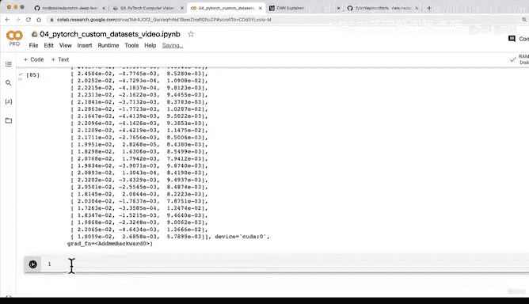

# 151：构建基线模型（第三部分）：前向传播测试模型形状 🧪


## 概述

在本节课中，我们将学习如何对刚刚构建的神经网络模型进行一次“虚拟”前向传播，以验证模型结构是否正确，特别是输入和输出的张量形状是否符合预期。这是模型构建过程中一个关键的调试步骤。

---

## 前向传播测试

上一节我们成功复现了CNN解释器网站上的微型VGG架构。现在，我们需要确保数据能够正确地在模型中流动。

### 获取单批次数据

首先，我们需要从数据加载器中获取一个批次的图像和标签数据，以便进行测试。

以下是具体步骤：

1.  从训练数据加载器中获取一个批次的图像和标签。
2.  打印出该批次图像和标签的张量形状，以了解其结构。

```python
# 获取一个批次的图像和标签
image_batch, label_batch = next(iter(train_dataloader))

# 检查形状
print(f"图像批次形状: {image_batch.shape}")
print(f"标签批次形状: {label_batch.shape}")
```

### 执行前向传播

获取数据后，我们可以尝试将其输入到模型中，进行一次前向传播。

```python
# 尝试对图像批次进行前向传播
model_0(image_batch)
```

执行上述代码时，你很可能会遇到两个常见错误。

### 错误排查与解决

第一个错误通常是设备不匹配。我们的模型可能位于GPU（`cuda`设备）上，而数据批次位于CPU上。解决方案是将数据移动到与模型相同的设备上。

```python
# 将数据移动到目标设备
image_batch = image_batch.to(device)
model_0(image_batch)
```

解决设备问题后，第二个常见错误是**形状不匹配**。错误信息可能类似于：
`RuntimeError: mat1 and mat2 shapes cannot be multiplied (32x2560 and 10x3)`。

这里的`2560`和`10`是关键。`10`是我们分类器层中定义的隐藏单元数。错误表明，在进入线性层进行矩阵乘法时，中间的两个维度必须相等。

**调试技巧**：查看错误中第一个形状的中间数字（例如`2560`）。这个数字通常来自卷积层输出的扁平化（Flatten）结果。你需要将这个数字与分类器层第一个线性层的输入特征数对齐。

在我们的模型中，这个数字是卷积块2的输出经过扁平化后的尺寸。计算公式为：
`隐藏单元数 * 特征图高度 * 特征图宽度`

通过计算 `10 * 16 * 16 = 2560`，我们确认了这一点。因此，需要将模型分类器层中第一个线性层的输入特征数修改为`2560`。

```python
# 在模型定义中，修改分类器层
self.classifier = nn.Sequential(
    nn.Flatten(),
    nn.Linear(in_features=10*16*16, out_features=10), # 修改 in_features
    nn.Linear(in_features=10, out_features=output_shape)
)
```

修改后重新运行模型和前向传播，形状错误应该得到解决。

### 与参考架构对齐

为了完全复现CNN解释器中的模型，我们可能需要调整卷积层的`padding`（填充）参数。原模型可能未使用填充，这会导致特征图尺寸进一步缩小。

例如，将卷积层的`padding`从`1`改为`0`后，特征图尺寸会从`16*16`变为`13*13`。此时，分类器层第一个线性层的输入特征数就需要相应地更新为 `10 * 13 * 13 = 1690`。

```python
# 调整卷积层参数（无填充）
self.conv_block_1 = nn.Sequential(
    nn.Conv2d(in_channels=3, out_channels=10, kernel_size=3, stride=1, padding=0), # padding=0
    nn.ReLU(),
    nn.Conv2d(in_channels=10, out_channels=10, kernel_size=3, stride=1, padding=0), # padding=0
    nn.ReLU(),
    nn.MaxPool2d(kernel_size=2, stride=2)
)

# 更新分类器层输入特征数
nn.Linear(in_features=10*13*13, out_features=10)
```

经过这些调整，我们不仅确保了数据流的通畅，也精确地复现了目标架构。

---

## 模型可视化工具介绍

成功进行一次前向传播后，我们验证了模型的基本结构。在进入下一阶段之前，我想介绍一个非常实用的工具：`torchinfo`。

`torchinfo` 可以打印出模型的详细摘要，包括每一层的输入/输出形状、参数数量等信息，这比手动调试形状要直观和高效得多。

在下一节课中，我们将一起学习如何安装并使用 `torchinfo` 来生成我们模型`model_0`的摘要报告，类似于下图所示的清晰结构视图。

（此处可想象一张torchinfo输出摘要的图片）

我建议你可以先尝试在Google Colab中安装`torchinfo` (`!pip install torchinfo`)，并看看能否为我们的模型生成一份摘要。下节课我们将一起完成这个步骤。

---

## 总结



本节课中，我们一起学习了如何通过执行一次前向传播来测试新建的PyTorch模型。我们经历了获取测试数据、执行前向传播、排查并解决设备不匹配和形状不匹配错误的过程。特别是，我们掌握了通过错误信息和计算来调试并修正线性层输入特征数的关键技巧。最后，我们还了解了一个强大的模型可视化工具`torchinfo`，为后续的模型分析和优化打下基础。