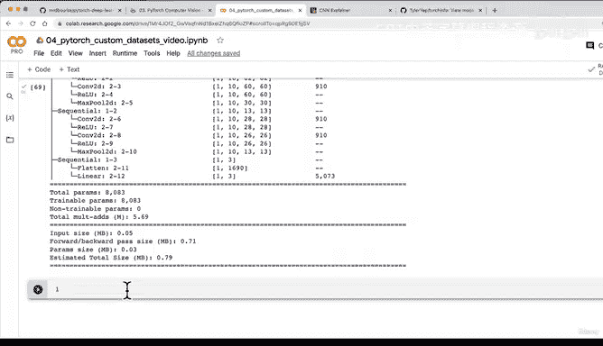

# 152：使用Torchinfo获取模型摘要 📊


## 概述
在本节课中，我们将学习如何使用`torchinfo`库来获取PyTorch模型的详细摘要信息。通过这个工具，我们可以清晰地看到数据在模型中流动时每一层的输入输出形状变化，以及模型的总参数量等信息。

---

## 回顾与引入
上一节我们通过手动执行前向传播来检查模型，确认了我们的`forward`方法工作正常，且数据在模型中流动时没有出现形状错误。

本节中，我们来看看如何以更程序化的方式获取这些信息，这就是`torchinfo`库的作用。

## 安装与导入Torchinfo
首先，我们需要安装`torchinfo`库。在Google Colab等环境中，它可能不是默认安装的。

以下是安装和导入的代码：

```python
# 尝试导入torchinfo，如果失败则安装
try:
    import torchinfo
except:
    !pip install torchinfo
    import torchinfo

# 从torchinfo导入summary函数
from torchinfo import summary
```

## 使用Torchinfo获取模型摘要
在导入`torchinfo`后，我们可以使用`summary`函数来生成模型的摘要。我们需要为函数提供模型实例和一个示例输入尺寸。

以下是生成摘要的代码示例：

```python
# 假设我们的模型实例名为 model_0
# 输入尺寸为 (batch_size, color_channels, height, width)
# 这里我们使用一个批次大小为1的示例图像
summary(model=model_0,
        input_size=(1, 3, 64, 64))
```

**注意**：输入尺寸必须与模型设计时预期的尺寸匹配，否则`torchinfo`在内部执行前向传播时会报错。

## 解读模型摘要输出
运行上述代码后，`torchinfo`会输出一个结构清晰的摘要。以下是对摘要中关键部分的解读：

*   **模型结构**：摘要会列出模型的整体结构，例如我们的TinyVGG模型由多个`Sequential`块组成。
*   **层信息**：每个`Sequential`块内部会详细列出每一层（如卷积层`Conv2d`、激活层`ReLU`、池化层`MaxPool2d`）及其参数。
*   **形状变化**：摘要的核心部分是展示数据流经每一层时，输入和输出张量的形状变化。这能帮助我们直观地验证数据形状是否正确转换。
*   **参数量统计**：摘要底部会提供总参数量。**参数**指的是模型中可学习的权重和偏置项，它们最初是随机数，深度学习的核心目标就是调整这些参数以更好地表示数据。我们的模型约有8000多个参数，这属于非常小的模型。
*   **模型大小估计**：摘要还会给出模型在内存中占用空间的估计值。我们的模型小于1MB。随着模型层数和参数量的增加，其大小也会显著增长，这在部署到存储受限的设备时需要特别注意。

## 总结
本节课我们一起学习了如何使用`torchinfo`库来高效地获取和分析PyTorch模型的摘要信息。这个工具能帮助我们：
1.  可视化模型结构。
2.  跟踪数据在模型中的形状变化。
3.  统计模型的总参数量。
4.  估计模型的文件大小。



它是一个非常有用的调试和模型理解工具。记得在使用时传入正确的示例输入尺寸。

在下一节中，我们将开始为我们的TinyVGG模型创建训练和测试函数，正式进入模型训练阶段。