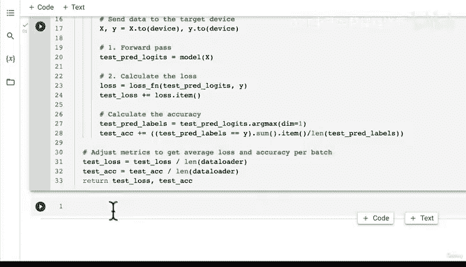

# 153：创建训练与测试循环函数 🚀


在本节课中，我们将学习如何将训练和测试过程封装成可复用的函数。我们将创建一个通用的训练步骤函数和一个测试步骤函数，它们可以应用于几乎任何模型和数据加载器。通过这种方式，我们可以简化代码，提高效率，并专注于模型架构和实验。

---

## 概述 📋

在之前的章节中，我们手动编写了训练和测试循环。现在，我们将把这些步骤抽象成函数，使代码更加模块化和可重用。我们将创建两个核心函数：`train_step` 用于训练模型，`test_step` 用于评估模型。这些函数设计为通用，可以适应不同的模型和数据加载器。

---

## 创建训练步骤函数 🏋️‍♂️

上一节我们介绍了训练循环的基本概念，本节中我们来看看如何将其封装成一个函数。训练步骤函数将负责执行单个训练周期内的所有操作，包括前向传播、损失计算、反向传播和参数更新。

以下是训练步骤函数 `train_step` 的实现步骤：

1.  **设置模型为训练模式**：`model.train()`
2.  **初始化评估指标**：将训练损失和准确率归零
3.  **遍历数据加载器**：对每个批次的数据执行以下操作
4.  **将数据发送到目标设备**：`X, y = X.to(device), y.to(device)`
5.  **执行前向传播**：`y_pred = model(X)`
6.  **计算损失**：`loss = loss_fn(y_pred, y)`
7.  **优化器梯度归零**：`optimizer.zero_grad()`
8.  **执行反向传播**：`loss.backward()`
9.  **更新模型参数**：`optimizer.step()`
10. **计算并累积批次准确率**
11. **循环结束后，计算平均损失和准确率**

以下是 `train_step` 函数的代码实现：

```python
def train_step(model: torch.nn.Module,
               data_loader: torch.utils.data.DataLoader,
               loss_fn: torch.nn.Module,
               optimizer: torch.optim.Optimizer,
               device: torch.device = device):
    """
    对模型执行一个训练周期。
    """
    # 将模型设置为训练模式
    model.train()
    
    # 初始化训练损失和准确率
    train_loss, train_acc = 0, 0
    
    # 遍历数据加载器中的每个批次
    for batch, (X, y) in enumerate(data_loader):
        # 将数据发送到目标设备
        X, y = X.to(device), y.to(device)
        
        # 1. 前向传播
        y_pred = model(X)
        
        # 2. 计算损失
        loss = loss_fn(y_pred, y)
        train_loss += loss.item()
        
        # 3. 优化器梯度归零
        optimizer.zero_grad()
        
        # 4. 反向传播
        loss.backward()
        
        # 5. 更新参数
        optimizer.step()
        
        # 计算准确率并累积
        y_pred_class = torch.argmax(torch.softmax(y_pred, dim=1), dim=1)
        train_acc += (y_pred_class == y).sum().item() / len(y_pred)
    
    # 计算整个周期的平均损失和准确率
    train_loss /= len(data_loader)
    train_acc /= len(data_loader)
    
    return train_loss, train_acc
```

---

## 创建测试步骤函数 🧪

现在我们已经有了训练函数，接下来看看如何创建测试步骤函数。测试步骤函数用于评估模型在未见数据上的性能，它不涉及参数更新，只进行前向传播和指标计算。

以下是测试步骤函数 `test_step` 的实现步骤：

1.  **设置模型为评估模式**：`model.eval()`
2.  **初始化评估指标**：将测试损失和准确率归零
3.  **在推理模式下遍历数据加载器**：使用 `torch.inference_mode()`
4.  **将数据发送到目标设备**
5.  **执行前向传播**
6.  **计算损失并累积**
7.  **计算准确率并累积**
8.  **循环结束后，计算平均损失和准确率**

以下是 `test_step` 函数的代码实现：

```python
def test_step(model: torch.nn.Module,
              data_loader: torch.utils.data.DataLoader,
              loss_fn: torch.nn.Module,
              device: torch.device = device):
    """
    对模型执行一个测试周期。
    """
    # 将模型设置为评估模式
    model.eval()
    
    # 初始化测试损失和准确率
    test_loss, test_acc = 0, 0
    
    # 在推理模式下进行，不跟踪梯度
    with torch.inference_mode():
        # 遍历数据加载器中的每个批次
        for batch, (X, y) in enumerate(data_loader):
            # 将数据发送到目标设备
            X, y = X.to(device), y.to(device)
            
            # 1. 前向传播
            test_pred_logits = model(X)
            
            # 2. 计算损失
            loss = loss_fn(test_pred_logits, y)
            test_loss += loss.item()
            
            # 计算准确率并累积
            # 注意：可以直接对logits使用argmax，softmax不是必须的，但为了完整性可以加上
            test_pred_labels = torch.argmax(torch.softmax(test_pred_logits, dim=1), dim=1)
            test_acc += (test_pred_labels == y).sum().item() / len(test_pred_labels)
    
    # 计算整个周期的平均损失和准确率
    test_loss /= len(data_loader)
    test_acc /= len(data_loader)
    
    return test_loss, test_acc
```

---

## 总结 🎯

本节课中我们一起学习了如何创建通用的训练和测试循环函数。我们实现了 `train_step` 函数来封装训练过程，包括前向传播、损失计算、反向传播和优化器更新。同时，我们实现了 `test_step` 函数来封装评估过程，用于计算模型在测试集上的性能指标。



通过将这些步骤函数化，我们的代码变得更加清晰、模块化且易于重用。在接下来的课程中，我们将学习如何将这些函数组合成一个完整的训练循环，以便轻松地训练和评估多个模型。