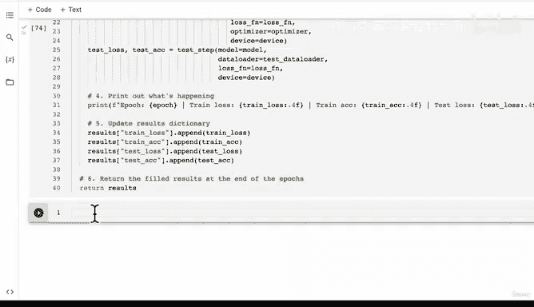

# 154：创建模型训练与评估函数 🚀


在本节课中，我们将学习如何将训练步骤和测试步骤的功能整合到一个统一的训练函数中。通过创建这个函数，我们可以简化模型训练和评估的流程，提高代码的复用性。

---

## 概述

在上一节中，我们分别创建了 `train_step` 和 `test_step` 函数。本节中，我们将把这两个函数整合到一个名为 `train` 的函数中。这个函数将负责模型的整个训练和评估过程，并记录每个周期的损失和准确率。

---

## 创建训练函数

首先，我们需要导入必要的库，并定义 `train` 函数。这个函数将接收模型、训练数据加载器、测试数据加载器、优化器、损失函数、训练周期数和设备作为参数。

```python
import torch
from tqdm.auto import tqdm

def train(model: torch.nn.Module,
          train_dataloader: torch.utils.data.DataLoader,
          test_dataloader: torch.utils.data.DataLoader,
          optimizer: torch.optim.Optimizer,
          loss_fn: torch.nn.Module = torch.nn.CrossEntropyLoss(),
          epochs: int = 5,
          device: torch.device = device):
```

---

## 初始化结果字典

为了跟踪模型在每个训练周期的表现，我们将创建一个结果字典。这个字典将包含训练损失、训练准确率、测试损失和测试准确率的列表。

以下是初始化结果字典的代码：

```python
    results = {
        "train_loss": [],
        "train_acc": [],
        "test_loss": [],
        "test_acc": []
    }
```

---

## 训练循环

接下来，我们将进入训练循环。在每个周期中，我们将调用 `train_step` 函数进行训练，然后调用 `test_step` 函数进行评估。同时，我们会记录每个周期的结果并打印出来。

以下是训练循环的代码：

```python
    for epoch in tqdm(range(epochs)):
        # 训练步骤
        train_loss, train_acc = train_step(model=model,
                                           dataloader=train_dataloader,
                                           loss_fn=loss_fn,
                                           optimizer=optimizer,
                                           device=device)
        
        # 测试步骤
        test_loss, test_acc = test_step(model=model,
                                        dataloader=test_dataloader,
                                        loss_fn=loss_fn,
                                        device=device)
        
        # 打印结果
        print(f"Epoch: {epoch} | "
              f"Train Loss: {train_loss:.4f} | "
              f"Train Acc: {train_acc:.4f} | "
              f"Test Loss: {test_loss:.4f} | "
              f"Test Acc: {test_acc:.4f}")
        
        # 更新结果字典
        results["train_loss"].append(train_loss)
        results["train_acc"].append(train_acc)
        results["test_loss"].append(test_loss)
        results["test_acc"].append(test_acc)
    
    return results
```

---

## 函数整合

通过以上步骤，我们已经成功创建了一个完整的训练函数。这个函数整合了训练和评估的流程，并能够记录每个周期的表现。现在，我们可以使用这个函数来训练和评估我们的模型。

---

## 总结



本节课中，我们一起学习了如何将训练步骤和测试步骤整合到一个统一的训练函数中。通过创建这个函数，我们简化了模型训练和评估的流程，提高了代码的复用性。在下一节课中，我们将使用这个函数来训练我们的第一个模型，并进一步优化其性能。