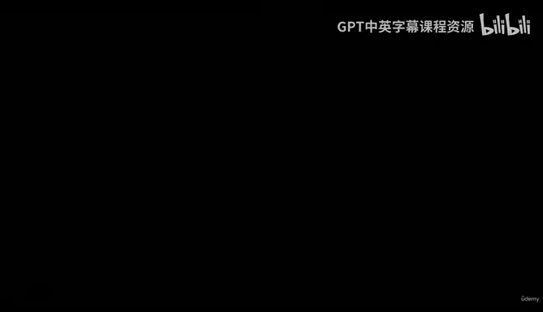
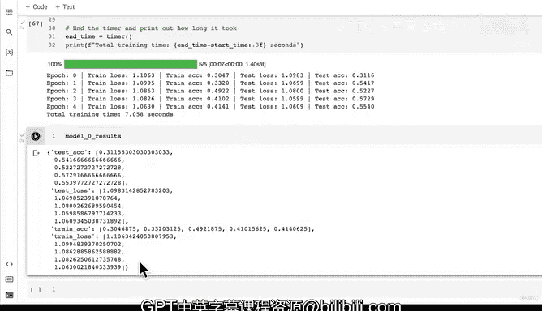

#  155：使用训练函数评估模型 0 🚀



在本节课中，我们将学习如何使用之前构建的训练循环函数来训练和评估我们的基准模型（Model 0）。我们将实例化模型、选择损失函数和优化器，并观察模型在自定义数据集上的初步表现。

---

## 设置环境与模型

上一节我们介绍了训练循环函数。本节中，我们来看看如何将这些函数应用于我们的基准模型。

首先，我们需要设置随机种子以确保结果的可复现性。请注意，在实际应用中，我们可能不会总是固定随机种子，因为理想情况下，模型性能应不依赖于特定的随机种子。但出于教学目的，我们在此固定它。

```python
import torch
torch.manual_seed(42)
torch.cuda.manual_seed(42)
```

接下来，我们定义训练轮数，并创建 TinyVGG 模型的实例。该模型将处理我们的彩色图像数据集。

```python
# 定义训练轮数
NUM_EPOCHS = 5

# 创建模型实例
model_0 = TinyVGG(
    input_shape=3,      # 彩色图像的通道数
    hidden_units=10,    # 隐藏单元数，与 CNN Explainer 网站保持一致
    output_shape=len(train_data.classes)  # 输出类别数
).to(device)
```

## 定义损失函数与优化器

模型创建好后，我们需要定义损失函数和优化器。对于多类别分类任务，交叉熵损失是合适的选择。我们将使用 Adam 优化器，并采用其默认学习率。

以下是核心组件的定义：

```python
# 定义损失函数
loss_fn = nn.CrossEntropyLoss()

# 定义优化器
optimizer = torch.optim.Adam(params=model_0.parameters(),
                             lr=0.001)  # Adam 的默认学习率
```

## 训练模型并计时

现在，我们可以使用之前编写的 `train` 函数来训练模型。同时，我们将记录训练所花费的时间。

```python
from timeit import default_timer as timer

# 开始计时
start_time = timer()

# 训练模型
model_0_results = train(model=model_0,
                        train_dataloader=train_dataloader_simple,
                        test_dataloader=test_dataloader_simple,
                        optimizer=optimizer,
                        loss_fn=loss_fn,
                        epochs=NUM_EPOCHS)

# 结束计时并打印耗时
end_time = timer()
print(f"总训练时间：{end_time - start_time:.3f} 秒")
```

运行代码后，模型开始训练。在我们的例子中，模型训练速度很快。训练完成后，我们得到了在训练集上约 40% 和在测试集上约 50% 的准确率。

## 分析结果与改进思路

我们的模型在三个类别的数据集上取得了约 50% 的测试准确率。考虑到随机猜测的基线准确率约为 33%，模型的表现略有提升，但仍有很大改进空间。

以下是几种可以尝试的模型改进方法：

*   **增加更多层**：例如，在当前的 TinyVGG 架构中再添加一个卷积块。
*   **增加隐藏单元数**：尝试将隐藏单元数从 10 增加到 20 或更多。
*   **延长训练时间**：将训练轮数从 5 增加到 10、20 或更多。
*   **更改激活函数**：ReLU 可能不是我们特定用例的最佳选择。
*   **调整学习率**：尝试不同于 Adam 默认值（0.001）的学习率。
*   **更改损失函数**：虽然对于多分类任务，交叉熵损失通常效果很好，但也可以进行尝试。

前三种方法（增加层、增加隐藏单元、延长训练时间）可以快速进行实验，是很好的起点。

---

## 总结



本节课中，我们一起学习了如何将训练循环函数应用于基准模型 Model 0。我们完成了环境设置、模型实例化、损失函数与优化器的定义，并成功训练了模型。初步结果显示模型性能优于随机猜测，但仍有提升潜力。我们讨论了几种可行的改进策略。在下一节课中，我们将绘制损失曲线，以更直观地分析模型的训练过程。