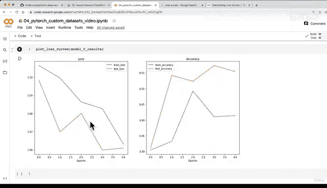

# 156：绘制模型0的损失曲线 📉


在本节课中，我们将学习如何绘制模型的损失曲线。损失曲线是评估模型训练过程的重要工具，它能直观地展示模型性能随时间（如训练轮次）的变化趋势。

上一节我们训练了第一个卷积神经网络，但发现其性能有待提升。本节中我们来看看如何通过绘制损失曲线来可视化模型的训练过程。

## 什么是损失曲线？

损失曲线是一种追踪模型随时间进展的方式。它通常以训练轮次（或批次）为横轴，以损失值（或准确率）为纵轴。理想的趋势是损失值随时间下降，而准确率随时间上升。

## 绘制损失曲线的步骤

以下是绘制损失曲线的具体步骤。我们将编写一个函数，接收包含训练和测试结果的字典，并生成相应的图表。

首先，我们需要从结果字典中提取数据。

```python
def plot_loss_curves(results):
    """
    绘制结果字典的训练曲线。
    """
    # 获取损失值
    train_loss = results["train_loss"]
    test_loss = results["test_loss"]

    # 获取准确率值
    train_accuracy = results["train_acc"]
    test_accuracy = results["test_acc"]

    # 确定训练轮次数量
    epochs = range(len(results["train_loss"]))
```

接下来，我们设置图表布局并绘制损失曲线。

```python
    import matplotlib.pyplot as plt

    plt.figure(figsize=(15, 7))

    # 绘制损失子图
    plt.subplot(1, 2, 1)
    plt.plot(epochs, train_loss, label="Train Loss")
    plt.plot(epochs, test_loss, label="Test Loss")
    plt.title("Loss")
    plt.xlabel("Epochs")
    plt.legend()
```

然后，我们在同一图表中绘制准确率曲线。

```python
    # 绘制准确率子图
    plt.subplot(1, 2, 2)
    plt.plot(epochs, train_accuracy, label="Train Accuracy")
    plt.plot(epochs, test_accuracy, label="Test Accuracy")
    plt.title("Accuracy")
    plt.xlabel("Epochs")
    plt.legend()

    plt.show()
```

## 解读损失曲线

调用函数并传入模型0的结果字典。

```python
plot_loss_curves(model_0_results)
```

生成的图表显示，我们的模型损失有下降趋势，准确率有上升趋势。这是一个积极的信号。虽然当前模型的绝对性能不高，但趋势表明，如果增加训练轮次，模型性能可能会继续提升。

理想的损失曲线应从左上方向右下方下降。准确率曲线则应从左下方向右上方上升。在后续课程中，我们将探讨不同类型的损失曲线，例如理想曲线、欠拟合曲线和过拟合曲线。



本节课中我们一起学习了如何绘制并初步解读模型的损失曲线。损失曲线是诊断模型训练状态的关键可视化工具。理解其趋势有助于我们判断模型是否在有效学习，并为后续的模型改进提供方向。