# 157：过拟合与欠拟合的平衡与应对策略 📊


在本节课中，我们将要学习机器学习中的两个核心挑战：过拟合与欠拟合。我们将探讨如何通过观察损失曲线来诊断模型状态，并学习一系列应对策略，以帮助模型达到“刚刚好”的理想状态。

---

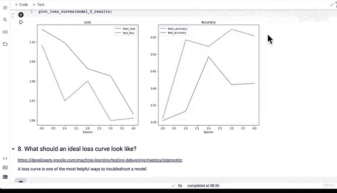

## 损失曲线：模型性能的“仪表盘” 📉

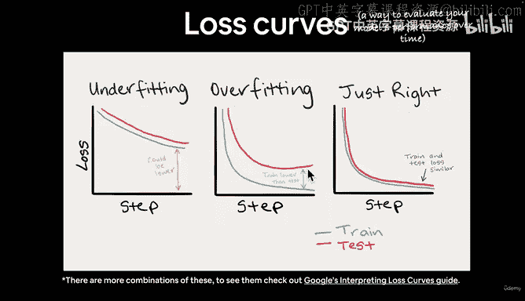

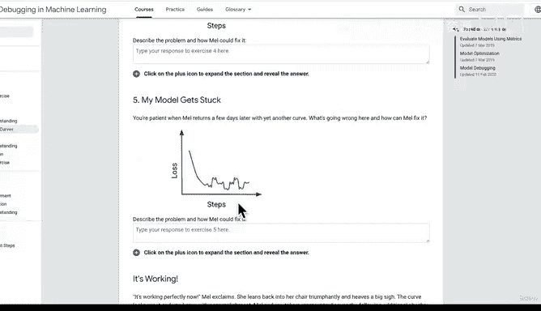

上一节我们介绍了如何评估模型性能。本节中我们来看看损失曲线，它是评估模型随时间（例如训练时长）表现的一种重要方式。

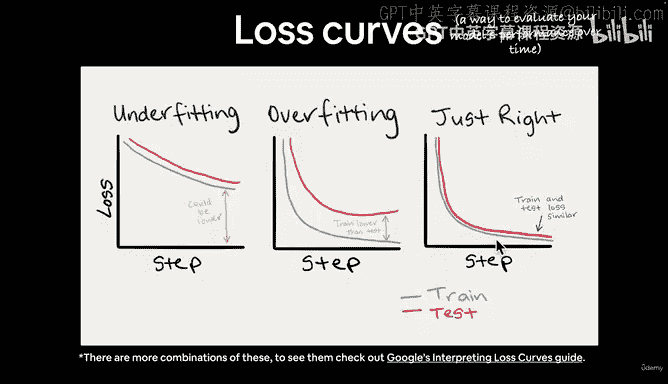

损失曲线是调试模型最有帮助的工具之一。理想的趋势是，损失值应随时间下降，而像准确率这样的评估指标则应随时间上升。

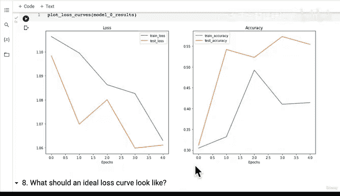

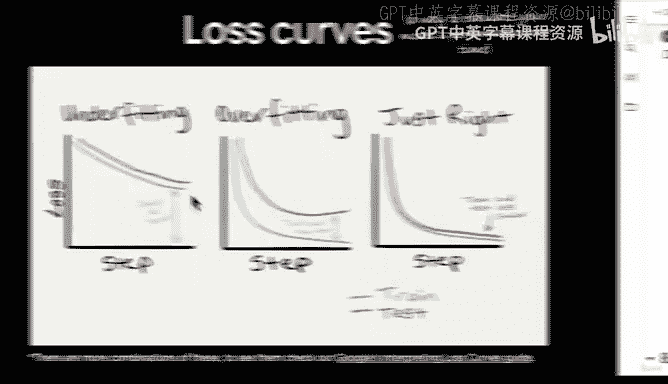

以下是三种主要的损失曲线形态，但实际中会遇到更多变化：

*   **欠拟合**：模型在训练集和测试集上的损失都可能更低。
*   **过拟合**：模型在训练集上的损失远低于测试集。
*   **刚刚好**：训练损失和测试损失以相近的速率下降。

---

## 理解过拟合与欠拟合 🤔

### 欠拟合

欠拟合是指模型的损失可以更低，即模型未能充分学习数据中的模式。在我们的例子中，模型看起来是欠拟合的，可能需要训练更长时间（例如10或20个周期）来观察损失是否继续下降。

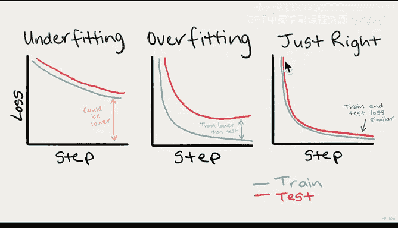

### 过拟合

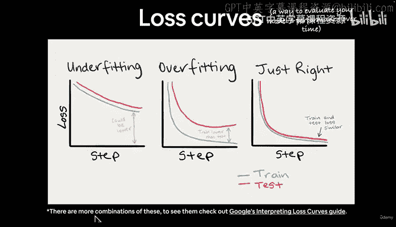

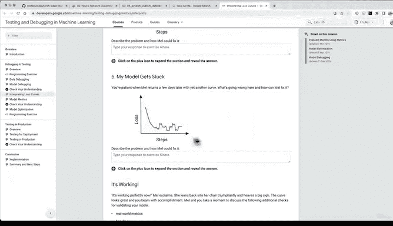


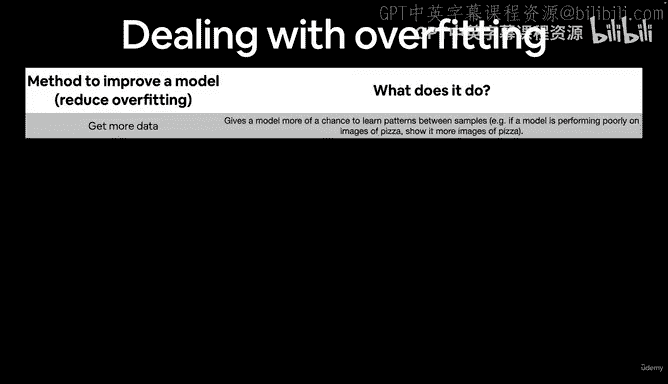

过拟合是欠拟合的反面，是机器学习的两大难题之一。过拟合发生时，训练损失低于测试损失。

这意味着模型过于擅长学习训练数据，导致训练集上的损失下降（这通常是好事），但这种学习并未体现在测试集上。模型本质上是在记忆训练数据中无法良好泛化到测试集的特定模式。

一个类比是：如果你为期末考试只死记硬背了课程材料（训练集），当遇到没见过的题目（测试集）时，你将无法灵活运用所学知识。

### “刚刚好”的理想状态

理想情况下，我们希望训练损失和测试损失尽可能同步下降。通常训练损失会略低于测试损失，因为模型接触过训练数据而从未见过测试数据。我们的目标是达到一个平衡点，即模型既不过于简单（欠拟合），也不过于复杂（过拟合）。

---

## 应对策略：如何解决过拟合与欠拟合 ⚙️

以下是处理过拟合和欠拟合的一些常用方法。

### 减少过拟合的策略

我们希望模型在训练集和测试集上表现同样出色。以下是减少过拟合的方法：

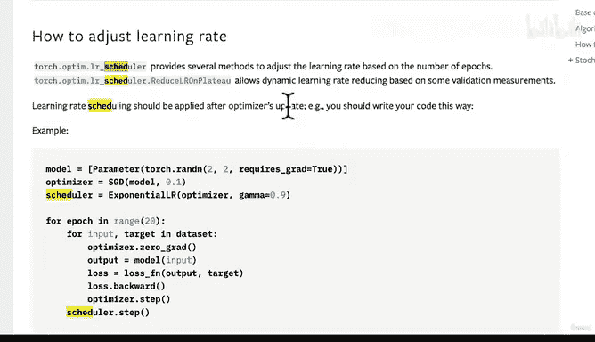

*   **获取更多数据**：扩大训练集，让模型接触更多样本，理论上能学习到更通用的模式。
*   **使用数据增强**：通过对训练数据进行变换（如旋转、裁剪），增加数据多样性，使模型学习更鲁棒的特征。
*   **获取更好的数据**：提升数据质量，有助于模型学习更通用的模式。
*   **使用迁移学习**：利用在大型数据集（如ImageNet）上预训练好的模型，将其学到的模式调整应用于你自己的问题。
*   **简化模型**：减少模型复杂度，例如减少网络层数或每层的隐藏单元数。这迫使模型用更有限的资源学习更通用的模式。
*   **使用学习率衰减**：随着训练进行，逐渐降低学习率。初始时可以用较大的学习率快速下降，接近收敛时则用小步长精细调整，防止“错过”最优解。
    *   **类比**：就像在沙发缝里找硬币，开始时可以大步寻找，快找到时则需小步调整，以防硬币掉得更深。
    *   **代码示例**：PyTorch中可使用学习率调度器。
        ```python
        from torch.optim.lr_scheduler import StepLR
        scheduler = StepLR(optimizer, step_size=30, gamma=0.1) # 每30个epoch，学习率乘以0.1
        ```
*   **使用早停法**：在测试误差开始上升之前停止训练，并保存验证集上表现最好的模型权重。

### 减少欠拟合的策略

欠拟合是指模型未能很好地拟合数据。以下是减少欠拟合的方法：

*   **增加模型复杂度**：为模型添加更多层或隐藏单元，增强其学习能力。
*   **调整学习率**：学习率可能初始设置不当，需要调整。
*   **延长训练时间**：增加训练周期数，让模型有更多机会学习数据中的模式。
*   **使用迁移学习**：同样有助于解决欠拟合。
*   **减少正则化**：正则化是为了防止过拟合，但如果正则化过强，可能会抑制模型学习能力，导致欠拟合。

---

## 核心：寻找平衡 ⚖️

机器学习很大程度上是在欠拟合和过拟合之间寻找平衡的艺术。

*   如果过于努力减少欠拟合（如让模型过于复杂或训练过久），可能会导致过拟合。
*   如果过于努力防止过拟合（如过度简化模型或使用强正则化），可能会导致欠拟合。

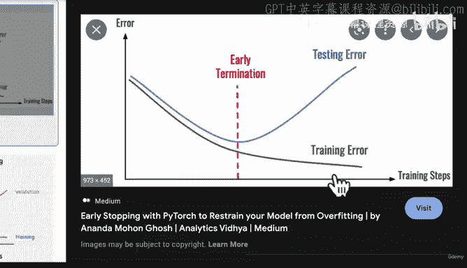

我们的目标是让模型达到“刚刚好”的拟合状态。这将是整个机器学习实践中持续面临的挑战和核心研究领域。

---

## 总结与思考 💡

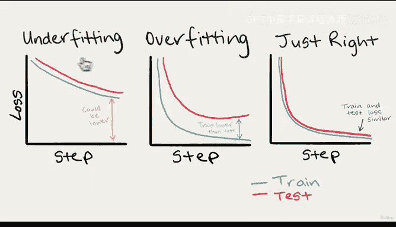

本节课中我们一起学习了：

1.  **损失曲线**是评估模型性能随时间变化的重要工具。
2.  **欠拟合**意味着模型能力不足，损失还有下降空间。
3.  **过拟合**意味着模型过于复杂，记忆了训练集的特有噪声，导致泛化能力差。
4.  掌握了一系列应对**过拟合**（如数据增强、简化模型、早停）和**欠拟合**（如增加复杂度、延长训练）的策略。
5.  机器学习的核心之一是找到**欠拟合与过拟合之间的最佳平衡点**。

根据上一节的损失曲线，我们的模型似乎存在欠拟合。请思考：为了提升该模型从训练数据中学习模式的能力，你会采取什么措施？是训练更长时间、添加更多层，还是增加隐藏单元数？

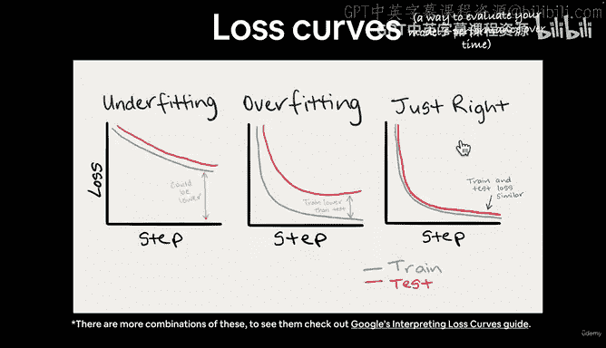

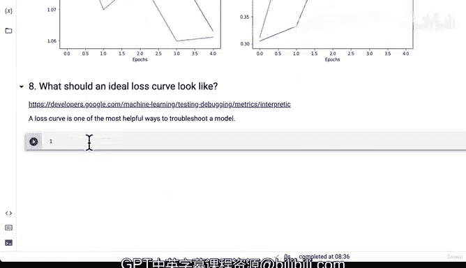

在下一个视频中，我们将开始构建另一个模型，并尝试使用数据增强等方法。