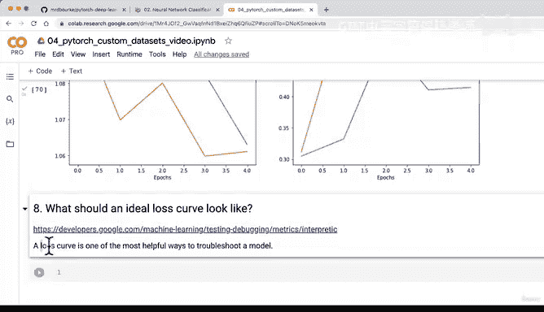
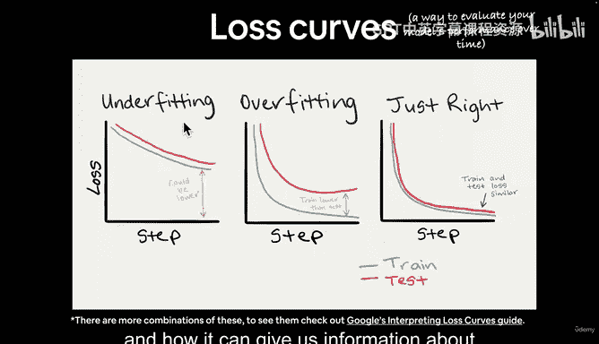
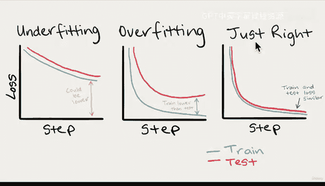
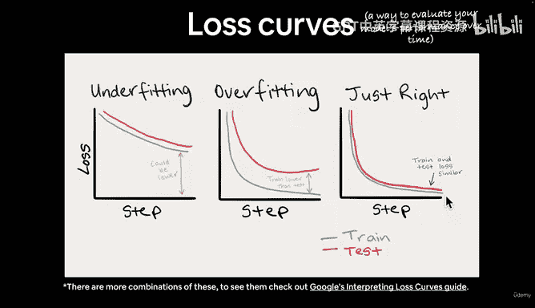
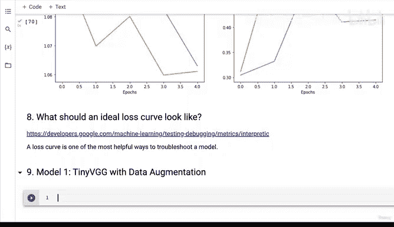
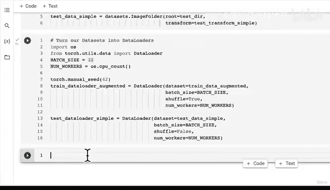

# 158：为模型1创建增强训练数据集与DataLoader 📊








在本节课中，我们将学习如何通过数据增强技术来创建训练数据集和DataLoader，以应对模型可能出现的过拟合问题。我们将使用PyTorch的`transforms`模块来实现图像增强，并构建适用于训练和测试的数据加载器。



---

上一节我们介绍了损失曲线的概念，以及如何通过它判断模型是欠拟合还是过拟合。本节中，我们来看看如何通过数据增强来改善模型性能。



数据增强是处理过拟合的一种方法。它通过对训练图像进行随机变换（如旋转、翻转等），在不收集新数据的情况下，人工增加训练数据集的多样性。这有助于模型学习更通用的模式，而不是仅仅记住训练数据。

以下是实现数据增强的步骤：


首先，我们需要创建一个包含数据增强的转换流程。我们将使用PyTorch的`transforms`模块，并采用`TrivialAugmentWide`这种增强策略。

```python
from torchvision import transforms

# 创建训练数据转换流程（包含数据增强）
train_transform_trivial = transforms.Compose([
    transforms.Resize(size=(64, 64)),
    transforms.TrivialAugmentWide(num_magnitude_bins=31),
    transforms.ToTensor()
])

# 创建测试数据转换流程（不包含数据增强）
test_transform_simple = transforms.Compose([
    transforms.Resize(size=(64, 64)),
    transforms.ToTensor()
])
```

接下来，我们使用这些转换流程来加载数据集。我们将使用`ImageFolder`类从指定目录加载图像，并应用相应的转换。

```python
from torchvision import datasets

# 创建训练数据集（应用数据增强）
train_data_augmented = datasets.ImageFolder(
    root=train_dir,
    transform=train_transform_trivial
)

# 创建测试数据集（不应用数据增强）
test_data_simple = datasets.ImageFolder(
    root=test_dir,
    transform=test_transform_simple
)
```

现在，我们将数据集转换为DataLoader，以便在训练过程中批量加载数据。我们将设置批量大小、工作线程数，并打乱训练数据。

```python
import os
from torch.utils.data import DataLoader

# 设置批量大小和工作线程数
BATCH_SIZE = 32
NUM_WORKERS = os.cpu_count()

# 创建训练数据加载器（包含数据增强）
train_dataloader_augmented = DataLoader(
    dataset=train_data_augmented,
    batch_size=BATCH_SIZE,
    shuffle=True,
    num_workers=NUM_WORKERS
)

# 创建测试数据加载器（不包含数据增强）
test_dataloader_simple = DataLoader(
    dataset=test_data_simple,
    batch_size=BATCH_SIZE,
    shuffle=False,
    num_workers=NUM_WORKERS
)
```

通过以上步骤，我们成功创建了包含数据增强的训练数据集和DataLoader，以及简单的测试数据集和DataLoader。在下一节中，我们将使用这些数据加载器来构建和训练模型1。

---



本节课中我们一起学习了如何通过数据增强技术创建训练数据集和DataLoader。我们介绍了数据增强的概念、实现步骤，并完成了数据加载器的构建。在下一讲中，我们将使用这些数据加载器来训练模型1。