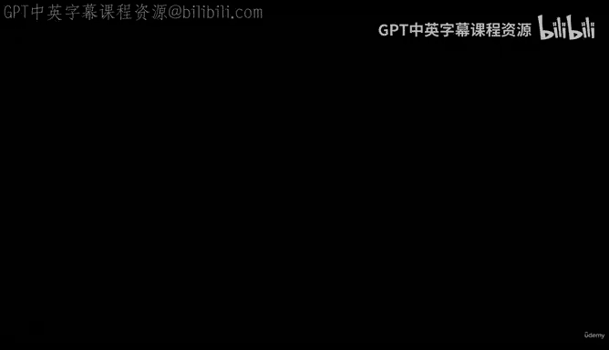
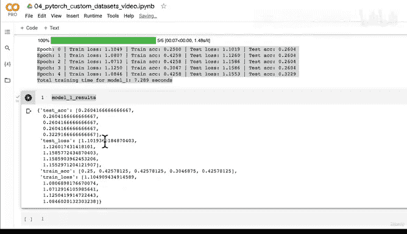

# 159：构建与训练模型1 🏗️



在本节课中，我们将学习如何构建并训练一个使用了数据增强的模型。我们将使用与之前相同的模型架构，但这次会在训练数据上应用数据增强技术，以观察其性能与未使用数据增强的基线模型有何不同。

---

## 概述

上一节我们准备好了数据集、数据加载器以及数据增强策略。本节中，我们将利用这些组件来构建并训练我们的第一个模型（Model 1）。这个模型将使用数据增强后的训练数据，我们将通过对比实验来评估数据增强的效果。

---

## 构建模型

首先，我们需要创建模型并将其发送到目标设备（如GPU）。由于我们之前已经定义了一个模型类，现在可以方便地复用。

以下是创建模型的步骤：

```python
import torch

# 设置随机种子以确保结果可复现
torch.manual_seed(42)

# 获取数据增强后训练集的类别数量
num_classes = len(train_data_augmented.classes)

# 创建模型实例并发送到设备
model_1 = TinyVGG(input_shape=3,
                  hidden_units=10,
                  output_shape=num_classes).to(device)

# 查看模型结构
print(model_1)
```

---

## 设置训练参数

在开始训练之前，我们需要定义损失函数、优化器以及训练轮数等参数。

以下是需要设置的参数：

*   **损失函数**：我们使用交叉熵损失，在PyTorch中常被称为 `criterion`。
*   **优化器**：我们选择Adam优化器，并设置学习率为0.001。
*   **训练轮数**：暂时设置为5个epoch。

```python
from torch import nn
from torch.optim import Adam
from timeit import default_timer as timer

# 设置随机种子
torch.manual_seed(42)

# 定义训练轮数
num_epochs = 5

# 定义损失函数
loss_fn = nn.CrossEntropyLoss()

# 定义优化器
optimizer = Adam(params=model_1.parameters(),
                 lr=0.001)

# 开始计时
start_time = timer()
```

---

## 训练模型

现在，我们可以调用之前编写好的训练函数来训练我们的模型。

以下是训练模型的代码：

```python
# 训练模型
model_1_results = train(model=model_1,
                        train_dataloader=train_dataloader_augmented,
                        test_dataloader=test_dataloader_simple,
                        optimizer=optimizer,
                        loss_fn=loss_fn,
                        epochs=num_epochs,
                        device=device)

# 结束计时并打印训练时间
end_time = timer()
print(f"Model 1 训练时间: {end_time - start_time:.3f} 秒")
```

运行上述代码后，模型开始训练。在本例中，训练耗时约7秒。需要注意的是，训练时间会根据所使用的GPU性能而有所不同。

---

## 初步分析与过渡

训练完成后，我们初步观察到，使用了数据增强的Model 1在训练集和测试集上的准确率，似乎不如之前未使用数据增强的基线模型（Model 0）。

这可能是因为我们的基线模型尚未出现过拟合现象。**数据增强的主要作用是防止模型过拟合**。既然模型还没有过拟合，强行引入数据增强可能不会带来性能提升，甚至可能干扰模型学习有效的特征。

尽管如此，这仍然是一次有价值的实验。它告诉我们，并非所有高级技术都适用于当前阶段的问题。机器学习工作流通常从简单模型开始，仅在必要时引入复杂性。

在下一节中，我们将通过绘制Model 1的损失曲线来更深入地分析其训练过程。你可以尝试自己调用 `plot_loss_curves` 函数，我们将在下一讲一起查看结果。

---

## 总结



本节课中，我们一起学习了如何构建并训练一个应用了数据增强的深度学习模型。我们完成了设置模型、定义损失函数与优化器、以及启动训练流程的完整步骤。通过对比实验，我们初步探讨了数据增强在模型未过拟合时可能起到的作用，并强调了从简单基线开始实验的重要性。