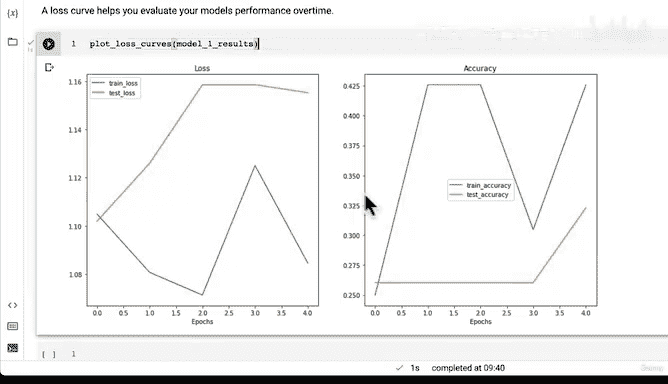
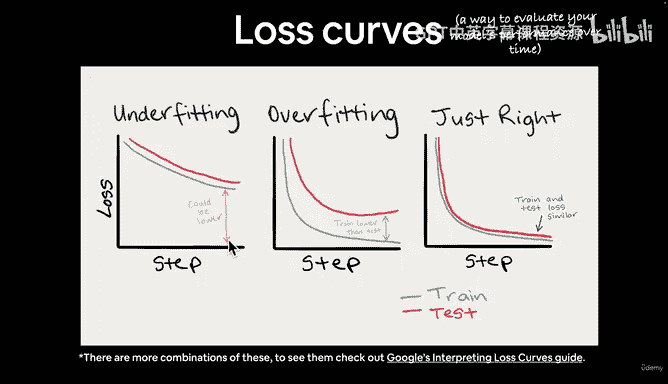
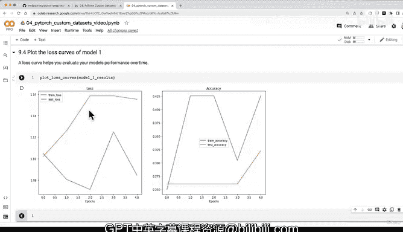

# 160：绘制模型1损失曲线 📈


在本节课中，我们将学习如何通过绘制损失曲线来评估模型1的性能。损失曲线是衡量模型在训练过程中表现随时间变化的重要工具，它能直观地展示模型是否存在欠拟合或过拟合问题。

---

## 评估模型性能：损失曲线

上一节我们介绍了使用数据增强技术训练模型1，但定量分析显示改进有限。本节中，我们来看看如何通过可视化手段进一步评估模型。

损失曲线能帮助你评估模型随时间变化的性能，并直观地展示模型是否欠拟合或过拟合。

以下是绘制模型1结果损失曲线的步骤：

```python
# 使用之前创建的函数绘制损失曲线
plot_loss_curves(results=model_1_results)
```

观察生成的曲线，我们发现测试损失呈现上升趋势。这并非理想方向，因为损失衡量的是模型的错误程度，理想情况下损失应随时间下降。同时，准确率曲线也显得波动不定。

一个可行的实验是延长模型0和模型1的训练周期，观察损失曲线是否会趋于平缓。

---



## 分析模型状态：欠拟合与过拟合

现在，我们来分析模型当前的状态：它是在欠拟合、过拟合，还是两者兼有？

对于损失曲线（此处特指损失值，而非准确率），理想的方向是随时间下降。目前，我们的模型似乎存在欠拟合，因为损失值仍有下降空间。同时，模型也表现出过拟合的迹象，因为测试损失远高于训练损失，这表明模型未能很好地泛化到新数据。



---

## 改进模型的策略

回顾Learnpytorch.io书籍第4节，理想的损失曲线应呈现平滑下降趋势。针对过拟合问题，我们可以考虑以下方法：

*   获取更多数据
*   简化模型结构
*   使用迁移学习（后续课程将涉及）

针对欠拟合问题，可以尝试以下策略：

*   增加网络层数，例如添加另一个卷积块
*   增加每层的隐藏单元数量（例如从10个增加到64个）
*   延长训练周期（例如训练20个周期）

建议你参考这些策略进行实验，尝试让损失曲线更接近理想形状。

---

## 后续内容预告

在下一视频中，我们将继续推进。我们将并排比较两个模型的结果。目前我们已经完成了两项实验，并知道它们都有改进空间。比较所有实验结果的良好方式是将模型结果并排对比，这正是我们下一节课要做的内容。

---



本节课中，我们一起学习了如何绘制并解读损失曲线，以评估模型是否存在欠拟合或过拟合，并探讨了针对这些问题的潜在改进策略。