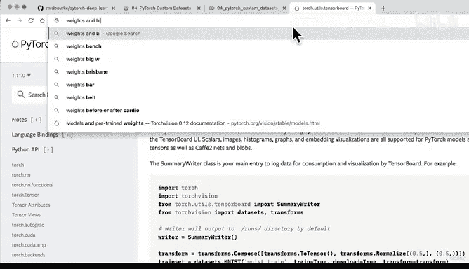
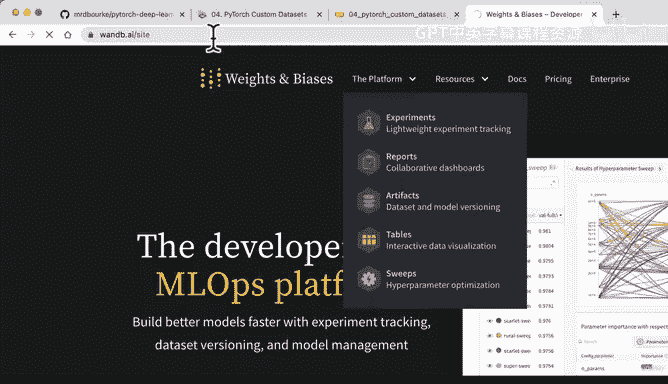
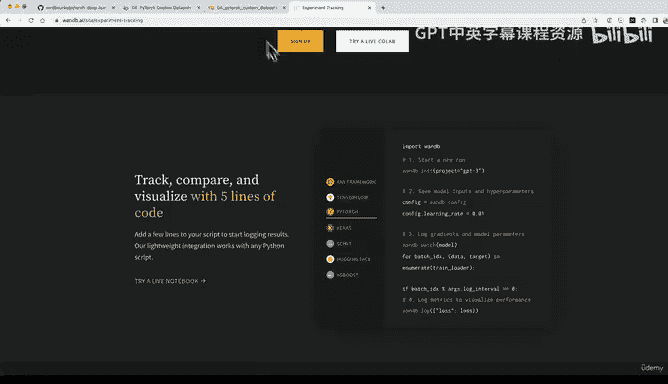
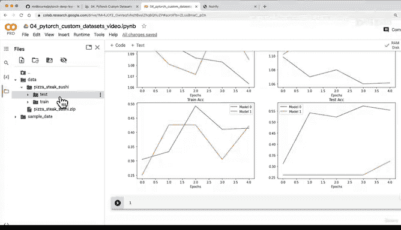

# 161：对比所有模型损失曲线 📊

在本节课中，我们将学习如何对比不同模型的训练结果。我们已经分别评估了各个模型的损失曲线，现在我们将把它们放在一起进行比较，以便更直观地看出哪个模型表现更好。

## 概述

在评估了各个建模实验的独立表现后，对比它们之间的结果至关重要。这有助于我们识别哪些调整有效，哪些无效，从而指导后续的模型优化。

有多种方法可以实现模型结果的对比。

以下是几种常见的方法：

1.  **硬编码方式**：就像我们之前所做的那样，编写函数和辅助函数，然后手动绘制图表。这是我们本节课将采用的方法。
2.  **使用工具**：例如 PyTorch + TensorBoard。TensorBoard 是一个用于跟踪实验的绝佳工具，我们将在课程后面的部分看到它。
3.  **权重与偏置**：这是我最喜欢的工具之一，它是一个用于实验的平台。你可以轻松设置它来跟踪不同的模型超参数。例如，你可以导入 `wandb`，开始一个新的运行，并记录学习率等所有信息。
4.  **MLflow**：这是另一个我喜欢的工具，它提供机器学习跟踪、项目、模型注册等功能。

虽然本课程主要关注纯 PyTorch，但了解这些工具是有益的，因为你最终会遇到它们。目前，我们将坚持使用硬编码方式，以最简单的方法开始。如果需要，我们以后可以随时添加其他工具。

## 创建模型结果对比图表

现在，让我们为每个模型的结果创建一个数据框。我们可以这样做，因为我们的模型结果是以字典形式存储的。

通过硬编码方式实现这一点相当繁琐。想象一下，如果我们有10个甚至只是5个模型，就需要编写大量代码来处理所有的字典。而上面提到的工具可以帮助你自动跟踪一切。

我们已经有了一个数据框，显示了 `Model0` 随时间变化的结果。我们可以看到训练损失开始下降，测试损失也开始下降，训练和测试数据集的准确率开始上升。这些正是我们期望看到的趋势。

一个可以尝试的实验是：将这个 `Model0` 训练更长时间，看看它是否会改进。但目前，我们只对比较结果感兴趣。

接下来，我们设置一个图表。我们希望在同一个图表上绘制 `Model 0` 和 `Model 1` 的结果。我们需要四个子图：训练损失、训练准确率、测试损失和测试准确率。每个子图上都有两条线，分别代表模型0和模型1。

无论我们有多少个不同的实验或想要比较的指标，这种模式都是相似的。你通常希望将它们全部绘制在一起以便可视化。这正是像权重与偏置、TensorBoard 和 MLflow 这样的工具可以帮助你完成的工作。

让我们开始设置图表。我将使用 Matplotlib 库，创建一个较大的图形，因为我们有四个子图，每个子图对应一个我们想要在不同模型之间比较的指标。

首先，获取训练周期数。`epochs` 将是 `model_0_df` 的长度范围。

现在，创建训练损失的图表。我们想要比较模型0和模型1的训练损失。

我们注意到 `Model 0` 的趋势是正确的。`Model 1` 在某个周期（比如第2个周期）损失飙升，但随后又开始下降。如果我们继续训练这些模型，可能会发现训练数据集上的损失总体呈下降趋势，这正是我们想要的。

接下来，绘制测试损失。我们注意到 `Model 1` 在这个阶段可能过拟合了，所以数据增强可能不是对我们模型的最佳改变。

请记住，即使你对模型进行了更改（例如防止过拟合或欠拟合），也不能保证这种改变总是能让模型的评估指标朝着正确的方向发展。理想情况下，损失应该随着时间的推移从左上方移动到右下方。目前看来，在损失方面，`Model 0` 暂时领先。

现在，让我们绘制训练和测试的准确率。在准确率方面，似乎我们的两个模型都朝着正确的方向发展。我们希望准确率从底部向左上方移动。

但是，测试准确率……哦，抱歉。我搞错了，这不是训练准确率。你发现了吗？训练准确率，我们正朝着正确的方向前进，但看起来 `Model 1` 仍然过拟合。因此，我们在训练数据上得到的结果并没有完全迁移到测试数据集上。而我们真正希望模型表现出色的地方，是在它从未见过的测试数据上。

训练数据集上的指标是好的，但理想情况下，我们希望模型在测试数据集上表现良好。因此，每当你进行一系列建模实验时，记住这一点总是好的。不仅要单独评估它们，还要相互比较。这样，你就可以回顾你的实验，看看哪些有效，哪些无效。

如果你问我对于这两个模型会怎么做，我可能会将它们训练更长时间，并可能在每一层添加更多的隐藏单元，看看结果会如何变化。

## 总结

在本节课中，我们一起学习了如何通过硬编码方式对比不同深度学习模型的训练结果。我们创建了包含训练损失、测试损失、训练准确率和测试准确率的综合图表，直观地比较了基线模型与加入数据增强的模型之间的性能差异。我们发现，简单的更改（如数据增强）并不总是能带来直接的性能提升，有时甚至可能导致过拟合。关键是要系统地跟踪和对比实验，以指导后续的优化方向。

在下一节课中，我们将学习如何使用训练好的模型对我们自己的自定义食物图像进行预测。我们将尝试上传一张不在训练集和测试集中的图片，让我们的 PyTorch 模型对其进行分类。