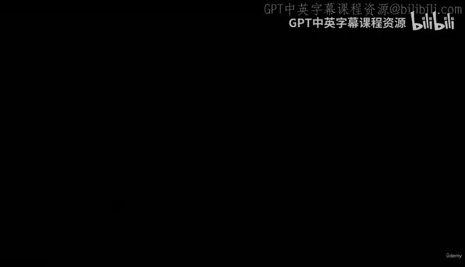
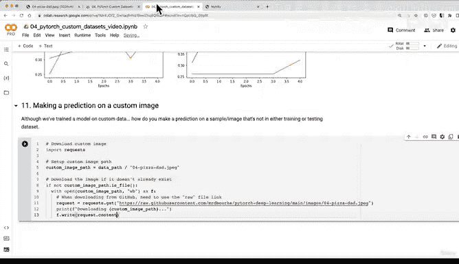

# 162：自定义数据预测（第一部分）：下载图像 📸



在本节课中，我们将学习如何为自定义图像进行预测。我们将从下载一张不在训练集或测试集中的图像开始，为后续的预测步骤做准备。

上一节我们比较了不同的建模实验。本节中，我们来看看深度学习中最令人兴奋的部分之一：对自定义图像进行预测。虽然我们已经用自定义数据训练了模型，但如何对训练集和测试集之外的样本（在我们的案例中是图像）进行预测呢？

假设你正在构建一个食物识别应用（例如 Nurify），其功能是拍摄食物照片并识别它。你希望使用计算机视觉技术，将食物图像转化为类似二维码的信息。以下是其工作流程：如果我们上传一张我爸爸为美味披萨竖起大拇指的照片，Nurify 会将其预测为“披萨”，然后提供营养信息和耗时等数据。

我们可以使用训练好的 PyTorch 模型复制类似的过程。尽管由于模型准确率和损失等指标尚有提升空间，预测结果可能不会非常出色，但让我们先了解一下整个工作流程。我们要做的第一件事是获取一张自定义图像。

我们可以在 Google Colab 中点击上传按钮并选择图像，以交互方式导入。但为了可重复性，我将像之前一样，通过编写代码以编程方式完成。因此，在本视频中，我们将编写代码来下载一张自定义图像。我将使用 `requests` 库来实现。

就像所有优秀的烹饪节目一样，我已经为大家准备了一张自定义图像。其路径为 `custom_image_path`。请注意，你可以将此流程应用于你自己的披萨、牛排或寿司图像。如果你想在其他自定义数据集上训练自己的模型，工作流程也将非常相似。

我将从 GitHub 下载一张名为 `04-pizza-dad.jpeg` 的照片。这张照片位于课程 GitHub 仓库中。如果图像尚未存在于我们的 Colab 实例中，我们将编写代码来下载它。如果你想上传单张图像，可以点击上传按钮，但请注意，与我们的其他数据一样，如果 Colab 断开连接，上传的文件将会消失。这就是我喜欢编写代码的原因，这样我们就不必每次都重新上传。

以下是下载图像的代码逻辑：如果 `custom_image_path` 对应的文件不存在，我们将打开一个请求，从 GitHub 的原始文件链接下载图像。下载图像或从 GitHub 下载文件时，通常需要使用原始文件链接。

以下是实现此功能的代码：

```python
import requests

# 自定义图像路径
custom_image_path = data_path / "04-pizza-dad.jpeg"

# 如果图像不存在，则下载
if not custom_image_path.is_file():
    # 原始图像 URL
    image_url = "https://raw.githubusercontent.com/mrdbourke/pytorch-deep-learning/main/images/04-pizza-dad.jpeg"
    
    # 打开文件以二进制写入模式
    with open(custom_image_path, "wb") as f:
        # 从 URL 下载图像内容
        request = requests.get(image_url)
        # 将内容写入文件
        f.write(request.content)
    print(f"[INFO] 下载数据: {custom_image_path}")
else:
    print(f"[INFO] {custom_image_path} 已存在，跳过下载。")
```



运行此代码后，图像将被下载并保存到我们的 `data` 文件夹中。现在，我们可以在 Google Colab 中查看这张图像。图像中有一个大披萨，我们的目标是在后续视频中让模型正确预测它为“披萨”。

在接下来的几节中，我们将编写代码，对此自定义图像执行与处理自定义数据集相同的流程：将其转换为张量，然后将其输入我们的模型进行预测。

本节课中，我们一起学习了如何以编程方式从 GitHub 下载自定义图像，为后续的预测步骤做好准备。下一节，我们将学习如何将这张图像转换为适合模型输入的张量格式。