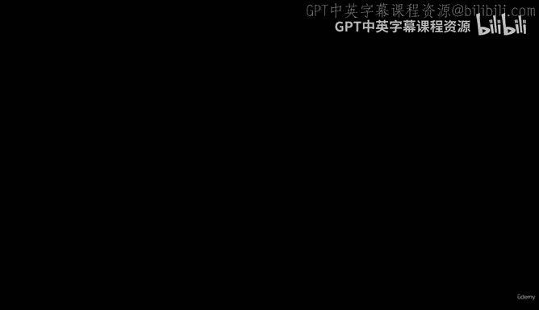
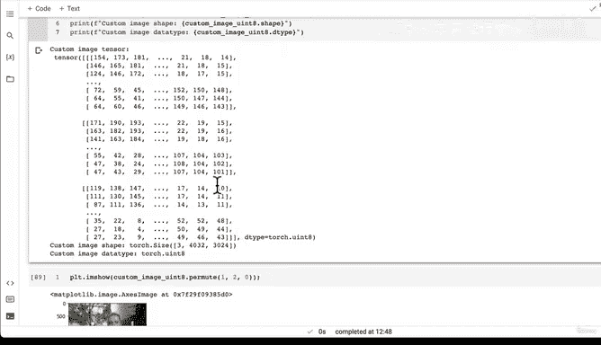
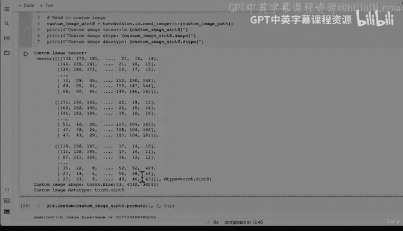

# 163：自定义数据预测（第二部分）—— 加载自定义图像 🖼️



在本节课中，我们将学习如何使用 PyTorch 加载自定义图像，并准备将其输入到我们之前训练好的深度学习模型中进行预测。我们将重点关注如何将图像转换为模型所需的张量格式。

---

## 概述

上一节我们介绍了自定义数据预测的基本概念。本节中，我们来看看如何将一张自定义图像（例如一张披萨照片）加载到 PyTorch 中，并将其转换为适合我们模型输入的张量格式。

## 加载自定义图像

我们构建深度学习模型最令人兴奋的部分之一，就是使用自定义数据进行预测。在本例中，我们将使用一张自定义图像——一张我父亲吃披萨的照片。由于我们的模型是在披萨、牛排和寿司图像上训练的，理想情况下，模型应该预测这张图像为“披萨”。

我们需要将自定义图像转换为张量形式。

### 图像格式要求

我们必须确保自定义图像的格式与模型训练时使用的数据格式一致。具体来说，数据应为张量形式，数据类型为 `torch.float32`，形状为 `[64, 64, 3]`。因此，我们可能需要调整图像的形状，并确保它在正确的计算设备上。

### 使用 Torchvision 加载图像

用于加载数据的包取决于你所在的领域。对于图像数据，我们使用 `torchvision`。

以下是加载图像的关键步骤：

1.  **查阅文档**：`torchvision` 库提供了读取和写入图像的函数。我们需要使用 `torchvision.io.read_image` 函数来读取图像。
2.  **读取图像**：该函数将 JPEG 或 PNG 图像读取为一个三维的 RGB 或灰度张量。输出张量的值类型为 `uint8`。

让我们看看如何实际操作。

```python
import torchvision

# 读取自定义图像，返回 uint8 格式的张量
custom_image_uint8 = torchvision.io.read_image(str(custom_image_path))
```

**注意**：`read_image` 函数要求路径是字符串类型。如果我们的路径是 `Path` 对象，需要先将其转换为字符串。

读取后，我们可以查看图像的张量表示、形状和数据类型。

```python
print(f"Custom image tensor:\n{custom_image_uint8}")
print(f"Custom image shape: {custom_image_uint8.shape}")
print(f"Custom image datatype: {custom_image_uint8.dtype}")
```

执行上述代码后，我们会发现：
*   **形状**：原始图像的形状可能很大（例如 `[3, 3024, 4032]`），远大于模型训练时使用的 `64x64` 图像。这意味着图像包含的信息比模型训练时见过的更多，因此我们必须调整其大小。
*   **数据类型**：张量数据类型为 `torch.uint8`，而我们的模型期望 `torch.float32` 类型。这可能在后续步骤中引发错误。

### 下一步任务

在继续之前，你可以尝试以下练习：
*   使用 `torchvision.transforms` 将图像张量的大小调整为 `64x64`。
*   将张量的数据类型从 `torch.uint8` 转换为 `torch.float32`。

完成这些预处理步骤后，我们就可以在下一部分尝试使用这个图像进行预测了。

---

## 总结





本节课中，我们一起学习了如何使用 `torchvision.io.read_image` 函数加载自定义图像，并分析了其原始的**形状**和**数据类型**。我们明确了为了匹配模型输入要求，需要进行的两个关键操作：**调整图像大小**和**转换数据类型**。下一节，我们将完成这些预处理步骤，并最终使用模型进行预测。