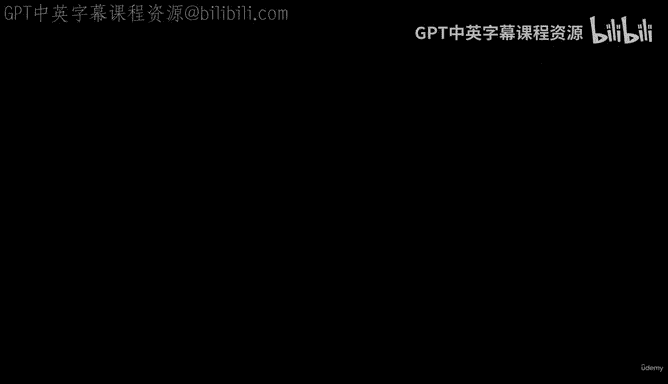
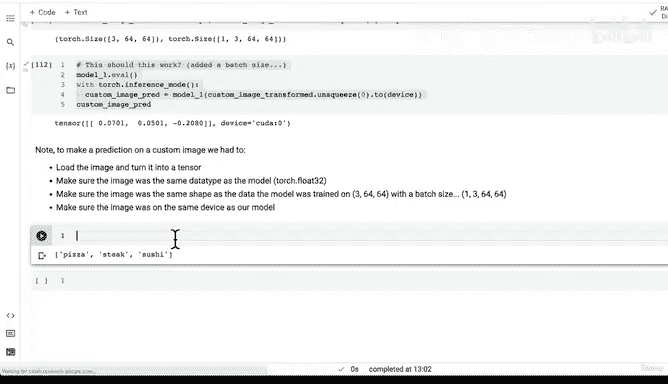

# 164：自定义数据预测（第三部分）：图像格式标准化 🖼️



在本节课中，我们将学习如何对自定义图像进行预测。我们将重点关注在将图像输入模型之前，如何确保其格式与模型训练时使用的数据格式完全一致。这是实际应用深度学习模型的关键步骤。

---

## 11.2 使用训练好的PyTorch模型对自定义图像进行预测

上一节我们加载了自己的自定义图像，并将其转换为张量。现在，我们来看看如何用它进行预测。

我们的模型性能可能尚未达到理想水平，但了解如何对自定义数据进行端到端的预测非常重要，因为这是最有趣的部分。

现在，我们尝试对图像进行预测。我想强调不同数据类型、形状和设备的重要性。在深度学习中，这是三个最常见的错误来源。

让我们看看如果尝试用 `uint8` 格式的数据进行预测会发生什么。

```python
with torch.inference_mode():
    prediction = model_1(custom_image)
```

我们遇到了一个运行时错误。错误信息提示输入类型是 `uint8`。这是我们讨论过的第一个错误：需要确保自定义数据的数据类型与模型训练时使用的数据类型相同。我们的模型期望的是 `torch.float32` 张量，而我们提供的是 `uint8` 图像张量。

---

### 修复数据类型

为了解决这个问题，我们需要加载自定义图像并将其转换为 `torch.float32` 类型。

```python
custom_image = torchvision.io.read_image(image_path).type(torch.float32)
```

现在，我们的图像是 `torch.float32` 类型了。让我们再次尝试预测。

```python
with torch.inference_mode():
    prediction = model_1(custom_image.to(device))
```

我们又遇到了问题。这次是因为我们的图像形状太大了。

---

### 调整图像数值范围

让我们检查一下图像的形状和数值范围。

```python
print(custom_image.shape)
print(custom_image.min(), custom_image.max())
```

我们发现图像尺寸非常大（例如4032x3024），并且像素值范围是0到255，而不是我们模型训练时使用的0到1。

为了将像素值缩放到0到1之间，我们可以将其除以255，因为255是标准RGB图像格式的最大值。

```python
custom_image = custom_image / 255.
print(custom_image.min(), custom_image.max()) # 现在值在0到1之间了
```

虽然数值范围正确了，但图像尺寸仍然太大。

---

### 调整图像形状

我们的模型是在64x64像素的图像上训练的。因此，我们需要将自定义图像调整为相同的大小。

以下是创建转换管道来调整图像大小的方法：

```python
custom_image_transform = transforms.Compose([
    transforms.Resize(size=(64, 64))
])
```

现在，让我们应用这个转换并查看结果。

```python
custom_image_transformed = custom_image_transform(custom_image)
print(f"原始形状: {custom_image.shape}")
print(f"转换后形状: {custom_image_transformed.shape}")
```

图像从几千像素缩小到了64x64像素。这会导致图像质量下降，变得像素化。请记住，提高模型性能的一个潜在方法是使用更大的训练图像（例如224x224），但为了与当前教程保持一致，我们暂时使用64x64。

---

### 添加批次维度并确保设备一致

即使调整了大小，预测仍然可能失败。常见的错误包括缺少批次维度和设备不匹配。

我们的模型期望的输入形状是 `[batch_size, color_channels, height, width]`。对于单张图像，我们需要添加一个批次维度（大小为1）。

```python
# 添加批次维度
custom_image_transformed_with_batch = custom_image_transformed.unsqueeze(dim=0)
print(custom_image_transformed_with_batch.shape) # 应为 [1, 3, 64, 64]
```

同时，我们必须确保图像张量与模型在同一个设备上（例如GPU）。

```python
custom_image_transformed_with_batch = custom_image_transformed_with_batch.to(device)
```

---

### 最终预测

现在，所有条件都已满足，我们可以进行预测了。

```python
with torch.inference_mode():
    custom_prediction = model_1(custom_image_transformed_with_batch)

print(custom_prediction)
```

成功了！我们得到了模型对于“披萨”、“牛排”、“寿司”三个类别的原始输出（logits）。

---

### 关键步骤总结

本节课中，我们一起学习了如何对自定义图像进行预测。以下是必须牢记的关键步骤，这些步骤几乎适用于所有自定义数据：

1.  **加载图像并将其转换为张量。**
2.  **确保图像数据类型与模型一致**（通常是 `torch.float32`）。
3.  **确保图像形状与模型训练数据一致**（例如 `[color_channels, height, width]`，并添加批次维度 `[1, color_channels, height, width]`）。
4.  **确保图像与模型在同一个设备上**（CPU或GPU）。

对自定义数据进行预测是可行的，但前提是必须将数据格式化为与模型训练时相似的格式。请务必处理好PyTorch深度学习中三个最常见的错误：**错误的数据类型、错误的形状和错误的设备**。无论处理的是图像、音频还是文本，这三个问题都会一直伴随你。

目前，我们用了大约10个代码单元来完成一次预测。在下一节课中，我们将把这些步骤封装成一个函数，使其更加简洁和可重用。

---



我们下节课再见。