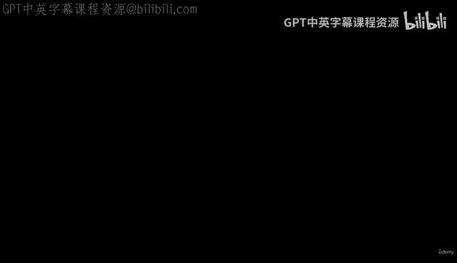
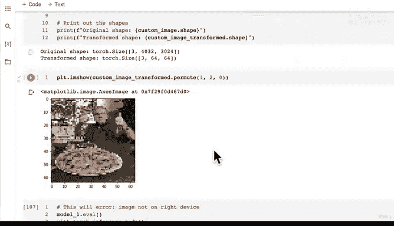

# 165：自定义数据预测（第四部分）🎯



## 概述

在本节课中，我们将学习如何将模型的原始输出（logits）转换为具体的预测标签。我们将通过应用Softmax函数将logits转换为概率，然后使用argmax获取预测类别，最终构建一个能够处理自定义图像并输出预测结果的流程。

---

## 从模型原始输出到预测概率

上一节我们成功获取了模型对自定义图像的原始输出（logits）。本节中，我们来看看如何将这些logits转换为更容易理解的预测概率。

以下是转换步骤：

1.  使用`torch.softmax()`函数。
2.  在第一个维度（dim=1）上应用Softmax，该维度对应批量中的不同样本。

```python
custom_image_pred_probs = torch.softmax(custom_image_pred, dim=1)
```

执行上述代码后，`custom_image_pred_probs`将包含模型为每个类别分配的概率值。由于我们的模型在训练集上表现并非完美，这些概率值可能会比较分散地分布在各个类别上，而不是高度集中在正确的目标类别上。

---

## 从预测概率到预测标签

得到预测概率后，下一步是确定模型最终预测的类别标签。

以下是转换步骤：

1.  使用`torch.argmax()`函数。
2.  在第一个维度（dim=1）上寻找概率值最大的索引，该索引对应类别名称列表中的位置。

```python
custom_image_pred_label = torch.argmax(custom_image_pred_probs, dim=1)
```

现在，`custom_image_pred_label`是一个包含预测类别索引的张量。为了将其转换为可读的类别名称，我们需要使用之前定义的`class_names`列表进行索引。请注意，在索引前通常需要将张量移至CPU。

```python
class_names[custom_image_pred_label.cpu()]
```

尽管当前模型的预测概率分布较散，但上述流程已成功地将一张自定义图像（例如披萨图片）通过预处理、模型推理、后处理，最终输出了一个预测标签（例如“pizza”）。

---

## 整合流程：构建预测函数

我们已经编写了多行代码来完成从图像路径到预测结果的整个流程。为了使代码更简洁、可复用，理想的做法是将这些步骤封装成一个函数。

我们的目标是构建一个函数，其理想效果是：传入一个图像文件路径，函数能够自动加载图像、进行预处理、使用模型预测、并最终绘制图像并将预测结果作为标题显示。

以下是函数需要完成的核心步骤：

1.  使用`torchvision.io.read_image`导入图像。
2.  按照之前的流程对图像进行格式化处理（调整数据类型、变换形状等）。
3.  将图像数据移至正确的设备（如GPU）。
4.  使用训练好的模型进行预测。
5.  将模型的logits输出转换为预测概率和标签。
6.  绘制图像，并将预测的类别名称设置为图表标题。

我建议你将此作为一个小挑战，尝试根据以上步骤整合我们之前编写的所有代码，构建出这个预测函数。在下一节视频中，我们将一起完成这个函数的构建。

---



## 总结

本节课中我们一起学习了模型预测流程的后处理部分。我们掌握了如何利用Softmax函数将模型的原始logits输出转换为预测概率，并通过argmax操作得到具体的预测标签索引，进而映射为人类可读的类别名称。最后，我们提出了将整个自定义图像预测流程封装成函数的任务，为下一节实现一个完整的端到端预测工具做好准备。