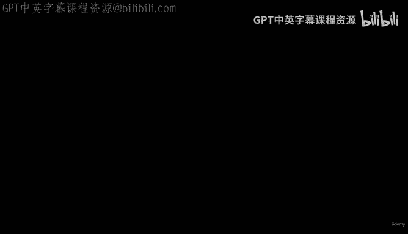
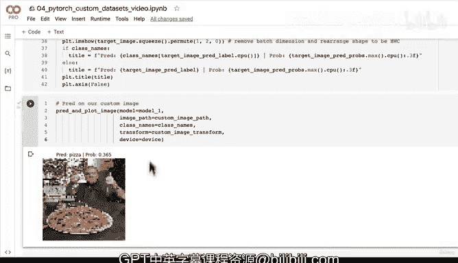

# 166：自定义数据预测（第五部分）：全流程整合 🧩



在本节课中，我们将学习如何将之前所有关于自定义数据预测的步骤整合到一个简洁、可复用的函数中。这个函数将能够加载图像、进行预处理、使用训练好的模型进行预测，并最终可视化结果。

---

上一节我们介绍了如何对单张自定义图像进行预测。本节中，我们来看看如何将这些步骤封装成一个函数，以便于重复使用。

## 函数设计思路

我们的目标是创建一个名为 `pred_and_plot_image` 的函数。这个函数需要接收以下参数：
*   一个训练好的 PyTorch 模型。
*   目标图像的路径。
*   可选的类别名称列表，用于将预测索引转换为可读标签。
*   可选的图像变换，以确保输入与模型训练时一致。
*   目标计算设备（如 CPU 或 GPU）。

以下是该函数的核心步骤：

1.  **加载图像**：使用 `torchvision.io.read_image` 加载图像。
2.  **数据转换**：将图像数据类型转换为 `torch.float32`，并将像素值从 `[0, 255]` 缩放到 `[0, 1]` 范围。
3.  **应用变换**：如果提供了变换参数，则对图像应用该变换。
4.  **准备模型**：确保模型位于正确的计算设备上。
5.  **模型预测**：为图像添加一个批次维度，将其移至正确的设备，然后让模型进行推理。
6.  **处理输出**：将模型的原始输出（logits）通过 softmax 函数转换为预测概率，并使用 `argmax` 获取预测标签。
7.  **可视化结果**：绘制图像，并在标题中显示预测的类别名称和对应的概率。

## 代码实现

以下是 `pred_and_plot_image` 函数的完整实现代码：

```python
import torch
import torchvision
import matplotlib.pyplot as plt

def pred_and_plot_image(model: torch.nn.Module,
                        image_path: str,
                        class_names: list[str] = None,
                        transform=None,
                        device: torch.device = None):
    """
    使用训练好的模型对目标图像进行预测并绘制结果。

    参数:
        model: 训练好的 PyTorch 模型。
        image_path: 目标图像的文件路径。
        class_names: 可选的类别名称列表。
        transform: 可选的图像变换。
        device: 目标计算设备（如 "cuda" 或 "cpu"）。
    """

    # 1. 加载图像
    target_image = torchvision.io.read_image(str(image_path)).type(torch.float32)

    # 2. 缩放像素值到 [0, 1] 范围
    target_image = target_image / 255.

    # 3. 应用变换（如果提供）
    if transform:
        target_image = transform(target_image)

    # 4. 确保模型在目标设备上
    model.to(device)

    # 5. 将模型设置为评估模式并进行预测
    model.eval()
    with torch.inference_mode():
        # 添加批次维度 [batch_size, color_channels, height, width]
        target_image = target_image.unsqueeze(dim=0)

        # 将图像移至目标设备
        target_image = target_image.to(device)

        # 进行预测
        target_image_pred = model(target_image)

    # 6. 将 logits 转换为预测概率和标签
    target_image_pred_probs = torch.softmax(target_image_pred, dim=1)
    target_image_pred_label = torch.argmax(target_image_pred_probs, dim=1)

    # 7. 绘制图像和预测结果
    # 移除批次维度并调整维度顺序为 [height, width, color_channels] 以供 Matplotlib 显示
    plt.imshow(target_image.squeeze().permute(1, 2, 0).cpu())

    # 设置标题
    if class_names:
        title = f"Pred: {class_names[target_image_pred_label.cpu()]} | Prob: {target_image_pred_probs.max().cpu():.3f}"
    else:
        title = f"Pred: {target_image_pred_label.cpu()} | Prob: {target_image_pred_probs.max().cpu():.3f}"

    plt.title(title)
    plt.axis(False)
```

## 使用函数进行预测

现在，我们可以使用这个函数来预测我们自己的图像。首先，确保你有所需的组件：模型、图像路径、类别列表和变换。

```python
# 定义图像变换（例如，调整大小以匹配模型输入）
custom_image_transform = torchvision.transforms.Compose([
    torchvision.transforms.Resize((64, 64)),
])

# 调用预测函数
pred_and_plot_image(model=model_1,
                    image_path="path/to/your/custom_pizza_image.jpg",
                    class_names=["pizza", "steak", "sushi"],
                    transform=custom_image_transform,
                    device=device)
```

运行上述代码后，你将看到图像以及模型对其的预测结果和置信度。

---

## 总结与思考

本节课中我们一起学习了如何将自定义图像预测的完整流程封装成一个函数。我们涵盖了从加载图像、预处理、模型推理到结果可视化的所有关键步骤。

这个函数 `pred_and_plot_image` 是一个强大的工具，它允许你轻松地对任何新图像测试你的模型。通过可视化，你可以直观地评估模型的性能，即使定量指标（如准确率）可能不高。正如我们在示例中看到的，一个在测试集上表现“较差”的模型，有时在特定自定义图像上却能做出正确的预测。

**核心要点**：
*   **代码复用**：将常用流程函数化是提高效率和组织代码的好习惯。
*   **数据一致性**：确保预测时的数据预处理（如缩放、变换）与模型训练时完全一致。
*   **设备管理**：注意将数据和模型放在相同的计算设备（CPU/GPU）上。
*   **可视化验证**：始终通过可视化来定性评估模型的预测，这能提供比单纯数字更丰富的见解。



尝试用你自己的图像和不同的模型来使用这个函数吧！观察并分析结果，这是深入理解模型行为的最佳方式。