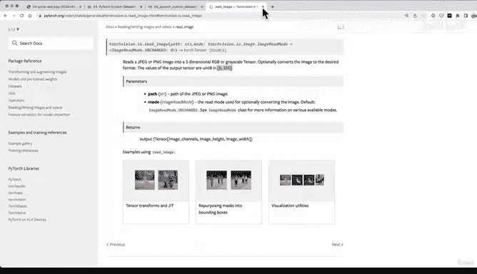
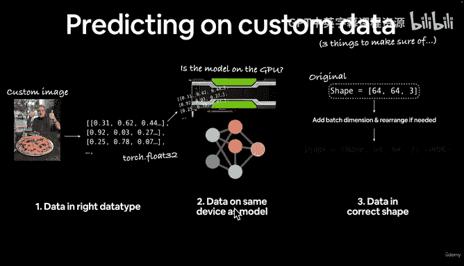
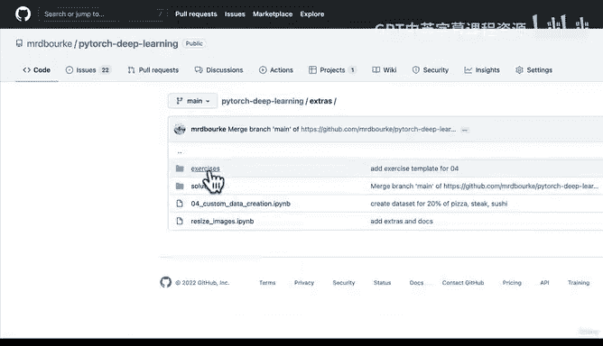

# 167：自定义数据集与预测实践 📚

在本节课中，我们将总结自定义数据集的构建方法，并学习如何对自定义图像进行预测。我们将回顾关键概念，并介绍后续的练习资源。

---

## 课程总结 🎯

上一节我们实现了对自定义图像的预测。虽然图像较为模糊，且模型在定量评估上表现一般，但定性预测结果尚可。当然，模型性能仍有多种改进方式。

核心要点在于：我们必须进行一系列预处理，确保自定义图像的格式与模型期望的格式一致。这在实际应用中非常常见，例如在图像分类服务中，上传的图像会经过类似预处理流程。

---

## 自定义数据预测的三个关键点 ✅

以下是进行自定义数据预测时必须确保的三点，无论处理图像、文本还是音频数据都适用：

1.  **确保数据为正确的数据类型**  
    在我们的案例中，数据应为 `torch.float32`。

2.  **确保数据与模型位于同一设备**  
    我们需要将自定义图像移至GPU，因为模型也在GPU上。

3.  **确保数据具有正确的形状**  
    原始图像形状为 `[64, 64, 3]`（实际应为 `[3, 64, 64]`，即通道优先）。我们需添加批次维度并根据需要调整维度顺序。最终形状为：`[batch_size, color_channels, height, width]`。

具体的数据形状、设备和数据类型取决于你的具体问题和所用框架。

---

## PyTorch核心要点与资源 🔧

PyTorch提供了丰富的内置函数来处理各类数据：

*   **`torchvision`**：用于计算机视觉（我们本节课实践的内容）。
*   **`torchaudio`**：用于音频处理。
*   **`torchtext`**：用于文本处理。
*   **`torchdata`**（测试版）：另一种数据加载方式，未来值得关注。

如果内置数据加载功能无法满足需求，你可以通过继承 `torch.utils.data.Dataset` 类来编写自定义数据集类，我们在本课的“选项2”中已经实践过。

机器学习中一个核心挑战是平衡**过拟合**与**欠拟合**。这需要仔细调整模型与数据，相关研究也大量集中于此。

进行自定义数据预测时，务必警惕三个常见错误：**错误的数据类型**、**错误的数据形状**和**错误的数据设备**。我们在实践中已经亲身体验了如何为训练好的模型准备自定义图像。

---

## 练习与拓展学习 🚀

你的练习时间到了！以下是提供的资源：

*   **练习模板**：包含问题、代码框架和注释的Jupyter笔记本。
*   **示例解答**：我提供的一种参考实现，但并非唯一或最佳方案。
*   **视频讲解**：我在YouTube上直播编写这些解答的过程，包括遇到的错误和调试思路。

我强烈建议你先独立尝试完成练习模板，利用课程笔记、已编写代码和官方文档。如果遇到困难，再参考示例解答或视频。

所有练习和拓展资料都位于课程仓库的“extras/exercises”目录中。

---

## 总结 📝

本节课我们一起学习了PyTorch自定义数据集的构建、关键的数据预处理步骤（类型、形状、设备），并对自定义图像进行了预测。我们还回顾了PyTorch的核心数据模块和过拟合/欠拟合的概念。现在，是时候通过实践来巩固这些知识了。

下一节再见！👋