# 168：模块化编程概念与内容规划 🧩

在本节课中，我们将学习如何将Jupyter Notebook中编写的实验性PyTorch代码，转化为可重用、结构化的Python脚本。我们将探讨模块化编程的核心概念，并规划如何将之前课程中构建的“Food Vision Mini”项目代码进行模块化重构。

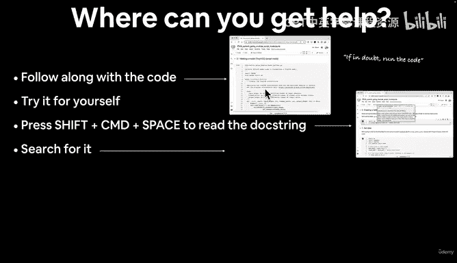

---

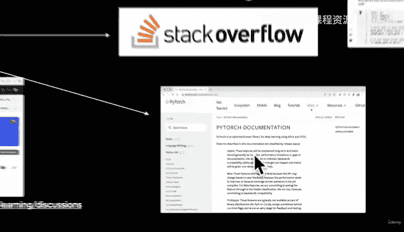

## 概述

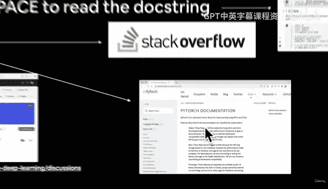

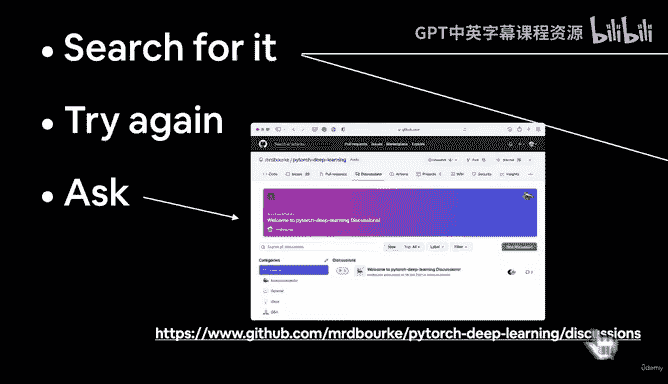

在之前的课程中，我们编写了许多有用的代码，例如数据加载、模型构建和训练循环。然而，这些代码通常都存在于单个笔记本文件中。模块化编程的目标是将这些代码组织成独立的、可重用的Python脚本。这样做的好处是，我们可以在不同的项目中轻松复用这些代码，并且可以通过命令行参数灵活地控制训练过程。

上一节我们构建了“Food Vision Mini”模型来识别披萨、牛排和寿司图像。本节中，我们来看看如何将构建该模型的所有代码模块化。

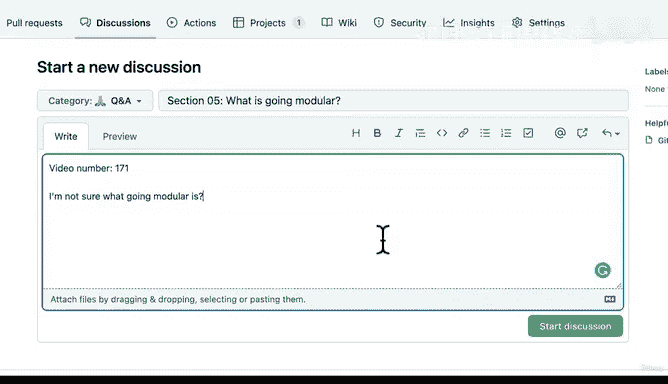

## 获取帮助的途径

以下是遇到问题时可以遵循的步骤：
1.  运行代码。如果不确定，就运行代码。
2.  所有代码资源都可以在Github上找到。如果遇到困难，可以参考这些资源。
3.  自己动手尝试。编写代码，运行它，观察结果。
4.  按Shift+Command+空格键可以阅读文档字符串。
5.  如果仍然卡住，建议搜索相关问题。你会找到Stack Overflow或非常有用的PyTorch文档等资源。
6.  再次尝试。记住我们的座右铭：如果不确定，就运行代码。
7.  如果问题依旧，你可以在本课程的PyTorch深度学习讨论页上提问。

## 什么是“模块化”？

“模块化”的核心思想是代码复用。你可能在笔记本中编写了一些优秀的代码，并想知道是否能在其他地方重用它们。事实上，我们已经在前面的许多笔记本中编写了大量优秀代码。其中很多代码我们已经练习编写了多次。我故意这样做，因为练习代码的最佳方式之一就是编写更多代码。但现在，我们已经练习了编写训练循环、数据加载等代码，我们可能希望重用它们。因此，“模块化”的全部前提就是，你可以重用你那些有用的代码。这就是我们本节要涵盖的内容：将之前笔记本中最有用的代码复用到Python脚本中。

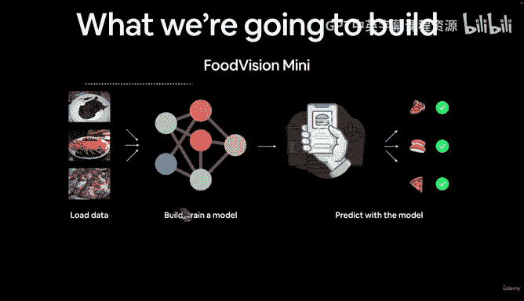

让我们更具体一些。在上一节中，我们构建了“Food Vision Mini”项目。我们加载了一些数据，编写了一些PyTorch代码来加载牛排、寿司和披萨的图像数据。我们构建并训练了一个模型来识别不同的食物。然后我们用模型做了一些预测，尽管预测结果不如本图示显示的那么好，它确实弄错了一些，但这没关系。本节我们要关注的是，将我们用于加载数据、构建模型、训练模型的所有代码转化为一系列Python脚本。

## 目标目录结构

在本节结束时，我们将得到一个类似这样的目录结构：
*   一个顶级目录，在本节后命名为 `going_modular`。
*   一个同样名为 `going_modular` 的子目录。
*   在该 `going_modular` 子目录内，我们将有一系列Python脚本：
    *   `data_setup.py`：用于准备数据。
    *   `engine.py`：用于训练和测试模型。
    *   `model_builder.py`：用于构建我们的PyTorch模型。
    *   `train.py`：主要的训练脚本。
    *   `utils.py`：工具函数。
*   我们最终还会得到一个 `models` 目录，用于存放我们训练好的不同PyTorch模型。

我们的数据将采用过去几节中使用过的相同格式，即标准的图像分类格式（披萨、牛排和寿司图像）。但需要注意的是，你可以根据你正在处理的问题，以几乎任何形式自定义这种结构。然而，你通常会在实际项目中发现的PyTorch代码就是类似这样的结构。

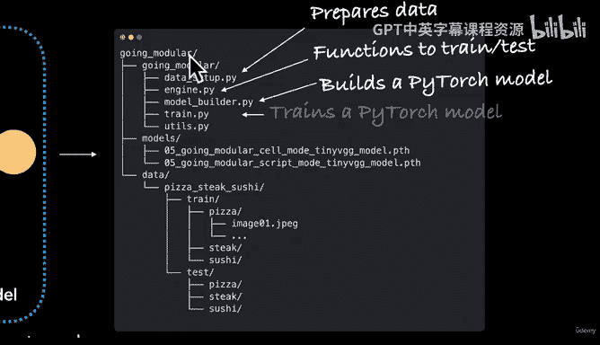

## 核心目标：一行命令训练模型

我们真正想做的是能够用一行代码训练一个PyTorch模型。并且，通过这行代码，最好能传入不同的超参数，例如训练哪个模型、批量大小应该是多少、应该使用什么学习率、应该训练多长时间。

这是一个命令行命令。我们可以运行 `python train.py`。这是我们的目标脚本。我们想训练某个模型。我们想使用某个批量大小。我们想使用某个学习率。我们想训练若干个周期。这里的这些标志称为参数标志。

以下是一个例子。如果我们想训练上一节中的TinyVGG模型，我们可以这样写：
```bash
python train.py --model tiny_vgg --batch_size 32 --learning_rate 0.001 --num_epochs 10
```
当然，你可能会猜，我们能否在这里添加更多超参数，例如隐藏单元数或层数等。答案是肯定的。这真的可以扩展到20个不同的超参数、30个、10个，这并不重要，它是无限可定制的。

所以，这行代码本质上是在说：使用批量大小32、学习率0.001训练TinyVGG模型10个周期。

## 实际项目中的模块化实践

正如我之前提到的，这通常就是你在实际项目中找到PyTorch代码的方式。当然，你也会在不同的笔记本中找到它们，但Detectron2文档（Meta/Facebook的使用PyTorch的计算机视觉库）就是一个例子。在那里，你会看到 `train_net.py` 脚本，它用于在多个GPU上训练神经网络。如果你想用单个GPU训练，只需更改相应的参数标志即可。

TorchVision（PyTorch官方库的一部分）也是如此。这是他们进行目标检测的方式。如果你访问PyTorch/vision/references/detection，你会看到一堆Python脚本：`train.py`、`utils.py`、`engine.py`。

PyTorch博客文章中训练最先进计算机视觉模型的部分也使用了类似的方式，他们使用 `torchrun` 来运行PyTorch脚本。

## 工作流程：从笔记本到脚本

我想与你分享我的工作流程。这不一定是最佳或唯一的工作流程，它只是一个例子。这是将有用的笔记本代码转化为Python脚本的众多选项之一。

1.  我通常从Jupyter/Google Colab笔记本开始，因为它们非常适合实验和可视化。
2.  如果我在一些代码单元格中编写了一些有用的笔记本代码，我会将最有用的代码移动到Python脚本中。

例如，这里可能有一个名为 `data_setup.py` 的脚本，它包含设置数据的代码：
```python
import os
from torchvision import datasets, transforms
from torch.utils.data import DataLoader
```
在这个脚本中，我们可能会返回一个训练数据加载器、一个测试数据加载器和类别名称。我们将在接下来的编码部分中学习如何创建这样的文件。

## 本节的两个部分：单元格模式与脚本模式

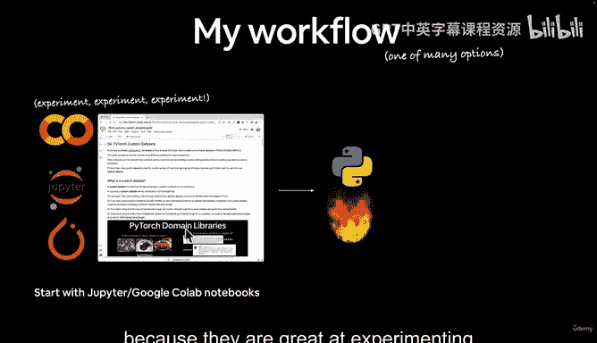

本节有两个部分或两个笔记本需要注意。一个是单元格模式，另一个是脚本模式。

1.  **第1部分：单元格模式笔记本**。这是笔记本 `05_pytorch_going_modular_part_1_cell_mode.ipynb`。这与普通的Jupyter笔记本和Google Colab笔记本没有什么不同。我们将从上到下运行它。它只是在单元格中执行Python代码，就像我们在课程其余部分一直在做的那样。
2.  **第2部分：脚本模式笔记本**。这是笔记本 `05_pytorch_going_modular_part_2_script_mode.ipynb`。它将使用Jupyter魔术命令将我们有用的代码转化为Python脚本。

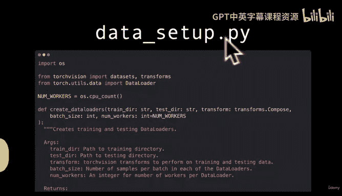

魔术命令是以双百分号 `%%` 开头的命令。我们将使用 `%%writefile` 这个命令。例如：
```
%%writefile going_modular/model_builder.py
```
这会将此代码单元格中的所有内容写入到 `going_modular` 目录下名为 `model_builder.py` 的脚本中。我们稍后会看到这个实际操作。

因此，本节分为两部分。第1部分是一个单元格模式的笔记本。第2部分是脚本模式，它将把单元格模式中的代码转化为Python脚本。

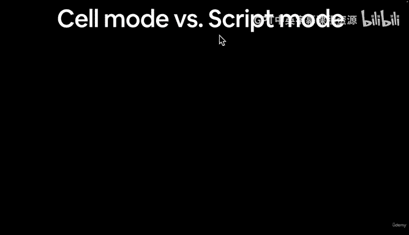

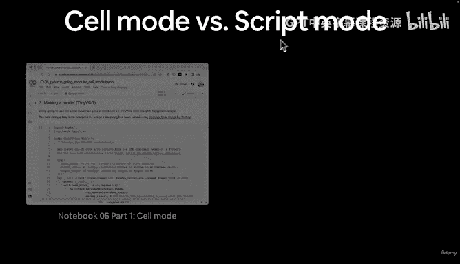

## 模块化代码结构

我们将遵循我们的工作流程。我们现在已经看过几次了，所以可以快速浏览一下。但我想让你注意的是，这里的每个小部分，因为它们各自具有一定的功能。它们确实相互交互，但都可以被个体化为不同的Python脚本。这就是我们将在本节中看到的内容。

因此，每个部分都可以转化为一个Python脚本：一个用于准备数据，一个用于构建模型，一个用于训练模型（拟合是训练模型的一部分），一个用于评估，一个用于保存模型，等等。

## 本节涵盖内容

最后，我们广泛地概述一下本节将涵盖的内容：
*   转换数据以供模型使用（我们已经做了一些）。
*   使用预构建函数加载自定义数据。
*   构建“Food Vision Mini”模型来分类披萨、牛排和寿司图像（这是我们关注的重点）。
*   将上述所有有用的笔记本代码转化为Python脚本。
*   了解如何从命令行训练PyTorch模型。

虽然这是一个机器学习“烹饪”节目，我们将编写大量代码，但话虽如此，让我们开始编码吧！

---

## 总结


本节课中，我们一起学习了模块化编程的核心概念与本节的内容规划。我们明确了模块化的目标是实现代码复用，并规划了如何将“Food Vision Mini”项目的代码重构为一系列独立的Python脚本，最终实现通过单行命令灵活训练模型的目标。接下来，我们将进入实践环节，开始编写这些模块化的脚本。