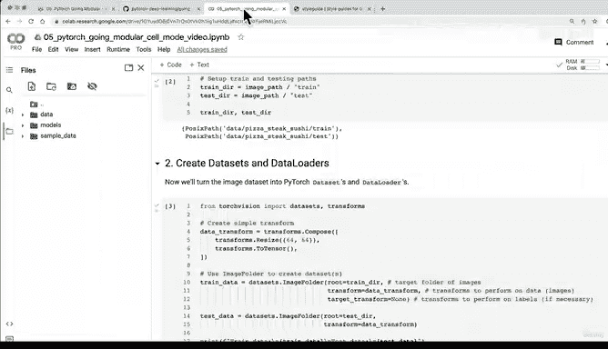

# 169：模块化笔记本（第一部分）🚀


在本节课中，我们将学习如何将Jupyter笔记本中的代码转换为可重用的Python脚本文件。这是将实验性代码转化为生产级代码的重要一步。

## 概述

上一节我们学习了如何构建自定义数据集。本节我们将开始模块化之旅，将笔记本中零散的代码单元格，组织成结构清晰、可复用的Python模块。

## 什么是模块化？

模块化是指将代码按功能拆分成独立的文件或模块。这样做的好处是提高代码的可读性、可维护性和复用性。在PyTorch项目中，常见的做法是将数据准备、模型定义、训练引擎和工具函数分别放在不同的脚本中。

以下是本部分将使用的两个笔记本：
*   **第一部分（Cell模式）**：以常规的、从上到下运行的笔记本形式，包含了上一节（04节）所有代码的浓缩版本。
*   **第二部分（Script模式）**：在第一部分的基础上进行重构，展示了我们最终要达成的模块化目标。

## 启动Cell模式笔记本

我们首先从第一部分（Cell模式）开始。这个笔记本已经包含了我们所需的所有功能代码。

为了在Google Colab中运行，我们需要复制一份到自己的云端硬盘。

```python
# 在Colab中，通过点击“复制到云端硬盘”按钮，即可创建个人副本
```

确保运行时使用了GPU加速。

```python
# 在Colab中，选择：运行时 -> 更改运行时类型 -> 选择GPU
```

## 代码结构解析

现在，让我们运行并解析这个Cell模式笔记本中的代码。整个流程分为以下几个步骤：

以下是笔记本中按顺序执行的核心步骤：

1.  **获取数据**：下载披萨、牛排、寿司的图像数据集，并设置训练和测试目录。
2.  **创建数据加载器**：基于数据集创建训练和测试数据加载器（`DataLoader`）。
3.  **构建模型**：实例化一个TinyVGG模型。
4.  **设置设备无关代码**：确保模型能在CPU或GPU上运行。
5.  **定义训练与测试步骤**：创建`train_step()`和`test_step()`函数，并为其添加Google风格的文档字符串（Docstring），以说明函数功能。
6.  **组合训练循环**：编写`train()`函数，整合训练和测试步骤，完成模型的训练过程。
7.  **保存模型**：创建`save_model()`函数，将训练好的模型保存到指定路径。
8.  **执行训练与评估**：运行代码，训练模型，输出每个epoch的损失和准确率，最后保存训练好的模型。

运行结束后，你会在工作区看到生成的`data/`目录和`models/`目录，其中`models/`里保存了训练好的模型文件。

## 从Cell到Script的转变目标

目前，所有代码都运行在一个笔记本文件中。我们的目标是将其模块化，最终得到一组Python脚本文件。

我们期望的最终文件结构如下：
*   `data_setup.py`: 包含数据下载和预处理逻辑。
*   `model_builder.py`: 包含模型定义（如TinyVGG）。
*   `engine.py`: 包含训练（`train_step`）、测试（`test_step`）和主训练循环（`train`）函数。
*   `train.py`: 主执行脚本，整合以上模块，启动训练流程。
*   `utils.py`: 包含辅助函数，如保存模型（`save_model`）等。

## 总结

本节课我们一起运行了一个完整的、端到端的PyTorch训练流程笔记本（Cell模式）。我们回顾了从数据准备、模型构建、训练到保存的每一步，并理解了将所有代码写在一个笔记本中的形式。



下一节，我们将开始动手重构，将这些有用的代码单元格提取出来，逐步转换成上述可复用的Python脚本文件，迈出模块化的第一步。