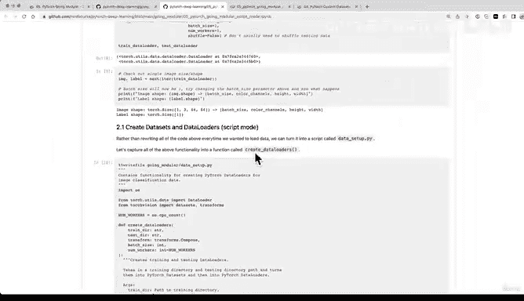

# 170：下载数据集 🗂️


在本节课中，我们将学习如何下载并准备一个用于图像分类的数据集。我们将复用之前课程中编写的代码，并将其整理成清晰的步骤，为后续将其转换为可复用的Python脚本打下基础。

---

## 概述

上一节我们介绍了“模块化”项目的整体结构。本节中，我们来看看如何获取数据。我们将运行一个代码单元，下载披萨、牛排和寿司的图像数据集，并将其解压到标准格式的目录中。

以下是获取数据的具体步骤。

1.  **导入所需库**：首先导入处理压缩文件所需的Python模块。
2.  **设置数据路径**：定义存储数据的目标文件夹路径。
3.  **下载数据**：如果目标文件夹不存在，则从网络下载数据集压缩包。
4.  **解压数据**：将下载的压缩文件解压到指定目录。
5.  **清理文件**：删除已解压的原始压缩文件，以节省空间。

## 详细步骤

### 1. 导入所需库
我们使用 `zipfile` 模块来处理压缩文件。
```python
import zipfile
```

### 2. 设置数据路径
定义数据将要存储的根目录。
```python
data_path = “./data”
```

### 3. 下载并准备数据
检查数据目录是否存在。如果不存在，则执行下载和解压操作。
```python
import os
from pathlib import Path
import requests

# 设置数据路径
data_path = Path(“data/“)
image_path = data_path / “pizza_steak_sushi”

# 如果图像文件夹不存在，则下载数据
if image_path.is_dir():
    print(f“{image_path} 目录已存在，跳过下载。“)
else:
    print(f“{image_path} 不存在，正在创建并下载数据…“)
    image_path.mkdir(parents=True, exist_ok=True)

    # 下载数据集压缩包
    url = “https://github.com/mrdbourke/pytorch-deep-learning/raw/main/data/pizza_steak_sushi.zip“
    filename = image_path / “pizza_steak_sushi.zip“
    print(“正在下载数据…“)
    with open(filename, “wb“) as f:
        request = requests.get(url)
        f.write(request.content)

    # 解压文件
    print(“正在解压数据…“)
    with zipfile.ZipFile(filename, “r“) as zip_ref:
        zip_ref.extractall(image_path)

    # 删除压缩文件
    print(“清理压缩文件…“)
    os.remove(filename)
```

### 4. 设置训练和测试路径
数据解压后，会按照标准图像分类格式组织，即 `train/` 和 `test/` 目录下各有以类别命名的子文件夹。
```python
# 设置训练和测试目录路径
train_dir = image_path / “train“
test_dir = image_path / “test“

train_dir, test_dir
```

## 总结

本节课中我们一起学习了如何下载和准备一个图像分类数据集。我们编写代码来自动完成从检查目录、下载压缩包到解压和清理的整个过程。数据集被组织成 `train` 和 `test` 文件夹，每个文件夹内包含以类别（披萨、牛排、寿司）命名的子文件夹，这是一种非常常见的格式。



下一节，我们将以此为基础，开始创建数据集和数据加载器，并学习如何将这部分代码模块化，转换成独立的Python脚本。