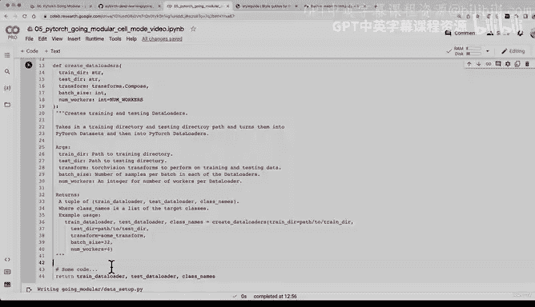

# 171：编写首个数据配置 Python 脚本大纲 📝


在本节课中，我们将学习如何将 Jupyter Notebook 中用于创建数据集和数据加载器的代码，转化为一个可复用的 Python 脚本。我们将使用 Jupyter 的魔法命令来高效地完成这一过程。

---

## 从 Notebook 到脚本的转变

上一节我们介绍了如何使用 Torchvision 的数据集和转换来加载数据。本节中，我们来看看如何将这些代码模块化，以便于重用。

我们当前的目标是将以下功能封装成独立的 Python 脚本：
*   使用 `ImageFolder` 加载标准格式的图像分类数据。
*   应用数据转换。
*   将数据集转换为数据加载器。

---

## 使用 Jupyter 魔法命令

为了将代码单元的内容保存为 `.py` 文件，我们将使用 Jupyter 的一个内置魔法命令：`%%writefile`。这是一个单元格魔法，意味着它会将整个单元格的内容写入指定的文件。

以下是使用该命令的语法：
```python
%%writefile 文件路径/文件名.py
```

---

## 构建 `data_setup.py` 脚本

现在，让我们开始编写我们的第一个脚本。我们将创建一个名为 `data_setup.py` 的文件，并将其保存在 `going_modular` 目录下。

首先，我们写入一个文档字符串，说明文件的功能：
```python
"""
功能：为图像分类数据创建 PyTorch 数据加载器。
"""
```

接着，导入必要的库：
```python
import os
from torchvision import datasets, transforms
from torch.utils.data import DataLoader
```

然后，我们定义核心函数 `create_dataloaders`。我们将按照 Google Python 风格指南为其编写详细的文档字符串，说明参数和返回值。

```python
def create_dataloaders(
    train_dir: str,
    test_dir: str,
    transform: transforms.Compose,
    batch_size: int,
    num_workers: int = os.cpu_count()
):
    """
    从训练和测试目录创建训练和测试数据加载器。

    参数:
        train_dir: 训练数据目录的路径。
        test_dir: 测试数据目录的路径。
        transform: 要对训练和测试数据执行的转换组合。
        batch_size: 每个数据加载器中每批的样本数量。
        num_workers: 每个数据加载器的工作进程数（整数）。

    返回:
        一个包含以下内容的元组：
            train_dataloader: 训练数据加载器。
            test_dataloader: 测试数据加载器。
            class_names: 目标类别的列表。

    示例用法:
        train_dataloader, test_dataloader, class_names = create_dataloaders(
            train_dir="path/to/train_data",
            test_dir="path/to/test_data",
            transform=some_transform,
            batch_size=32,
            num_workers=4
        )
    """
    # 函数内部代码将在这里实现
    pass
```

---

## 你的挑战 🎯

在下一个视频开始前，你的任务是完成 `create_dataloaders` 函数内部的代码。你需要整合我们之前在 notebook 中编写的逻辑：

1.  使用 `datasets.ImageFolder` 和传入的 `transform` 创建训练和测试数据集。
2.  使用 `DataLoader` 将数据集转换为数据加载器，并利用 `batch_size` 和 `num_workers` 参数。
3.  从训练数据集中获取类别名称列表。
4.  最后，函数应返回训练数据加载器、测试数据加载器和类别名称。

尝试基于之前章节的代码来完成这个函数。我们将在下一节课中一起实现它。

---

## 总结



本节课中我们一起学习了如何开始模块化我们的 PyTorch 代码。我们介绍了使用 `%%writefile` 魔法命令将 Jupyter 单元格保存为 Python 脚本的方法，并构建了 `data_setup.py` 脚本的基本框架，包括导入语句、函数定义和详细的文档字符串。通过完成这个脚本，我们将拥有一个可重用的工具来为图像分类任务快速设置数据管道。