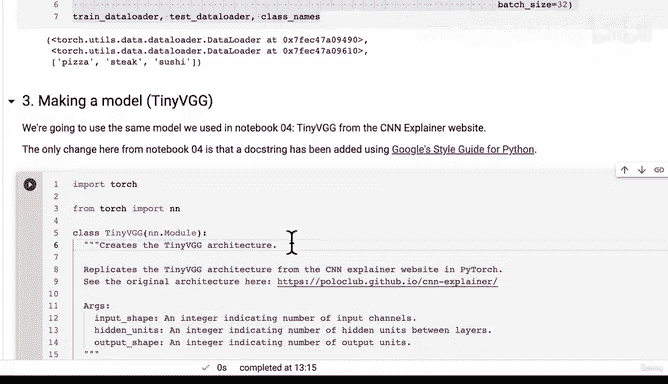

# 172：创建PyTorch DataLoader生成脚本 🚀


在本节课中，我们将学习如何将Jupyter Notebook中用于创建数据加载器的代码，重构并保存为一个独立的、可复用的Python脚本。我们将重点关注`torch.utils.data.DataLoader`的创建过程，并介绍一个能提升GPU数据加载效率的重要参数。

---

## 概述

在上一节中，我们为第一个Python脚本`dataset.py`编写了框架，定义了一个用于创建数据加载器的函数。本节我们将一起填充该函数的逻辑，完成脚本的编写，并学习如何使用它来高效地加载数据。

## 创建数据加载器函数

我们的目标是创建一个名为`create_dataloaders`的函数。它接收训练和测试目录路径、数据变换、批次大小和工作进程数作为参数，并返回对应的数据加载器以及类别名称。

以下是该函数的核心逻辑步骤：

1.  **使用`ImageFolder`创建数据集**
    我们使用PyTorch内置的`torchvision.datasets.ImageFolder`类，它能够自动根据文件夹结构创建数据集。每个子文件夹名将被视为一个类别标签。

    ```python
    train_data = datasets.ImageFolder(root=train_dir, transform=transform)
    test_data = datasets.ImageFolder(root=test_dir, transform=transform)
    ```

2.  **获取类别名称**
    从训练数据集中提取类别名称列表，这在我们后续构建和评估模型时非常有用。

    ```python
    class_names = train_data.classes
    ```

3.  **创建DataLoader**
    这是将数据集转换为可迭代数据加载器的关键步骤。`DataLoader`负责按批次加载数据，并支持打乱顺序、多进程加载等特性。

    ```python
    train_dataloader = DataLoader(dataset=train_data,
                                  batch_size=batch_size,
                                  shuffle=True,
                                  num_workers=num_workers,
                                  pin_memory=True)
    ```

## 理解关键参数：`pin_memory=True`

在创建`DataLoader`时，我们设置了一个参数`pin_memory=True`。这个参数对于使用GPU进行训练时提升速度至关重要。

*   **作用**：当`pin_memory=True`时，数据加载器会将数据预先固定在（pin）主机（CPU）内存的特定区域。这使得后续将数据从CPU内存复制到GPU内存的过程更快，因为避免了额外的内存分配和传输开销。
*   **公式/原理**：可以理解为 `数据传输时间 ∝ 1 / 内存固定优化`。通过固定内存，减少了数据在CPU端准备时的延迟，从而加速了 `CPU -> GPU` 的数据流。
*   **适用场景**：当使用GPU训练且数据量较大时，启用此选项通常能获得明显的性能提升。对于小型数据集，效果可能不明显，但养成使用它的习惯是有益的。

## 脚本的使用与验证

函数编写完成后，我们将其保存为`going_modular/data_setup.py`。现在，我们可以在任何地方通过导入这个模块来快速创建数据加载器，而无需重复编写代码。

```python
from going_modular import data_setup

train_dataloader, test_dataloader, class_names = data_setup.create_dataloaders(
    train_dir=train_dir,
    test_dir=test_dir,
    transform=data_transform,
    batch_size=32
)
```

运行上述代码，我们成功获得了数据加载器，并打印出了类别名称：`['pizza', 'steak', 'sushi']`。这证明我们的脚本工作正常。

## 总结

本节课中我们一起学习了如何将数据准备代码模块化。我们完成了以下工作：
1.  实现了`create_dataloaders`函数，它封装了使用`ImageFolder`创建数据集和`DataLoader`的过程。
2.  深入了解了`pin_memory=True`参数的作用，它是优化GPU训练数据流水线的一个关键技巧。
3.  成功创建并验证了我们的第一个模块化脚本`data_setup.py`，实现了代码的复用。



通过将常用功能脚本化，我们的工作流程变得更加清晰和高效。在下一节中，我们将尝试把定义模型的代码也转化为一个独立的脚本。