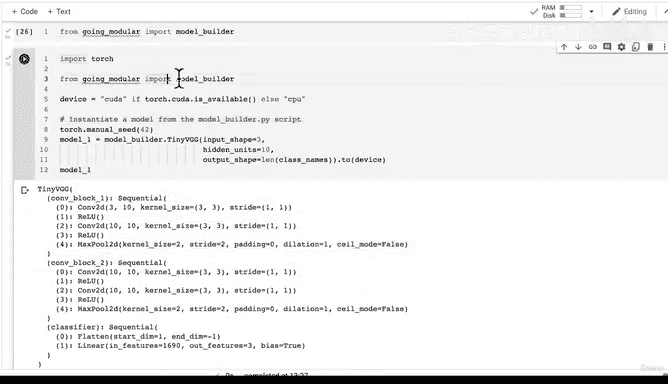

# 173：将模型构建代码转为Python脚本 🚀


在本节课中，我们将学习如何将Jupyter Notebook中的PyTorch模型构建代码转换为独立的Python脚本。这样做的好处是，我们可以将有用的代码模块化，以便在其他项目中重复使用，从而提高开发效率。

---

## 概述

上一节我们创建了用于数据设置的Python脚本。本节中，我们来看看如何将模型构建代码也转换为Python脚本。我们将以之前使用过的TinyVGG模型为例，演示如何将其封装成一个可导入的脚本文件。

---

## 将模型代码转换为脚本

以下是我们在Notebook中创建的TinyVGG模型代码。我们的目标是将这段代码保存到一个独立的Python文件中。

```python
import torch
from torch import nn

class TinyVGG(nn.Module):
    """
    根据CNN Explainer网站复现的TinyVGG模型架构。
    参数:
        input_shape: 输入图像的通道数。
        hidden_units: 隐藏层的通道数。
        output_shape: 输出类别的数量。
    """
    def __init__(self, input_shape: int, hidden_units: int, output_shape: int) -> None:
        super().__init__()
        self.conv_block_1 = nn.Sequential(
            nn.Conv2d(in_channels=input_shape,
                      out_channels=hidden_units,
                      kernel_size=3,
                      stride=1,
                      padding=0),
            nn.ReLU(),
            nn.Conv2d(in_channels=hidden_units,
                      out_channels=hidden_units,
                      kernel_size=3,
                      stride=1,
                      padding=0),
            nn.ReLU(),
            nn.MaxPool2d(kernel_size=2,
                         stride=2)
        )
        self.conv_block_2 = nn.Sequential(
            nn.Conv2d(in_channels=hidden_units,
                      out_channels=hidden_units,
                      kernel_size=3,
                      stride=1,
                      padding=0),
            nn.ReLU(),
            nn.Conv2d(in_channels=hidden_units,
                      out_channels=hidden_units,
                      kernel_size=3,
                      stride=1,
                      padding=0),
            nn.ReLU(),
            nn.MaxPool2d(kernel_size=2,
                         stride=2)
        )
        self.classifier = nn.Sequential(
            nn.Flatten(),
            nn.Linear(in_features=hidden_units*13*13,
                      out_features=output_shape)
        )

    def forward(self, x: torch.Tensor):
        x = self.conv_block_1(x)
        x = self.conv_block_2(x)
        x = self.classifier(x)
        return x
```

为了将其转换为脚本，我们使用Jupyter的魔术命令将代码写入文件。

```python
%%writefile going_modular/model_builder.py
import torch
from torch import nn

class TinyVGG(nn.Module):
    """
    根据CNN Explainer网站复现的TinyVGG模型架构。
    参数:
        input_shape: 输入图像的通道数。
        hidden_units: 隐藏层的通道数。
        output_shape: 输出类别的数量。
    """
    def __init__(self, input_shape: int, hidden_units: int, output_shape: int) -> None:
        super().__init__()
        self.conv_block_1 = nn.Sequential(
            nn.Conv2d(in_channels=input_shape,
                      out_channels=hidden_units,
                      kernel_size=3,
                      stride=1,
                      padding=0),
            nn.ReLU(),
            nn.Conv2d(in_channels=hidden_units,
                      out_channels=hidden_units,
                      kernel_size=3,
                      stride=1,
                      padding=0),
            nn.ReLU(),
            nn.MaxPool2d(kernel_size=2,
                         stride=2)
        )
        self.conv_block_2 = nn.Sequential(
            nn.Conv2d(in_channels=hidden_units,
                      out_channels=hidden_units,
                      kernel_size=3,
                      stride=1,
                      padding=0),
            nn.ReLU(),
            nn.Conv2d(in_channels=hidden_units,
                      out_channels=hidden_units,
                      kernel_size=3,
                      stride=1,
                      padding=0),
            nn.ReLU(),
            nn.MaxPool2d(kernel_size=2,
                         stride=2)
        )
        self.classifier = nn.Sequential(
            nn.Flatten(),
            nn.Linear(in_features=hidden_units*13*13,
                      out_features=output_shape)
        )

    def forward(self, x: torch.Tensor):
        x = self.conv_block_1(x)
        x = self.conv_block_2(x)
        x = self.classifier(x)
        return x
```

执行上述代码后，会在`going_modular`目录下创建`model_builder.py`文件，其中包含了我们的模型类。

---

## 从脚本导入并使用模型

创建脚本后，我们可以在Notebook或其他Python文件中导入并使用它。以下是导入和实例化模型的步骤。

首先，导入必要的库和我们的模型构建脚本。

```python
import torch
from going_modular import model_builder

# 设置设备无关代码
device = "cuda" if torch.cuda.is_available() else "cpu"

# 设置随机种子以确保可重复性
torch.manual_seed(42)

# 从脚本实例化模型
model_1 = model_builder.TinyVGG(input_shape=3,
                                hidden_units=10,
                                output_shape=len(class_names)).to(device)

# 查看模型结构
print(model_1)
```

接下来，我们可以进行一个前向传播测试，以确保模型工作正常。

```python
# 进行一次虚拟前向传播以验证模型
# 获取一个批次的图像
images, labels = next(iter(train_dataloader))

# 获取单张图像并调整形状以匹配模型输入
single_image = images[0].unsqueeze(dim=0).to(device)

# 进行前向传播
model_1.eval()
with torch.inference_mode():
    pred = model_1(single_image)



print(pred)
```

如果输出显示预测的张量形状正确，则说明模型从脚本导入并工作正常。

---

## 模块化工作流的优势

将代码转换为Python脚本的主要优势在于可重用性和组织性。以下是这种工作流的核心步骤：

1.  **在Notebook中实验**：首先在Jupyter Notebook中编写和测试代码。
2.  **封装为函数或类**：将工作正常的代码组织成函数或类。
3.  **保存为脚本**：使用魔术命令或手动方式将代码保存到`.py`文件中。
4.  **导入和使用**：在其他项目或脚本中导入这些模块，避免重复编写代码。

这种模式特别适合机器学习工程，因为它允许快速原型开发，同时保持生产代码的整洁和可维护性。

---

## 总结

本节课中我们一起学习了如何将Notebook中的PyTorch模型代码转换为独立的Python脚本。我们创建了`model_builder.py`文件来存放TinyVGG模型类，并演示了如何导入和使用它。这种模块化的方法能显著提升代码的复用性和项目的组织性。

在下一课中，我们将把训练循环相关的函数（如`train_step`、`test_step`和`train`）也封装到名为`engine.py`的脚本中，进一步推进我们的模块化进程。