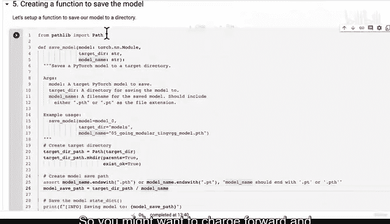

# 174：将模型训练代码转为 Python 脚本 🚀


在本节课中，我们将学习如何将之前编写的模型训练和测试循环代码，封装成一个独立的 Python 脚本。这样做可以避免重复编写代码，提高项目的模块化和可重用性。

---

## 概述

在前两节课程中，我们分别创建了 `data_setup.py` 和 `model_builder.py` 脚本。现在，我们将进入下一步：将训练、测试步骤以及整合它们的训练函数，打包成名为 `engine.py` 的脚本。

## 4.1 将训练函数转为脚本

上一节我们介绍了如何构建模型，本节中我们来看看如何将训练逻辑模块化。

我们将创建一个名为 `engine.py` 的脚本。这个脚本将包含我们之前在 Jupyter Notebook（`notebook 04`）中编写的 `train_step`、`test_step` 和 `train` 函数。为了提升代码的可读性和可维护性，我们为每个函数添加了 Google 风格的文档字符串，并使用了 Python 类型注解作为提示。

以下是创建 `engine.py` 脚本的步骤：

1.  **导入必要的库**：脚本中的函数依赖于一些外部模块，我们必须导入它们。
2.  **复制函数代码**：将已编写并测试好的函数代码复制到脚本中。
3.  **保存脚本**：使用 Jupyter 的魔法命令将代码块写入 `engine.py` 文件。

让我们看看具体的实现。

首先，我们需要在脚本顶部进行必要的导入。这些导入确保了我们的函数能够正常运行。

```python
from typing import Dict, List, Tuple
import torch
from tqdm.auto import tqdm
```

接下来，我们将三个核心函数复制到脚本中。以下是每个函数的简要说明：

*   **`train_step` 函数**：负责模型的一个训练周期（前向传播、计算损失、反向传播、优化器更新）。
*   **`test_step` 函数**：负责模型的一个测试/评估周期（前向传播、计算损失和准确率）。
*   **`train` 函数**：整合上述两个步骤，循环指定的周期数，并输出训练和测试结果。

以下是 `engine.py` 脚本的完整内容示例：

```python
from typing import Dict, List, Tuple
import torch
from tqdm.auto import tqdm

def train_step(model: torch.nn.Module,
               dataloader: torch.utils.data.DataLoader,
               loss_fn: torch.nn.Module,
               optimizer: torch.optim.Optimizer,
               device: torch.device) -> Tuple[float, float]:
    """
    对模型进行一个训练周期。

    参数:
        model: 要训练的PyTorch模型。
        dataloader: 用于训练数据的DataLoader。
        loss_fn: 损失函数。
        optimizer: 优化器。
        device: 目标设备（如 "cuda" 或 "cpu"）。

    返回:
        一个包含训练损失和训练准确率的元组。
    """
    model.train()
    train_loss, train_acc = 0, 0

    for batch, (X, y) in enumerate(dataloader):
        X, y = X.to(device), y.to(device)
        y_pred = model(X)
        loss = loss_fn(y_pred, y)
        train_loss += loss.item()
        optimizer.zero_grad()
        loss.backward()
        optimizer.step()
        y_pred_class = torch.argmax(torch.softmax(y_pred, dim=1), dim=1)
        train_acc += (y_pred_class == y).sum().item()/len(y_pred)

    train_loss = train_loss / len(dataloader)
    train_acc = train_acc / len(dataloader)
    return train_loss, train_acc

def test_step(model: torch.nn.Module,
              dataloader: torch.utils.data.DataLoader,
              loss_fn: torch.nn.Module,
              device: torch.device) -> Tuple[float, float]:
    """
    对模型进行一个测试周期。

    参数:
        model: 要测试的PyTorch模型。
        dataloader: 用于测试数据的DataLoader。
        loss_fn: 损失函数。
        device: 目标设备（如 "cuda" 或 "cpu"）。

    返回:
        一个包含测试损失和测试准确率的元组。
    """
    model.eval()
    test_loss, test_acc = 0, 0
    with torch.inference_mode():
        for batch, (X, y) in enumerate(dataloader):
            X, y = X.to(device), y.to(device)
            test_pred_logits = model(X)
            loss = loss_fn(test_pred_logits, y)
            test_loss += loss.item()
            test_pred_labels = test_pred_logits.argmax(dim=1)
            test_acc += ((test_pred_labels == y).sum().item()/len(test_pred_labels))

    test_loss = test_loss / len(dataloader)
    test_acc = test_acc / len(dataloader)
    return test_loss, test_acc

def train(model: torch.nn.Module,
          train_dataloader: torch.utils.data.DataLoader,
          test_dataloader: torch.utils.data.DataLoader,
          optimizer: torch.optim.Optimizer,
          loss_fn: torch.nn.Module,
          epochs: int,
          device: torch.device) -> Dict[str, List]:
    """
    训练和测试一个PyTorch模型。

    参数:
        model: 要训练和测试的PyTorch模型。
        train_dataloader: 用于训练数据的DataLoader。
        test_dataloader: 用于测试数据的DataLoader。
        optimizer: 优化器。
        loss_fn: 损失函数。
        epochs: 训练周期数。
        device: 目标设备（如 "cuda" 或 "cpu"）。

    返回:
        一个包含训练和测试损失及准确率的字典。
    """
    results = {"train_loss": [],
               "train_acc": [],
               "test_loss": [],
               "test_acc": []
    }

    for epoch in tqdm(range(epochs)):
        train_loss, train_acc = train_step(model=model,
                                          dataloader=train_dataloader,
                                          loss_fn=loss_fn,
                                          optimizer=optimizer,
                                          device=device)
        test_loss, test_acc = test_step(model=model,
          dataloader=test_dataloader,
          loss_fn=loss_fn,
          device=device)

        print(
          f"Epoch: {epoch+1} | "
          f"train_loss: {train_loss:.4f} | "
          f"train_acc: {train_acc:.4f} | "
          f"test_loss: {test_loss:.4f} | "
          f"test_acc: {test_acc:.4f}"
        )

        results["train_loss"].append(train_loss)
        results["train_acc"].append(train_acc)
        results["test_loss"].append(test_loss)
        results["test_acc"].append(test_acc)

    return results
```

创建好脚本文件后，我们可以在其他 Python 文件或 Notebook 中导入并使用它：

```python
from going_modular import engine

# 之后就可以调用 engine.train() 等函数，传入必要的参数
# results = engine.train(model, train_dataloader, ...)
```

## 总结



本节课中我们一起学习了如何将模型训练代码模块化。我们创建了 `engine.py` 脚本，它封装了训练步骤、测试步骤和完整的训练循环。通过这种方式，我们避免了代码重复，使项目结构更加清晰，并且可以轻松地在不同项目中复用这些训练逻辑。

在下一节课程中，我们将尝试创建一个用于保存模型的工具函数，并将其放入 `utils.py` 脚本中。