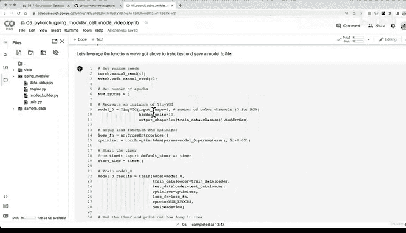

# 175：将模型保存工具函数转为Python脚本 📂


在本节课中，我们将学习如何将之前编写的模型保存功能，整理并保存为一个独立的Python脚本文件。这有助于代码的模块化和重用。

---

## 概述

上一节我们创建了 `engine.py` 脚本，它包含了我们主要的训练和测试逻辑。本节中，我们来看看如何将其中“保存模型”这个实用功能，提取出来并保存到一个名为 `utils.py` 的独立脚本中。这样做可以让我们的代码结构更清晰，更易于维护。

## 创建 `utils.py` 文件

`utils.py` 在Python项目中通常用于存放各种工具函数。目前我们只有一个“保存模型”的函数，但随着项目增长，这里可以存放更多辅助功能。

以下是创建 `utils.py` 文件的步骤：

1.  首先，我们需要导入必要的库。
2.  然后，将我们之前编写的 `save_model` 函数复制进去。
3.  最后，保存文件。

让我们开始操作。

## 编写 `utils.py` 脚本

我们需要确保脚本中导入了所有必需的模块。对于 `save_model` 函数，我们需要导入 `torch`。

以下是 `utils.py` 文件的内容：

```python
"""
一个包含用于PyTorch模型训练的各种工具函数的文件。
"""

import torch
from pathlib import Path

def save_model(model: torch.nn.Module,
               target_dir: str,
               model_name: str):
    """
    将PyTorch模型保存到目标目录。

    参数:
        model: 要保存的目标模型。
        target_dir: 模型要保存到的目录路径。
        model_name: 保存模型时使用的文件名。应包含“.pth”或“.pt”作为文件扩展名。

    示例用法:
        save_model(model=model_0,
                   target_dir="models",
                   model_name="05_going_modular_tingvgg_model.pth")
    """
    # 创建目标目录
    target_dir_path = Path(target_dir)
    target_dir_path.mkdir(parents=True,
                        exist_ok=True)

    # 创建模型保存路径
    assert model_name.endswith(".pth") or model_name.endswith(".pt"), "model_name应以'.pth'或'.pt'结尾"
    model_save_path = target_dir_path / model_name

    # 保存模型状态字典
    print(f"[INFO] 正在将模型保存到: {model_save_path}")
    torch.save(obj=model.state_dict(),
             f=model_save_path)
```

## 代码解析

现在，让我们简要解析一下这段代码：

*   **导入模块**：我们导入了 `torch` 用于模型操作，导入了 `pathlib` 中的 `Path` 用于处理文件路径。
*   **函数定义**：`save_model` 函数接受三个参数：要保存的模型、目标目录和模型文件名。
*   **目录创建**：使用 `Path.mkdir()` 确保目标目录存在。
*   **路径验证**：使用 `assert` 语句确保文件名以正确的扩展名结尾。
*   **模型保存**：使用 `torch.save()` 将模型的状态字典保存到指定路径。

## 从实践到模块化

你可能会问，为什么不从一开始就编写这些脚本文件？虽然完全可以那样做，但花费时间一步步编写代码有它的价值。通过先在笔记本中探索、实验和可视化，我们能够深入理解每一行代码的作用。这样，当我们最终将其整理成脚本时，我们清楚地知道里面发生了什么，而不仅仅是复制粘贴。

PyTorch官方团队在其代码库中也采用了类似的方式。他们拥有 `train.py`、`utils.py` 等脚本，将功能模块化。我们正在实践的是一个简化版本，但核心原则是相同的：将有用的代码保存到Python文件中以便重用。

## 下一步挑战

目前，我们的 `utils.py` 中只有一个工具函数。随着项目复杂度的增加，你可以将更多辅助函数添加进来，例如加载模型的函数、设置随机种子的函数等。

现在，我们已经有了 `engine.py`（训练/测试逻辑）和 `utils.py`（工具函数）。一个自然的下一步是创建一个 `train.py` 脚本，它将整合所有功能：加载数据、初始化模型、进行训练和评估，并最终调用 `utils.py` 中的函数来保存训练好的模型。

理想情况下，我们最终可以通过在终端运行一条命令，例如 `python going_modular/train.py`，来完成整个模型的训练流程。

---

## 总结



本节课中我们一起学习了如何将模型保存功能模块化。我们创建了一个 `utils.py` 文件，并将 `save_model` 函数放入其中，这使我们的代码更加整洁和可复用。记住，模块化是构建可维护和可扩展项目的重要一步。在下一讲中，我们将尝试创建最终的 `train.py` 脚本来整合所有训练流程。