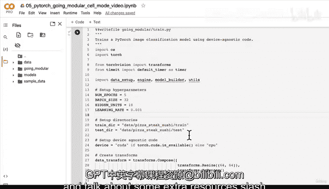

# 176：创建单行代码训练脚本 🚀


在本节课中，我们将学习如何将之前编写的多个Python脚本整合起来，创建一个名为 `train.py` 的训练脚本。这个脚本将利用模块化的代码，实现用一行命令训练一个PyTorch图像分类模型的目标。

---

## 概述

到目前为止，我们已经创建了四个Python脚本：`data_setup.py`、`engine.py`、`model_builder.py` 和 `utils.py`。本节的目标是整合所有这些代码，创建一个简洁高效的 `train.py` 脚本，实现模型的训练、评估和保存。

---

## 6.1 训练、评估并保存模型（脚本模式）

上一节我们介绍了各个功能模块的创建，本节中我们来看看如何将它们组合成一个完整的训练流程。

我们将创建一个名为 `train.py` 的文件，它位于 `going_modular` 目录下。这个脚本将调用我们之前编写的所有模块化代码。

以下是 `train.py` 脚本的完整内容：

```python
import os
import torch
from torch import nn
import torchvision
from torchvision import transforms
import data_setup
import engine
import model_builder
import utils
from timeit import default_timer as timer

# 设置超参数
NUM_EPOCHS = 5
BATCH_SIZE = 32
HIDDEN_UNITS = 10
LEARNING_RATE = 0.001

# 设置数据目录
train_dir = "data/pizza_steak_sushi/train"
test_dir = "data/pizza_steak_sushi/test"

# 设置设备无关代码
device = "cuda" if torch.cuda.is_available() else "cpu"

# 创建数据变换
data_transform = transforms.Compose([
    transforms.Resize((64, 64)),
    transforms.ToTensor()
])

# 创建数据加载器并获取类别名称
train_dataloader, test_dataloader, class_names = data_setup.create_dataloaders(
    train_dir=train_dir,
    test_dir=test_dir,
    transform=data_transform,
    batch_size=BATCH_SIZE
)

# 创建模型
model = model_builder.TinyVGG(
    input_shape=3,
    hidden_units=HIDDEN_UNITS,
    output_shape=len(class_names)
).to(device)

# 设置损失函数和优化器
loss_fn = nn.CrossEntropyLoss()
optimizer = torch.optim.Adam(model.parameters(),
                             lr=LEARNING_RATE)

# 开始计时
start_time = timer()

# 训练模型
engine.train(model=model,
             train_dataloader=train_dataloader,
             test_dataloader=test_dataloader,
             loss_fn=loss_fn,
             optimizer=optimizer,
             epochs=NUM_EPOCHS,
             device=device)

# 结束计时
end_time = timer()
print(f"[INFO] 总训练时间：{end_time-start_time:.3f} 秒")

# 保存模型到文件
utils.save_model(model=model,
                 target_dir="models",
                 model_name="05_going_modular_script_mode_tiny_vgg_model.pth")
```

---

## 脚本详解

以下是 `train.py` 脚本中各个部分的功能说明：

1.  **导入模块**：我们导入了所有必需的PyTorch模块以及我们自定义的脚本（`data_setup`、`engine`、`model_builder`、`utils`）。
2.  **设置超参数**：定义了训练周期数、批次大小、隐藏单元数和学习率。
3.  **设置数据目录**：指定了训练和测试数据的路径。
4.  **设备无关代码**：自动检测并使用可用的GPU或CPU。
5.  **数据变换**：创建了将图像调整大小并转换为张量的变换。
6.  **数据加载器**：调用 `data_setup.create_dataloaders` 函数来创建训练和测试数据加载器，并获取类别名称。
7.  **创建模型**：使用 `model_builder.TinyVGG` 类实例化模型，并将其移动到目标设备。
8.  **损失函数与优化器**：为多分类任务设置交叉熵损失函数和Adam优化器。
9.  **计时与训练**：开始计时，调用 `engine.train` 函数进行模型训练，然后结束计时。
10. **保存模型**：最后，使用 `utils.save_model` 函数将训练好的模型保存到指定目录。

---

## 运行训练脚本

要运行这个脚本，你只需要在终端中进入 `going_modular` 目录，并执行以下命令：

```bash
python train.py
```

脚本将自动开始训练过程，输出每个周期的损失和准确率，并在完成后将模型保存到 `models` 目录中。

---

## 最终项目结构

完成本课后，你的项目目录结构应如下所示：

```
going_modular/
├── data/
│   └── pizza_steak_sushi/
│       ├── train/
│       └── test/
├── models/
│   └── 05_going_modular_script_mode_tiny_vgg_model.pth
├── data_setup.py
├── engine.py
├── model_builder.py
├── utils.py
└── train.py
```

这个结构清晰地将数据、代码和模型输出分开，是构建可维护机器学习项目的良好实践。

---

## 总结

本节课中我们一起学习了如何将模块化的PyTorch代码整合到一个 `train.py` 训练脚本中。我们实现了：

*   设置超参数和数据路径。
*   利用设备无关代码。
*   调用自定义模块创建数据加载器和模型。
*   设置训练循环并计时。
*   保存训练好的模型。

通过这种方式，我们成功地将多行笔记本代码浓缩成了一个可通过单行命令执行的、高效且可复用的训练脚本。这是迈向专业机器学习工程师的重要一步，它使得代码更易于管理、分享和部署。



你可以尝试将本课的 `train.py` 脚本中的超参数（如学习率、周期数）改为通过命令行参数传入，这将使脚本更加灵活和强大。