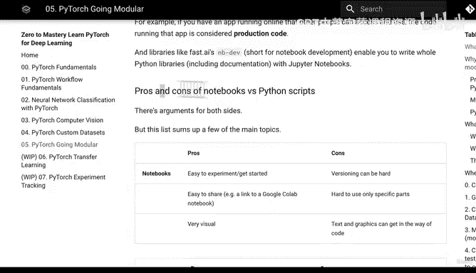
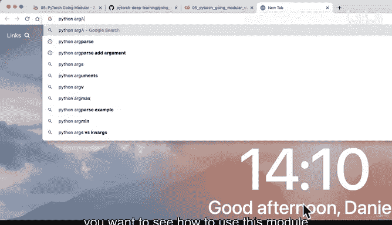
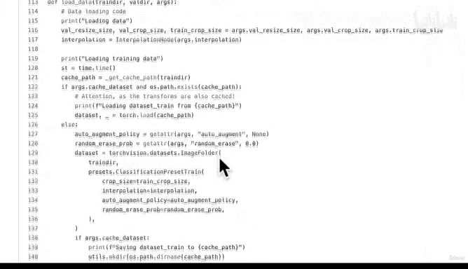

# 177：模块化总结与练习拓展 🚀

在本节课中，我们将回顾模块化代码的创建过程，并探讨如何通过练习进一步拓展技能。我们将从笔记本代码转向Python脚本，实现一行代码训练模型的目标。

## 回顾模块化进程

上一节我们创建了`train.py`脚本，该脚本整合了之前所有章节的代码，实现了用单行命令训练PyTorch模型的功能。

我们完成了从笔记本代码到Python脚本的转换。具体来说，我们将第一部分“模块化入门”中的笔记本代码转换为了脚本模式。

## 实际工作流程示例

以下是我的典型工作流程：

1.  使用Google Colab探索不同选项并测试代码可行性
2.  确认代码有效后，将其转换为Python脚本

在实际应用中，PyTorch代码通常以脚本形式存在，因此熟悉脚本模式非常重要。

## 待探索内容

目前还有一些未覆盖的内容，例如使用参数标志进行不同超参数训练。这引出了我们的第一个练习。

## 练习任务

以下是三个拓展练习，帮助你巩固模块化技能：

**练习一：数据获取脚本化**
将`get_data.py`（第1节）中的代码转换为独立脚本。提示：可参考现有脚本的创建方法。

**练习二：超参数命令行传递**
使用Python的`argparse`模块，为`train.py`添加自定义超参数传递功能。推荐查阅Python官方文档和Real Python的“如何使用argparse构建命令行界面”教程。

**练习三：预测脚本创建**
基于第4节的自定义图像预测代码，创建名为`predict.py`的脚本，实现通过文件路径加载保存模型并进行预测的功能。

## 学习资源

如需练习模板，可在PyTorch深度学习仓库的`extras/exercises/05_pytorch_going_modular_exercise_template.ipynb`中找到。示例解答位于`extras/solutions/`目录，我还在近期章节中录制了练习的实时解答视频。

## 延伸阅读建议

若想深入了解本节内容，强烈推荐查阅补充资料：

*   **Python项目结构**：学习如何合理组织模块化项目中的文件
*   **PyTorch代码风格指南**：Igor Susmelj编写的指南，为本课程代码风格提供了重要参考
*   **高级训练脚本示例**：研究PyTorch官方仓库中的`train.py`脚本，了解如何训练最先进的图像分类模型

## 课程总结

本节课我们一起学习了PyTorch代码模块化的完整流程。我们创建了整合性训练脚本，探讨了实际工作模式，并提供了三个拓展练习来深化理解。虽然当前模型规模较小，但通过模块化代码，我们已经为构建更复杂的训练流程奠定了基础。

下一节我们将进入更令人兴奋的内容：如果单行代码训练模型已经让你感到兴奋，那么如何提升模型性能将是我们的新挑战。敬请期待！