# 01：强化学习导论 🚀

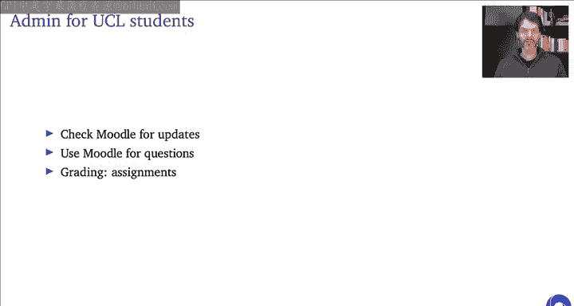


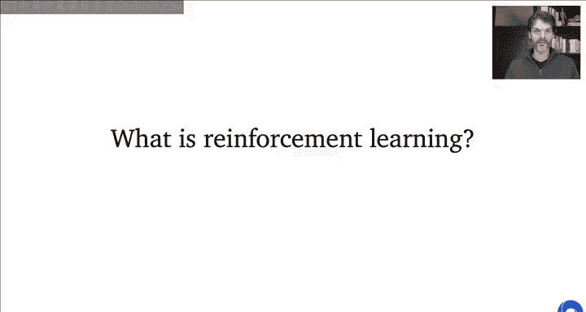

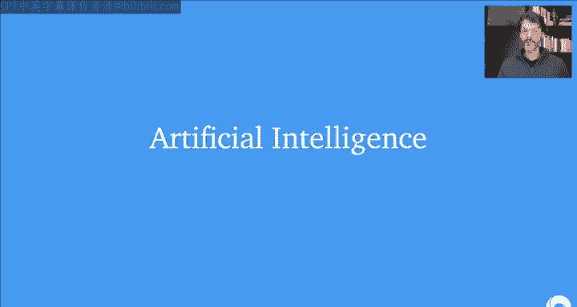

在本节课中，我们将学习强化学习的基本概念、核心思想以及它与其他人工智能领域的联系。我们将从宏观视角理解什么是强化学习，并介绍其核心组成部分：智能体、环境、奖励和策略。

---

## 概述

强化学习是关于智能体如何通过与环境的交互来学习做出决策，以最大化累积奖励的科学和框架。它不同于其他类型的机器学习，因为它强调**主动交互**、**顺序决策**和**长期目标**。

---

## 什么是人工智能？

在深入强化学习之前，理解人工智能的背景是有益的。我们可以将技术发展分为几个阶段：

*   **工业革命**：自动化重复的**体力劳动**。
*   **数字革命**：自动化重复的**脑力劳动**（例如，计算器）。
*   **人工智能革命**：让机器**自己寻找解决方案**。

艾伦·图灵在1950年的论文《计算机器与智能》中提出了一个关键思想：与其尝试编写一个模拟成人思维的程序，不如尝试编写一个能像儿童一样学习的程序，然后通过“教育”使其成长为“成人”。这本质上就是**学习**的思想。

因此，我们可以将人工智能的一个目标定义为：**学习做出决策以实现目标**。学习、决策和目标这三个概念是核心。

---

## 什么是强化学习？

强化学习与图灵所说的“通过交互学习”密切相关。其特点包括：

1.  **主动而非被动**：智能体的行为会影响它获得的数据和经验。
2.  **交互是顺序的**：未来的交互可能依赖于之前的行动。
3.  **目标导向**：行为带有目的性。
4.  **无需最优行为示例**：智能体可以在没有被告知具体每一步该如何做的情况下学习技能。

一种思考方式是：强化学习是关于**优化某个奖励信号**。我们通过获得奖励（或避免惩罚）来感到满足，这驱动了我们的行为。

---

## 交互循环：核心框架

强化学习的核心是一个交互循环：

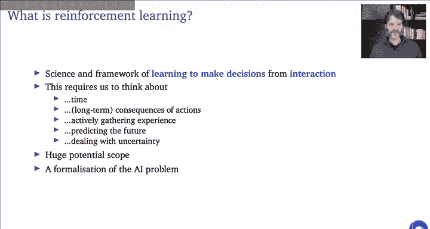


```
智能体 (Agent) <-> 环境 (Environment)
```

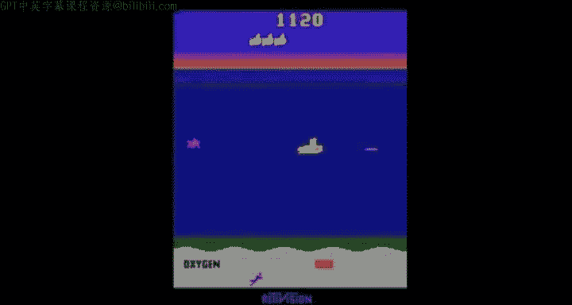


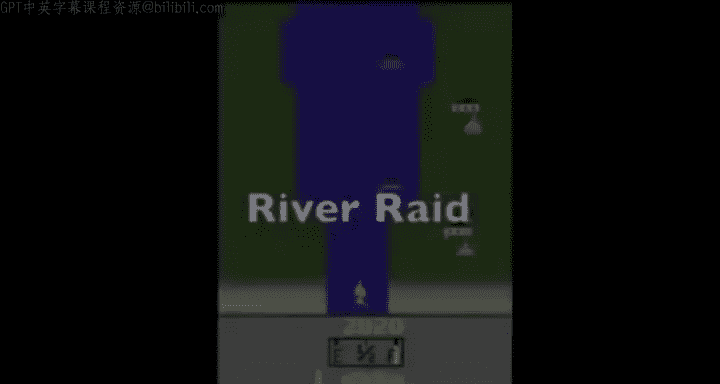

以下是该循环的运作方式：

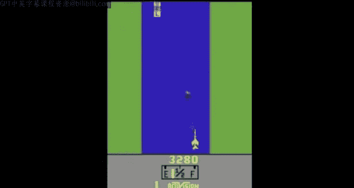


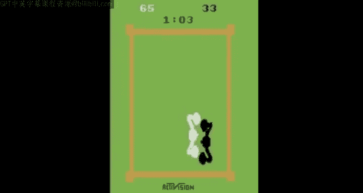

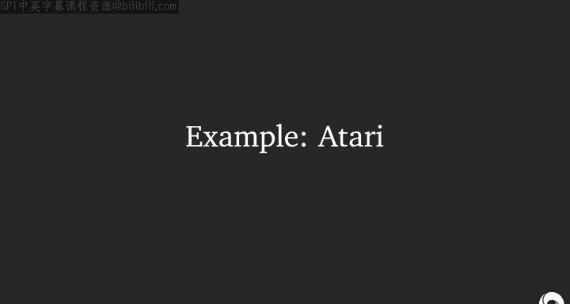

*   **智能体**：做出决策的实体（如机器人、程序）。
*   **环境**：智能体所处的外部世界（如真实世界、游戏、互联网）。
*   **行动 (A)**：智能体对环境施加的影响。
*   **观察 (O)** 和 **奖励 (R)**：环境对智能体行动的反馈。观察是环境的状态信息，奖励是一个标量值，表示该步的好坏。

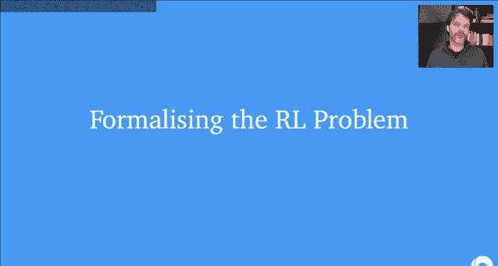

**奖励假说**指出：任何目标都可以被形式化为最大化累积奖励的结果。这为指定目标提供了一个灵活而强大的框架。

---

## 强化学习问题示例

以下是一些已成功应用强化学习的例子：

*   操控直升机飞行
*   管理投资组合
*   控制发电站
*   让机器人行走
*   玩视频游戏或棋盘游戏

在这些问题中，学习可能有两个不同的目的：
1.  **寻找解决方案**：学习一个策略并部署它（例如，一个下棋程序）。
2.  **在线适应**：系统能够持续学习以适应未预见的情况（例如，适应不同地形的机器人）。

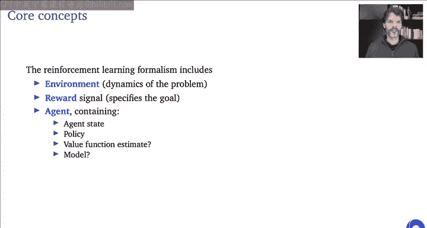

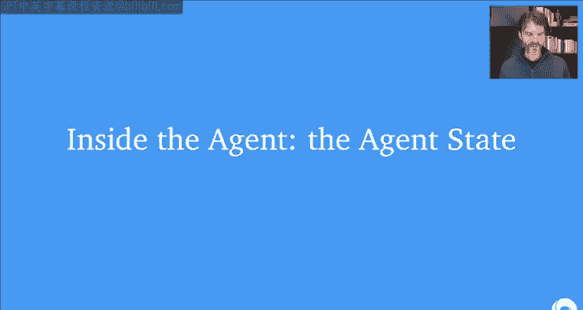

---

## 形式化与核心概念

现在，让我们更正式地定义一些核心概念。在交互循环的每一步 `t`：
*   智能体收到观察 `O_t` 和奖励 `R_t`。
*   智能体执行行动 `A_t`。
*   环境转移到新状态，并在 `t+1` 时刻产生新的观察和奖励。

**奖励 (R_t)** 是标量反馈信号，表示即时表现。
**回报 (G_t)** 是从时刻 `t` 开始的未来累积奖励之和：`G_t = R_t + γR_{t+1} + γ^2R_{t+2} + ...`
**折扣因子 (γ)** 介于0和1之间，决定了未来奖励的现值。γ=0表示只关心即时奖励；γ=1表示所有未来奖励同等重要。

**价值函数 (V(s))** 是处于状态 `s` 后期望能获得的回报。它评估了状态（或状态-行动对）的“好坏”。
**策略 (π)** 是智能体的行为方式，是从状态到行动（或行动概率）的映射。

**贝尔曼方程** 以递归形式定义了价值函数，这是许多强化学习算法的基石。最优价值函数 `V*(s)` 满足：
`V*(s) = max_a E[ R_{t+1} + γ V*(S_{t+1}) | S_t=s, A_t=a ]`

---

## 智能体内部：状态、策略、价值与模型

智能体内部可能包含以下组件：

1.  **智能体状态 (S_t)**：智能体内部对当前情况的总结。它是历史的函数：`S_{t+1} = u(S_t, A_t, R_{t+1}, O_{t+1})`。
    *   **完全可观测性**：观察 `O_t` 等于环境状态。此时智能体状态可以直接用观察表示，且具有**马尔可夫性**（未来仅取决于当前状态，与历史无关）。
    *   **部分可观测性 (POMDP)**：更常见的情况。观察不足以完全确定环境状态。智能体需要构建一个足够丰富的内部状态（如使用历史缓冲区或循环网络）来做出良好决策。

2.  **策略 (π)**：定义智能体行为的函数。可以是确定性的 `a = π(s)`，或随机性的 `π(a|s)`。

3.  **价值函数 (V, Q)**：预测未来回报的期望。用于评估策略或状态-行动对的好坏。

4.  **模型**（可选）：智能体对环境动态的预测。包括**状态转移模型** `P(s‘|s,a)` 和**奖励模型** `R(r|s,a)`。拥有模型可以进行“规划”。

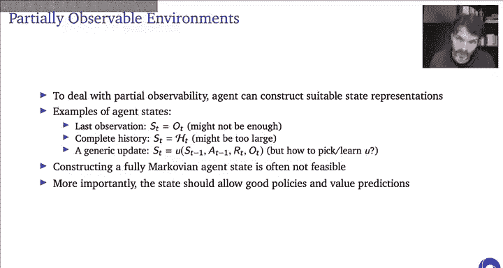

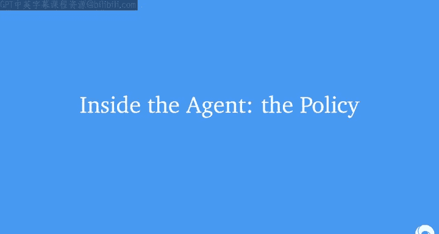

---

## 智能体分类

根据智能体内部包含的组件，可以将其分类：

*   **基于价值的智能体**：主要学习价值函数（如Q函数），策略隐含地由价值函数导出（例如，选择价值最高的行动）。
*   **基于策略的智能体**：直接学习并维护一个策略函数，可能没有明确的价值函数。
*   **演员-评论家智能体**：同时学习策略函数（演员）和价值函数（评论家）。评论家用于评估和指导演员的改进。
*   **无模型 vs 基于模型**：
    *   **无模型**：不显式学习环境模型，直接从经验中学习价值或策略。
    *   **基于模型**：学习（或已知）环境模型，并利用该模型进行规划以改进策略。

---

## 预测与控制

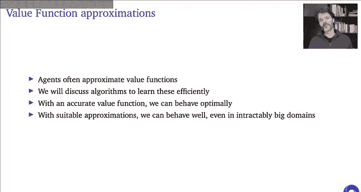

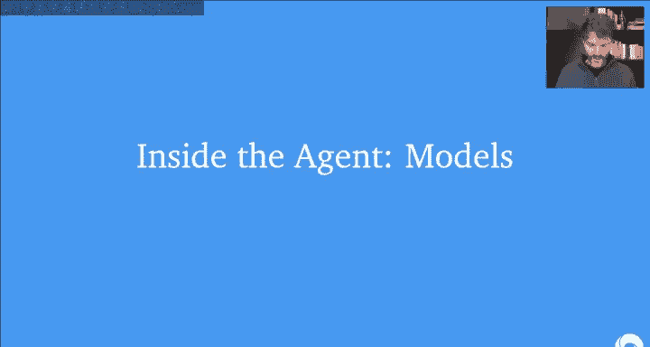

强化学习中的两个核心子问题：

*   **预测**：评估一个给定策略的未来表现（即学习该策略的价值函数）。
*   **控制**：寻找最优策略以最大化未来回报。

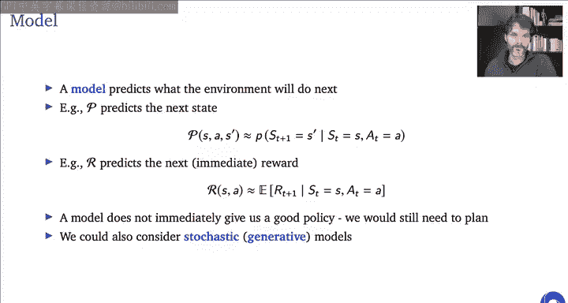

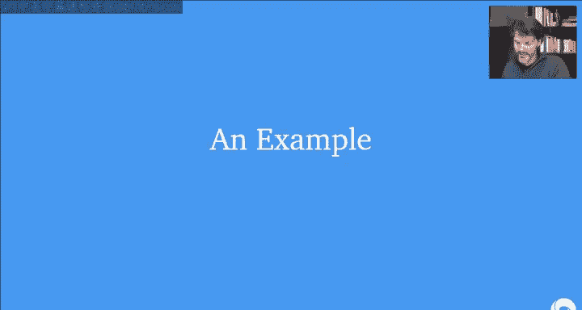

预测通常是控制的基础。如果能够完美预测每个策略的价值，就能通过比较找到最优策略。

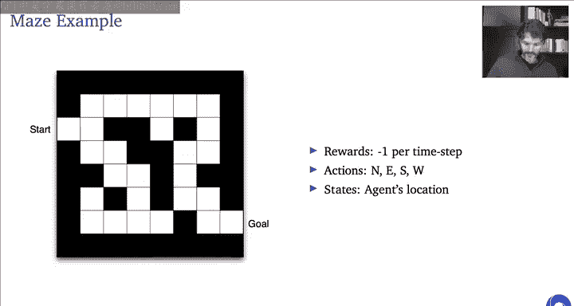

---

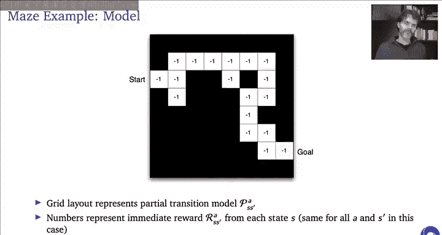

## 学习与规划


*   **学习**：环境初始未知，智能体通过与其交互来改进其策略、价值或模型。
*   **规划**：当环境模型（可能是学得的）已知时，智能体通过内部计算（如模拟推演）来改进策略，而无需与真实环境进行新的交互。

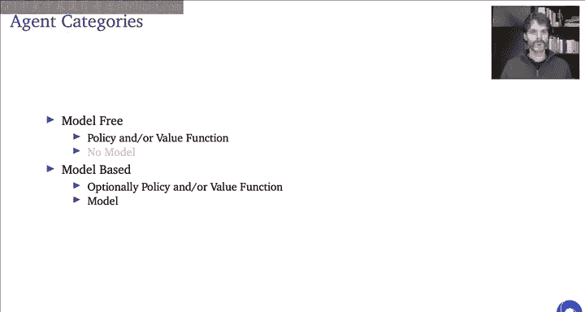

现代强化学习系统通常将学习与规划相结合。

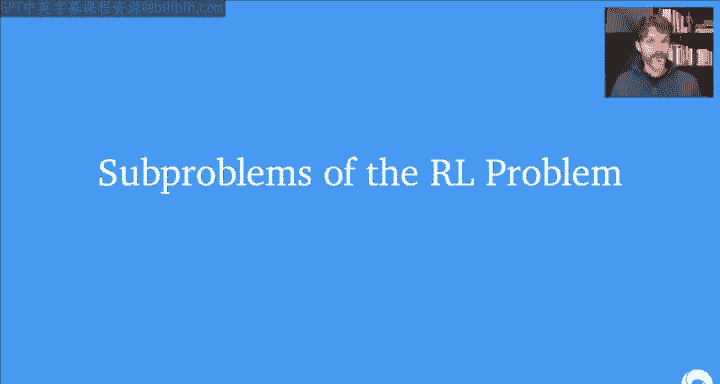

---

## 函数近似与深度学习

策略、价值函数、模型等都是某种形式的函数。我们可以使用**函数近似**方法（如线性函数、神经网络）来表示和学习这些函数。使用深度神经网络进行函数近似的强化学习被称为**深度强化学习**。

需要注意的是，强化学习的数据通常具有**序列相关性**且问题可能是**非平稳的**（因为策略在改变），这违反了传统监督学习的一些假设，因此需要专门的技术。

---

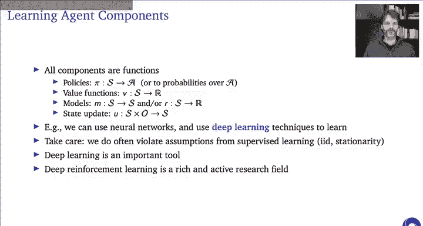

## 实例分析

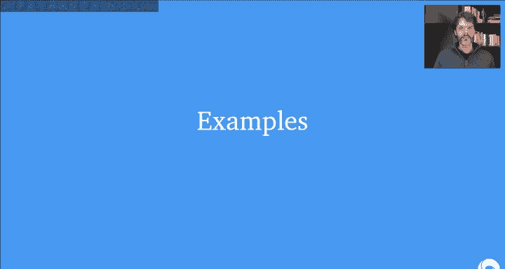

**雅达利游戏**：智能体仅接收像素画面（观察）和游戏得分变化（奖励），输出为手柄控制（行动）。通过算法（如DQN）学习后，智能体可以掌握多种游戏，而无需任何关于游戏规则或控制对象的先验知识。

**网格世界示例**：一个简单的导航问题，展示了如何计算随机策略的价值函数以及最优策略和价值函数。它说明了即使在小问题上，最优行为也可能不直观，但算法可以找到。

**人体运动控制**：智能体控制一个多关节的身体，其目标奖励仅仅是“向右移动得越快越好”。通过强化学习，智能体自行学会了协调复杂肌肉运动以跑步、跳跃、攀爬，并适应不同的地形和身体形态。这凸显了强化学习的强大之处：我们只需指定目标，而非解决方案。

---

## 预告

在接下来的课程中，我们将深入探讨：
*   **探索与利用**（多臂赌博机问题）
*   **马尔可夫决策过程**的形式化定义
*   **动态规划**进行规划
*   **无模型预测与控制**算法（如蒙特卡洛法、时序差分学习、Q学习）
*   **策略梯度方法**与**演员-评论家算法**
*   **深度强化学习**的整合
*   **学习与规划的结合**

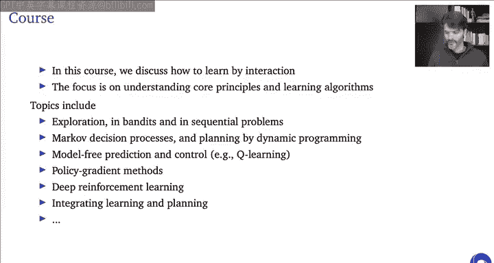


---

## 总结


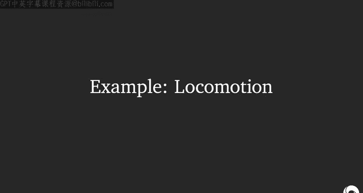

本节课我们一起学习了强化学习的基础。我们了解到强化学习是智能体通过与环境交互来学习决策以最大化累积奖励的框架。我们介绍了核心概念：智能体、环境、行动、观察、奖励、回报、价值函数、策略和模型。我们还探讨了智能体的不同内部结构（基于价值、基于策略、演员-评论家）以及无模型与基于模型方法的区别。最后，我们通过雅达利游戏和人体运动控制等实例，看到了强化学习在解决复杂、序列决策问题上的巨大潜力。强化学习为实现通用人工智能提供了一个形式化且强大的途径。