#  02：探索与控制 🎯

在本节课中，我们将学习强化学习中的一个核心挑战：探索与利用的权衡。我们将聚焦于一个简化的环境——多臂老虎机问题，来深入理解这个概念。

---

## 概述

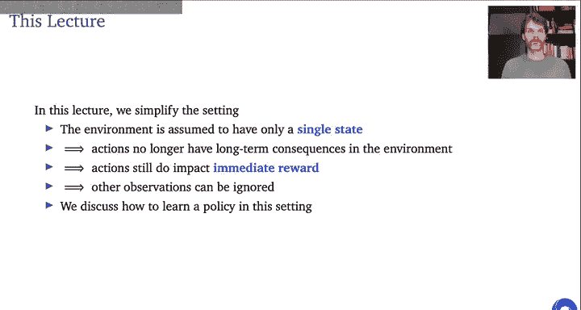

在上一讲中，我们介绍了强化学习的基本框架，即智能体与环境交互的循环。在本节中，我们将简化这个框架，假设环境只有一个状态。这使得我们可以专注于一个核心问题：智能体如何在尝试新事物（探索）以获得更多信息，与利用现有知识做出最佳决策（利用）之间做出权衡。

---

## 探索与利用的权衡 😊

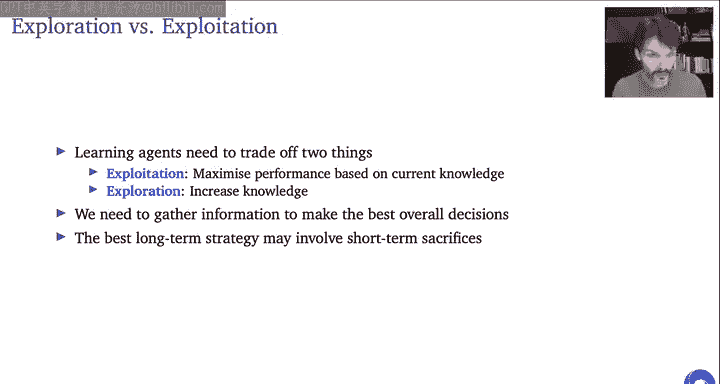

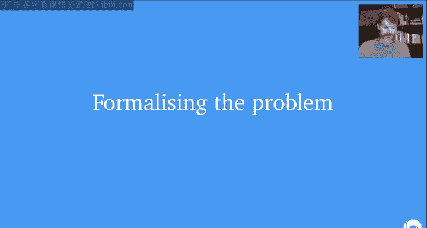

任何主动收集数据的学习智能体都必须处理探索与利用之间的权衡。

*   **利用** 指的是基于当前知识最大化性能。例如，如果你尝试过两种电影推荐，其中一种的成功率更高，那么为了最大化下一次的成功率，选择成功率更高的电影是合理的。
*   **探索** 的主要目的是通过接触新信息来增加我们的知识。如果我们从不尝试新事物，就永远不会发现可能存在的巨大回报。

这是一个根本性的权衡。我们简化环境状态，正是为了能在这个基本层面上清晰地推理这个问题，并希望将学到的经验应用到更一般的情况中。

---

## 问题形式化：多臂老虎机

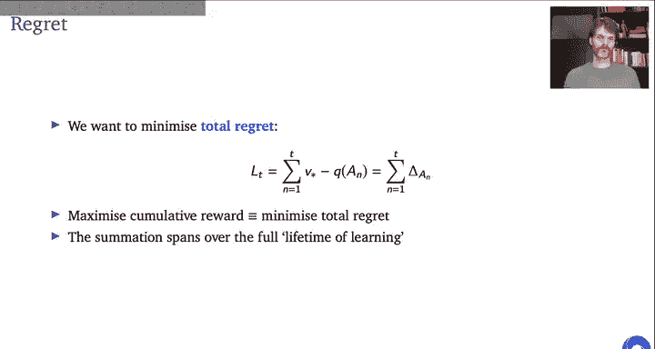

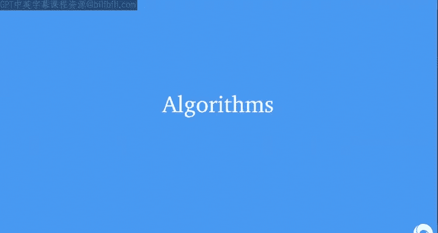

这个简化设置通常被称为**多臂老虎机**问题。

*   它包含一组动作（或“臂”），每个动作 `a` 对应一个奖励分布 `R(a)`。
*   在每个时间步，智能体选择一个动作 `A_t`，并观察一个来自该动作奖励分布的随机奖励 `R_t`。
*   目标是随时间最大化累积奖励。

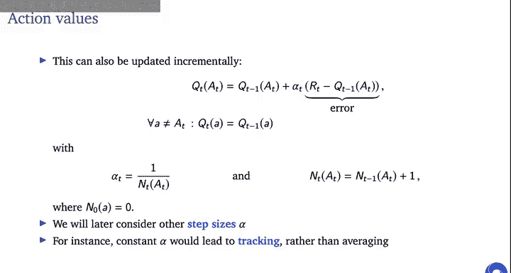

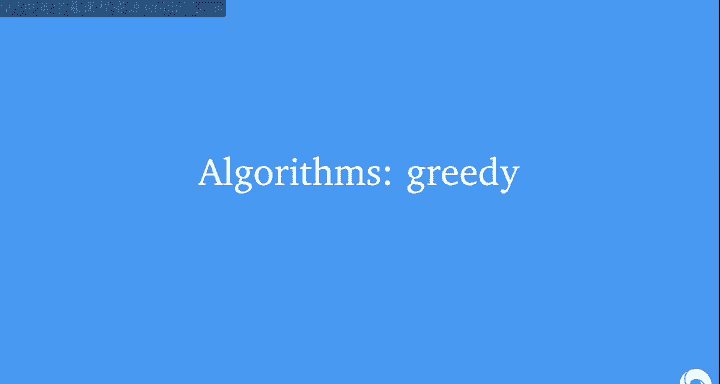

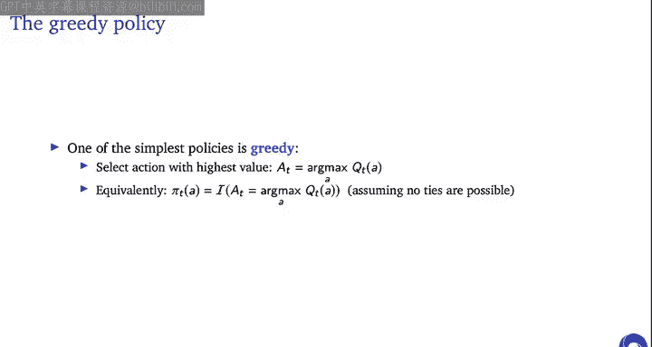

我们也可以从**遗憾**的角度来思考目标。动作 `a` 的瞬时遗憾是其最优期望奖励与自身期望奖励的差值：
`regret(a) = max_{a'} Q(a') - Q(a)`
总遗憾则是所有时间步上所选动作的瞬时遗憾之和。最小化总遗憾与最大化累积奖励是等价的。

---

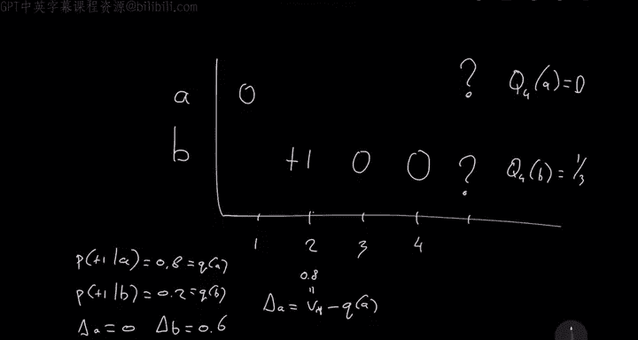

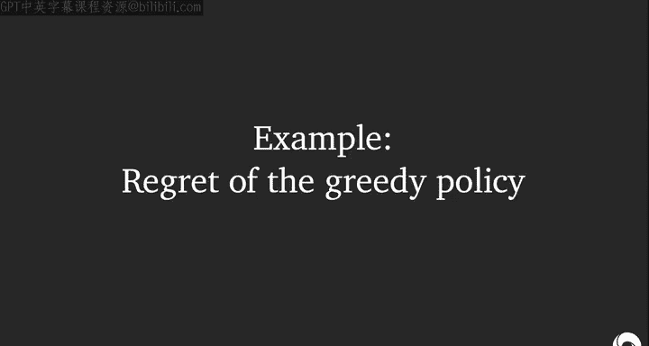

## 动作价值估计

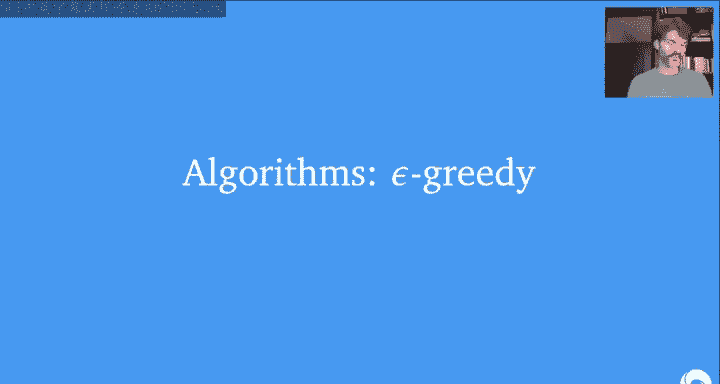

许多方法依赖于对动作价值 `Q(a)` 的估计。一个简单的方法是计算每个动作的平均奖励。

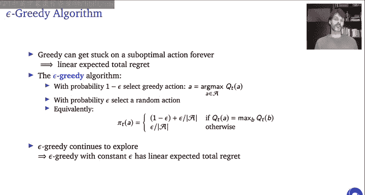

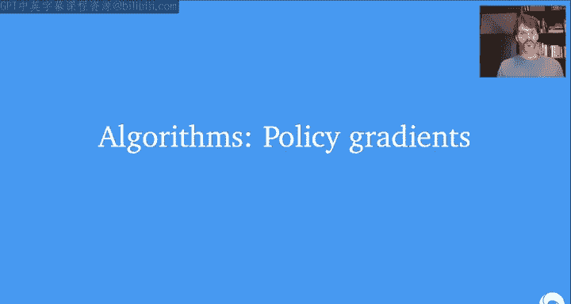

我们可以使用增量更新来跟踪这个平均值：
`Q_{t+1}(A_t) = Q_t(A_t) + α * (R_t - Q_t(A_t))`
其中步长参数 `α` 可以设置为 `1 / N_t(A_t)`，`N_t(A_t)` 是动作 `A_t` 被选择的次数。

---

## 算法一：贪婪策略

最简单的策略是**贪婪策略**，即总是选择当前估计价值最高的动作。
`π(a) = 1 if a = argmax_{a'} Q(a'), else 0`

然而，贪婪策略可能陷入困境。如果某个次优动作在早期偶然获得了较高的估计值，贪婪策略可能会无限期地选择它，而不再探索可能更优的其他动作，导致遗憾线性增长。

---

## 算法二：ε-贪婪策略

一个流行的改进是 **ε-贪婪策略**。

*   以 `1 - ε` 的概率选择贪婪动作。
*   以 `ε` 的概率随机选择一个动作（包括贪婪动作）。

其策略可以形式化为：
`π(a) = (1 - ε) + ε/|A| if a is greedy, else ε/|A|`

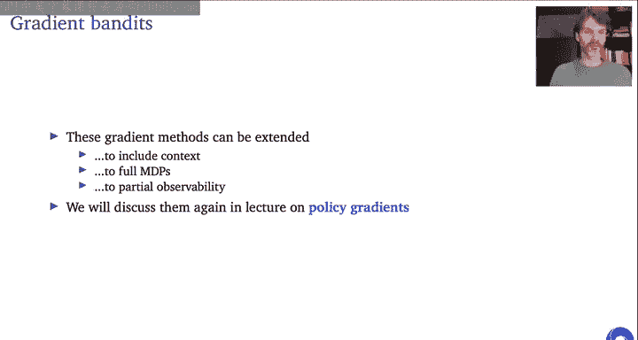

ε-贪婪策略持续探索，但其探索概率 `ε` 是固定的。这意味着即使我们已经足够确定某些动作很差，它仍然会以固定概率选择它们，因此其期望遗憾仍然是线性的。

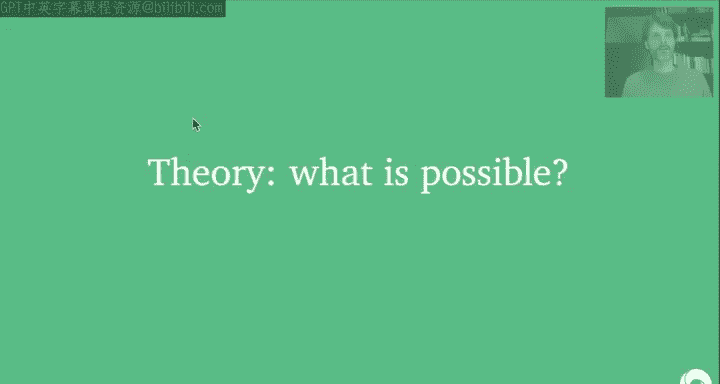

---

## 算法三：策略梯度方法

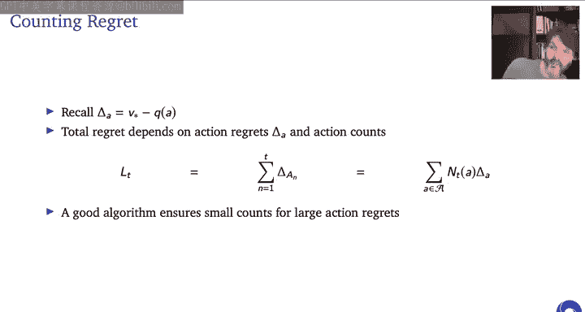

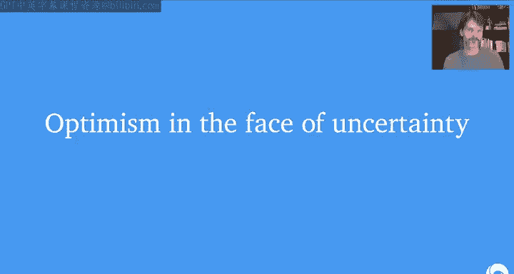

我们也可以不学习价值函数，而是直接学习策略参数。例如，使用**Softmax策略**，根据动作偏好 `h(a)` 来选择动作：
`π(a) = exp(h(a)) / Σ_{a'} exp(h(a'))`

目标是优化偏好参数 `θ`（这里 `θ` 可以就是 `h` 向量），以最大化期望奖励 `J(θ) = E[R | π_θ]`。我们可以使用梯度上升法。

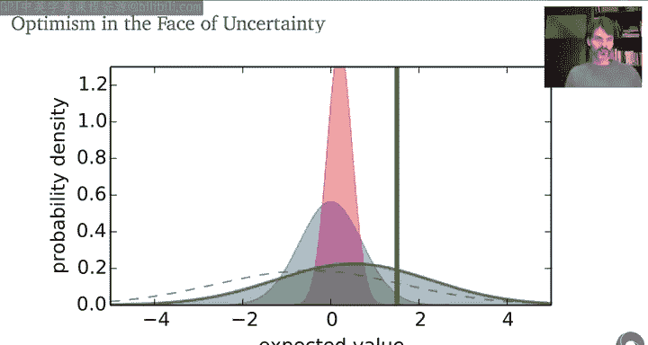

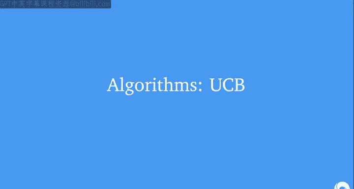

通过一个称为 **Reinforce Trick** 或对数似然技巧的推导，我们可以得到梯度的采样形式：
`∇J(θ) = E[ R * ∇ log π_θ(A) ]`

这引出了一个随机梯度上升更新规则：
`θ_{t+1} = θ_t + α * R_t * ∇ log π_θ(A_t)`

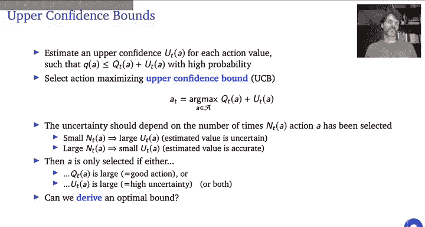

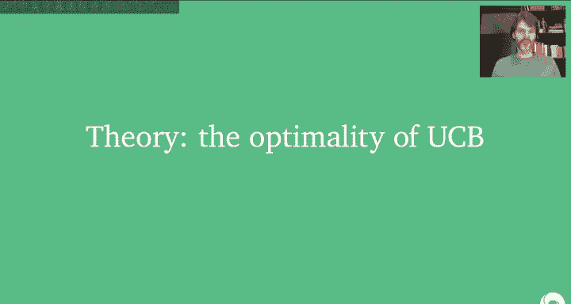

对于Softmax策略，这个更新有直观的解释：获得正奖励的动作，其偏好会增加；获得负奖励的动作，其偏好会减少。其他动作的偏好则朝相反方向调整。探索源于策略本身的随机性。

我们还可以引入一个**基线** `b` 来减少更新的方差，因为 `∇J(θ) = E[ (R - b) * ∇ log π_θ(A) ]` 对于不依赖于动作的 `b` 是等价的。

---

## 理论界限与乐观原则

Lai & Robbins 定理指出，对于任何算法，总遗憾的增长速度至少是时间 `T` 的对数级别：
`Total Regret ≥ Ω(log T)`

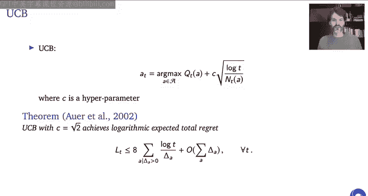

我们的目标是找到能达到对数级遗憾上界的算法。这类算法通常遵循 **“面对不确定性的乐观”** 原则。

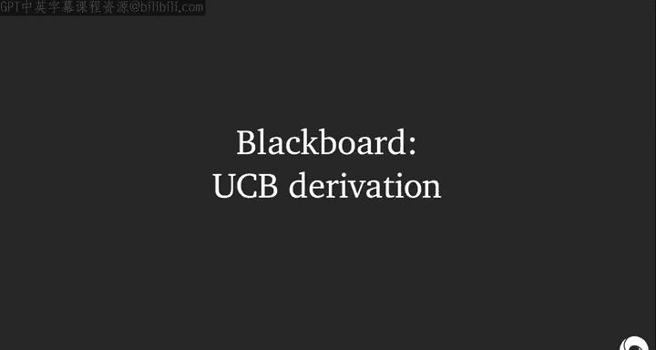

其思想是：当我们对一个动作的价值非常不确定时，我们乐观地认为它可能很好，因此更倾向于选择它。这鼓励了对不确定性高的动作进行探索。

---

## 算法四：上置信界算法

**上置信界算法** 是乐观原则的一个具体实现。

1.  为每个动作的价值估计 `Q(a)` 计算一个上置信界 `U(a)`。
2.  选择具有最高 `Q(a) + U(a)` 的动作。

`U(a)` 的设计是关键。它应该随着动作被选择次数 `N(a)` 的增加而减小（不确定性降低），同时随着总时间 `t` 的增长而缓慢增加（保证持续探索）。使用霍夫丁不等式可以推导出一种形式：
`U(a) = c * sqrt( log(t) / N(a) )`
其中 `c` 是一个超参数。

UCB算法被证明能够实现对数级遗憾。

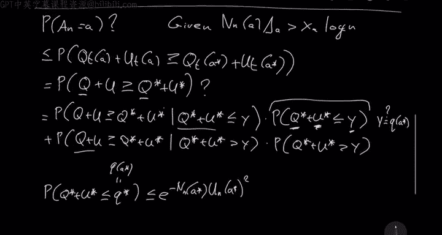

---

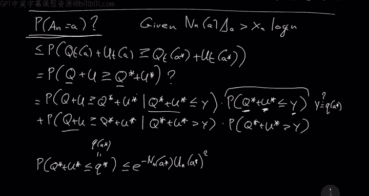

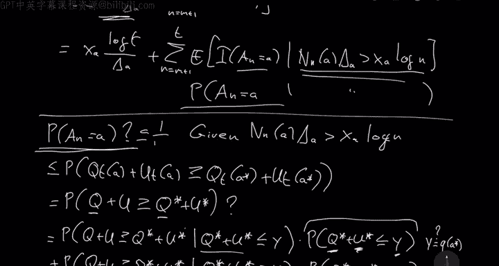

## 贝叶斯方法

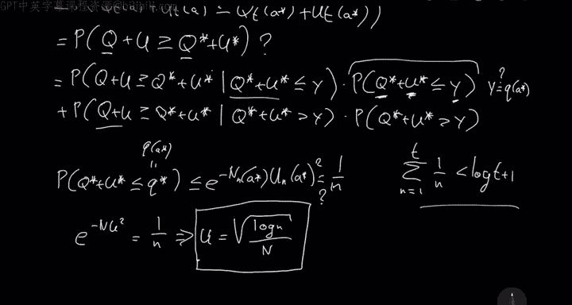

在贝叶斯方法中，我们维护一个关于每个动作期望价值的**信念分布** `P(Q(a) | θ)`，而不仅仅是点估计。例如，对于伯努利奖励，可以使用Beta分布作为共轭先验。

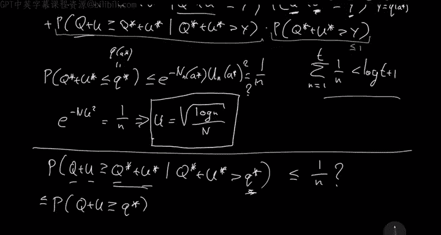

*   **先验**：假设对 `Q(a)` 一无所知，可以使用均匀分布（如Beta(1,1)）。
*   **后验更新**：观察到奖励后，根据贝叶斯规则更新分布参数。

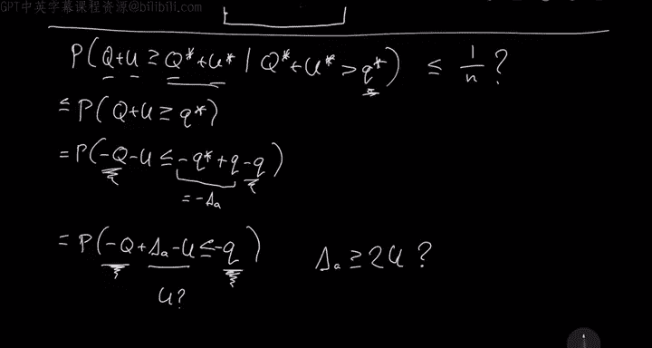

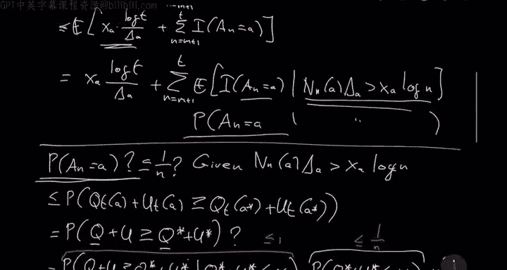

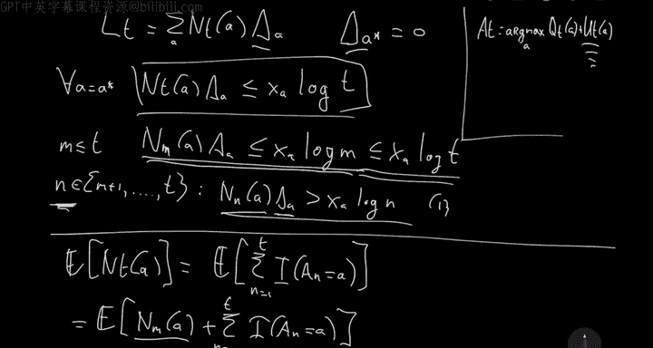

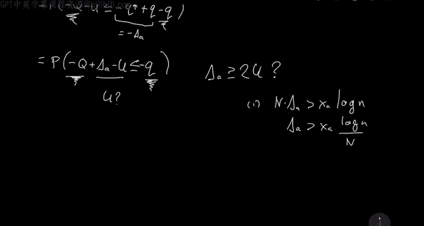

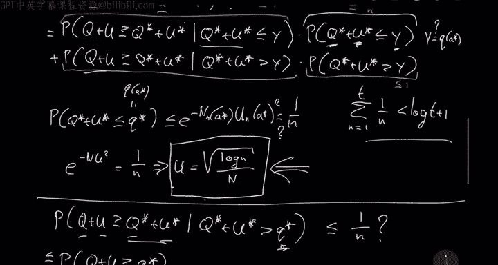

有了后验分布，我们可以通过多种方式实现乐观探索：
1.  计算均值加若干倍标准差作为上界（类似贝叶斯版UCB）。
2.  使用**概率匹配**：选择动作 `a` 的概率等于我们相信 `a` 是最优动作的后验概率。

---

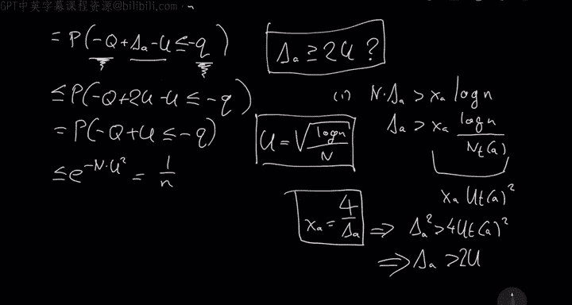

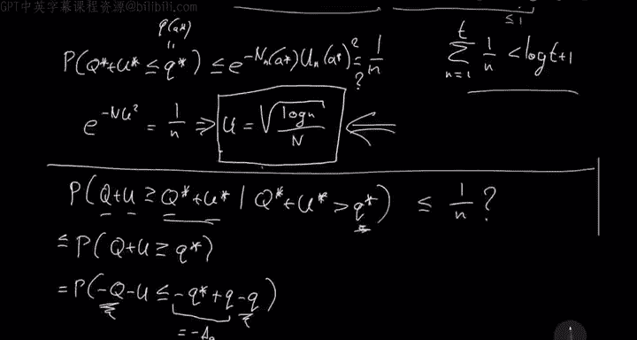

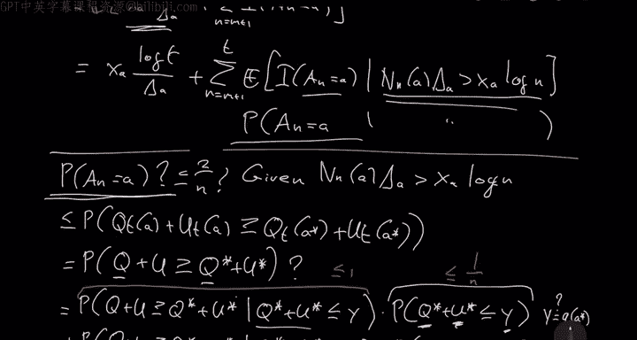

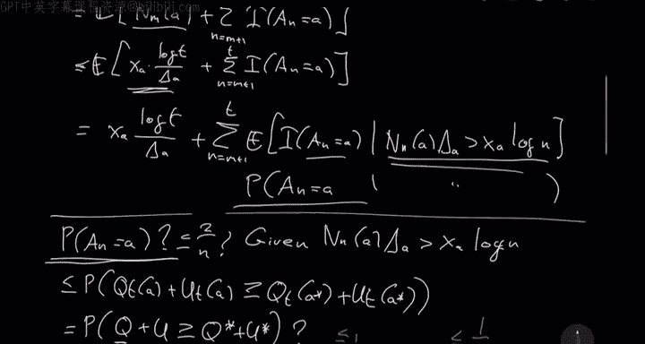

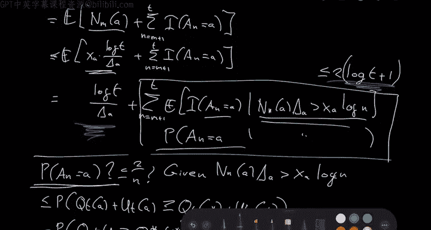

## 算法五：汤普森采样

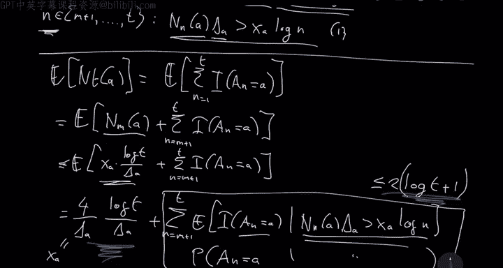

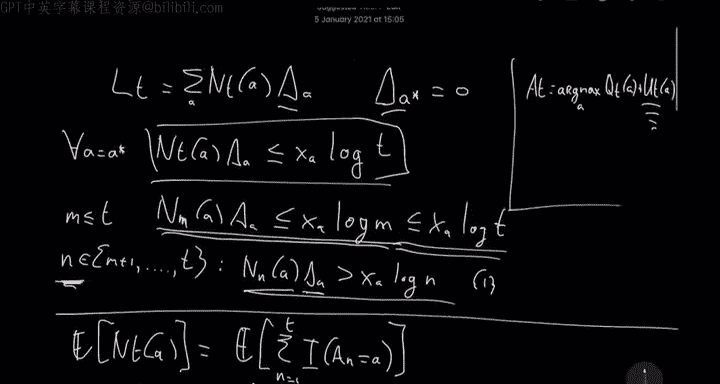

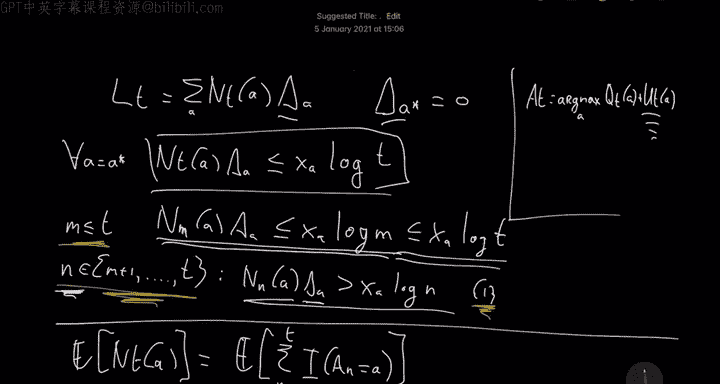

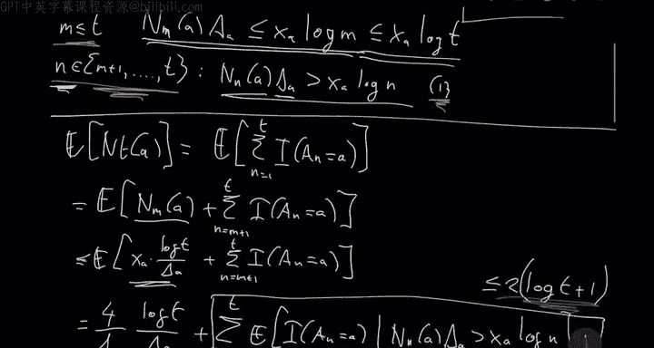

**汤普森采样** 是概率匹配的一种高效实现方法。

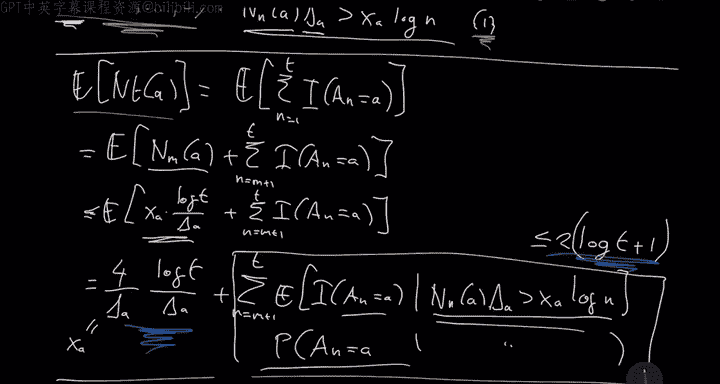

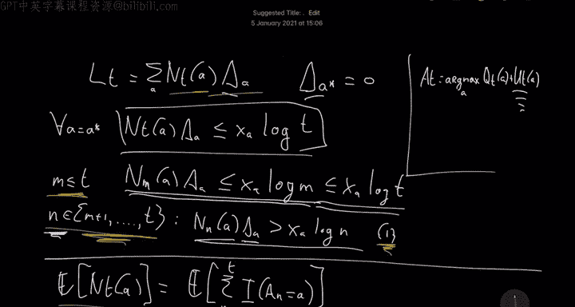

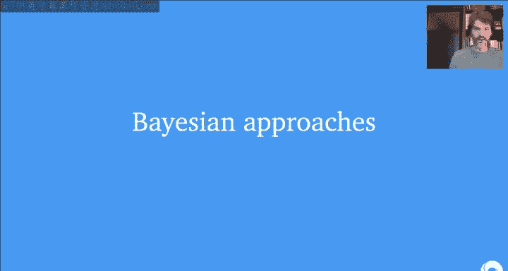

1.  从每个动作的后验信念分布中采样一个价值样本 `Q̃(a) ~ P(Q(a) | Data)`。
2.  选择具有最高采样值 `Q̃(a)` 的动作。

可以证明，汤普森采样的动作选择概率与概率匹配完全相同。对于伯努利老虎机等问题，它也能达到对数级遗憾，并且在实际中常常表现优异。

---

## 规划探索

我们还可以将老虎机问题视为一个**关于信息状态的序列决策问题**。智能体的内部状态（如记录每个动作奖励历史的计数）会随着每次动作和观察到的奖励而演变。

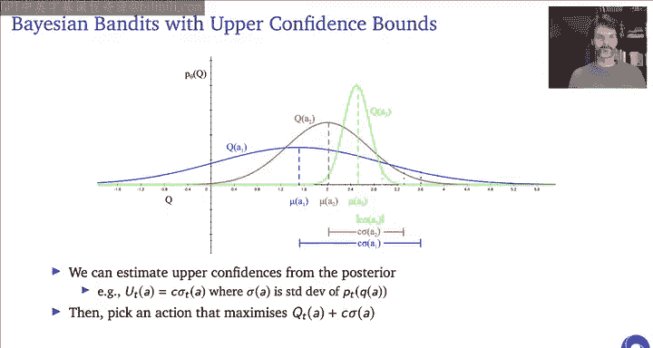

这形成了一个（可能是无限的）马尔可夫决策过程。如果我们学习了一个关于奖励分布的贝叶斯模型，就可以使用规划算法（如动态规划）来求解这个MDP，从而在考虑未来信息价值的基础上，最优地权衡探索与利用。这被称为**贝叶斯自适应强化学习**，虽然理论最优，但计算成本高昂，难以扩展到复杂问题。

---

## 示例回顾与比较

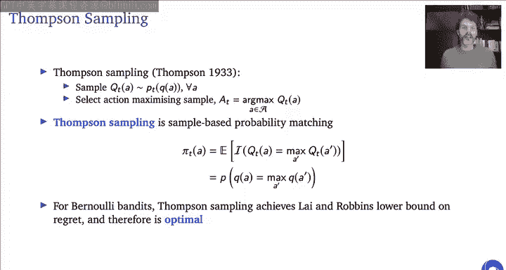

考虑一个简单的双臂老虎机例子：
*   动作A：尝试1次，奖励0。
*   动作B：尝试2次，奖励分别为1和0。

不同算法在下一步选择动作A的概率：
*   **贪婪策略**：0（永远选择B）。
*   **ε-贪婪策略**：`ε / 2`（以 `ε` 概率随机选择时，A被选中的概率）。
*   **UCB**：0（因为两臂尝试次数相同，上界相同，仍选B）。
*   **汤普森采样**（均匀先验）：约0.25（根据后验分布计算A更优的概率）。

这个例子展示了不同算法在具体决策上的差异，尽管它们的长期遗憾增长率可能相同。

---

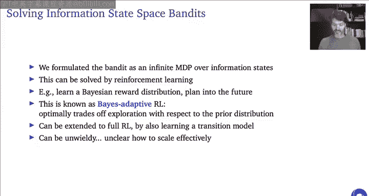

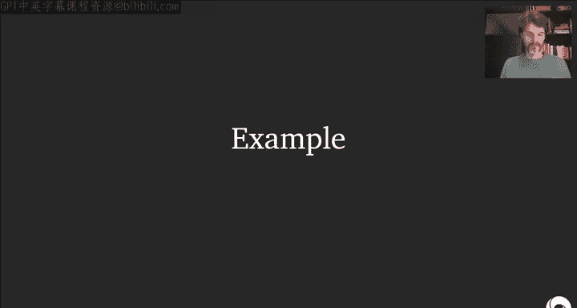

## 总结

本节课中，我们一起学习了强化学习中探索与利用的核心挑战。我们通过多臂老虎机这个简化模型，深入探讨了多种策略：

1.  **贪婪策略** 和 **ε-贪婪策略** 简单直观，但遗憾可能是线性的。
2.  **策略梯度方法** 直接优化策略参数，易于扩展，但缺乏探索的理论保证。
3.  **上置信界算法** 和 **汤普森采样** 遵循“面对不确定性的乐观”原则，被证明能达到对数级遗憾，是理论上高效的探索方法。
4.  我们还简要介绍了**贝叶斯方法**和**规划探索**的思想。

在接下来的课程中，我们将回到具有多个状态的一般强化学习设置，并学习如何将这些探索原理与价值函数估计、规划和控制结合起来。