# 03：马尔可夫决策过程与动态规划 🎯

在本节课中，我们将学习如何用马尔可夫决策过程（MDP）来形式化强化学习中的智能体-环境交互循环，并介绍解决MDP问题的第一类方法——动态规划。我们将涵盖MDP的定义、目标函数、贝尔曼方程，以及用于策略评估和控制的动态规划算法。

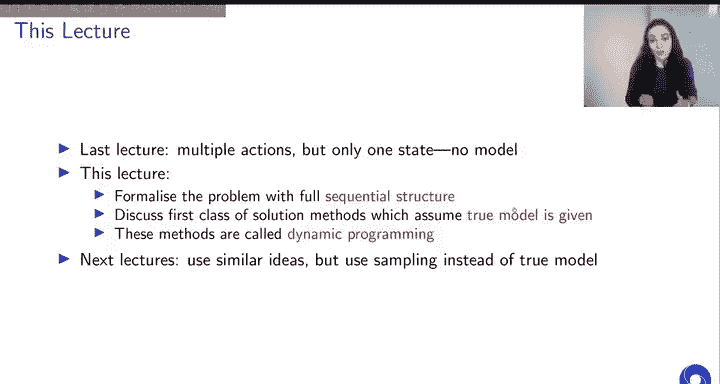

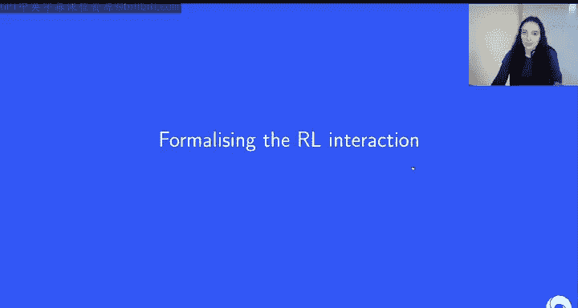

## 概述：形式化RL交互

首先，我们来讨论智能体与环境交互的数学形式化，这被称为马尔可夫决策过程。这使我们能够更清晰地讨论RL智能体的目标以及如何实现它。

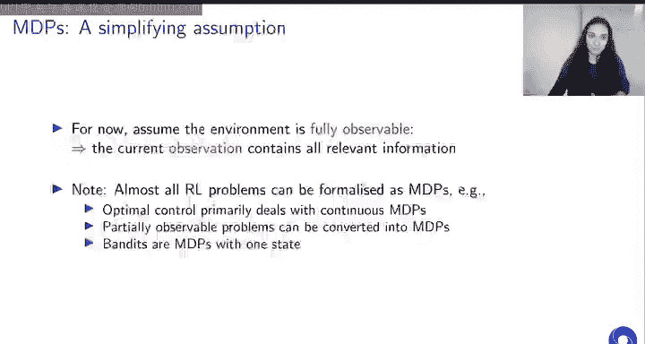

目前，我们假设环境是完全可观测的，即智能体当前的观察包含了所有与未来预测相关的信息。几乎所有RL问题都可以形式化为MDP，这是一个非常通用的范式。

## 马尔可夫决策过程（MDP）定义

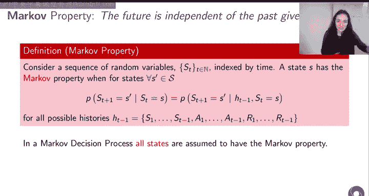

MDP是一个五元组 `(S, A, P, R, γ)`：
*   **S**：所有状态的集合。
*   **A**：所有动作的集合。
*   **P**：状态转移概率核。给定当前状态 `s` 和动作 `a`，转移到下一个状态 `s'` 并获得奖励 `r` 的联合概率，即 `P(s', r | s, a)`。
*   **R**：奖励函数。有时也指期望奖励 `R(s, a) = E[r | s, a]`。
*   **γ**：折扣因子，取值范围 `[0, 1]`，用于权衡近期和远期奖励。

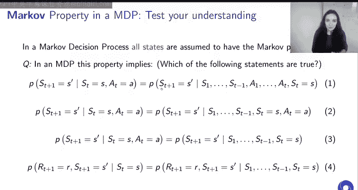

MDP中的“马尔可夫”属性是指：未来状态仅依赖于当前状态，与过去历史无关。也就是说，当前状态 `s_t` 是过去历史的充分统计量。

## 智能体的目标与回报

智能体在MDP中交互，每一步都会产生即时奖励。智能体的目标是找到一个行为策略，以最大化其获得的累积回报。

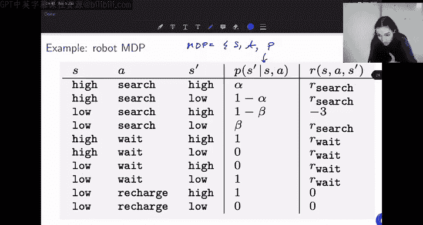

以下是几种常见的回报定义：
*   **无折扣回报**：`G_t = R_{t+1} + R_{t+2} + ... + R_T`。通常用于有限步长的情景式任务。
*   **折扣回报**：`G_t = R_{t+1} + γ R_{t+2} + γ^2 R_{t+3} + ...`。这是我们最常用的形式，适用于有限和无限步长任务。
*   **平均回报**：`G_t = lim_{T->∞} (1/T) Σ_{k=1}^{T} R_k`。通常用于无限步长任务。

折扣因子 `γ` 的作用：
*   `γ` 接近0：近视，只重视即时奖励。
*   `γ` 接近1：远视，平等对待未来奖励。
*   引入折扣在数学上便于处理无限步长问题，避免回报无限大，同时也符合经济学和生物学中“即时奖励更有价值”的直觉。

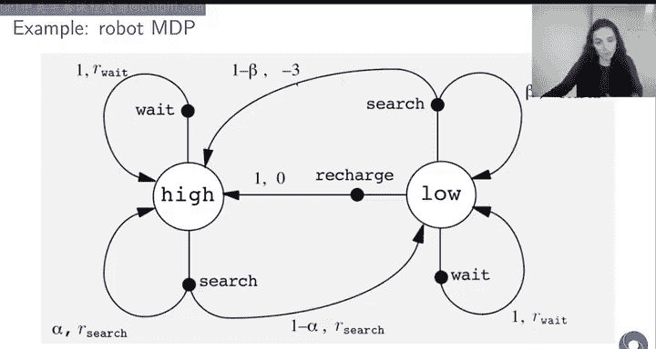

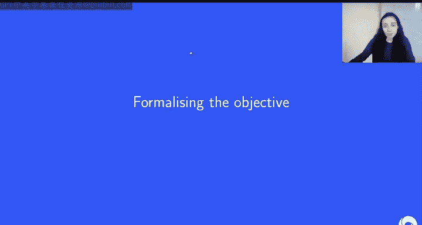

智能体的目标是找到一个策略 `π`，以最大化期望折扣回报。策略 `π` 是一个从状态到动作概率分布的映射。

## 价值函数与最优性

为了衡量策略的好坏，我们引入价值函数：
*   **状态价值函数 `V^π(s)`**：从状态 `s` 开始，遵循策略 `π` 所能获得的期望回报。
    `V^π(s) = E_π[G_t | S_t = s]`
*   **动作价值函数 `Q^π(s, a)`**：从状态 `s` 开始，执行动作 `a`，然后遵循策略 `π` 所能获得的期望回报。
    `Q^π(s, a) = E_π[G_t | S_t = s, A_t = a]`

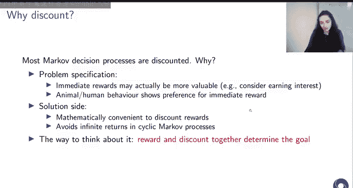

两者关系：`V^π(s) = Σ_a π(a|s) Q^π(s, a)`

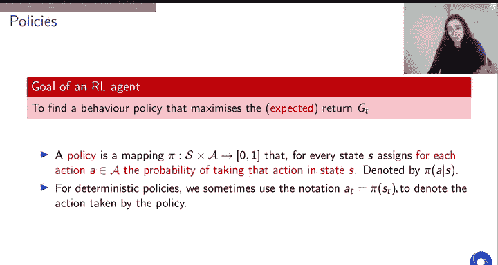

最优价值函数定义了在MDP中可能达到的最佳性能：
*   **最优状态价值函数 `V^*(s)`**：`V^*(s) = max_π V^π(s)`
*   **最优动作价值函数 `Q^*(s, a)`**：`Q^*(s, a) = max_π Q^π(s, a)`

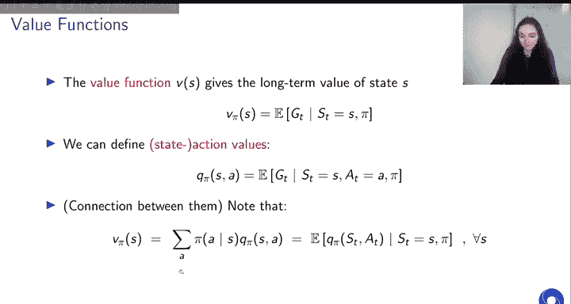

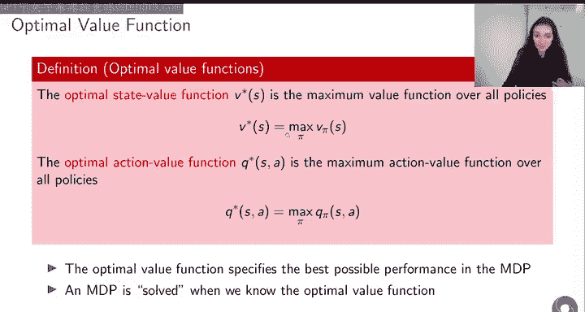

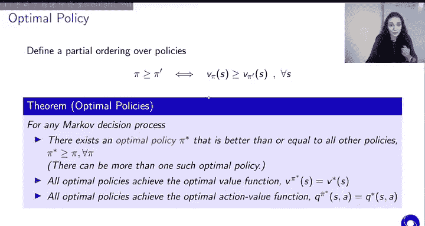

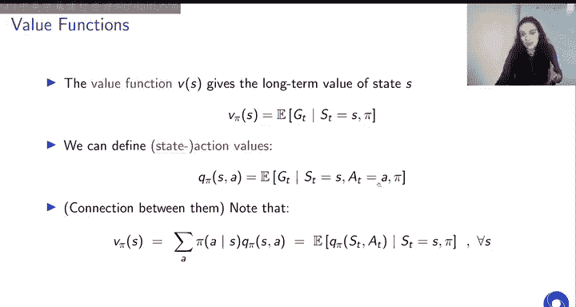

**定理**：对于任何MDP，总存在一个最优确定性策略 `π^*`，它不劣于任何其他策略。所有最优策略都共享相同的最优价值函数 `V^*` 和 `Q^*`。

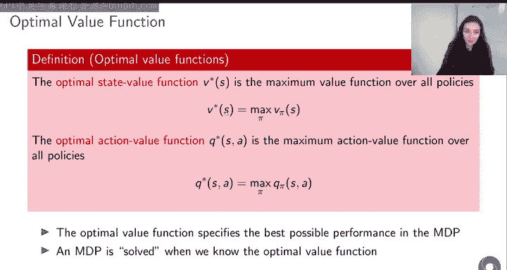

一旦我们知道了 `Q^*`，就可以通过贪心策略立即得到一个最优策略：
`π^*(s) = argmax_a Q^*(s, a)`

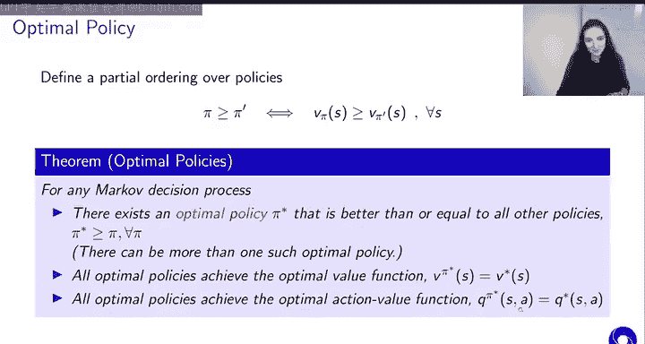

## 贝尔曼方程

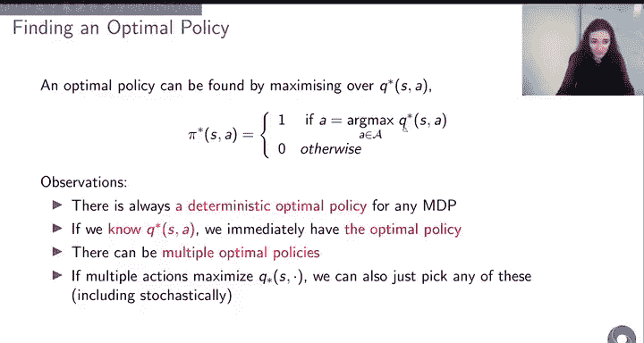

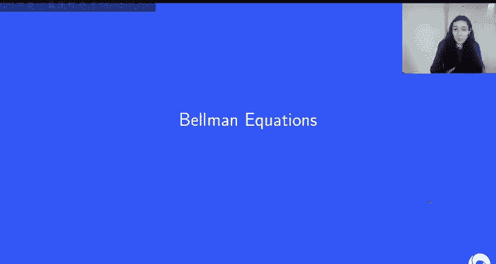

价值函数具有递归结构，由贝尔曼方程描述。

**贝尔曼期望方程**（针对给定策略 `π`）：
`V^π(s) = Σ_a π(a|s) Σ_{s', r} P(s', r | s, a) [r + γ V^π(s')]`
`Q^π(s, a) = Σ_{s', r} P(s', r | s, a) [r + γ Σ_{a'} π(a'|s') Q^π(s', a')]`

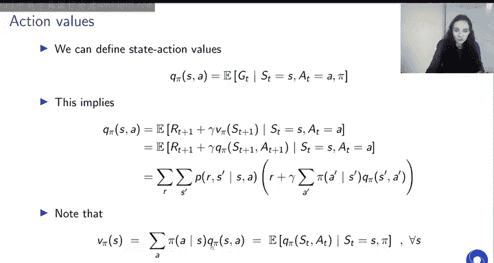

**贝尔曼最优方程**（针对最优价值函数）：
`V^*(s) = max_a Σ_{s', r} P(s', r | s, a) [r + γ V^*(s')]`
`Q^*(s, a) = Σ_{s', r} P(s', r | s, a) [r + γ max_{a'} Q^*(s', a')]`

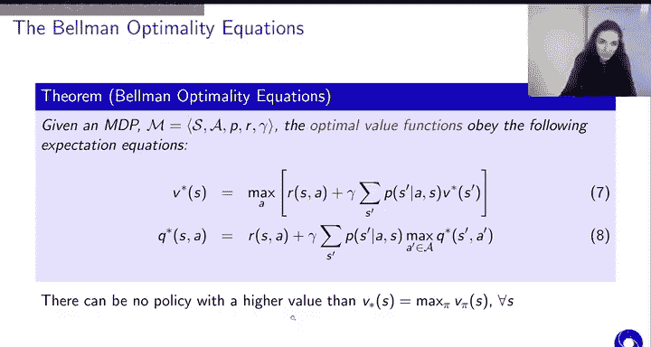

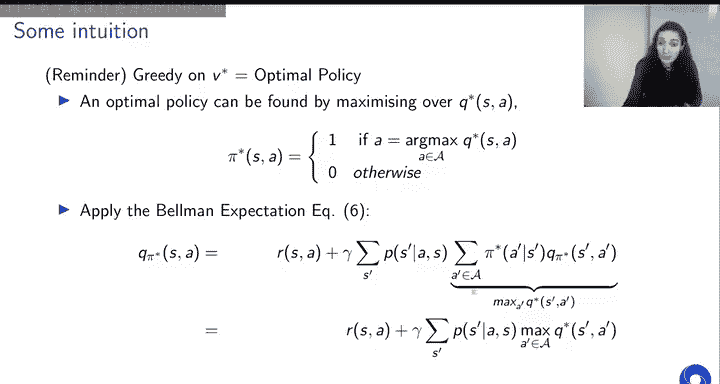

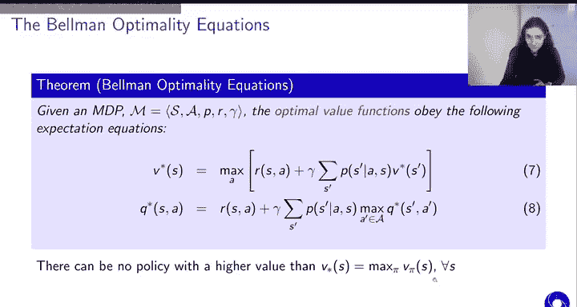

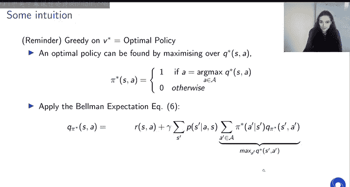

贝尔曼方程是强化学习中的核心概念，它将复杂的长期回报计算分解为即时奖励和下一个状态的价值的组合。

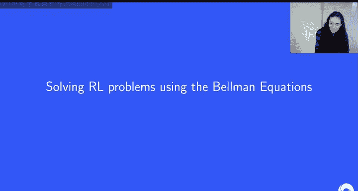

## RL中的两类问题

在强化学习中，我们主要解决两类问题：

1.  **预测（策略评估）**：给定一个策略 `π`，估计其价值函数 `V^π` 或 `Q^π`。即回答“这个策略有多好？”。
2.  **控制**：寻找最优价值函数 `V^*` 或 `Q^*`，从而得到最优策略 `π^*`。即回答“最好的行为是什么？”。

控制问题通常比预测问题更难。

对于小型MDP，策略评估可以通过求解贝尔曼期望方程的线性系统来完成（复杂度为 `O(|S|^3)`）。但对于控制问题，贝尔曼最优方程是非线性的，无法直接线性求解。因此，我们需要迭代方法。

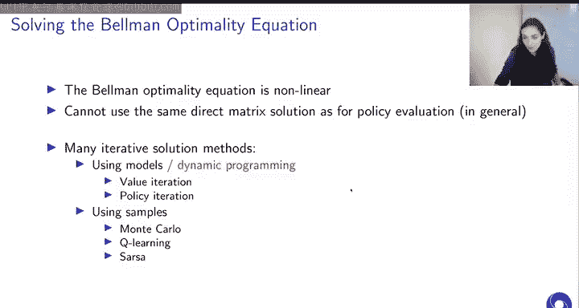

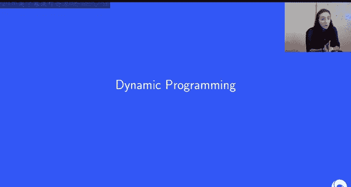

## 动态规划简介

动态规划是一类算法的总称，用于在已知环境完整模型（即MDP）的情况下，计算最优策略或最优价值函数。

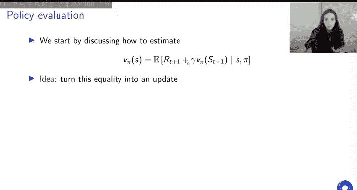

所有动态规划方法都遵循一个通用模式：**策略评估** 和 **策略改进** 的交替进行。

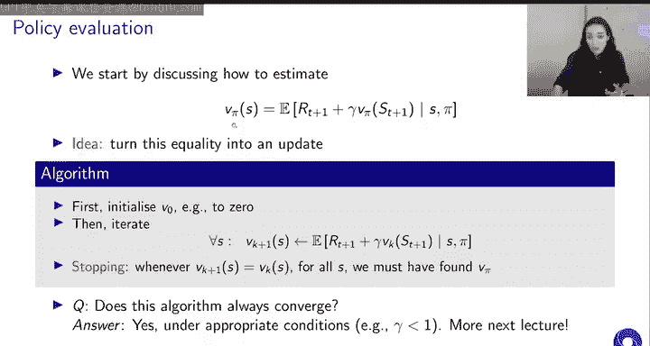

### 策略评估：迭代策略评估

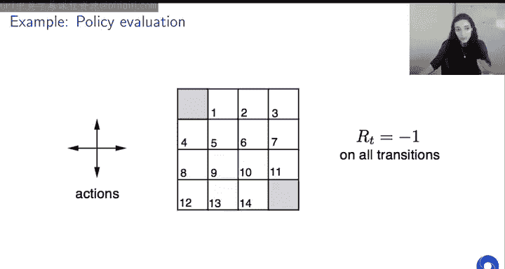

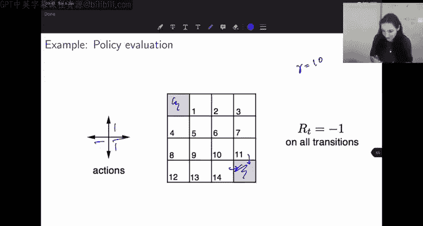

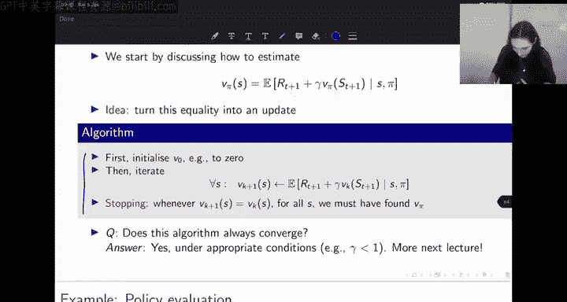

给定一个策略 `π`，我们希望计算 `V^π`。我们可以将贝尔曼期望方程转化为一个迭代更新规则：

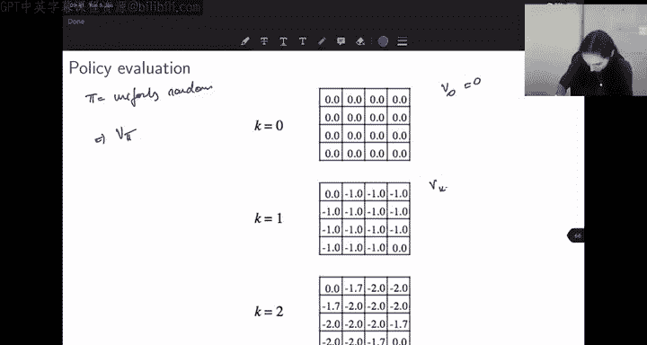

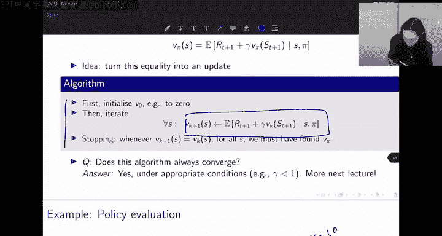

初始化 `V_0(s)`（例如全0）。
对 `k = 0, 1, 2, ...` 重复：
`V_{k+1}(s) = Σ_a π(a|s) Σ_{s', r} P(s', r | s, a) [r + γ V_k(s')]`，对所有 `s ∈ S`

当 `V_{k+1}` 与 `V_k` 足够接近时停止。在 `γ < 1` 或所有策略都能最终终止的条件下，该算法保证收敛到 `V^π`。

### 策略改进：贪心策略

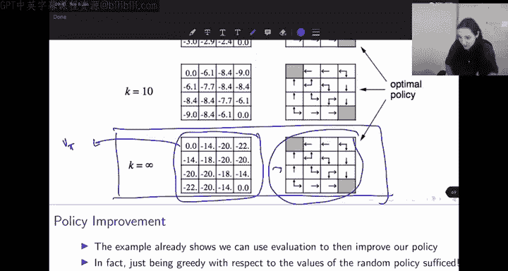

假设我们已经评估了一个策略 `π` 并得到了其价值函数 `V^π`（或 `Q^π`）。我们可以通过贪心方式改进它，得到一个新策略 `π'`：
`π'(s) = argmax_a Q^π(s, a)`

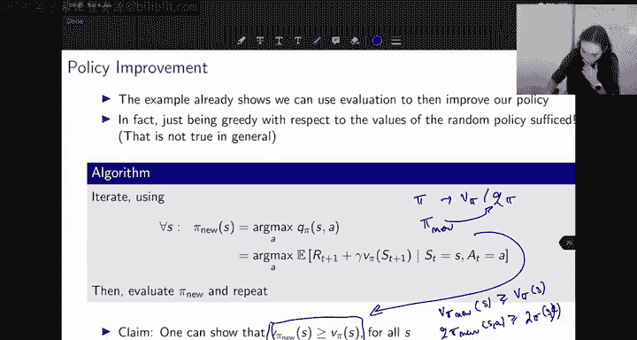

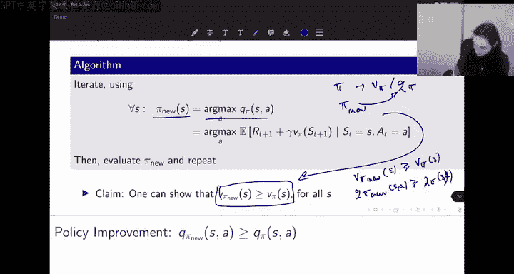

**策略改进定理**：由 `π` 产生的贪心策略 `π'` 满足 `V^{π'}(s) ≥ V^π(s)` 对所有状态 `s` 成立。即新策略不差于原策略。

这个定理的直觉是：新策略在每个状态都选择看起来最好的动作。即使它只在这个动作上偏离原策略一次，然后继续遵循旧策略，其回报也不会变差。多次这样的改进会带来累积的收益。

### 策略迭代算法

结合策略评估和策略改进，就得到了策略迭代算法：

1.  初始化策略 `π_0`（例如随机策略）。
2.  对 `i = 0, 1, 2, ...` 重复：
    *   **策略评估**：计算当前策略 `π_i` 的价值函数 `V^{π_i}`（通过迭代策略评估直至收敛）。
    *   **策略改进**：通过贪心方式更新策略：`π_{i+1}(s) = argmax_a Σ_{s', r} P(s', r | s, a) [r + γ V^{π_i}(s')]`
3.  当策略不再变化（`π_{i+1} = π_i`）时停止。

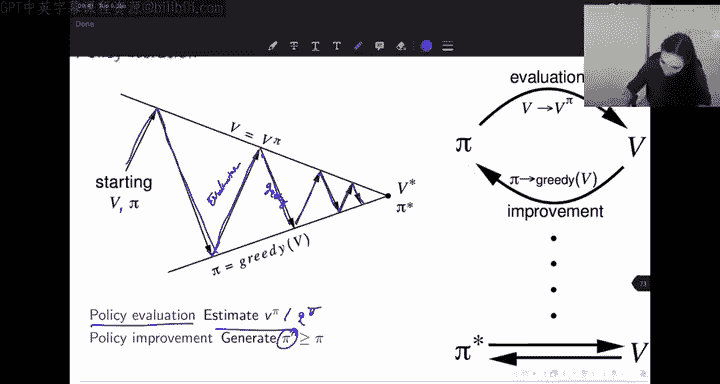

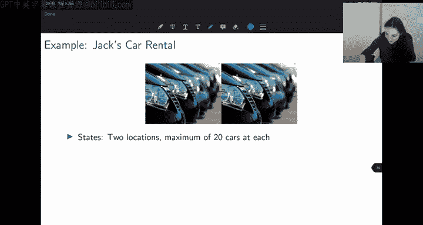

策略迭代算法保证收敛到最优策略 `π^*` 和最优价值函数 `V^*`。

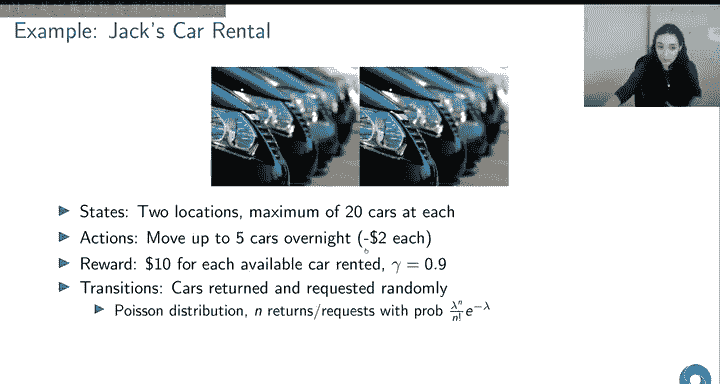

### 价值迭代算法

策略迭代需要在每次改进前将策略评估到收敛，这可能计算量较大。价值迭代是一种更简洁的方法，它直接将贝尔曼最优方程转化为更新规则，本质上相当于“只进行一次策略评估就进行策略改进”。

初始化 `V_0(s)`（例如全0）。
对 `k = 0, 1, 2, ...` 重复：
`V_{k+1}(s) = max_a Σ_{s', r} P(s', r | s, a) [r + γ V_k(s')]`，对所有 `s ∈ S`

当 `V_{k+1}` 与 `V_k` 足够接近时停止。此时 `V_k` 近似满足贝尔曼最优方程，因此近似为 `V^*`。最优策略可以通过对 `V_k` 贪心得到。

价值迭代是动态规划中常用的控制算法。

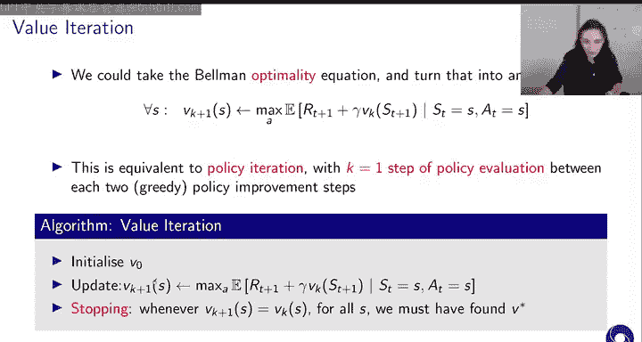

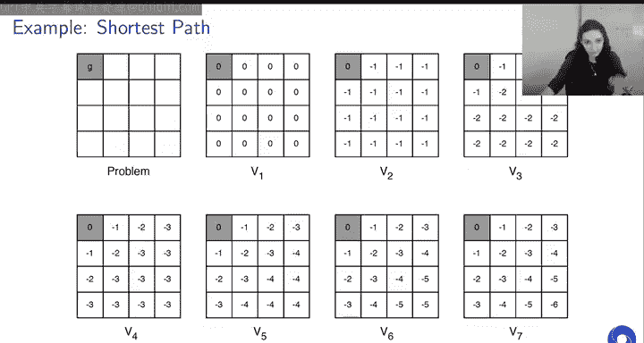

## 动态规划的扩展

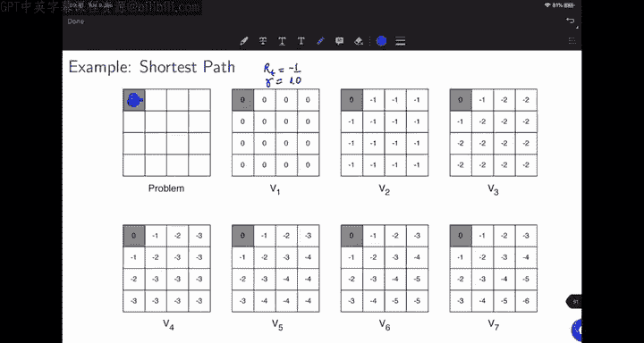

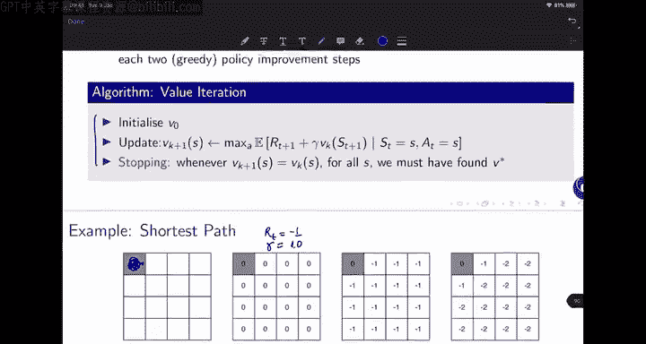

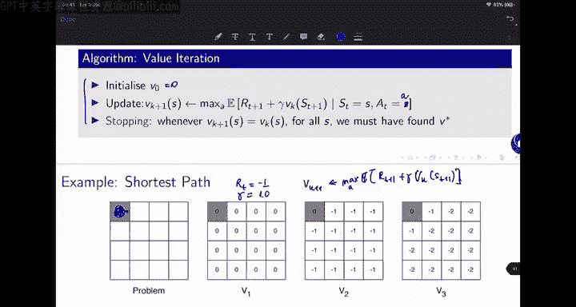

标准的动态规划算法（如同步价值迭代）需要遍历所有状态进行更新，计算复杂度为 `O(|S|^2 |A|)`（对于状态价值函数）或 `O(|S| |A|^2)`（对于动作价值函数）。对于大规模问题，这可能是不可行的。

以下是一些扩展方法：

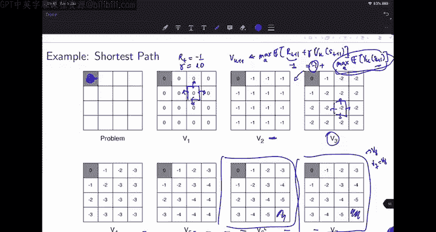

*   **异步动态规划**：不按固定顺序更新所有状态，而是以任意顺序逐个或分批更新状态。只要每个状态都被持续访问，算法仍然保证收敛。这可以显著减少计算开销。
    *   **就地更新**：只维护一个价值表，用新值立即覆盖旧值。
    *   **优先级扫描**：根据贝尔曼误差的大小来确定状态更新的优先级，优先更新误差大的状态。
    *   **实时动态规划**：只更新与智能体当前或近期可能访问的状态相关的部分价值函数。
*   **采样备份**：在更新状态价值时，不使用完整的模型动态（需要对所有可能的下一个状态和奖励求和），而是使用从模型中采样得到的一个或几个转移样本 `(s, a, r, s')` 来进行更新。这打破了维数灾难，并且是后续无模型方法（如蒙特卡洛法和时序差分学习）的基础。

## 总结

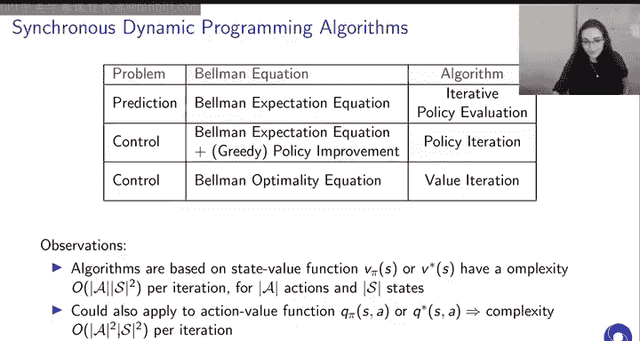

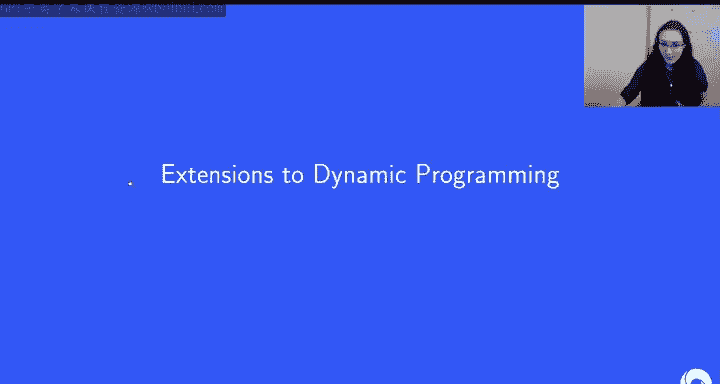

本节课我们一起学习了强化学习的核心数学框架——马尔可夫决策过程，以及解决MDP问题的第一类方法——动态规划。

我们首先介绍了MDP如何形式化智能体与环境的序列决策交互，并定义了折扣回报作为智能体的优化目标。然后，我们引入了价值函数（`V^π` 和 `Q^π`）和最优价值函数（`V^*` 和 `Q^*`）来衡量和寻找最佳行为。

贝尔曼方程揭示了价值函数的内在递归结构，是连接预测和控制的桥梁。我们区分了RL中的预测（策略评估）和控制两类问题。

在动态规划部分，我们学习了：
1.  **迭代策略评估**：通过迭代求解贝尔曼期望方程来评估给定策略的价值。
2.  **策略改进定理**：基于价值函数进行贪心改进总能得到不劣于原策略的新策略。
3.  **策略迭代**：交替进行策略评估（至收敛）和策略改进，直至找到最优策略。
4.  **价值迭代**：直接迭代求解贝尔曼最优方程，是策略迭代的一种高效变体。

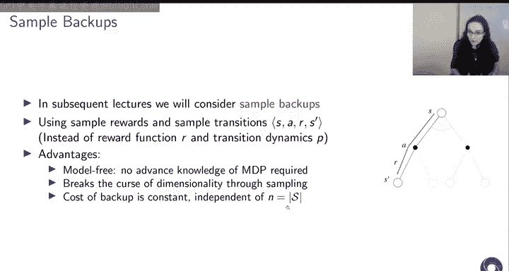

最后，我们简要讨论了异步动态规划和采样备份等扩展，以应对大规模问题。

动态规划假设我们拥有环境的完整模型（`P` 和 `R`）。在接下来的课程中，我们将放松这一假设，探索如何在仅通过与环境采样交互的情况下，仍然应用动态规划的思想，这就是无模型的强化学习方法，如蒙特卡洛法和时序差分学习。