# 04：动态规划算法的理论基础 🧮

在本节课中，我们将深入探讨动态规划的理论基础。我们将回顾贝尔曼方程，引入贝尔曼算子，并重新审视策略迭代、策略评估和价值迭代算法。我们将基于这些算子来证明这些算法的收敛性质。

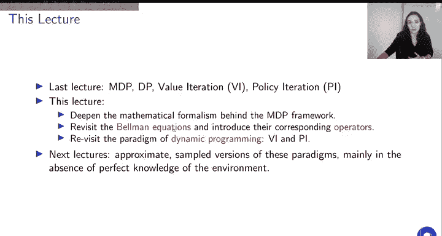

---

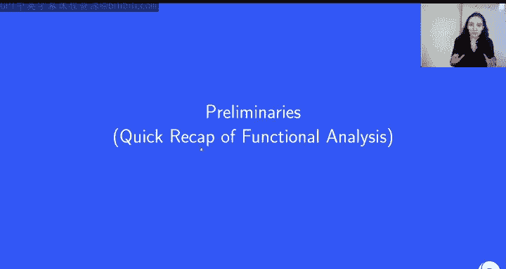

## 数学预备知识 📐

在进入正题之前，我们先回顾一些必要的泛函分析基础概念，确保大家理解一致。

### 范数与向量空间

向量空间是大家熟悉的概念。范数是一个从向量空间映射到实数域的映射，它具有以下性质：
*   总是非负的。
*   满足齐次性。
*   满足三角不等式。

在本课程中，我们主要接触的向量空间是 R^d，常用的范数是无穷范数（L∞ 范数）和有时由分布加权的 L2 范数。

### 压缩映射

对于一个装备了范数的向量空间，一个从该空间到自身的映射 **T** 被称为 **α-压缩映射**（系数为 α），如果对于空间中的任意两点，应用该映射后，两点之间的距离至少缩小 α 倍。

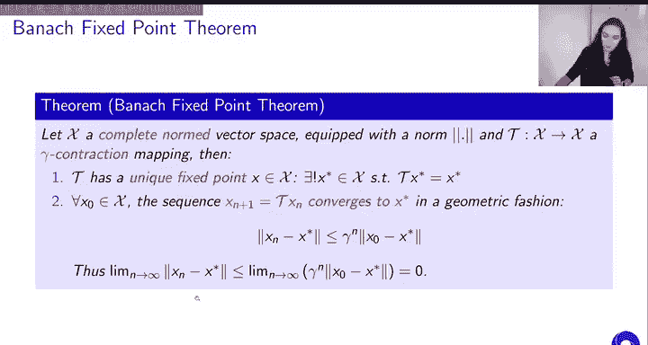

其数学公式为：
`||T(u) - T(v)|| ≤ α ||u - v||`

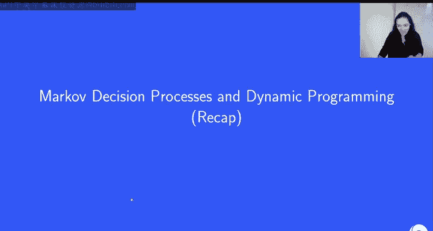

如果 α 在 0 和 1 之间，我们称 **T** 是非扩张的；如果 α 严格小于 1，则是一个完全的压缩映射。

每个压缩映射都是利普希茨连续的，这意味着它将收敛序列映射为收敛序列。

### 不动点

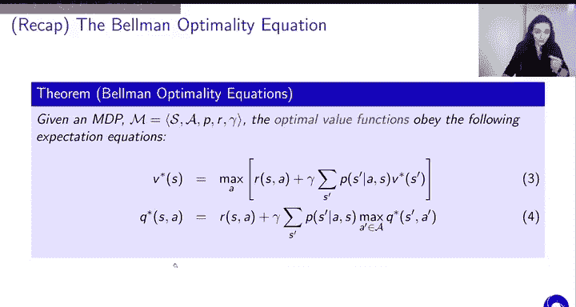

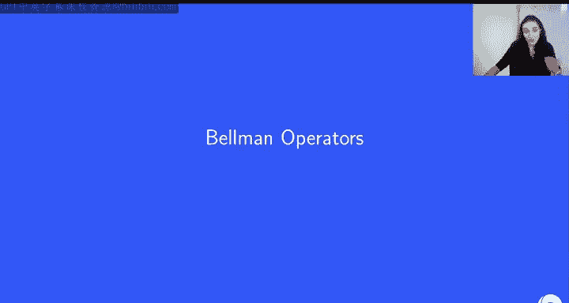

向量空间中的一个点 **x** 被称为映射 **T** 的**不动点**，如果应用该算子后点保持不变，即 `T(x) = x`。

### 巴拿赫不动点定理

这是本节的核心定理。它指出：在一个完备的赋范向量空间（即任何柯西序列的极限仍在空间内）中，如果一个映射 **T** 是一个系数为 γ 的压缩映射，那么：
1.  **T** 存在唯一的不动点 **x***。
2.  由 `x_{n+1} = T(x_n)` 定义的序列会以几何速率收敛到该不动点 **x***。

收敛速率满足：
`||x_n - x*|| ≤ γ^n ||x_0 - x*||`

---

## 马尔可夫决策过程与值函数回顾 🔄

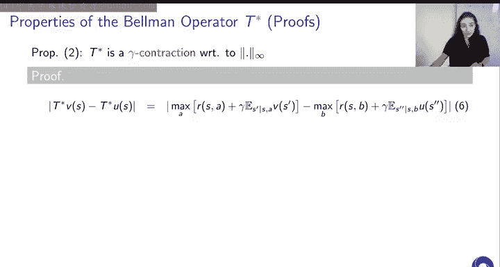

上一节我们介绍了马尔可夫决策过程和动态规划算法。现在，让我们快速回顾几个核心概念，为引入算子做准备。

### 马尔可夫决策过程定义

我们使用 MDP 的第二种定义，包含以下要素：
*   **S**: 状态集合
*   **A**: 动作集合
*   **P**: 状态转移动态（`P(s' | s, a)`）
*   **R**: 期望奖励函数（`R(s, a)`）
*   **γ**: 折扣因子（`0 ≤ γ < 1`）

### 值函数定义

*   **状态值函数 V^π(s)**: 从状态 s 开始，遵循策略 π 所能获得的期望折扣回报。
*   **动作值函数 Q^π(s, a)**: 从状态 s 采取动作 a 开始，然后遵循策略 π 所能获得的期望折扣回报。
*   **最优值函数 V*(s), Q*(s, a)**: 对所有可能策略取最大值得到的最优值函数。

### 贝尔曼方程

对于任意策略 π，其值函数满足**贝尔曼期望方程**：
`V^π(s) = Σ_a π(a|s) [ R(s, a) + γ Σ_{s'} P(s'|s, a) V^π(s') ]`

最优值函数满足**贝尔曼最优性方程**：
`V*(s) = max_a [ R(s, a) + γ Σ_{s'} P(s'|s, a) V*(s') ]`

---

## 引入贝尔曼算子 🧠

现在，我们基于贝尔曼方程引入关键的数学工具——贝尔曼算子。

### 贝尔曼最优性算子 T*

我们定义在所有有界实值函数空间 **V** 上的贝尔曼最优性算子 **T***。对于任意函数 **f ∈ V**，算子 **T*** 将其映射为另一个函数，该函数在状态 s 处的取值为：
`(T* f)(s) = max_a [ R(s, a) + γ Σ_{s'} P(s'|s, a) f(s') ]`

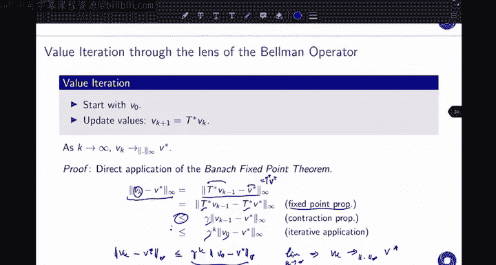

请注意，如果我们将 **f** 替换为最优值函数 **V***，那么根据贝尔曼最优性方程，右边就等于 **V*(s)**。这意味着 **V*** 是算子 **T*** 的一个不动点。

实际上，算子 **T*** 具有三个非常重要的性质：
1.  **V*** 是其唯一的不动点。
2.  **T*** 是关于无穷范数 **||·||_∞** 的 **γ-压缩映射**。
3.  **T*** 是**单调的**：如果对于所有状态 s 有 `U(s) ≤ V(s)`，那么对于所有状态 s 也有 `(T* U)(s) ≤ (T* V)(s)`。

性质1由定义直接得出。下面我们来证明性质2和3。

#### 证明 T* 是压缩映射

我们需要证明：`||T* V - T* U||_∞ ≤ γ ||V - U||_∞`。

我们从定义出发，利用不等式 `|max f - max g| ≤ max |f - g|`，经过推导可得上述结论。这证实了 **T*** 确实是一个系数为 γ 的压缩映射。

#### 证明 T* 是单调的

我们需要证明：如果对于所有 s 有 `U(s) ≤ V(s)`，那么对于所有 s 也有 `(T* U)(s) ≤ (T* V)(s)`。

根据假设和算子的定义，我们可以直接比较 `(T* V)(s)` 和 `(T* U)(s)` 的表达式。利用 `max f - max g ≤ max (f - g)` 这个不等式，并结合 `U(s) ≤ V(s)` 的假设，可以证明结论成立。

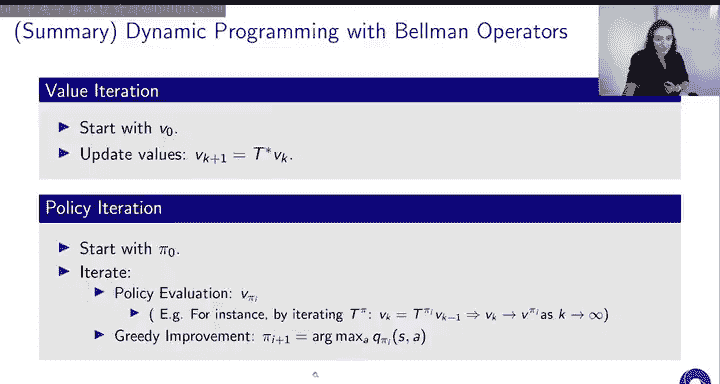

---

## 价值迭代的收敛性证明 ✅

上一节我们介绍了价值迭代算法。现在，我们可以通过贝尔曼算子的视角重新审视它，并证明其收敛性。

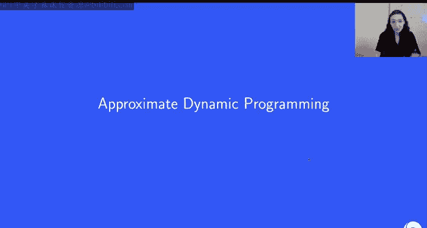

价值迭代的更新规则是：
`V_{k+1}(s) = max_a [ R(s, a) + γ Σ_{s'} P(s'|s, a) V_k(s') ]`

这恰好就是应用一次贝尔曼最优性算子：`V_{k+1} = T* V_k`。

由于我们已经证明 **T*** 是一个压缩映射，并且 **V*** 是其唯一不动点，根据巴拿赫不动点定理，由 `V_{k+1} = T* V_k` 生成的序列 **{V_k}** 一定会以几何速率收敛到 **V***。

具体来说，收敛速度满足：
`||V_k - V*||_∞ ≤ γ^k ||V_0 - V*||_∞`

当折扣因子 γ < 1 时，随着迭代次数 k 增加，上式右侧趋于 0，因此算法收敛。

---

## 策略评估与贝尔曼期望算子 📈

类似地，我们可以为策略评估问题定义贝尔曼期望算子 **T^π**。

对于给定的策略 π，算子 **T^π** 定义为：
`(T^π f)(s) = Σ_a π(a|s) [ R(s, a) + γ Σ_{s'} P(s'|s, a) f(s') ]`

这个算子同样具有优良的性质：
1.  策略 π 对应的真实值函数 **V^π** 是其唯一不动点。
2.  **T^π** 也是关于无穷范数的 **γ-压缩映射**。
3.  **T^π** 也是单调的。

其证明思路与 **T*** 类似。

因此，迭代策略评估算法 `V_{k+1} = T^π V_k` 同样是一个压缩映射的重复应用。根据巴拿赫不动点定理，该序列必然收敛到不动点 **V^π**，从而证明了该算法的收敛性。

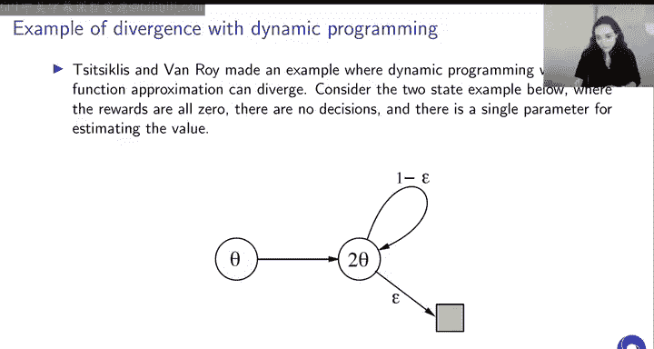

---

## 扩展到 Q 值函数 🔄

上述所有关于值函数 **V** 的讨论和算子定义，都可以平行地推广到动作值函数 **Q** 上。

我们可以在 **Q** 值函数空间上定义对应的贝尔曼最优性算子 **T*** 和贝尔曼期望算子 **T^π**。这些算子同样是 γ-压缩映射，并且具有单调性和唯一不动点（分别是 **Q*** 和 **Q^π**）。因此，基于 **Q** 值的各种动态规划算法也具有相同的收敛保证。

---

## 近似动态规划概述 🔮

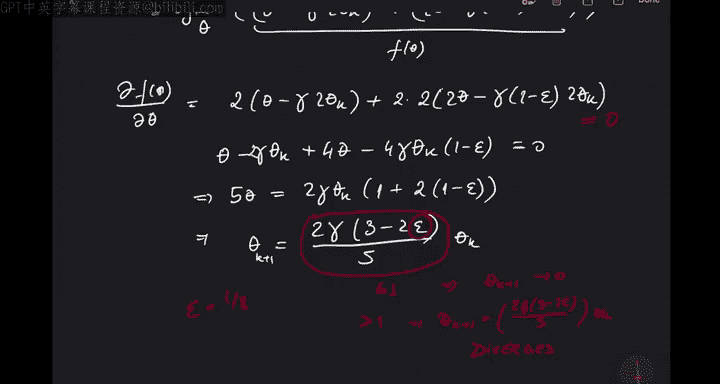

到目前为止，我们都假设**完全了解 MDP 模型**（即知道精确的 **P** 和 **R**），并且能够**精确表示值函数**（例如用表格存储每个状态的值）。然而在实际中，这两个条件经常无法满足：
1.  **模型未知**：我们不知道真实的环境动态和奖励。
2.  **函数近似**：当状态或动作空间很大时，无法用表格精确存储值函数，需要使用参数化函数（如线性函数、神经网络）来近似。

当我们违反这些假设时，就会引入误差：
*   **采样/估计误差**：在模型未知时，我们只能通过采样来近似贝尔曼算子中的期望。
*   **近似误差**：使用的函数近似器可能无法精确表示真实的值函数。

我们的目标仍然是在这些近似条件下，找到一个最优或接近最优的策略。

---

### 近似价值迭代

在近似设定下，价值迭代的更新步骤 `V_{k+1} = T* V_k` 无法精确计算。我们只能得到一个近似值：
`V_{k+1} ≈ T* V_k`

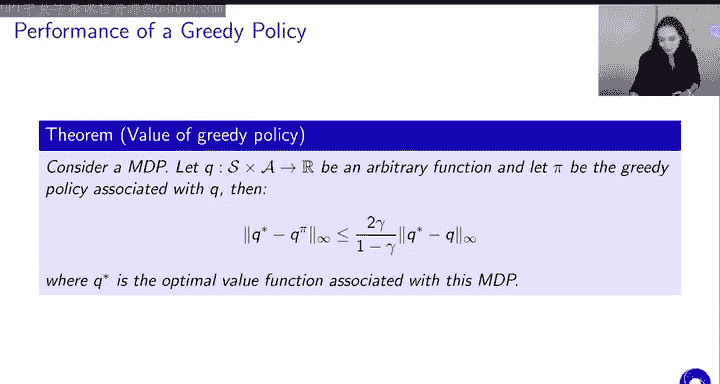

这里的近似可能来自采样，也可能来自函数近似。

**关键问题**：在这种近似下，算法是否仍然收敛到最优值函数？
**答案**：一般来说，**不一定**。如果没有对近似性质的假设，序列可能不收敛，或者收敛到非最优的点。

即使我们假设模型已知，仅引入函数近似也可能导致发散。Baird 的反例表明，在一个简单的两状态 MDP 中使用线性函数近似进行近似价值迭代，会导致值函数估计发散。

### 近似策略迭代

在近似策略迭代中，主要误差来自**策略评估步骤**。我们无法精确计算出当前策略的值函数 **V^π**，只能得到一个近似值。

这导致两个问题：
1.  **值函数序列是否收敛到 Q***？ 通常不能保证。
2.  **策略序列是否收敛到最优策略？** 通常也不能保证。

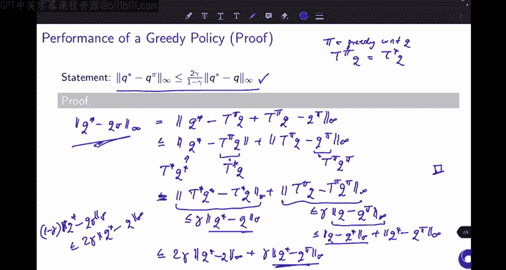

更重要的是，在精确动态规划中，策略改进步骤（贪心策略）能保证策略性能提升。但在近似设定下，由于评估不准确，贪心操作**不能保证**一定得到比原策略更好的策略。

---

## 近似值函数的策略性能边界 🎯

尽管近似动态规划缺乏全局收敛保证，但我们仍然可以分析：从一个近似值函数导出的贪心策略，其性能到底如何？

**定理**：设 **Q** 是 **Q*** 的一个近似，**π** 是基于 **Q** 的贪心策略。那么，贪心策略 **π** 的性能满足以下边界：
`||Q* - Q^π||_∞ ≤ (2γ / (1-γ)) ||Q* - Q||_∞`

这个定理非常重要，它告诉我们：
*   **性能边界与近似误差成正比**：如果我们的近似值函数 **Q** 非常接近最优 **Q***，那么由此产生的贪心策略 **π** 的性能也会接近最优。
*   **折扣因子 γ 的影响巨大**：
    *   当 **γ 较小**（接近 0）时，边界系数 `2γ/(1-γ)` 也很小。这意味着即使近似比较粗糙，得到的策略也可能很不错。问题相对简单。
    *   当 **γ 接近 1** 时，边界系数会变得非常大。这意味着即使我们对 **Q*** 的近似很好，由此产生的贪心策略性能也可能远低于最优。问题更具挑战性。

这个定理为近似动态规划提供了一丝希望：我们不一定需要精确收敛到 **V*** 或 **Q*** 才能得到一个好策略。在迭代的中间阶段，我们可能已经获得了足够好的值函数近似，从而能导出一个优秀的策略。

---

## 总结 📝

本节课我们一起深入学习了动态规划算法的理论基础。

1.  **数学基础**：我们回顾了压缩映射和巴拿赫不动点定理，这是证明算法收敛性的核心工具。
2.  **贝尔曼算子**：我们引入了贝尔曼最优性算子 **T*** 和贝尔曼期望算子 **T^π**，并证明了它们都是压缩映射且具有单调性。
3.  **算法收敛性**：利用算子的压缩性，我们严格证明了价值迭代和迭代策略评估算法能够收敛到各自的不动点（分别是 **V*** 和 **V^π**）。
4.  **近似动态规划**：我们探讨了当模型未知或必须使用函数近似时，动态规划算法所面临的挑战。近似可能导致算法不收敛或策略性能无法保证提升。
5.  **性能边界**：我们证明了一个关键定理，该定理量化了从近似值函数推导出的贪心策略与最优策略之间的性能差距，并揭示了折扣因子 γ 在此过程中的重要作用。

理解这些理论为我们后续学习更复杂的、基于采样的强化学习算法（如蒙特卡洛方法和时序差分学习）奠定了坚实的基础。在接下来的课程中，我们将看到如何在实际问题中应用这些动态规划原理的近似版本。