# 05：无模型预测 🎯

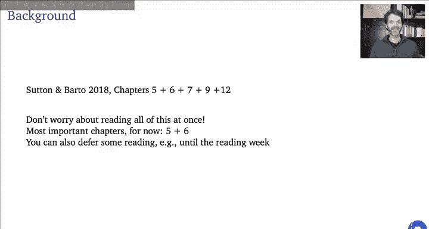

在本节课中，我们将学习无模型预测。我们将探讨如何在不了解环境内部模型（即马尔可夫决策过程）的情况下，仅通过与环境的交互来估计策略的价值函数。这是强化学习应用于现实世界问题的关键一步。

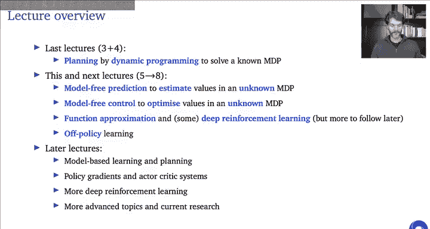

---

## 1. 引言与背景 📚

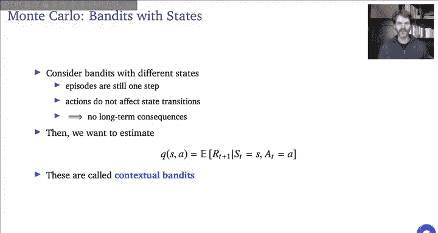

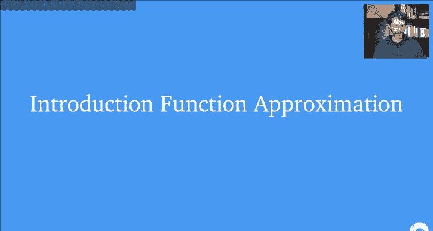

上一节我们介绍了基于动态编程的规划，它要求我们拥有环境的完整模型。本节中，我们将放松这个假设，转向**无模型**方法。

无模型预测的目标是：在无法直接访问环境动态模型，但可以通过交互获得经验样本的情况下，估计给定策略的价值函数。这是后续学习最优策略（即无模型控制）的基础。

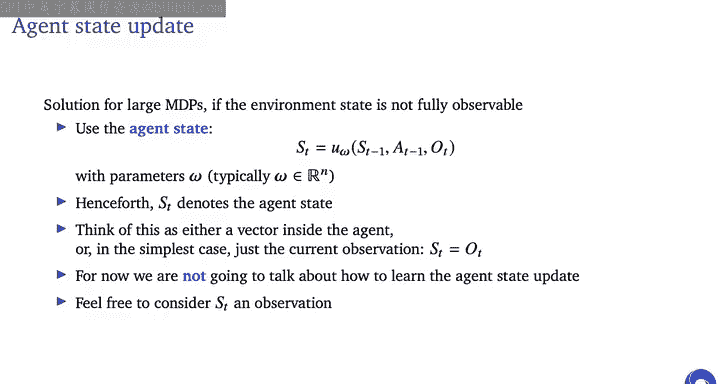

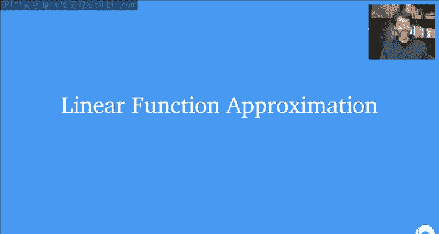

---

## 2. 蒙特卡洛方法 🎲

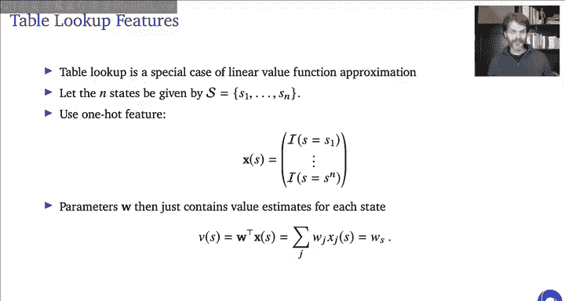

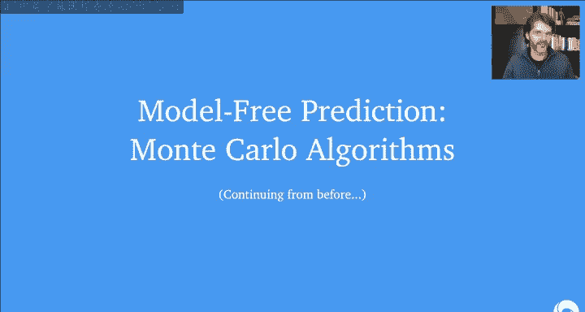

蒙特卡洛方法的核心思想是：通过采样完整的交互轨迹（称为“幕”或“回合”），并使用这些轨迹的回报来估计价值函数。

### 2.1 从多臂老虎机到状态老虎机

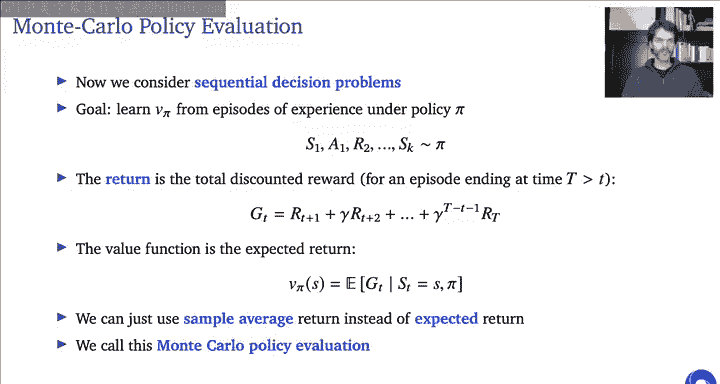

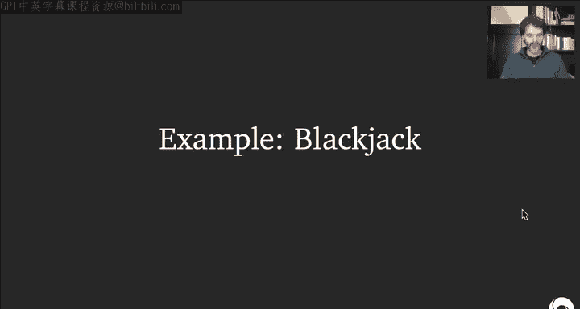

首先，回顾一个简单例子：多臂老虎机。我们的目标是估计每个动作的价值 `Q(a)`。其真实值是给定动作后的期望奖励：
`Q(a) = E[R | A = a]`

我们可以通过采样奖励并计算平均值来估计它。增量更新公式为：
`Q_{t+1}(A_t) = Q_t(A_t) + α * (R_t - Q_t(A_t))`
其中 `α` 是步长参数。当 `α = 1/N(A_t)` 时，此更新等价于计算算术平均。

现在，我们将其扩展到**状态老虎机**。此时，状态会变化，但动作不影响状态转移（即没有长期后果）。目标是估计给定状态和动作下的期望奖励 `Q(s, a)`。

### 2.2 引入函数近似

到目前为止，我们主要使用**查表法**，即为每个状态（或状态-动作对）存储一个独立的值。然而，当状态空间巨大时，这不可行。

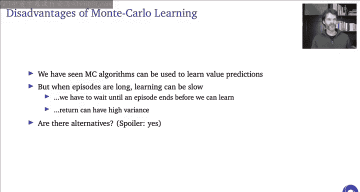

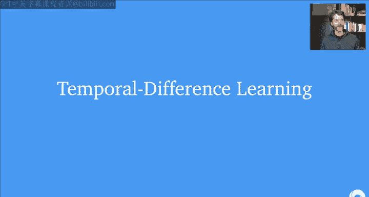

解决方案是使用**函数近似**。我们用一个参数化函数（如线性函数或神经网络）来表示价值函数，记为 `V_w(s)` 或 `Q_w(s, a)`，其中 `w` 是参数向量。更新参数 `w`，而非更新表格中的单个条目。

对于线性函数近似，我们假设有一个固定的特征映射 `x(s)`，将状态转换为特征向量。价值函数是参数与特征的內积：
`V_w(s) = w^T * x(s) = Σ_i w_i * x_i(s)`

我们的目标是最化预测值与真实价值之间的均方误差。使用随机梯度下降，参数更新规则为：
`w_{t+1} = w_t + α * (V^π(s_t) - V_w(s_t)) * x(s_t)`
当然，我们无法直接获得 `V^π(s_t)`，后续会讨论如何用采样目标替代它。

查表法是函数近似的特例：特征向量是状态的独热编码。

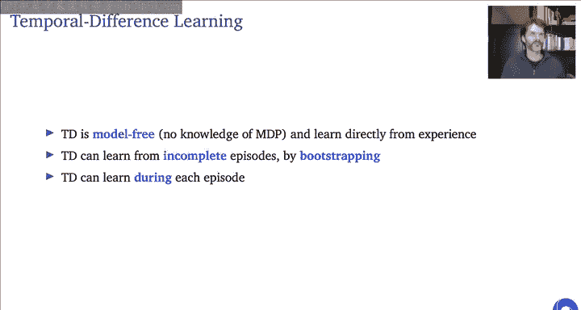

---

## 3. 时序差分学习 ⚡

蒙特卡洛方法必须等待整幕结束才能获得回报进行更新，这在长序列中效率低下。**时序差分学习** 通过**自举**解决了这个问题。

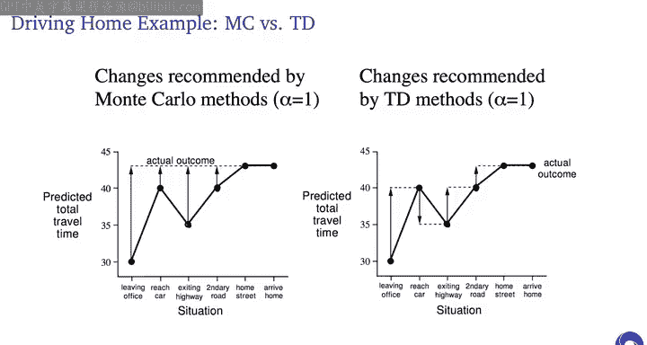

### 3.1 TD(0) 算法

回顾贝尔曼方程：`V^π(s) = E[R + γ * V^π(S') | S = s]`。TD学习将方程右侧的期望值替换为单次采样，并用当前价值估计 `V` 来近似 `V^π`，然后朝着这个目标做部分更新。

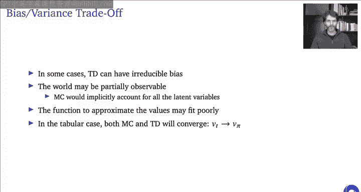

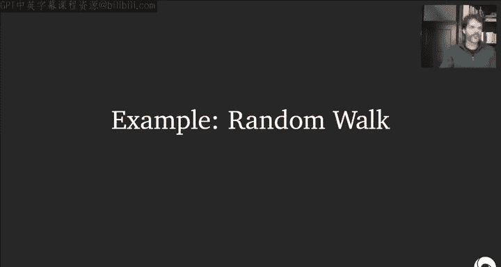

对于表格型方法，TD(0)更新为：
`V(S_t) ← V(S_t) + α * [R_{t+1} + γ * V(S_{t+1}) - V(S_t)]`
其中，`δ_t = R_{t+1} + γ * V(S_{t+1}) - V(S_t)` 称为**时序差分误差**。

将其扩展到动作价值函数，就得到了 **Sarsa** 算法：
`Q(S_t, A_t) ← Q(S_t, A_t) + α * [R_{t+1} + γ * Q(S_{t+1}, A_{t+1}) - Q(S_t, A_t)]`

### 3.2 与MC和DP的对比

以下是三种方法的比较：
*   **动态规划**：需要模型，使用自举，考虑所有可能的转移（广度）。
*   **蒙特卡洛**：无模型，不使用自举，采样完整轨迹（深度）。
*   **时序差分**：无模型，使用自举，采样单步转移。

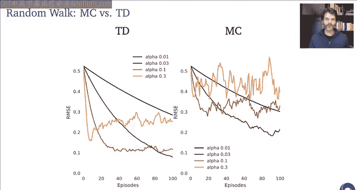

TD学习的优势在于：
1.  无需等待幕结束，可以在线学习。
2.  能处理非终止的持续环境。
3.  通常比蒙特卡洛方法具有更低的方差。

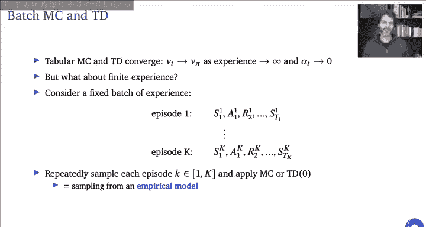

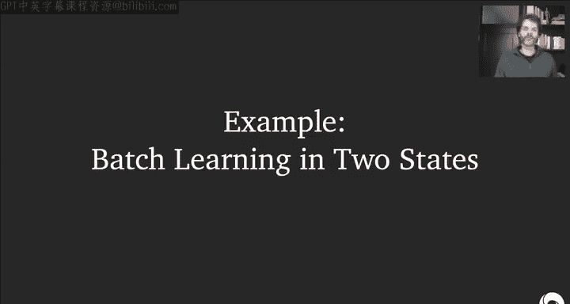

然而，TD学习因为使用自举而引入了**偏差**，且价值估计不准确时，信息在时间上反向传播较慢。

---

## 4. TD(λ) 与资格迹 🧵

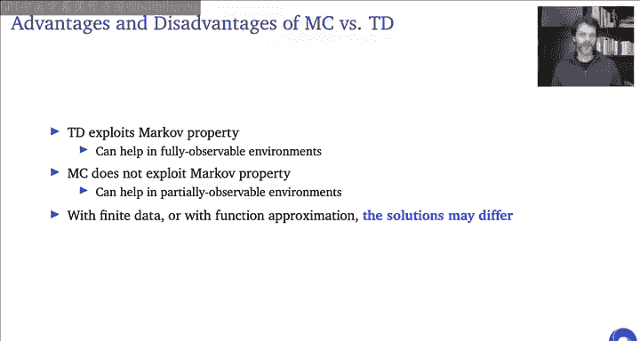

我们可以在一步TD（偏差大、方差小）和蒙特卡洛（偏差小、方差大）之间进行折中，这就是 **n步TD** 和 **TD(λ)** 方法。

### 4.1 n步回报

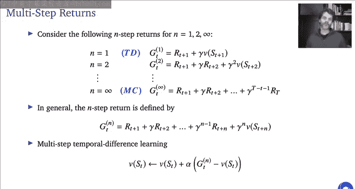

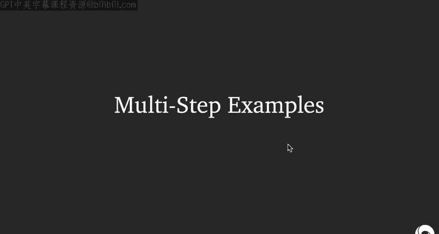

n步回报的定义如下：
`G_t^{(n)} = R_{t+1} + γ R_{t+2} + ... + γ^{n-1} R_{t+n} + γ^n V(S_{t+n})`
当 `n=1` 时，即为TD(0)；当 `n` 足够大直至幕结束时，即为蒙特卡洛。

### 4.2 λ回报与资格迹

λ回报 `G_t^λ` 是所有n步回报的指数加权平均，权重为 `(1-λ)λ^{n-1}`。当 `λ=0` 时，等价于TD(0)；当 `λ=1` 时，等价于蒙特卡洛。

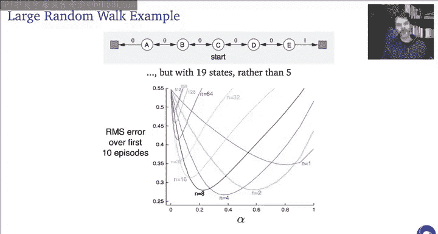

直接计算λ回报仍需等待幕结束。**资格迹** 提供了一种高效在线实现TD(λ)的机制。对于线性函数近似，资格迹 `e_t` 是一个向量，其更新规则为：
`e_t = γλ * e_{t-1} + x(S_t)`
参数更新规则为：
`w_{t+1} = w_t + α * δ_t * e_t`
其中 `δ_t` 是TD误差。资格迹追踪了最近访问过的状态特征，并根据时间和距离进行衰减，使得TD误差可以高效地分配给之前的状态。

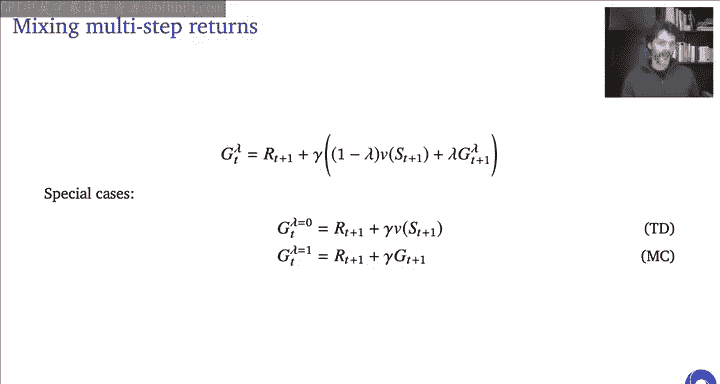

---

## 5. 不同方法的深入比较 ⚖️

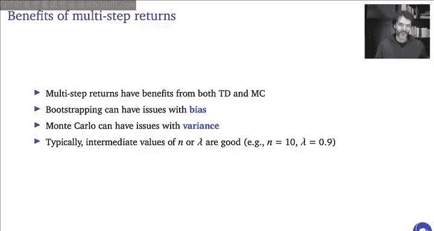

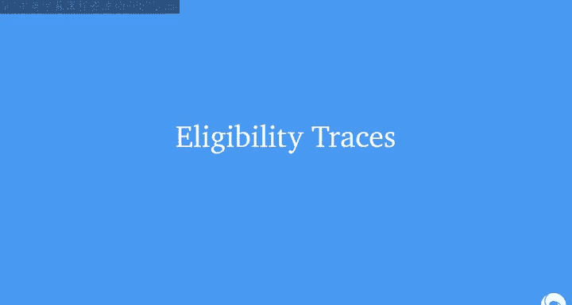

### 5.1 批量更新下的差异

考虑一个有限经验批次。在这个设定下：
*   **蒙特卡洛** 收敛于对观测回报的最小均方误差解。
*   **时序差分** 收敛于由经验数据构建的最大似然马尔可夫模型的解。

这意味着，在完全可观测的马尔可夫环境中，TD方法通常更有效，因为它利用了马尔可夫性。而在部分可观测或非马尔可夫环境中，蒙特卡洛方法可能更鲁棒，因为它不对状态信号的充分性做假设。

### 5.2 偏差-方差权衡

蒙特卡洛的回报是真实价值函数的无偏估计，但方差可能很高。TD(0)的目标是有偏的（除非价值函数已收敛），但方差较低。n步TD和TD(λ)通过选择中间范围的n或λ，试图在偏差和方差之间取得更好的平衡。

---

## 总结 📝

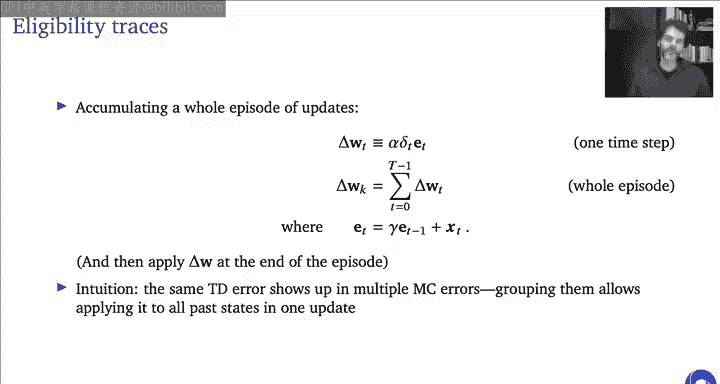

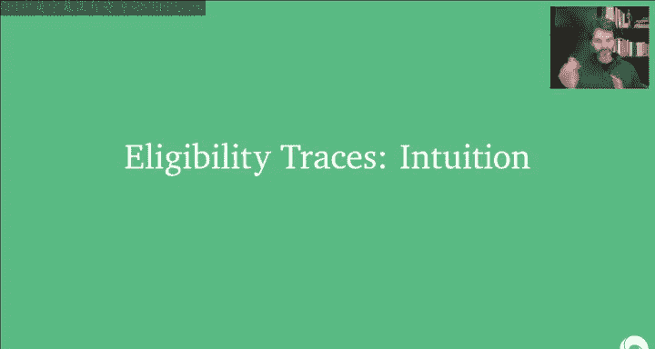

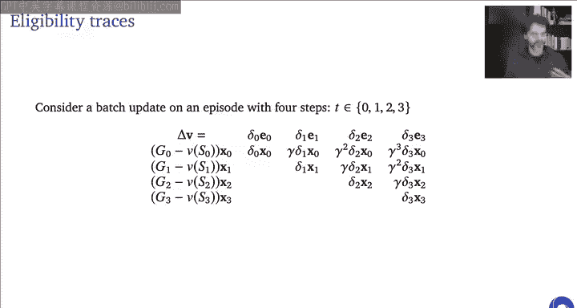

本节课中我们一起学习了无模型预测的核心方法。
1.  **蒙特卡洛方法**：通过采样完整幕的回报来估计价值，无偏但高方差，且学习速度慢。
2.  **时序差分学习**：通过单步采样和自举进行更新，可以在线学习，方差较低但有偏差，且信用分配较慢。
3.  **多步TD与TD(λ)**：折中了MC和TD的特性，通过使用n步回报或λ回报来平衡偏差和方差。
4.  **资格迹**：提供了高效在线实现TD(λ)的机制，能更快速地将时间上的误差信号分配回之前的状态。

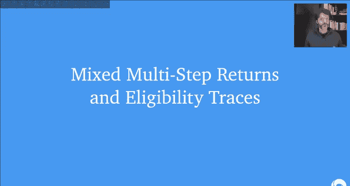

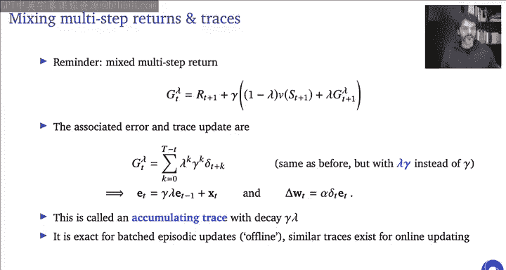

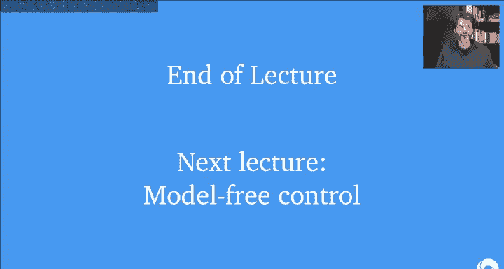

理解这些预测方法是学习下一课——**无模型控制**（即如何优化策略）的重要基础。