# 06：无模型控制 🎮

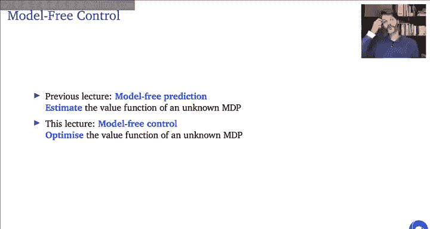


在本节课中，我们将学习如何在不依赖环境模型的情况下，直接通过与环境交互来优化智能体的策略。我们将从策略迭代的模型化版本出发，逐步推导出无模型的蒙特卡洛控制和时序差分控制算法，并探讨离策略学习、Q学习及其变种。

---

## 概述 📋

上一节课我们介绍了**无模型预测**，即如何在不了解环境动态的情况下，估计给定策略的价值函数。本节课，我们将在此基础上更进一步，探讨**无模型控制**。核心目标是**优化策略**，而不仅仅是评估它。我们将学习如何通过采样经验，直接改进策略，最终找到最优策略。

---

## 1. 蒙特卡洛控制 🎲

上一节我们介绍了无模型预测，本节中我们来看看如何利用它进行控制。我们首先回顾动态规划中的策略迭代方法，并将其改造为无模型版本。

### 1.1 策略迭代回顾

策略迭代包含两个交替进行的步骤：
1.  **策略评估**：计算当前策略 `π` 的价值函数 `Vπ`。
2.  **策略改进**：根据价值函数，改进策略（例如，使其对 `Vπ` 贪婪）。

在动态规划中，这两个步骤都依赖于已知的马尔可夫决策过程模型。为了做到无模型，我们需要用采样来近似这两个步骤。

### 1.2 从状态价值到动作价值

一个直接的挑战是：基于状态价值函数 `V(s)` 的贪婪策略改进需要模型，因为我们需要知道在状态 `s` 下采取每个动作 `a` 后的状态转移概率。

**解决方案**：转而估计**动作价值函数 `Q(s, a)`**。`Q(s, a)` 表示在状态 `s` 下采取动作 `a`，然后遵循策略 `π` 所能获得的期望回报。贪婪策略改进变得非常简单：在状态 `s` 下，只需选择 `Q(s, a)` 值最大的动作 `a`。

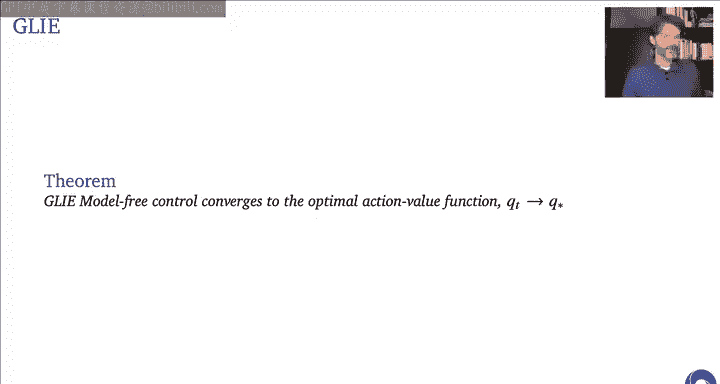

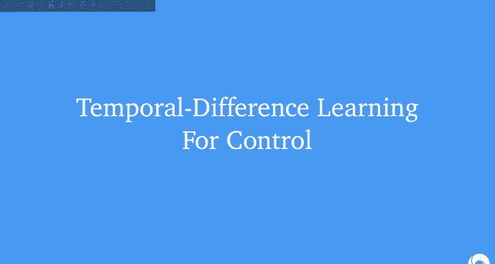

公式表示为：
`π'(s) = argmax_a Q(s, a)`

### 1.3 广义策略迭代与探索

如果我们简单地将蒙特卡洛预测用于策略评估，然后立即采用贪婪策略，会面临**探索不足**的问题：贪婪策略可能永远不会尝试某些状态-动作对，导致其 `Q` 值估计不准确，进而可能错误地排除最优动作。

**解决方案**：采用 **ε-贪婪策略** 进行策略改进。即以 `1-ε` 的概率选择贪婪动作，以 `ε` 的概率随机选择任意动作。这保证了持续的探索。

同时，我们也不再将策略评估进行到完全收敛，而是进行**广义策略迭代**：只对当前策略进行**部分评估**（例如，运行几个回合），然后立即进行**部分改进**（采用 ε-贪婪）。这种评估与改进的交错进行，在满足一定条件下仍能收敛到最优策略。

### 1.4 收敛条件：GLIE

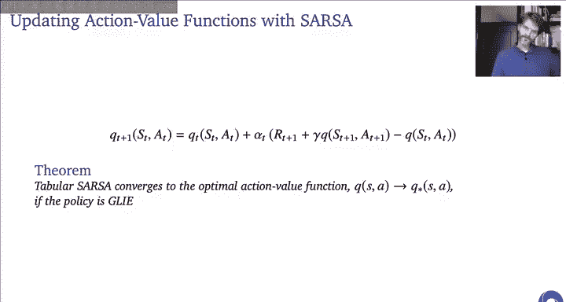

为了保证蒙特卡洛控制算法收敛，行为策略需要满足 **GLIE** 条件：
*   **无限探索**：每个状态-动作对都被访问无限次。
*   **贪心极限**：策略最终会收敛到一个贪心策略（例如，让 ε 随时间衰减到 0）。

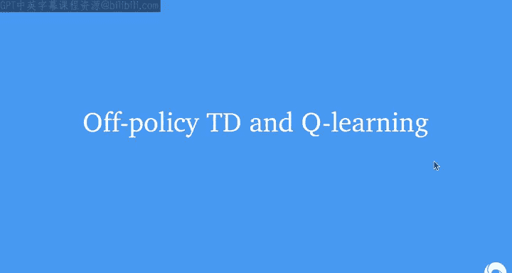

一个满足 GLIE 的策略示例是 ε-贪婪策略，其中 ε 按 `ε_k = 1/k` 衰减（`k` 是回合数）。

---

## 2. 时序差分控制 ⚡

上一节我们基于蒙特卡洛方法构建了控制算法，本节我们利用时序差分学习的优势来构建更高效的控制算法。

蒙特卡洛控制需要等到回合结束才能更新，而时序差分学习可以在每一步之后立即更新，学习更快，方差也更低。

### 2.1 SARSA 算法

SARSA 是一种**同策略**时序差分控制算法。其名称来源于更新所涉及的元素序列：`(S_t, A_t, R_{t+1}, S_{t+1}, A_{t+1})`。

其更新公式为：
`Q(S_t, A_t) ← Q(S_t, A_t) + α [ R_{t+1} + γ * Q(S_{t+1}, A_{t+1}) - Q(S_t, A_t) ]`

其中：
*   `α` 是学习率。
*   `γ` 是折扣因子。
*   `A_{t+1}` 是根据当前策略（如 ε-贪婪）在状态 `S_{t+1}` 下选择的动作。

SARSA 的本质是：用当前策略在下一步实际会采取的动作的价值，来估计当前状态-动作对的价值，并以此进行更新。

以下是 SARSA 的表格版本算法伪代码：

```
初始化 Q(s, a)，对所有 s ∈ S, a ∈ A
对每个回合：
    初始化状态 S
    根据 Q 派生的策略（如 ε-贪婪）选择动作 A
    对回合中的每一步：
        执行动作 A，观察奖励 R 和下一个状态 S'
        根据 Q 派生的策略（如 ε-贪婪）选择动作 A'
        Q(S, A) ← Q(S, A) + α [ R + γ * Q(S', A') - Q(S, A) ]
        S ← S', A ← A'
    直到 S 是终止状态
```

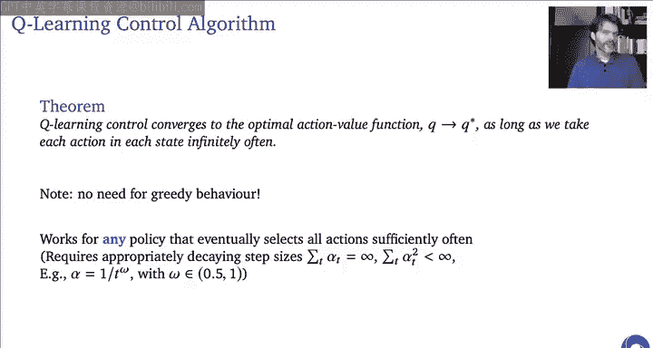

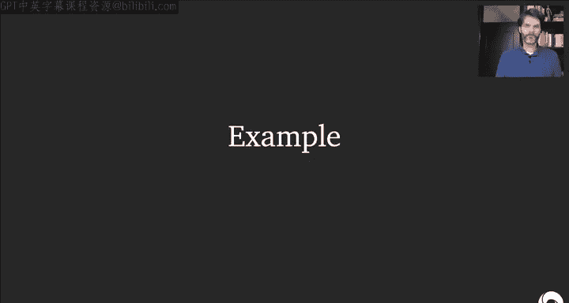

### 2.2 SARSA 的收敛性

与蒙特卡洛控制类似，要保证 SARSA 收敛到最优动作价值函数，行为策略也需要满足 GLIE 条件。

---

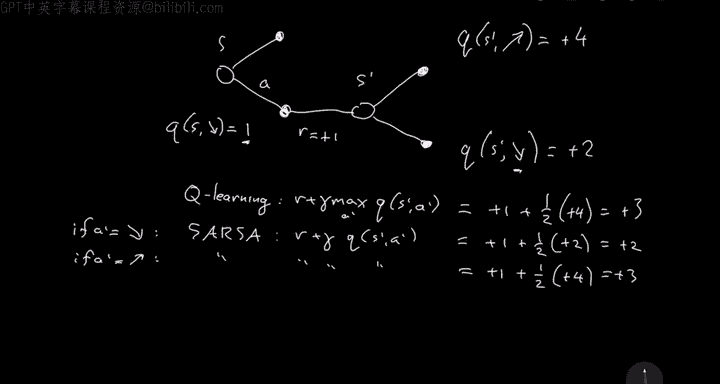

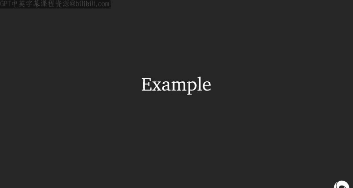

## 3. 离策略学习与 Q 学习 🧠

上一节介绍的 SARSA 是同策略算法，本节我们引入更强大的离策略学习概念，并重点学习著名的 Q-learning 算法。

### 3.1 同策略 vs. 离策略

*   **同策略学习**：评估和改进的策略与生成行为的策略是同一个。
*   **离策略学习**：评估和改进的策略（目标策略 `π`）与生成行为的策略（行为策略 `μ`）不同。

离策略学习的优势：
1.  可以从历史数据、专家演示或其他智能体的经验中学习。
2.  可以同时学习多个策略的价值。
3.  可以在遵循探索性行为策略（如随机策略）的同时，学习最优的贪婪策略。

### 3.2 Q-learning 算法

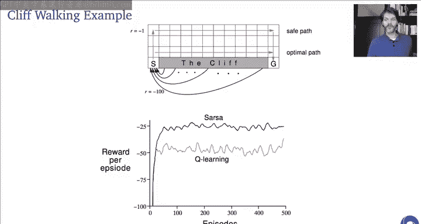

Q-learning 是一种**离策略**时序差分控制算法，也是最著名的强化学习算法之一。它的目标策略 `π` 是对当前 `Q` 值估计的贪婪策略，而行为策略 `μ` 可以是任何能充分探索的策略（如 ε-贪婪）。


其更新公式为：
`Q(S_t, A_t) ← Q(S_t, A_t) + α [ R_{t+1} + γ * max_a Q(S_{t+1}, a) - Q(S_t, A_t) ]`

关键区别在于更新目标：Q-learning 使用在下一状态 `S_{t+1}` 下所有可能动作中的**最大 `Q` 值**来构建目标，而不管行为策略实际会采取哪个动作。这相当于它假设在下一步会遵循贪婪的目标策略。

### 3.3 Q-learning vs. SARSA：悬崖行走示例

通过一个“悬崖行走”的网格世界示例，可以直观理解两者的区别：
*   **SARSA**：由于是同策略，它会考虑到行为策略（ε-贪婪）偶尔会随机选择动作而掉下悬崖的风险。因此，它学到的策略会倾向于走一条离悬崖稍远的“安全”路径。
*   **Q-learning**：作为离策略算法，它直接学习最优贪婪策略的价值。这个策略是贴着悬崖走的最短路径。但如果用 ε-贪婪策略执行，由于探索，偶尔会掉下悬崖，导致平均性能变差。

**结论**：SARSA 学到的策略更“稳健”，考虑了探索时的风险；而 Q-learning 学到的策略更“最优”，但执行时需要谨慎处理探索。

### 3.4 Q-learning 的收敛性

Q-learning 的收敛条件比 SARSA 更宽松：**只需要行为策略 `μ` 能无限次访问所有状态-动作对**，而不要求其最终变得贪婪。同时，学习率 `α` 需要满足 Robbins-Monro 条件（总和无穷，平方和有限）。

---

## 4. Q-learning 的改进：Double Q-Learning 🛡️

Q-learning 存在一个已知问题：它可能会**过高估计**动作价值。

### 4.1 过高估计的原因

Q-learning 的更新目标 `max_a Q(S_{t+1}, a)` 存在一个偏差：它使用相同的 `Q` 函数既**选择**最大值的动作，又**评估**该动作的价值。由于 `Q` 值估计存在随机误差（噪声），最大值操作更可能选中被正向高估的动作，然后用这个高估的值进行更新，导致偏差传播。

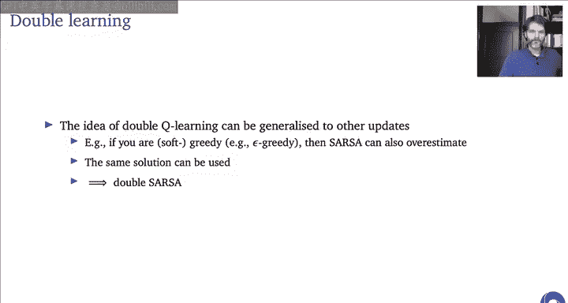

### 4.2 Double Q-Learning 解决方案

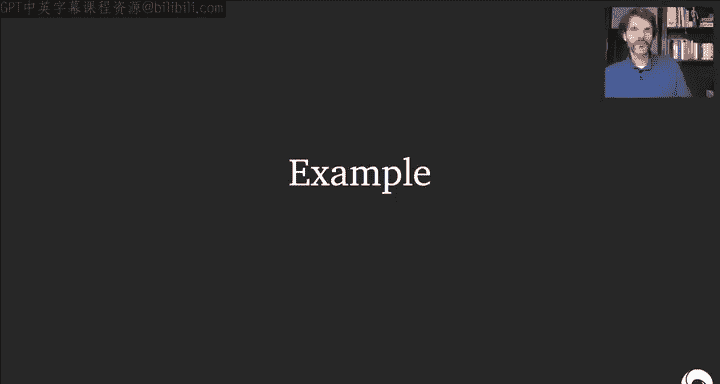

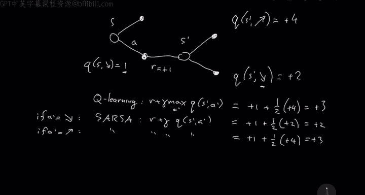

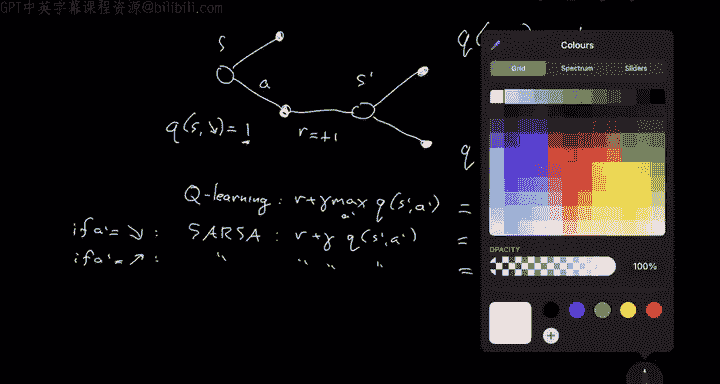

Double Q-Learning 通过维护两个独立的动作价值函数估计 `Q1` 和 `Q2` 来解决这个问题。更新时，随机选择一个函数（如 `Q1`）用于**选择**动作，用另一个函数（`Q2`）来**评估**该动作的价值。

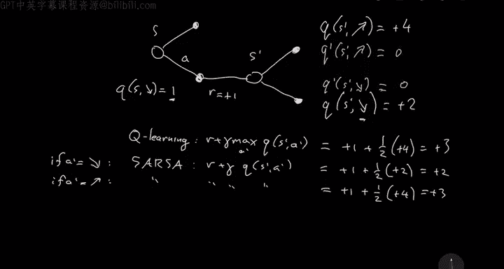

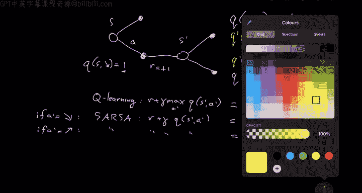

更新 `Q1` 的公式示例：
`A* = argmax_a Q1(S_{t+1}, a)`
`Q1(S_t, A_t) ← Q1(S_t, A_t) + α [ R_{t+1} + γ * Q2(S_{t+1}, A*) - Q1(S_t, A_t) ]`

通过这种解耦，选择动作时的高估与评估动作时的误差不再相关，从而显著减少了过高估计的偏差。Double Q-Learning 在实践中（尤其是在深度 Q 网络中）能带来显著的性能提升。

---

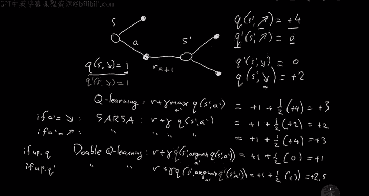

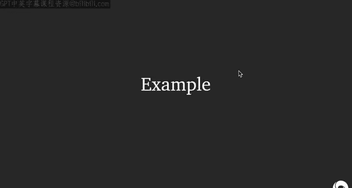

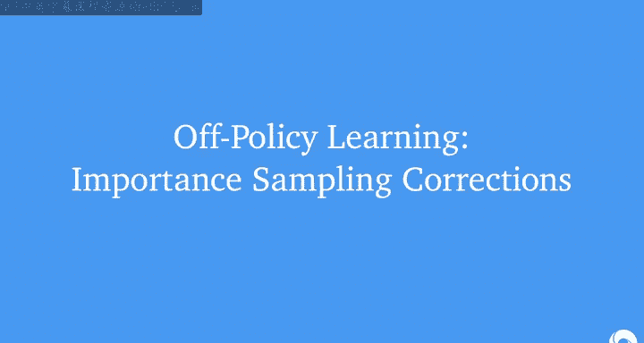

## 5. 通用的离策略学习：重要性采样 ⚖️

前面的 Q-learning 是一种特殊的离策略学习（目标策略是贪婪策略）。本节我们介绍一种适用于任何目标策略的通用离策略学习方法——重要性采样。

### 5.1 重要性采样原理

重要性采样是一种在分布 `P` 下估计期望 `E_{X~P}[f(X)]` 的技术，但我们只有从另一个分布 `Q` 中采样的数据。其核心是对样本进行加权：

`E_{X~P}[f(X)] = E_{X~Q} [ (P(X) / Q(X)) * f(X) ]`

权重 `P(X)/Q(X)` 称为**重要性采样比率**。它放大了在目标分布 `P` 中更常见、但在行为分布 `Q` 中罕见的样本。

### 5.2 在强化学习中的应用

在离策略蒙特卡洛预测中，为了估计目标策略 `π` 的价值，我们使用行为策略 `μ` 生成的轨迹，并对整个轨迹的回报 `G_t` 进行加权。权重是该轨迹在 `π` 下出现的概率与在 `μ` 下出现的概率之比。由于动态环境模型相同，这个比率简化为轨迹中每个动作选择概率的比值之积。

`ρ_t^T = Π_{k=t}^{T-1} (π(A_k|S_k) / μ(A_k|S_k))`
`V(S_t) ← V(S_t) + α [ ρ_t^T * G_t - V(S_t) ]`

这种方法方差可能很高，尤其是轨迹很长时。

### 5.3 离策略时序差分学习

我们可以将重要性采样应用于单步 TD 更新，从而得到方差更低的离策略 TD 算法。对于状态价值函数，只需要对当步的 TD 误差乘以单步重要性采样比率：

`ρ_t = π(A_t|S_t) / μ(A_t|S_t)`
`V(S_t) ← V(S_t) + α [ ρ_t * (R_{t+1} + γ * V(S_{t+1}) - V(S_t)) ]`

对于动作价值函数，有一个更优雅的算法叫 **Expected SARSA**。它使用目标策略 `π` 下下一状态的期望价值，而不是样本动作价值：

`Q(S_t, A_t) ← Q(S_t, A_t) + α [ R_{t+1} + γ * Σ_a π(a|S_{t+1}) * Q(S_{t+1}, a) - Q(S_t, A_t) ]`

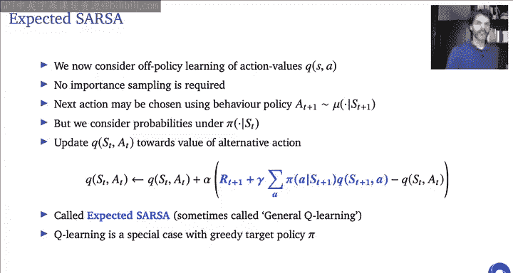


Expected SARSA 是更通用的算法：
*   当目标策略 `π` 是贪婪策略时，它退化为 **Q-learning**。
*   当目标策略 `π` 与行为策略 `μ` 相同，且使用单个样本来近似期望时，它退化为 **SARSA**。
*   它本身作为同策略算法时，比 SARSA 方差更低。

---

## 总结 🎯

本节课中我们一起学习了无模型控制的核心思想与方法：

1.  **核心框架**：我们将动态规划中的**策略迭代**和**价值迭代**思想迁移到无模型设置中，通过采样进行近似。
2.  **关键算法**：
    *   **蒙特卡洛控制**：基于回合更新，需要 GLIE 探索策略保证收敛。
    *   **SARSA**：同策略 TD 控制算法，学习当前行为策略的价值并进行改进。
    *   **Q-learning**：离策略 TD 控制算法的代表，直接学习最优贪婪策略的价值，是深度强化学习的基础。
3.  **高级主题**：
    *   **Double Q-Learning**：通过解耦动作的选择与评估，有效缓解 Q-learning 中的过高估计问题。
    *   **重要性采样**：为评估任意目标策略提供了通用工具。
    *   **Expected SARSA**：一个统一且低方差的算法框架，将 SARSA 和 Q-learning 囊括为特例。

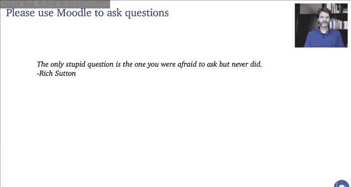

理解这些算法之间的联系与区别——特别是同策略与离策略、基于采样与基于期望的更新——是掌握无模型控制的关键。它们为后续处理大规模状态空间的函数近似方法奠定了坚实基础。