# 07：函数近似 🧠

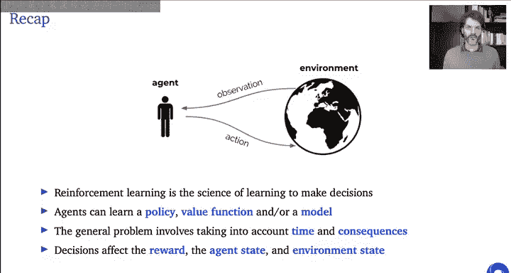

## 概述

在本节课中，我们将学习强化学习中的函数近似。我们将探讨为什么需要函数近似，介绍几种不同的函数近似方法，并深入讲解基于梯度的算法、线性函数近似以及深度强化学习的基础。我们还将讨论这些算法的收敛性与发散性问题。

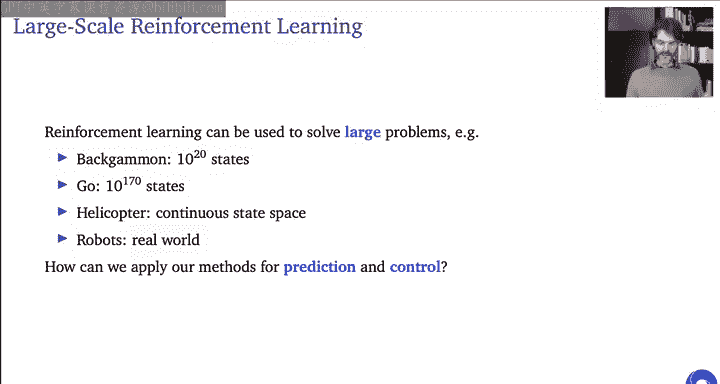

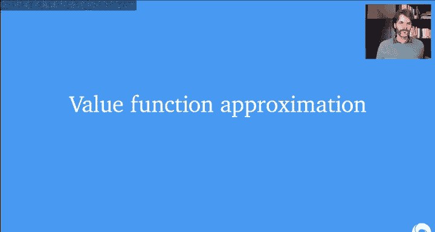

---

## 为什么需要函数近似？ 🤔

上一节我们介绍了强化学习的基本框架。本节中，我们来看看为什么需要函数近似。

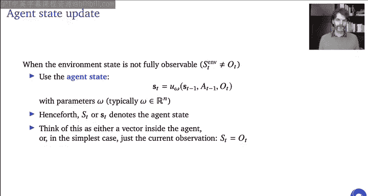

智能体内部的策略、价值函数和模型更新都可以被视为函数。例如，策略将智能体状态映射到动作，价值函数将状态映射到对未来累积奖励的估计值。我们希望从经验中学习这些函数。

使用函数近似有多个原因：
*   **灵活性**：通过经验学习规则比手动编码所有规则更灵活、更强大。
*   **处理大规模状态空间**：许多问题（如围棋、直升机控制）的状态空间是连续或极其庞大的，无法用查表法存储所有状态的价值。
*   **部分可观测性**：环境状态可能无法完全通过观测获得，我们需要对信息进行总结。

当使用神经网络来表示这些函数时，这个子领域通常被称为**深度强化学习**。

---

## 价值函数近似

到目前为止，我们主要考虑的是查表法。但在状态过多时，查表法存在内存不足、学习速度慢且无法利用状态间相似性（即泛化）的问题。

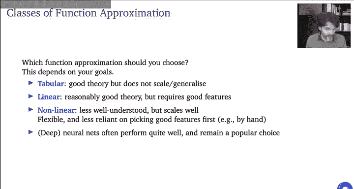

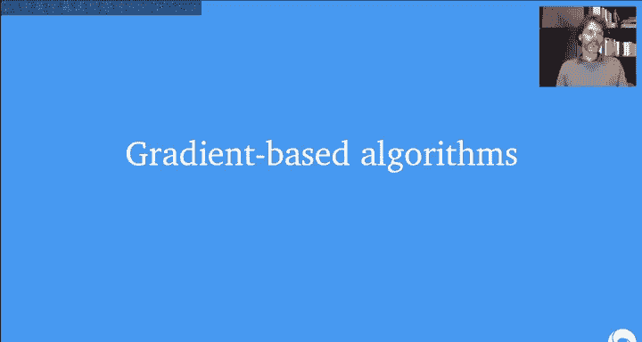

我们的解决方案是引入函数近似。在本讲座中，我们专注于价值预测。这意味着我们将引入一个参数向量 **w**，参数化价值函数：`V(s) ≈ V(s; w)`。然后，我们可以使用蒙特卡洛或时序差分等算法更新参数 **w**。如果函数类选择得当，我们将能够泛化到未见过的状态。

我们还需要简要提及**智能体状态更新函数**。在部分可观测环境中，观测可能不等于环境状态。因此，智能体需要维护一个内部状态，该状态更新函数 `s' = u(s, a, o; ω)` 也可以被参数化（参数为 **ω**），它可能包含记忆等功能。在后续的幻灯片中，提到的“状态”均指智能体状态。

---

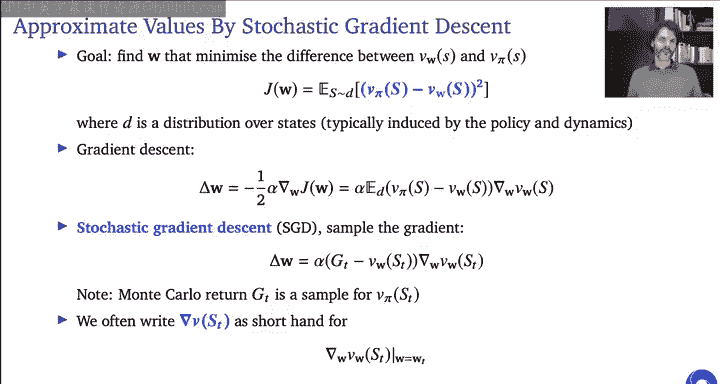

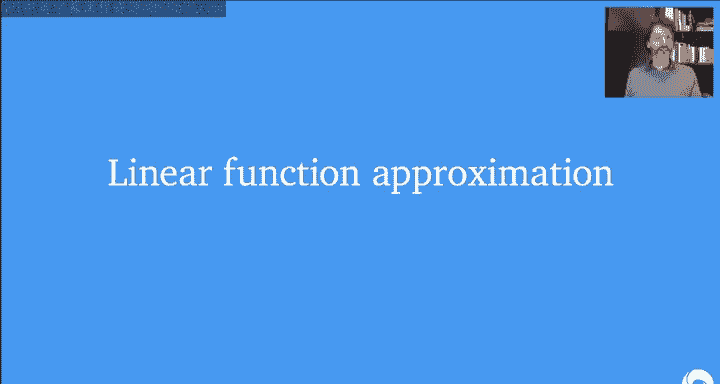

## 函数类别

以下是几种不同的函数近似类别：

*   **查表法**：每个状态有独立的条目。
*   **状态聚合**：将多个状态分组到同一个分区，共享价值估计。这是泛化的一种简单形式。
*   **线性函数近似**：假设有一个固定的特征映射 `x = φ(s)`，将状态映射到特征向量。价值函数是这些特征的线性组合：`V(s; w) = w^T · x(s) = Σ_i w_i · x_i(s)`。查表法和状态聚合都是线性近似的特例。
*   **可微函数近似**：价值函数是其参数 **w** 的可微（通常是非线性）函数，例如深度神经网络。这允许使用基于梯度的算法，并且非常灵活，减少了对手工设计特征的依赖。

强化学习的数据具有一些特定性质，可能会与函数类产生交互：
1.  经验并非独立同分布。
2.  智能体的策略会影响接收到的数据。
3.  回归目标通常是非平稳的（由于策略变化或自举）。
4.  环境本身可能非平稳或非常庞大。

选择哪种函数近似取决于目标：
*   **查表法**：理论完善，收敛稳定，但不泛化，无法扩展。
*   **线性近似**：理论较好，但依赖于手工设计的特征。
*   **非线性近似（如神经网络）**：理论理解较少，但扩展性好，在实践中通常表现优异，且对特征工程的依赖更少。

---

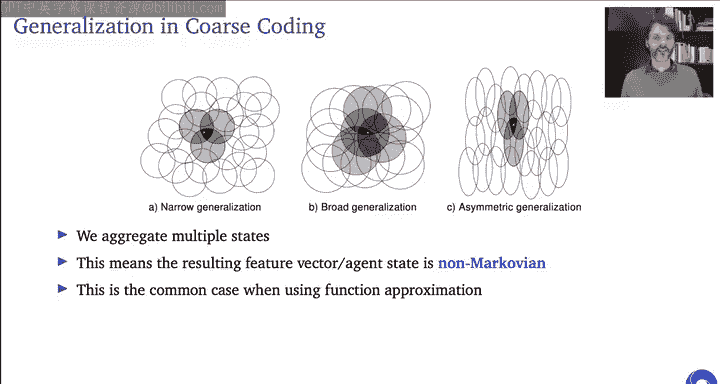

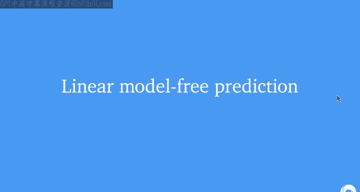

## 基于梯度的算法 ⚙️

上一节我们介绍了不同的函数类别。本节中，我们来看看如何用梯度下降法来学习这些函数的参数。

我们首先简要回顾梯度下降和随机梯度下降。目标是最小化某个标量函数 `J(w)`。梯度下降的更新规则为：
`w ← w - α · ∇_w J(w)`
其中 `α` 是步长。

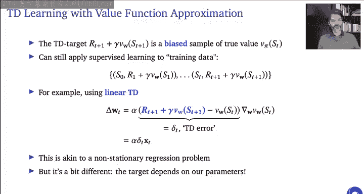

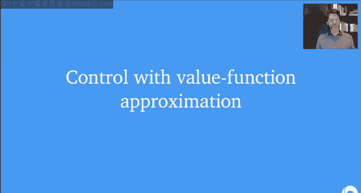

在价值函数近似中，我们可以定义目标函数为均方价值误差：
`J(w) = E_π[(V^π(s) - V(s; w))^2]`
其梯度为：
`∇_w J(w) = -2 E_π[(V^π(s) - V(s; w)) · ∇_w V(s; w)]`
使用随机梯度下降，我们采样状态 `s`，并用一个目标（如蒙特卡洛回报 `G_t`）代替真实价值 `V^π(s)`，得到更新：
`w ← w + α · (G_t - V(s_t; w)) · ∇_w V(s_t; w)`

对于时序差分学习，我们用TD目标 `r + γV(s'; w)` 代替 `G_t`，得到类似的更新形式。

在表示上，`∇_w V(s; w)` 常简写为 `∇V(s)`，意指关于参数 **w** 在当前位置的梯度。

---

## 线性函数近似深入

线性函数近似将状态表示为固定特征向量 `x(s)`。价值估计为 `V(s; w) = w^T · x(s)`。

**粗编码** 是构建特征的一种方法。它在状态空间上定义多个重叠的“感受野”（如圆圈）。对于一个给定状态，落入其内的感受野对应的特征值为1，否则为0（或根据距离给出连续值）。这样，更新一个状态的价值会影响到共享特征的其他状态，实现了泛化。

粗编码的性质受感受野大小影响：
*   **窄泛化**：感受野小，价值函数分辨率高，但学习可能较慢。
*   **宽泛化**：感受野大，学习更快，但最终价值函数的精度可能受限。

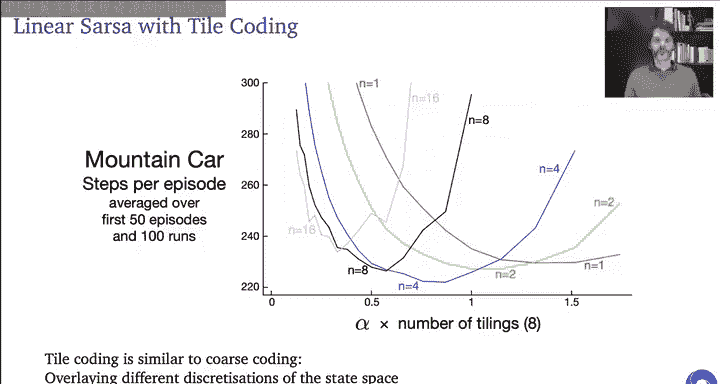

需要注意的是，使用函数近似（包括线性近似）后，智能体观察到的特征表示可能是**非马尔可夫**的，因为细微的状态变化可能不会立即反映在特征中。

---

## 线性模型无关预测

对于线性近似，我们可以显式地写出基于蒙特卡洛和时序差分的学习规则。

**蒙特卡洛线性策略评估**：
`w ← w + α · (G_t - w^T · x_t) · x_t`
其中 `x_t = x(s_t)`。蒙特卡洛回报 `G_t` 是真实价值 `V^π(s_t)` 的无偏估计。在适当条件下，该算法能收敛到全局最优解。

**时序差分线性策略评估**：
`w ← w + α · (r_t + γ w^T · x_{t+1} - w^T · x_t) · x_t`
TD目标 `r_t + γ V(s_{t+1})` 是有偏的。这引入了一个非平稳的回归问题，因为目标本身依赖于正在更新的参数 **w**。

---

## 基于价值函数近似的控制 🎮

控制算法可以自然地扩展到函数近似。我们进行某种形式的策略迭代，在策略评估步骤使用函数近似（如线性近似）来估计动作价值函数 `Q(s, a; w)`。

有两种常见方式用线性函数表示 `Q` 值：
1.  **动作输入**：特征向量同时依赖于状态和动作 `x(s, a)`，共享权重 `w`：`Q(s, a; w) = w^T · x(s, a)`。
2.  **动作输出**：特征向量仅依赖于状态 `x(s)`，但为每个动作 `a` 设置独立的权重向量 `w_a`，或者等价地使用一个权重矩阵 **W**：`Q(s, a; W) = x(s)^T · W e_a`，其中 `e_a` 是动作 `a` 的one-hot向量。

对于离散的小动作空间，动作输出法更常见（如DQN）。对于连续动作空间，动作输入法更可行。

我们可以将SARSA算法扩展到函数近似，使用线性SARSA学习 `Q` 值，然后进行 `ε-greedy` 策略改进。

---

## 收敛与发散 ⚖️

现在我们来讨论这些算法何时收敛，何时可能发散。

**蒙特卡洛** 与线性函数近似结合，在温和条件下能收敛到最小化价值误差的全局最优解。

**时序差分** 与线性函数近似结合，会收敛到一个不同的固定点，该点最小化的是**投影贝尔曼误差**。可以证明，TD解的渐近误差最多是蒙特卡洛最优误差的 `1/(1-γ)` 倍。

然而，当**函数近似**、**自举**和**离策略学习**三者结合时，TD学习可能**发散**。这被称为“致命三要素”。

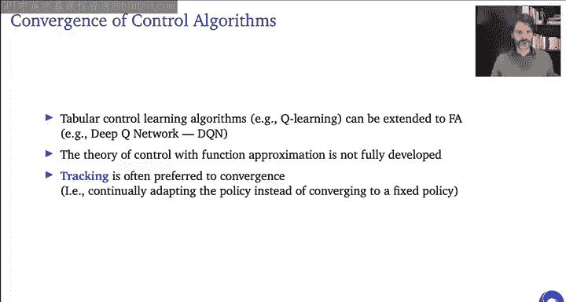

一个简单的发散例子：两个状态，单特征线性近似，只在第一个状态进行离策略TD更新，在 `γ > 0.5` 时，权重会增长至无穷。

避免发散的方法：
1.  **在策略学习**：线性TD在策略下通常收敛。
2.  **减少自举**：使用多步回报（较大的 `λ`）可以促进收敛。
3.  **使用查表法**：查表法下TD不会发散（但可能得到次优解）。

另一种思路是定义不同的目标函数，如最小化**贝尔曼残差**。但这会产生“双次采样”问题，且在实践中性能往往不如TD。

总结收敛性：
*   **在策略**：蒙特卡洛和TD（线性/非线性）通常表现良好。
*   **离策略**：蒙特卡洛（线性）仍可收敛，但TD（线性）可能发散。非线性情况下的理论更复杂。

对于控制算法，理论分析更加困难，因为策略在不断变化。即使算法不收敛，稳定的更新行为也很重要。

---

## 批处理方法 📦

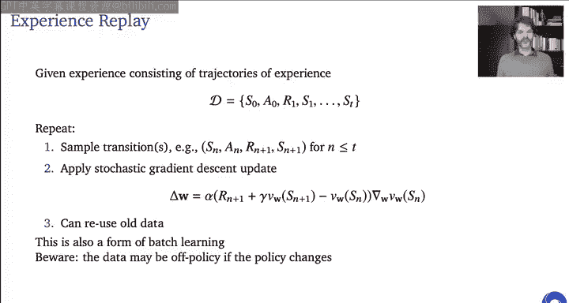

之前我们讨论了在线学习。本节中，我们来看看如何使用收集到的批数据更高效地进行学习。

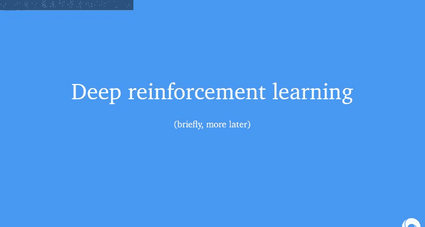

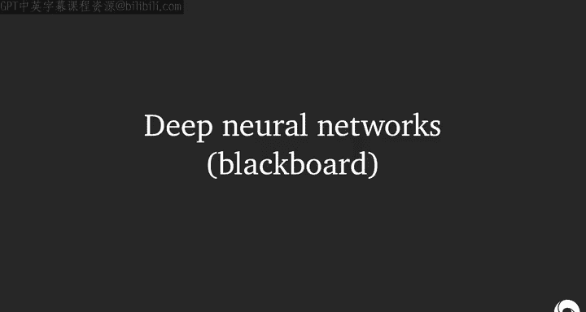

批处理试图从已有数据中提取更多信息，而不是每看到一个转移样本就进行一次增量更新后丢弃。

**最小二乘时序差分学习**：
对于线性近似，TD的固定点满足一个线性方程。LSTD直接基于已有数据求解这个方程：
`w = A^{-1} b`
其中 `A = Σ_t x_t (x_t - γ x_{t+1})^T`, `b = Σ_t r_t x_t`。
可以通过谢尔曼-莫里森公式在线更新 `A^{-1}`，避免每次重新求逆，将计算复杂度从 `O(n^3)` 降至 `O(n^2)`。

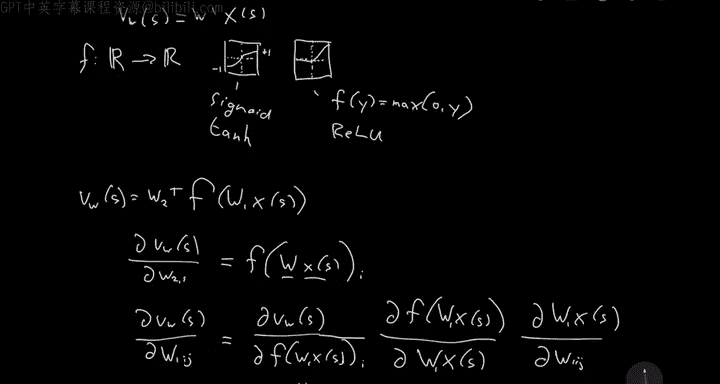

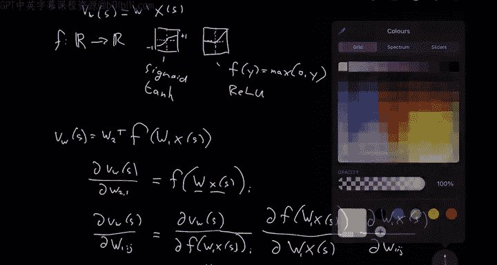

LSTD在极限下与TD收敛到相同的固定点。它可以扩展到多步回报和动作价值，进而与策略改进结合形成**最小二乘策略迭代**。

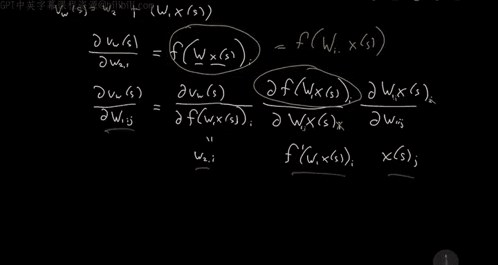

另一种批处理方法是**经验回放**：将经验存储在缓冲区中，然后从中重复采样进行梯度更新。这允许重用旧数据，进行多次更新。

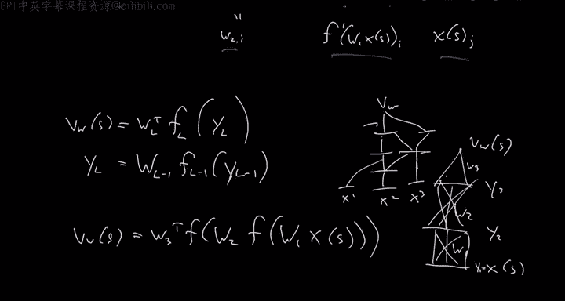

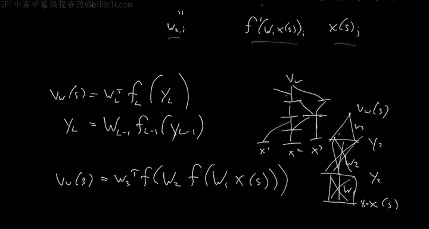

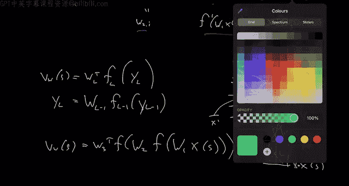

---

## 深度强化学习初探 🧠

最后，我们简要探讨深度强化学习，即将深度神经网络用作函数近似器。

神经网络由多层组成，每层包含线性变换和非线性激活函数（如ReLU）。通过自动微分，我们可以高效计算损失函数关于所有权重的梯度。

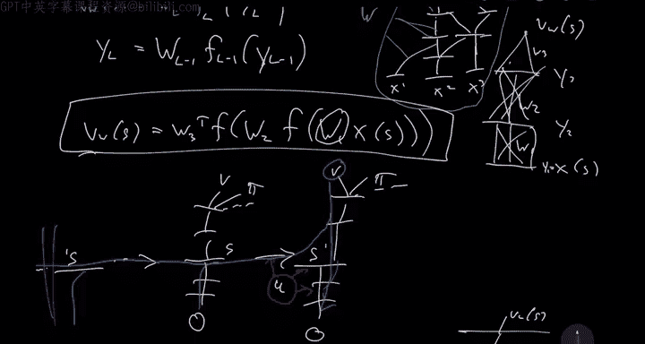

在强化学习中，我们可以用神经网络来表示价值函数 `V(s; w)` 或 `Q(s, a; w)`。更新时，只需将特征向量 `x` 替换为价值函数关于参数的梯度 `∇_w V(s; w)`，这个梯度可以通过反向传播自动计算。

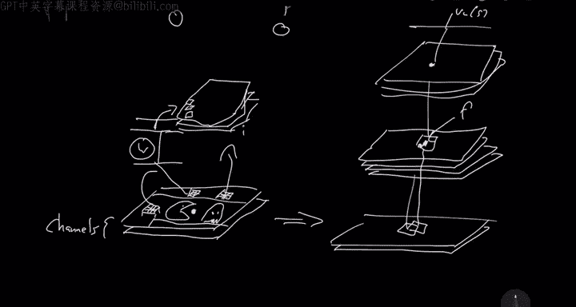

对于图像输入，常使用**卷积神经网络**。CNN通过卷积核在空间上共享权重，能有效处理图像等网格状数据，并引入平移不变性。

**深度Q网络（DQN）** 是一个里程碑式的算法，它使用CNN处理Atari游戏像素，并包含几个关键技巧：
1.  **经验回放**：存储并随机采样过去的转移，打破数据相关性，使学习更像监督学习。
2.  **目标网络**：使用一个独立的网络（参数为 `w^-`）来生成TD目标，并定期从在线网络同步参数。这稳定了学习目标。
3.  **专用优化器**：使用如RMSProp等优化器。

DQN的成功表明，通过精心设计（如经验回放和目标网络），可以使强化学习问题更接近深度网络擅长的监督学习设置。同时，也需要根据强化学习的特点调整网络架构和优化方法，这正是深度强化学习作为一个交叉领域的魅力所在。

---

## 总结

本节课中，我们一起学习了强化学习中的函数近似。
*   我们首先了解了在大规模或连续状态空间中，使用函数近似的必要性和优势。
*   接着，我们介绍了几种主要的函数近似方法，包括查表法、状态聚合、线性近似和可微非线性近似（如神经网络）。
*   我们深入探讨了基于梯度的学习算法，特别是线性函数近似下的蒙特卡洛和时序差分方法，并分析了其收敛性。
*   我们讨论了将函数近似应用于控制问题的方法。
*   我们重点分析了时序差分学习中可能出现的发散问题，即“致命三要素”（函数近似、自举、离策略），以及如何缓解。
*   我们介绍了批处理方法，如最小二乘时序差分学习和经验回放，以提高数据效率。
*   最后，我们初步了解了深度强化学习，特别是DQN算法如何利用神经网络、经验回放和目标网络等技巧来解决复杂的RL问题。

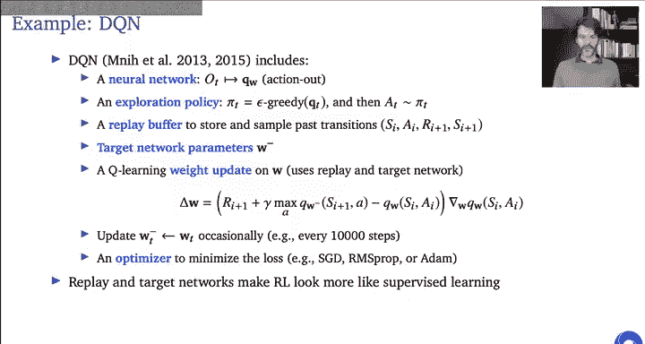

函数近似是使强化学习能够应用于现实世界大规模问题的关键。理解不同方法的特性、优势以及潜在的收敛问题，对于设计和应用有效的强化学习算法至关重要。