# 08：规划与模型 🧠

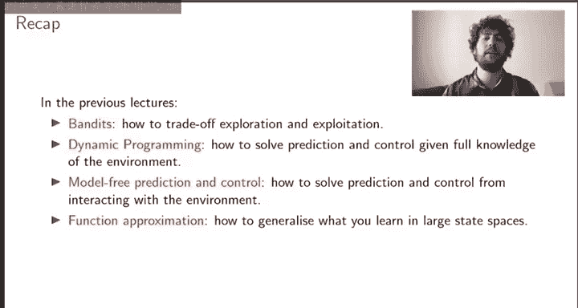

在本节课中，我们将要学习强化学习中的模型与规划。我们将探讨如何学习环境模型，以及如何利用这些模型进行规划，从而更高效地学习价值函数和策略。

---

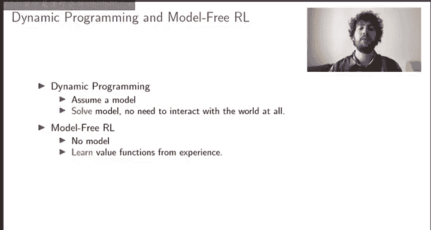

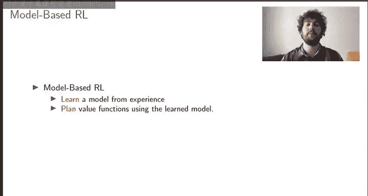

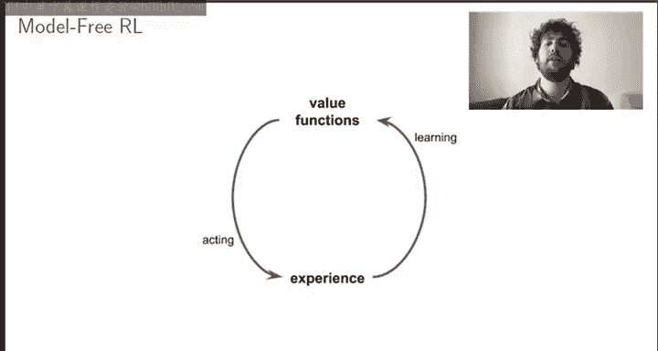

在之前的几讲中，我们已经涵盖了大量内容。我们从多臂老虎机问题开始，这是一个简化的强化学习问题，允许我们暂时忽略决策的顺序性，专注于探索与利用的权衡。

接着，我们讨论了动态规划和免模型算法，这是解决预测和控制问题的两大家族方法，无论我们是否拥有环境的完整描述。

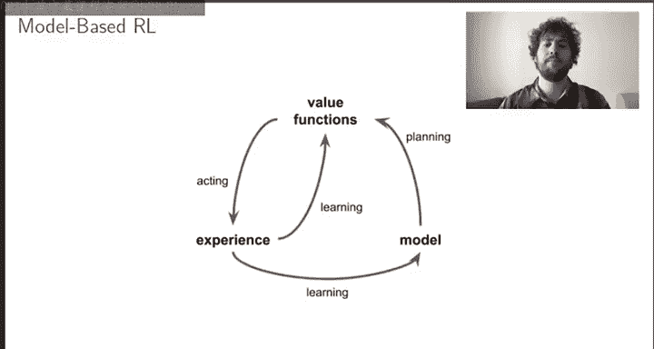

最后，我们介绍了函数逼近，这是将这些方法扩展到具有巨大甚至连续状态空间场景的主要途径。

回顾动态规划和免模型算法，我们可以大致勾勒出两者的基本原理和差异。在动态规划中，我们假设拥有对环境动态（包括状态转移和奖励动态）的完整、精确描述的“特权”访问权。我们只需要对这个完美模型进行求解，完全不需要与真实环境交互。

而在免模型算法中，我们不依赖任何给定的模型，而是直接从与环境的交互中学习价值和策略。

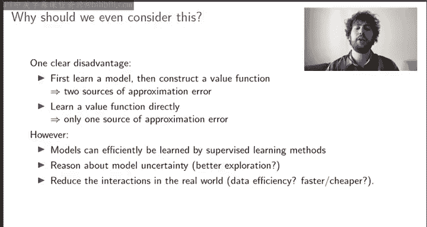

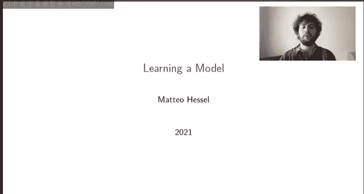

在这两个极端之间，存在第三种典型的算法家族，通常被称为**基于模型的强化学习**。

---

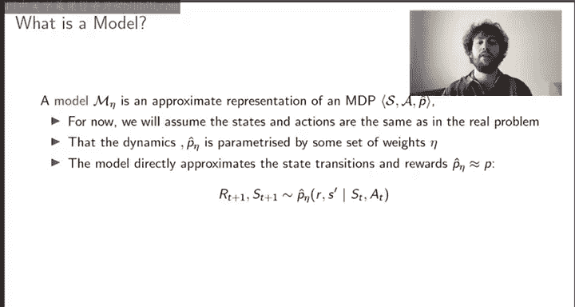

## 什么是模型？📊

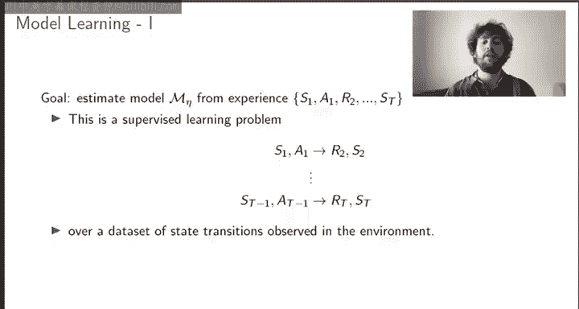

在基于模型的强化学习中，我们没有被给予一个完美模型，但我们尝试在与环境交互的同时，至少学习一个近似模型。然后，我们使用这个学习到的模型来推导价值和策略。

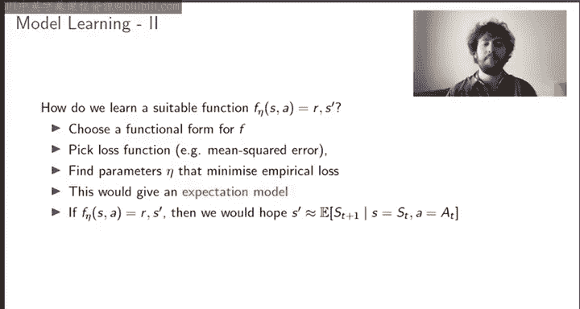

一个免模型算法的可视化描述可以看作实现这样一个循环：我们根据当前的价值估计和策略采取行动以生成经验，然后我们使用这些经验直接更新我们的价值和策略。

相反，基于模型的算法会在这个循环中添加一个间接步骤：我们像免模型RL一样，根据当前的价值估计和策略行动，但我们使用由此产生的经验来学习状态转移和奖励动态的模型。然后，我们可以使用学习到的模型（而不是直接使用经验）来更新价值和策略，从而仍然完成闭环。

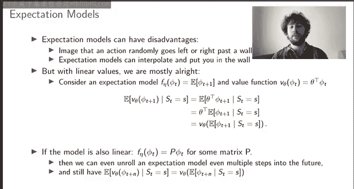

当然，这两类算法之间的界限并非绝对严格。我们可以完美地想象将两种思想结合起来，既使用经验更新价值，又学习模型，然后仍然可以使用模型执行额外的更新来优化我们的价值估计。今天我们将讨论这种思想的一个流行实例，即 **Dyna** 算法。

---

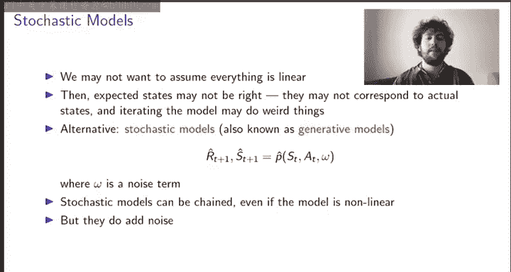

## 为何使用基于模型的方法？🤔

在深入新主题之前，停下来反思一下思想背后的动机总是好的。例如，这种攻击方式有明显的缺点。如果我们先学习一个模型，然后用它来规划价值函数，就会有两个误差来源：因为我们从数据中学到的任何模型都可能不完美，它会包含某些近似或误差，这些误差会与使用模型规划价值时产生的额外误差叠加。

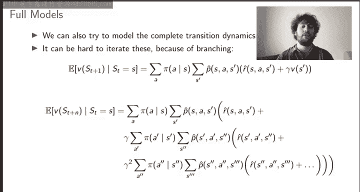

相比之下，如果你考虑免模型算法，它们使用总是正确的真实数据来更新价值，因此只有一个近似来源，即价值估计过程本身。

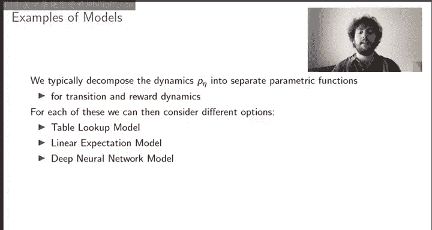

尽管如此，仍有理由相信基于模型的强化学习可能非常有效。第一个原因是模型可以用监督学习方法学习，这些方法非常成熟、强大且有效。此外，显式表示模型可以让我们获得额外的能力，例如用它们来表示不确定性或驱动探索。最后但同样重要的是，在许多现实世界场景中，通过与环境交互生成数据要么成本高昂，要么速度缓慢，或者两者兼而有之。而计算成本正逐年降低，因此使用模型执行额外的更新可以让我们用计算来换取所需环境交互次数的减少，这将使我们的算法更具数据效率，从而扩展我们可以成功应用它们的问题范围。

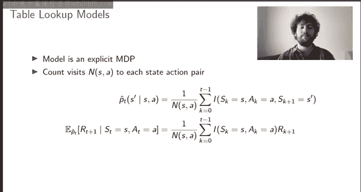

---

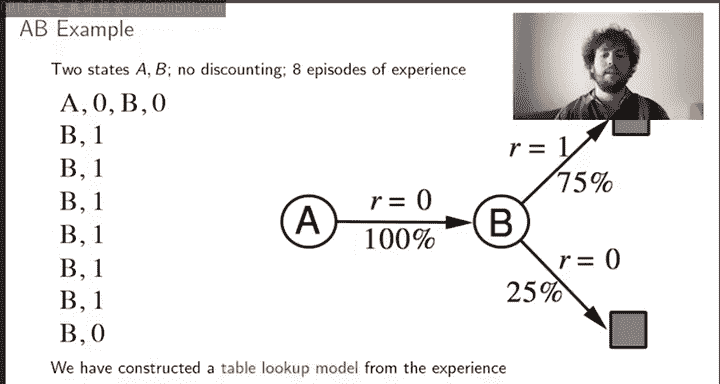

## 学习模型 🏗️

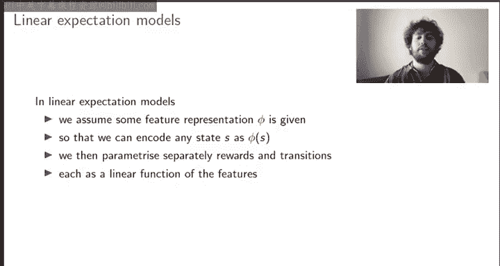

现在，我们首先进行一些基础工作，讨论不同类型的学习模型以及如何训练它们，然后才会深入具体的规划算法。

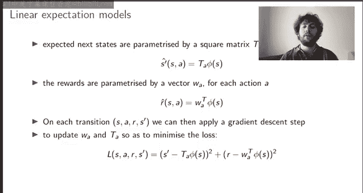

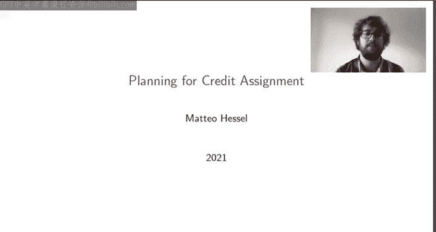

如果我们打算学习一个模型并用它进行规划，首先要讨论的是模型本身由什么构成。

在本课程中，模型将是MDP的一个近似表示。目前，我们假设MDP的环境动态将由一个带有参数 θ 的参数化函数来近似。模型中的状态和动作与真实环境中的相同。此外，我们假设给定状态和动作，从模型中采样将估计我们在真实环境中执行相同动作时可能得到的即时后继状态和即时奖励。

需要认识到，这并不是对模型最一般的描述。我们可以考虑其他与此相关但不同的模型类型，我们将在后续讲座中讨论其中的一些，例如非参数模型（直接使用数据来采样环境转移）和反向模型（例如，建模一个“迷你宇宙”MDP的动态，而不是你直接感兴趣的MDP），以及跳跃模型（其中的动作不直接映射到MDP中的原始动作集）。我们稍后会讨论其中的一些，但现在让我们专注于最简单的扫描模型，因为这已经足以讨论相当广泛的思想并支持一系列规划算法。

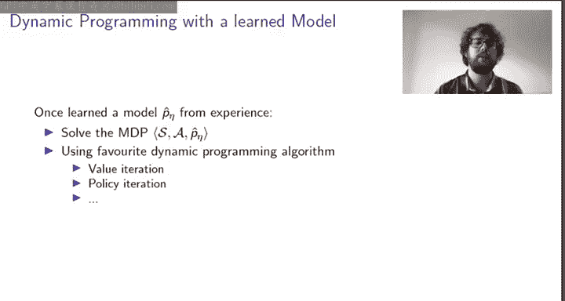

有了这些前提，从经验中学习模型的问题基本上可以表述为一个监督学习问题，其中我们的数据集包含一组状态-动作对，这些对的标签是我们在那些状态下执行那些动作时将观察到的真实状态和奖励。然后，模型的参数必须像标准监督学习一样选择，以最小化这些数据上的某些预测误差。

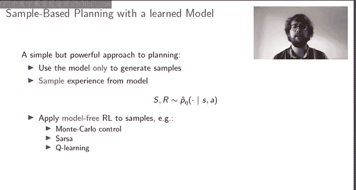

定义学习模型的程序将归结为：为转移和奖励函数选择一个合适的参数化函数，选择一个合适的损失函数进行最小化，并选择一个优化参数的程序以最小化这个损失。

例如，我们可以选择使用从状态和动作的合适编码到奖励和某种后继状态编码的线性映射来参数化转移和奖励。然后，最小化参数可以通过使用最小二乘法来实现。这将给我们一个**期望模型**，具体来说是一个线性期望模型。

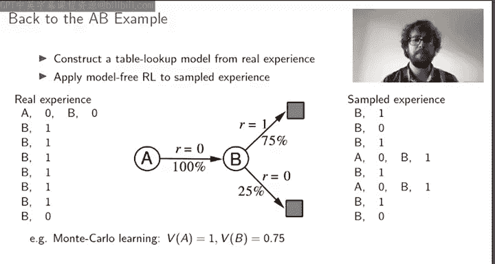

请注意，这不是我们可以考虑的唯一一种期望模型。例如，使用相同类型的损失（均方误差），我们可以用深度神经网络来参数化模型本身（包括奖励和转移），并可能使用梯度下降而不是最小二乘法来优化参数。

---

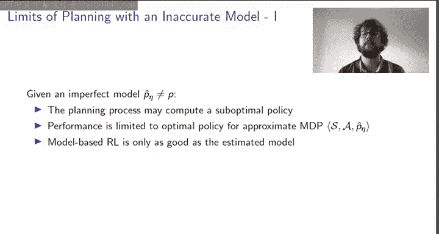

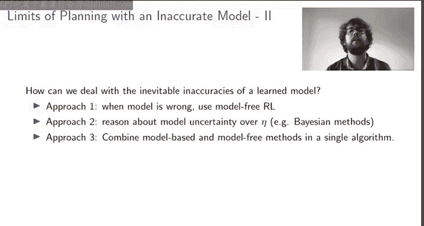

### 期望模型的优缺点 ⚖️

无论参数化的具体选择如何，理解期望模型的一般优缺点都是有益的。一些缺点相当明显。假设你有一个宏动作，随机将你置于某堵墙的左侧或右侧，那么一个期望模型可能会把你放在墙里面，这首先可能不是一个物理上有意义的预测。

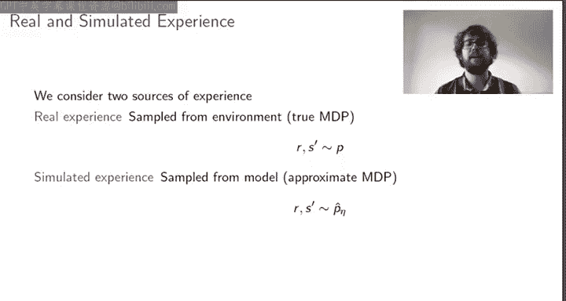

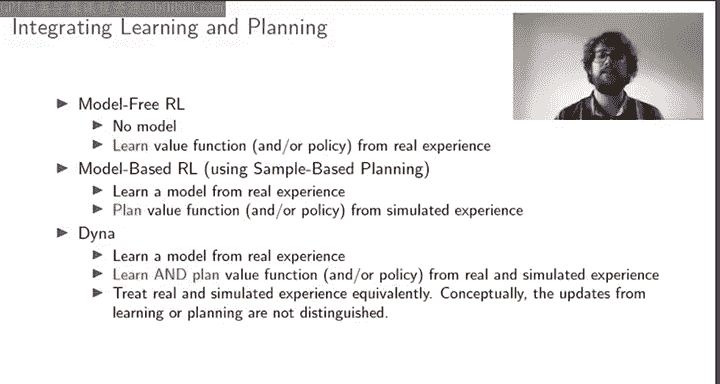

然而有趣的是，其价值可能仍然是正确的。如果价值特别是状态的线性函数或其编码的线性函数，那么线性变换实际上可以与期望交换，因此，下一个状态的期望价值实际上与期望下一个状态的价值相同，即使期望状态可能有一些奇怪的特征，比如把你放在墙中间。这实际上与模型本身的参数化无关，它只要求价值是其状态表示的线性函数。

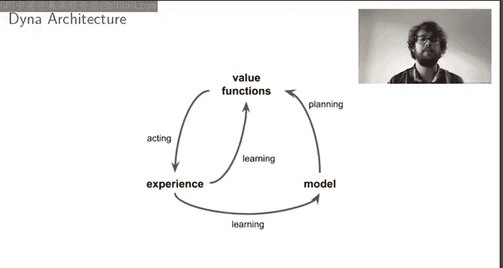

此外，如果价值和模型都是线性的，那么即使将模型向前展开多步，这个性质也成立，这是一个相当强大和有趣的性质。

我们可能仍然不愿意接受这种权衡，可能无法使价值或模型成为线性的。在这种情况下，期望状态可能不是正确的选择，因为我们从期望状态估计的价值可能没有正确的语义，我们可能无法从期望状态推导出期望价值。在这种情况下，我们可以考虑一种不同类型的模型，即所谓的**随机生成模型**。

---

### 生成模型与分布模型 🎲

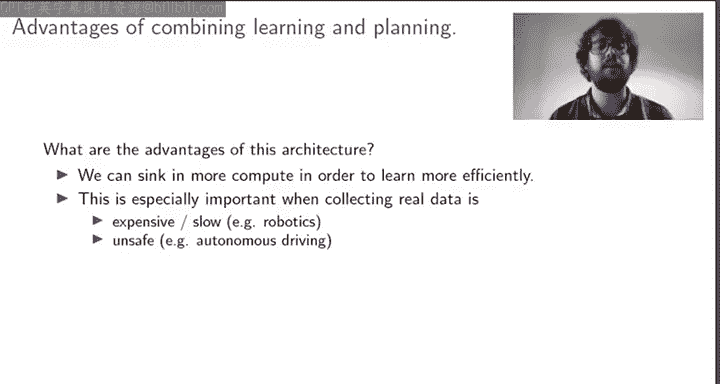

生成模型生成的不是期望（像期望模型那样），而是样本。它以状态、动作和一个噪声变量作为输入，并返回一个可能的下一个状态和可能奖励的样本。如果我们能有效地训练一个生成模型，那么我们可以在想象中进行规划，例如，生成环境中假设转移的长序列，并比较它们以选择最佳行动方案。即使模型和价值都不是线性的，也可以做到这一点。当然，反面是生成模型通过采样过程增加了噪声。

还有第三种选择，即实际尝试对完整的转移动态进行建模，对完整的转移分布和奖励分布进行建模。如果我们能做到这一点，实际上期望模型、生成模型甚至价值本身都可以作为我们完整转移和奖励模型的副产品推导出来。问题在于，对完整分布进行建模可能很困难，或者由于分支因子，实际应用在计算上可能不可行。

例如，如果我们试图估计下一个状态的价值（一步前瞻），这仍然需要对所有动作求和，并且对于每个动作，对所有可能的后继状态求和。如果我们甚至想前瞻多步，情况会呈指数级恶化。因此，即使我们拥有这个完整的分布模型，对于大多数感兴趣的问题，可能仍然需要某种形式的采样。在这种情况下，与仅仅使用生成模型相比，完整分布的优势可能更小。

---

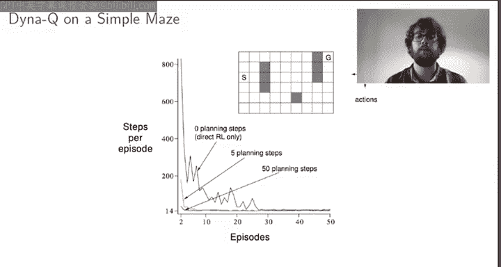

### 模型的参数化选择 🔧

除了我们可能想要训练的模型类型之外，还有第二个重要的维度，即我们如何参数化模型本身。一个非常常见的选择是首先将奖励和转移的动态分解为两个独立的参数化函数。然后，对于每一个，我们可以在许多不同的参数化中进行选择。在本课程中，我们将考虑查表模型、线性期望模型，最后还有深度神经网络模型。

在查表情况下，模型是MDP的显式表示。例如，我们可以根据过去经验的经验概率来估计给定状态-动作对观察到给定后继状态的概率。类似地，我们可以将奖励函数参数化为在给定状态下执行给定动作时实际观察到的奖励的经验均值。在这种情况下，我们实际上会得到一个混合模型，因为我们的查表模型会对转移动态使用完整分布，而对奖励使用期望模型。当然，也可以对奖励本身的完整分布进行建模。

---

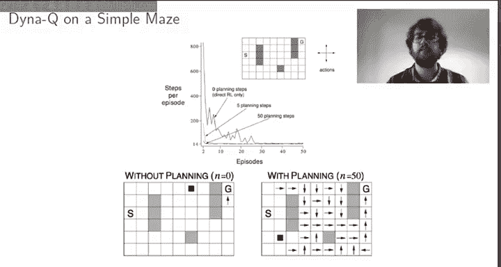

## 使用模型进行规划 🗺️

我们现在准备深入本主题的核心，即如何实际使用模型进行规划，特别是本节中如何为了改进我们的价值函数估计和策略而进行规划。

规划和基于模型RL的核心价值主张，是通过消耗计算能力但不要求实际环境交互来改进价值估计和策略的能力。你可能记得，动态规划实际上是我们已经见过的允许我们做到这一点的过程的一个好例子。问题当然在于，在动态规划中，我们被赋予了访问环境完美描述的“特权”，但在一般的强化学习中，我们实际上感兴趣的是不做出这种假设的规划算法，例如使用学习到的模型（如我们在上一节讨论的任何一种）进行规划。

在这种情况下，绕过动态规划这一限制的最简单方法可能就是直接镜像动态规划算法，但插入一个学习到的模型来代替环境的特权描述。如果我们这样做，那么我们可以用你喜欢的任何动态规划算法（例如价值迭代或策略迭代）来求解这个近似的MDP。这样做，我们仍然需要与环境进行一些交互，因为我们仍然需要学习模型，但至少希望我们能大大减少对真实交互的依赖，从而提高数据效率。

这种方法实际上可以奏效，并且是值得考虑的一个合理选择，但它也不是唯一的选择。例如，我们可以走另一条路，将学习到的模型不是与动态规划结合，而是与我们在免模型智能体背景下讨论的思想和算法结合。这也被称为**基于样本的规划**。

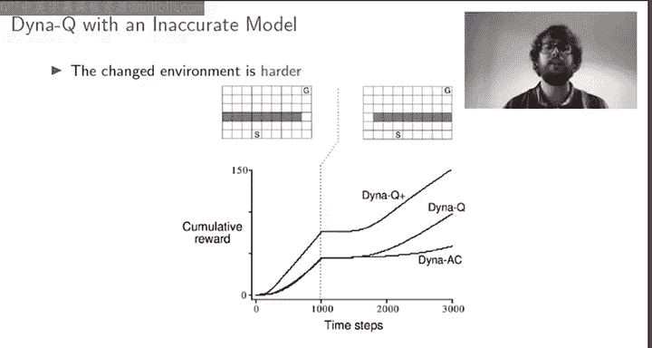

---

### 基于样本的规划 📈

它非常简单，通过使用学习到的模型来采样想象的转移和轨迹，然后将你最喜欢的免模型算法应用于想象的数据，就像它是真实数据一样。例如，你可以应用蒙特卡洛控制、SARSA或Q学习，并对从你学习到的近似MDP中采样的想象数据应用相同的更新，就像它是从环境中采样的真实数据一样。

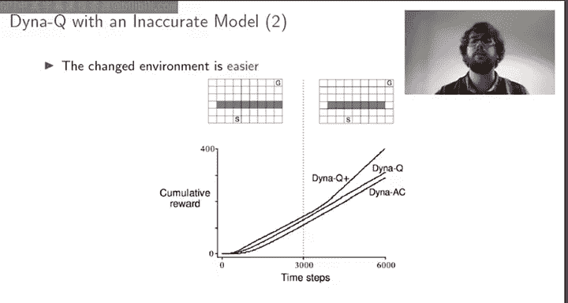

让我们考虑一个具体例子来澄清这一点。这是我们在上一节讨论的同一个例子。在左边，我们可以访问真实经验：八个回合，大多数从状态B开始，然后观察到0或1的奖励，实际上有一个从状态A开始，首先转移到B。中间是我们从这些数据中学到的查表模型：从A到B的转移概率为100%，在B终止的概率为100%，但有75%的概率获得奖励1，25%的概率获得奖励0。基于样本的规划将采用这个模型，然后从中采样轨迹（回合）。例如，这可能是我们在右边报告的数据：所有这些数据都是从我们学习到的模型中采样的。例如，我们现在有两个从A开始的回合，由于模型的强制，两者都转移到了B，然后在这种情况下，两个回合在B时都采样到了奖励1，加上一些从B开始并立即终止的回合，同样与模型一致。

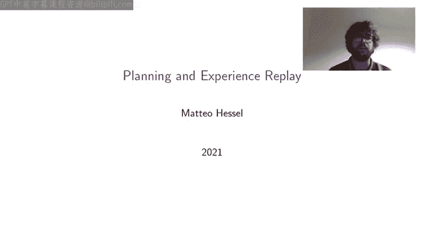

如果我们对这份数据应用蒙特卡洛学习，我们会得到，例如，A的价值是1，因为在这两个回合中，当我们从A开始时，最终收集到了奖励1；B的价值等于0.75，因为我们从模型中采样的回合中，四分之三的时间我们在B观察到了奖励1。在这种情况下，这与从模型中学到的概率完全一致。

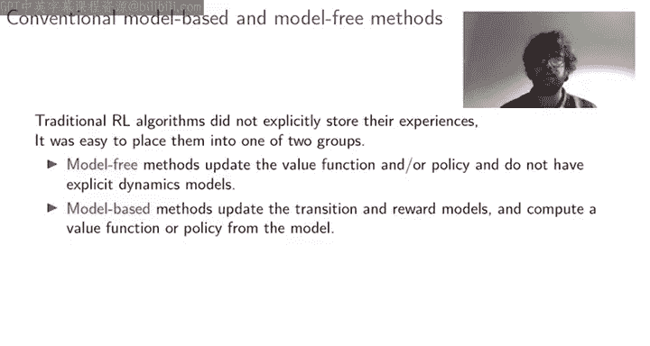

---

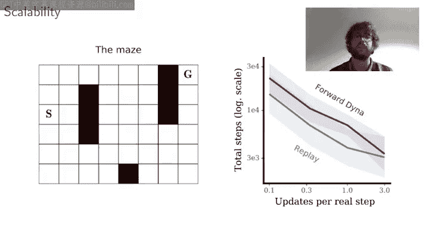

### 模型的局限性 🚧

这是一个很酷的想法，直接使用动态规划与学习模型也可能是一个非常有趣的方法，但这些想法有什么潜在的局限性呢？一如既往，最大的担忧是学习到的模型可能不完美。实际上，我们知道它通常会包含一些误差和近似，在这种情况下，规划过程可能会计算出一个对于近似MDP最优但对于真实环境次优的策略。

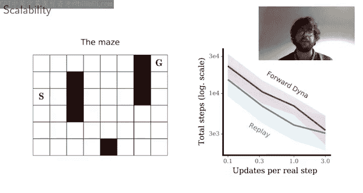

因此，如果不讨论如何处理这些局限性，我们的介绍就不完整。有很多方法可以解决这个问题。一种方法非常简单：每当模型不够好、不够可靠时，就直接使用免模型算法。

另一个想法是：让我们努力明确地推理我们对模型估计的不确定性，例如，这将引导我们更倾向于贝叶斯方法。最后，第三种方法，也是我们今天将深入探讨的，实际上是结合免模型和基于模型的方法，将学习和规划集成到单个算法中。

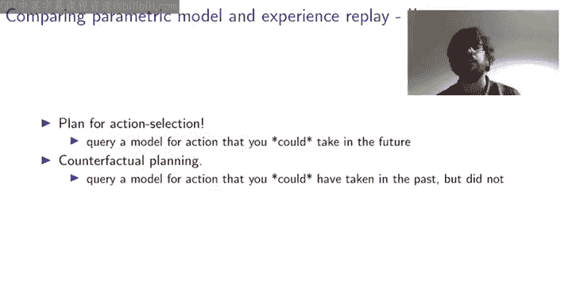

---

## Dyna：集成学习与规划 🔄

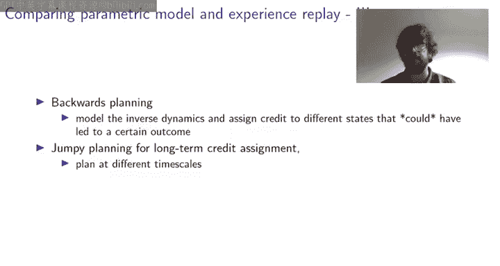

我们如何做到这一点？在之前的讨论中，我们已经在某种程度上隐含地讨论了存在两个潜在的数据来源、两个潜在的经验来源：一个是**真实经验**，这是你通过实际与环境交互生成的数据、转移、轨迹。另一个来源是**模拟经验**，其中数据是从模型（例如学习模型）中采样的，因此是从某个近似MDP中采样的。

**Dyna** 这一集成学习与规划的强大方法背后的核心思想是：让我们将这两个经验来源视为同一事物。在免模型中，我们从真实经验中学习价值；在基于样本的规划中，我们从模拟经验中规划价值；而在Dyna中，让我们两者都做，让我们对价值和策略应用相同的更新，无论数据来自真实经验还是模拟经验。

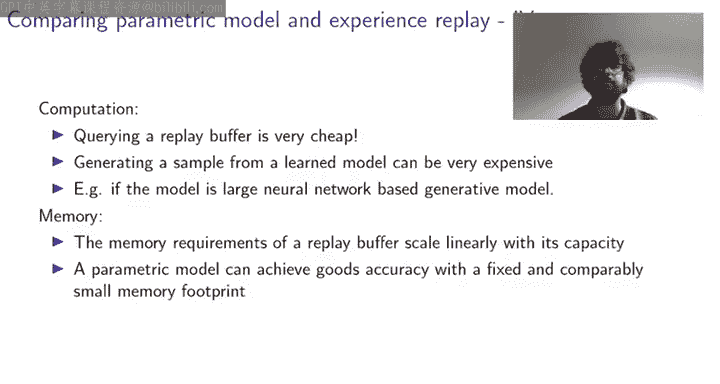

这非常直接地实现了我在本章开头展示的图景：我们可以根据我们的价值估计或策略采取行动以生成经验，然后这些经验既可以用来直接更新价值和策略，也可以用来学习一个模型，然后该模型可以生成额外的模拟更新、模拟经验。

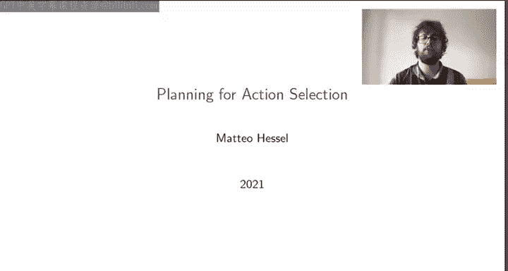

---

### Dyna-Q 算法实例 🧩

现在让我们讨论Dyna的具体实例化，因为这个思想非常通用，但当然我们可以将许多不同的算法插入其中，并对模拟和真实经验应用非常不同的更新。

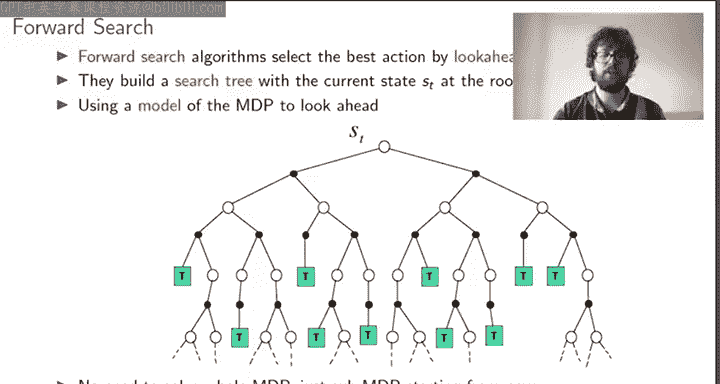

这在实践中意味着什么？Dyna的一个流行版本通常被称为 **Dyna-Q**，我们在真实和模拟经验上都使用Q学习。它的流程如下：首先，我们当然需要初始化价值函数（像在Q学习中一样），但也需要初始化一个模型，因为我们将同时训练它。然后在每一步，我们可以使用一个ε-贪心策略来选择动作，就像在标准Q学习中一样。

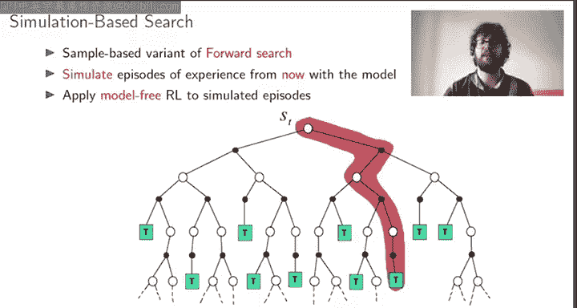

执行此动作后，我们当然会从环境中获得一个后继状态和一个奖励。利用这个真实转移，我们可以直接应用Q学习，例如，通过将当前的Q值更新到通常的目标（奖励加上下一步折扣后的最大Q值之和）。但我们也可以以监督学习的方式更新模型，例如，在表格化确定性环境中，这仅仅相当于存储下一个状态和奖励。

接下来是Dyna“秘制酱料”的关键所在。基本上，对于环境中的每个真实步骤，我们现在执行任意次规划更新：我们取一些在训练期间遇到过的过去状态-动作对，使用当前模型采样一个可能的下一个状态和一个可能的后续奖励，并使用这个想象的转移来执行一次额外的Q学习更新。当然，随着我们增加想象的步骤数量，我们基本上可以减少对真实转移的依赖，并如我们所希望的那样变得更具数据效率。

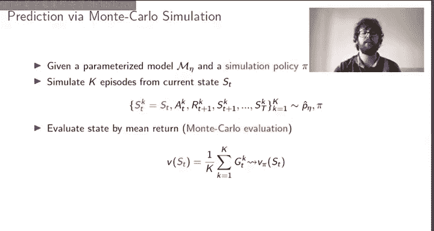

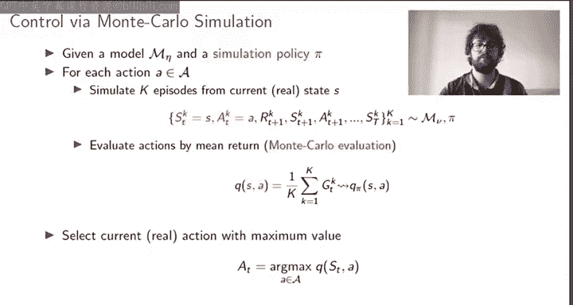

当然，有许多不同的方法来扩展或实现这个想法。例如，我们可以使用不同的免模型算法代替Q学习。此外，幻灯片上的算法是为表格化设置编写的，但我们当然可以使用线性函数或深度神经网络来表示价值或模型。或者，我们也可以随时间变化规划的量。非常直观地，模型通常会随着时间的推移而改进和更新，所以希望它会变得更好。因此，我们也许可以想象随着训练的进行和执行更多规划更新，我们对模型越来越有信心。理想情况下，我们甚至会有某种形式的不确定性估计，可以用来选择执行多少规划，根据学习模型的准确性来决定在多大程度上信任我们的规划更新。

但无论细节和潜在的增强如何，重要的是，即使是这个基本算法，在某些状态下也已经具备了我们所寻找的最基本属性：我们可以投入更多计算以更高效地学习。我想再次强调，如果数据收集缓慢、昂贵或不安全，这真的非常关键，而且我可以肯定地说，这在许多现实世界应用中确实经常是这种情况。

---

### 迷宫实验示例 🧪

让我们看看当我们在一个简单问题上实际运行这些算法时会发生什么，以便更深入地理解和直观感受规划对于信用分配的作用。为此，我们将考虑一个简单的迷宫，如本幻灯片右上角所示。在每个回合中，智能体从标记为S的单元格开始。从任何单元格，智能体可以采取四个动作之一，分别对应于向上、向下、向左和向右移动。深色单元格是墙壁，意味着如果我们试图移动到其中一个单元格，动作将无效（撞墙并停留在原地）。除了到达标记为G的目标单元格（右上角）时收集的单个正奖励外，其他地方的奖励均为零。

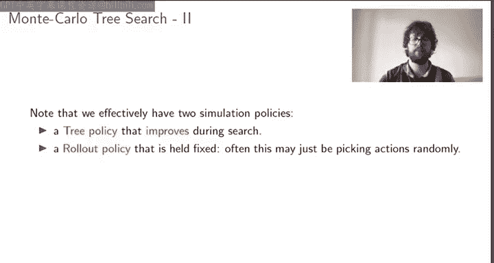

在这种设置下，对于任何折扣因子大于1的情况，最优策略显然是从S到G沿着最短路径引导你的策略，因为任何选择较长路径的动作都会导致最终奖励被更强烈地折扣。这意味着我们可以评估智能体学习到的策略的质量，例如，通过绘制智能体为达到目标所采取的步数作为其经历回合数的函数。这正是本幻灯片图表所示的内容。

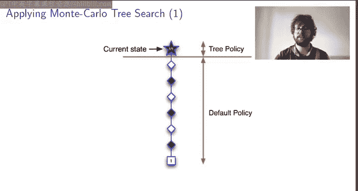

该图表显示了上一张幻灯片中算法的三个实例化运行，它们使用了不同数量的规划步骤。具体来说，它运行了零步规划（算法仅退化为普通Q学习）、五步规划或五十步规划。从这张图中可以明显看出，普通Q学习需要数十个回合才能实际收敛到最优解。相反，仅仅添加一点点规划（例如，每个真实更新只做五个额外更新），智能体就能更快地收敛到最优解，不到10个回合。随着我们增加到50个规划步骤，智能体实际上只需几个回合就收敛到最优策略，这真的令人印象深刻。

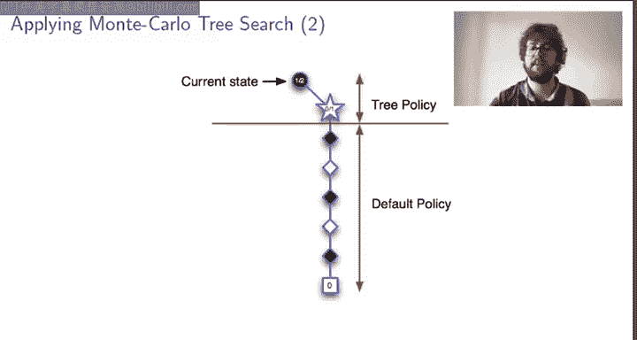

---

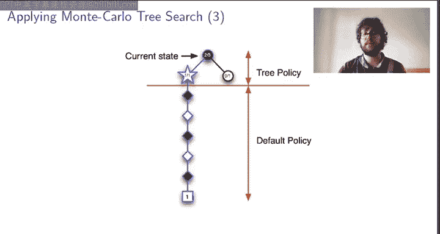

### 规划步骤的影响 🔍

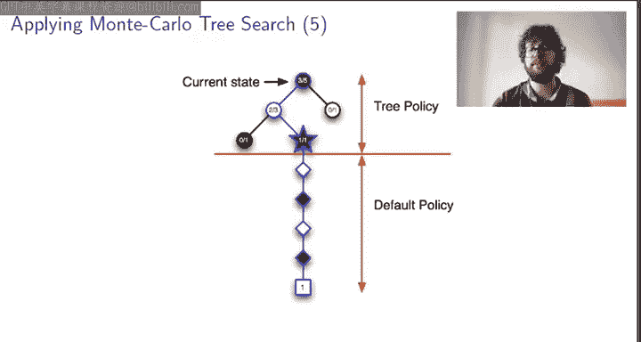

这甚至可能看起来好得令人难以置信，幕后到底发生了什么？在这张幻灯片中，我试图给你一个机会窥探幕后，看看当我们运行这个算法时，Q值估计发生了什么变化。

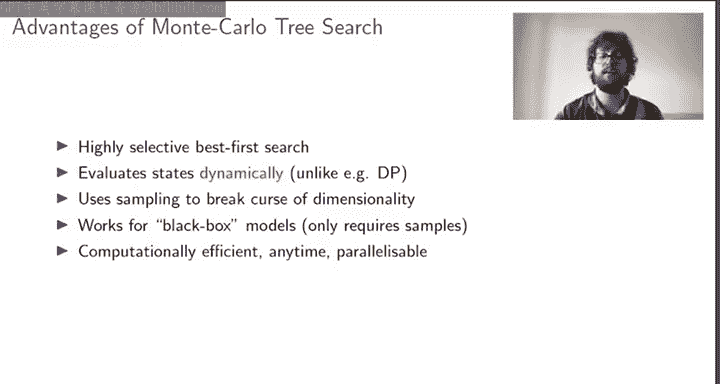

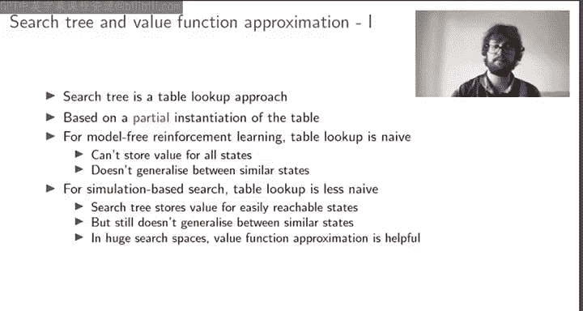

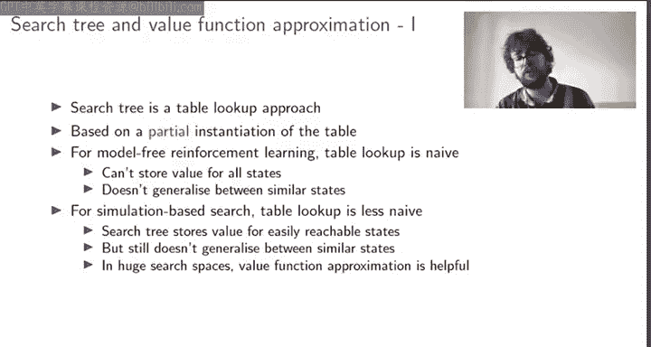

具体来说，让我们考虑在第一个回合的最后一步会发生什么，这基本上是智能体第一次观察到奖励。为简单起见，我们还将假设Q值初始化为零。在这种假设下，没有规划的第一个回合实际上相当无聊：在所有中间步骤，当智能体进入单元格时，价值都是0，并且实际上保持为0，因为TD误差始终为0（我们的估计是0，奖励是0，我们自举的最大Q值也是0），所以在整个第一个回合中没有进行任何更新。只有一个Q值在最后一个转移时被更新，这是对应于从紧邻目标下方单元格向上移动的Q值。当智能体执行第一个回合的这个最终转移时，该Q值被正确地更新为目标奖励。

这立即使得贪心策略在该单元格中是最优的，因为所有其他动作价值保持为零，但从目标正下方状态向上移动的动作价值变为非零。所有我们在第一个回合中看到过的其他状态都没有被更新，Q值都保持为零，行为保持随机（假设我们随机打破平局）。但最后那个状态（在左下角迷宫中显示的那个）被更新为正确的策略。

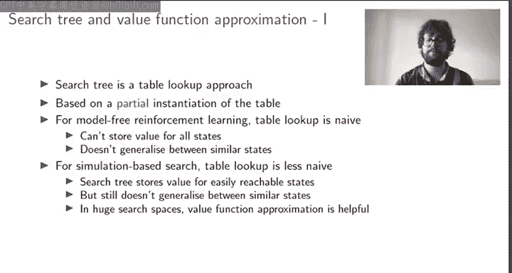

在右下角的迷宫中，我们展示了当我们运行具有50步规划的相同算法时，我们对Q值估计的状态。同样，我们在刚刚运行完一个回合后立即冻结算法。但突然之间，你可以看到Q值现在已经在整个迷宫中更新了。不仅仅是最终状态意识到最优动作是什么，实际上智能体在这个第一个回合中更新的Q值估计为许多其他不同的状态显示了一个有意义的方向，基本上关于如何从状态移动到目标的信息已经几乎传播到了起点。这相当令人印象深刻，原因是当你更新回合中的最后一个单元格时，你随后开始从模型中对想象转移进行50次额外更新，这意味着在这50个规划更新中的每一个上，我们都能够从新更新的Q值向后传播信息到状态空间