# 09：策略梯度与演员-评论员方法 🎯

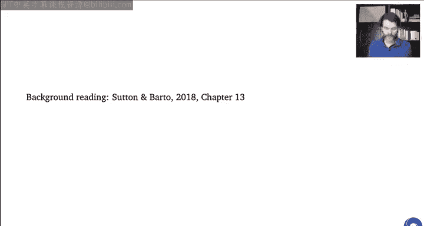

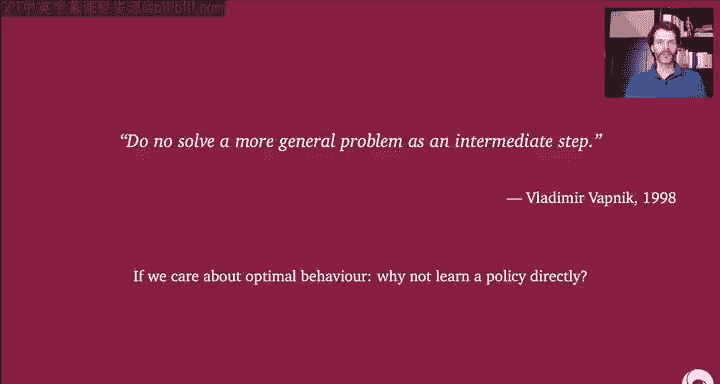

在本节课中，我们将学习如何直接优化策略，而不是通过价值函数间接推导。我们将探讨策略梯度方法，以及结合了策略和价值函数的演员-评论员方法。

---

## 引言与动机 🧠

上一讲我们讨论了基于价值的强化学习。本节中，我们来看看直接学习策略的方法。

弗拉基米尔·瓦普尼克曾写道：“不应将解决一个更普遍的问题作为中间步骤。” 这意味着，如果你最终关心的是智能体的行为，那么直接学习策略可能比学习一个更通用的模型或价值函数更高效。因为学习更通用的东西通常更困难，可能会浪费数据和计算资源在无关的细节上。

为了更深入地理解这种高层次的观点，我们首先比较一下强化学习中的其他方法。

---

## 与其他AI方法的比较 ⚖️

我们之前讨论过基于模型的强化学习，它有如下优缺点：

**优点：**
*   学习模型是一个监督学习过程，机制相对成熟。
*   理论上可以从数据中提取所有信息，即使某些转移没有带来高额奖励，也能将信息整合到知识结构中。

**缺点：**
*   可能会在无关细节上消耗大量计算和模型容量。例如，在吃豆人游戏中，如果背景有无关视频，模型可能会花费大量精力去学习背景像素，而不是对游戏策略重要的部分。
*   即使有了完美模型，从中计算（规划）出策略也通常非常耗时。

我们也讨论了很多基于价值的强化学习，其优缺点如下：

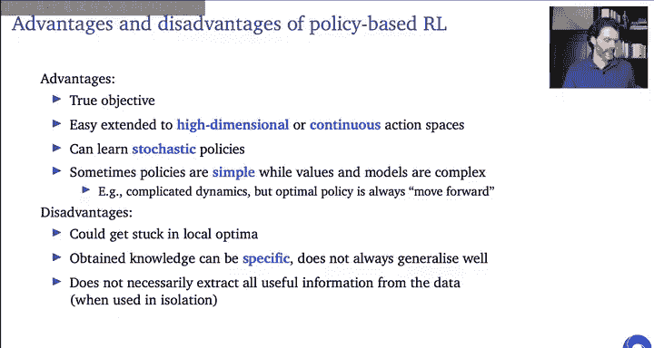

**优点：**
*   从价值函数（特别是动作价值函数）生成策略相对容易（例如，选择贪婪动作）。
*   比学习模型更接近真正的优化目标（即获得高回报）。
*   研究深入，存在很多优秀算法。

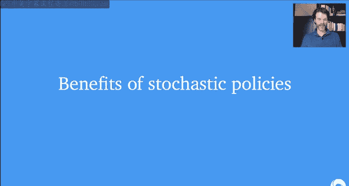

**缺点：**
*   仍然不是真正的目标，可能仍会关注无关细节。例如，精确学习两个动作之间的价值差异可能对选择最优策略无关紧要。
*   由于函数逼近误差，小的价值误差有时会导致大的策略误差。

在本讲中，我们将讨论**基于策略的强化学习**，它直接优化策略，至少在目标上是正确的。我们将在后续幻灯片中讨论这种方法的更多属性和优缺点。

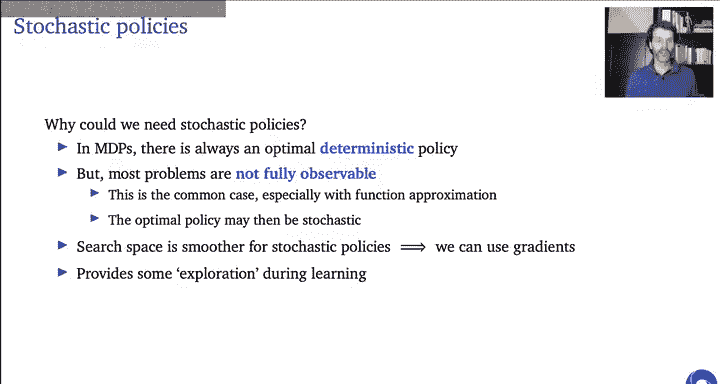

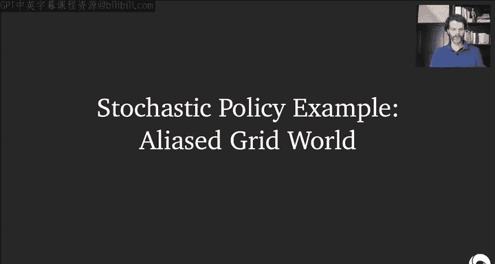

总的来说，需要记住，这些不同的方法以不同的方式泛化。有时学习模型更容易（例如，动态特别简单时），有时学习策略更容易（例如，真实世界难以建模，但最优策略可能很简单）。

---

## 策略参数化 📝

在之前的课程中，我们参数化地逼近价值函数：`V^π` 和 `Q^π` 表示策略 `π` 的真实价值，`V_w` 和 `Q_w` 表示其近似。

我们可以从中生成策略（例如贪婪策略）。但现在我们将做不同的事情：我们将使用另一组参数 `θ` 来直接参数化策略 `π_θ`。之前，策略是从价值函数推断出来的；现在，我们将直接有一个输出策略参数的函数（例如神经网络）。

我们将专注于**无模型**的强化学习。策略搜索当然也可以与模型结合，但本讲不涉及。

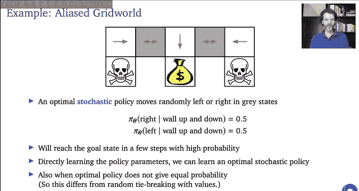

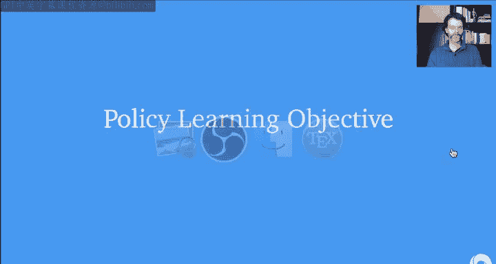

关于术语，需要注意以下几点：
*   **基于价值的强化学习**：使用价值函数，策略是隐式的。
*   **基于策略的强化学习**：直接学习策略。
*   **演员-评论员方法**：同时拥有策略（演员）和价值函数（评论员）。评论员用于评估和更新演员。

---

## 策略学习的优缺点 📊

以下是基于策略的强化学习的优缺点：

**优点：**
1.  **真正的目标**：直接优化我们关心的策略。
2.  **易于扩展到高维或连续动作空间**：例如，机器人控制输出的是连续值。
3.  **可以自然地参数化随机策略**。
4.  **有时策略很简单，而价值和模型很复杂**：这意味着学习策略可能更容易，也更容易用简单的函数类表示最优策略。

**缺点：**
1.  **可能陷入局部最优**：基于梯度的搜索通常是局部的。
2.  **更新可能非常特定，泛化能力差**：策略学习只提取优化行为所需的最窄信息（行为本身），如果环境变化，可能难以适应。它没有从数据中提取所有有用信息。

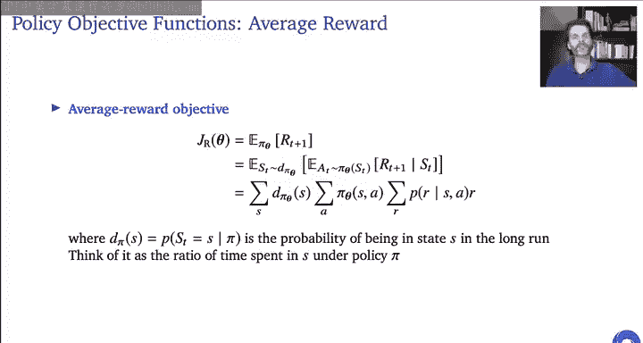

---

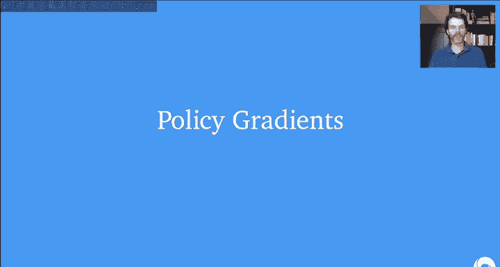

## 为何需要随机策略？ 🎲

你可能会想起，在马尔可夫决策过程中，总是存在一个最优的确定性策略。但在大多数实际问题中，环境并非完全可观测（例如，机器人只能看到前方）。即使MDP本身是马尔可夫的，如果使用函数逼近，智能体可能仍无法区分状态，这相当于部分可观测设置。

在这种情况下，**最优策略本身可能就是随机的**。此外：
*   随机策略的搜索空间可能更平滑，便于使用梯度优化。
*   随机策略能自动提供一定程度的探索。

---

## 随机策略示例：别名网格世界 🗺️

考虑一个简单的网格世界，其中两个灰色状态看起来完全一样（别名状态）。顶部走廊可以左右移动，向下移动会进入终端状态（获得金币或死亡）。

如果使用确定性策略，由于两个灰色状态无法区分，策略必须相同。无论选择向左还是向右，都会在某些起始情况下导致智能体无限期卡住，平均回报很低。

如果使用随机策略（例如，在每个灰色状态以相等概率随机向左或向右），那么无论从哪个角落开始，智能体最终都能到达中间的金币，且永远不会进入坏状态或卡住。这个随机策略的平均回报远高于任何确定性策略。

这个例子表明，有时随机策略是有益的，甚至是最优的。重要的是，这种随机策略可以通过直接学习策略参数来获得，而不仅仅是学习价值函数后随机打破平局。

---

## 形式化策略学习目标 🎯

我们的目标是找到一个策略 `π`。如果用参数 `θ` 参数化策略，目标就是找到最优的 `θ`。

如何衡量策略的质量？
*   在**分幕式环境**中，可以使用**每幕平均回报**。
*   在**持续式环境**中，可以使用**每步平均奖励**。

首先形式化分幕式情况。我们引入函数 `J_G(θ)`，其中 `G` 表示回报。目标是最大化期望回报：
`J_G(θ) = E_{s_0 ~ d_0, a_t ~ π_θ(·|s_t), s_{t+1} ~ P(·|s_t, a_t)} [ Σ_{t=0}^{∞} γ^t r_t ]`
其中期望基于起始状态分布 `d_0`、策略 `π_θ` 和MDP动态。

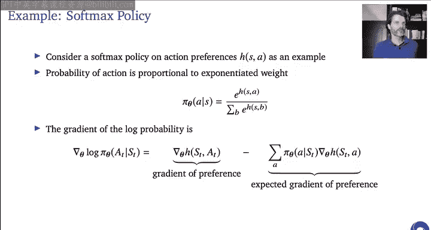

这可以重写为起始状态价值的期望：
`J_G(θ) = E_{s_0 ~ d_0} [ v^{π_θ}(s_0) ]`
如果起始状态是确定的，目标就是最大化起始状态的价值。

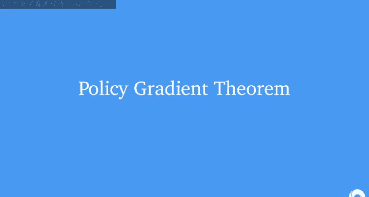

对于平均奖励目标（持续式），目标是最大化长期平均奖励：
`J_R(θ) = lim_{T->∞} (1/T) E [ Σ_{t=1}^{T} r_t ]`
在满足一定遍历性条件下，这可以写为在策略的稳态分布 `d^{π_θ}` 下的期望：
`J_R(θ) = E_{s ~ d^{π_θ}, a ~ π_θ(·|s)} [ r(s, a) ]`
`= Σ_s d^{π_θ}(s) Σ_a π_θ(a|s) Σ_{r,s'} P(r, s'|s, a) * r`

---

## 策略梯度 📈

基于策略的强化学习是一个优化问题：找到最大化 `J(θ)` 的 `θ`。我们将专注于**随机梯度上升**，因为它强大、高效，且易于与深度神经网络结合。

策略梯度定义为 `J(θ)` 关于参数 `θ` 的梯度。更新规则为：
`Δθ = α * ∇_θ J(θ)`
其中 `α` 是步长。随机策略有助于确保 `J(θ)` 是平滑的。

现在的问题是如何计算这个梯度。我们首先从更简单的**上下文赌博机**案例开始。

---

## 上下文赌博机案例 🎰

考虑一个单步“幕”，其中平均奖励是明确定义的，并且**状态分布不依赖于策略**（这是上下文赌博机的特点）。目标是最大化期望奖励：
`∇_θ J(θ) = ∇_θ E_{s~d, a~π_θ(·|s)} [ r(s, a) ]`

我们不能直接对奖励采样然后求梯度，因为奖励本身不依赖于 `θ`。我们需要使用**得分函数技巧**（或称对数似然技巧）：
`∇_θ J(θ) = E_{s~d, a~π_θ(·|s)} [ r(s, a) * ∇_θ log π_θ(a|s) ]`

这个等式的关键在于，右边是一个期望，我们可以通过采样来获得梯度的无偏估计。Ron Williams 将基于此的算法称为 **REINFORCE**。

**直觉**：如果奖励 `r` 高，更新会使选择该动作的对数概率增加，从而增加选择该动作的概率。

---

## 基线：降低方差 🎯

我们可以引入一个**基线** `b(s)`（可以是任何不依赖于动作 `a` 的函数），并保持梯度期望不变：
`∇_θ J(θ) = E_{s~d, a~π_θ(·|s)} [ (r(s, a) - b(s)) * ∇_θ log π_θ(a|s) ]`
因为可以证明 `E [ b(s) * ∇_θ log π_θ(a|s) ] = 0`。

选择合适的基线（例如状态价值函数 `V(s)`）可以显著降低梯度估计的方差。

**直觉**：如果所有奖励都是正数，原始更新会使所有被选中的动作概率增加。通过减去基线（如平均奖励），更新可以同时从“好”和“坏”的结果中学习，使学习更稳定。

---

## 策略梯度定理 📖

现在我们将讨论扩展到完整的**多步马尔可夫决策过程**。这里的关键区别是，状态分布现在也依赖于策略。

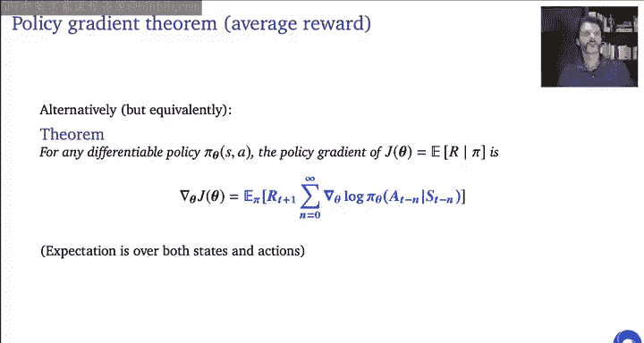

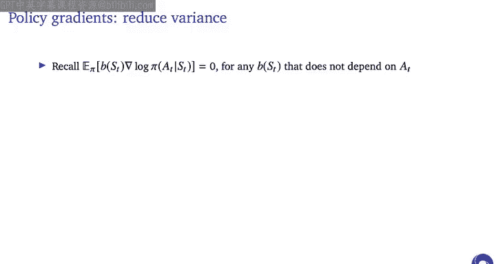

对于**分幕式情况**，策略梯度定理表述如下。对于一个可微策略 `π_θ`，初始状态分布为 `d_0`，目标为 `J_G(θ)`，其梯度为：
`∇_θ J_G(θ) = E_{π_θ} [ Σ_{t=0}^{T} γ^t * Q^{π_θ}(s_t, a_t) * ∇_θ log π_θ(a_t|s_t) ]`
其中期望基于从 `d_0` 开始并遵循 `π_θ` 的轨迹。`Q^{π_θ}(s_t, a_t)` 是从时间 `t` 开始的折扣回报的期望。

**重要说明**：
1.  该梯度**不依赖于MDP的动态**（转移概率），它们在对轨迹概率求对数时被抵消了。
2.  在实践中，人们通常忽略 `γ^t` 项，并在线更新（每步更新而不是等到幕结束），这会引入偏差，但通常可行。
3.  可以用采样的回报 `G_t` 代替 `Q^{π_θ}(s_t, a_t)`，得到无偏但高方差的估计。

对于**平均奖励情况**，策略梯度定理有类似但略有不同的形式：
`∇_θ J_R(θ) = E_{s~d^{π_θ}, a~π_θ(·|s)} [ A^{π_θ}(s, a) * ∇_θ log π_θ(a|s) ]`
其中 `A^{π_θ}(s, a) = Q^{π_θ}(s, a) - V^{π_θ}(s)` 是优势函数，而 `Q` 和 `V` 是**未折扣**的，与平均奖励 `ρ(π)` 相关。

---

## 演员-评论员方法 🎭

演员-评论员方法结合了策略（演员）和价值函数（评论员）。评论员用于评估演员的动作，从而指导更新。

**主要优势**：
1.  **降低方差**：使用价值函数作为基线 `b(s) = V(s)`。
2.  **允许自举**：可以用TD误差 `δ_t = r_{t+1} + γV(s_{t+1}) - V(s_t)` 来估计优势，进一步降低方差，但会引入一些偏差。

一个简单的**一步演员-评论员算法**步骤如下：
1.  初始化策略参数 `θ` 和价值函数参数 `w`。
2.  对每一步 `t`：
    *   根据当前策略 `π_θ` 选择动作 `a_t`。
    *   执行动作，观察奖励 `r_{t+1}` 和下一状态 `s_{t+1}`。
    *   计算TD误差：`δ_t = r_{t+1} + γV_w(s_{t+1}) - V_w(s_t)`。
    *   更新评论员：`w ← w + β * δ_t * ∇_w V_w(s_t)`。
    *   更新演员：`θ ← θ + α * δ_t * ∇_θ log π_θ(a_t|s_t)`。

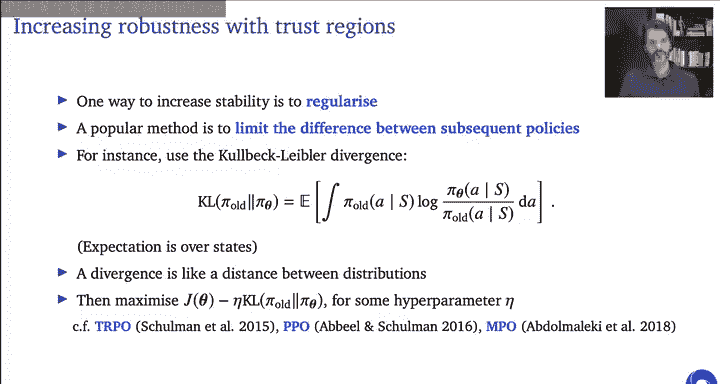

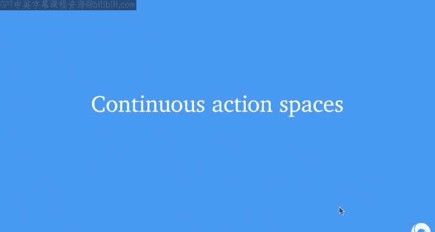

许多现代深度强化学习算法都基于此框架进行扩展。

---

## 提高稳定性：正则化 🔒

在策略梯度中，糟糕的策略更新可能导致后续数据质量下降。为了提高稳定性，可以对连续策略更新之间的差异进行正则化。

一个流行的方法是使用**KL散度**来限制新旧策略之间的差异：
`J(θ) = J_{original}(θ) - η * KL[ π_{θ_old} || π_θ ]`
其中 `η` 是超参数。这可以防止策略更新过快。TRPO、PPO等现代算法都使用了这种思想。

---

## 连续动作空间 🤖

基于价值的RL扩展到连续动作空间可能比较棘手（如何最大化连续动作？）。而策略梯度方法天然适用于连续动作，只需改变策略的参数化方式。

**示例：高斯策略**
将策略参数化为高斯分布：`π_θ(a|s) = N( μ_θ(s), σ^2 )`，其中均值 `μ_θ(s)` 是参数 `θ` 的函数，方差 `σ^2` 可以固定或也作为参数。
其对数梯度为：
`∇_θ log π_θ(a|s) = ( (a - μ_θ(s)) / σ^2 ) * ∇_θ μ_θ(s)`
可以将其插入到REINFORCE或演员-评论员更新中。

**确定性策略梯度**
如果我们能准确估计动作价值函数 `Q_w(s, a)`，对于确定性策略 `a = μ_θ(s)`，可以直接对价值求梯度来改进策略：
`∇_θ J(θ) ≈ E_{s~d} [ ∇_θ Q_w(s, μ_θ(s)) ]`
`= E_{s~d} [ ∇_a Q_w(s, a)|_{a=μ_θ(s)} * ∇_θ μ_θ(s) ]`
这就是**确定性策略梯度**算法。它类似于策略迭代，但用梯度步骤代替了贪婪最大化。

---

## 总结 🏁

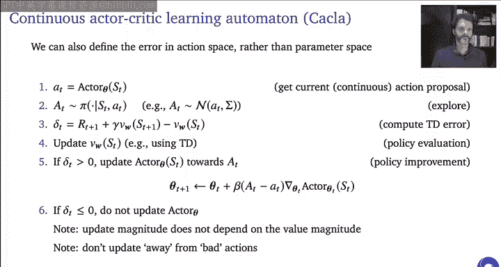

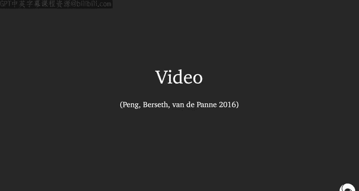

在本节课中，我们一起学习了：
1.  **直接策略优化**的动机：有时比学习模型或价值函数更直接、更高效。
2.  **策略梯度方法**：通过计算性能指标 `J(θ)` 的梯度来优化策略参数。
3.  **策略梯度定理**：为分幕式和平均奖励情况提供了计算梯度的理论公式。
4.  **演员-评论员方法**：结合策略（演员）和价值函数（评论员），用评论员来降低策略梯度估计的方差并指导学习。
5.  **连续动作空间**的扩展：通过高斯策略或确定性策略梯度，策略方法可以自然地处理连续动作。
6.  **提高稳定性的技术**：如使用基线降低方差，以及用KL散度正则化来限制策略更新幅度。

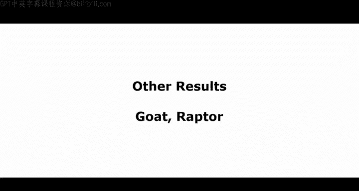

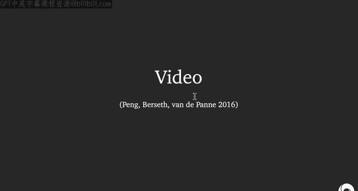

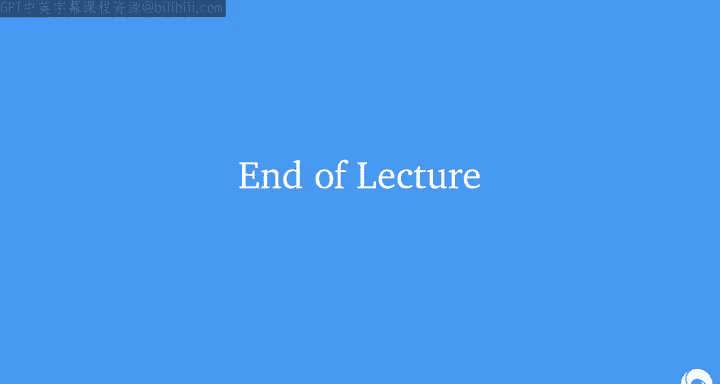

策略梯度及其变体是许多现代深度强化学习算法的核心，能够解决从离散游戏到连续机器人控制等各种复杂问题。