# 10：近似动态编程 🧠

在本节课中，我们将深入探讨近似动态编程。我们将回顾之前讲座中提到的算法框架，特别是在无模型强化学习背景下，如何将动态编程的思想与函数近似相结合。我们将分析两种主要的近似方法：近似值迭代和近似策略迭代，并理解它们背后的理论保证与局限性。

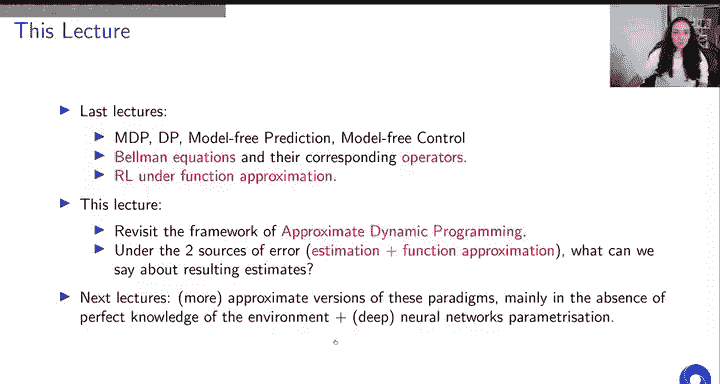

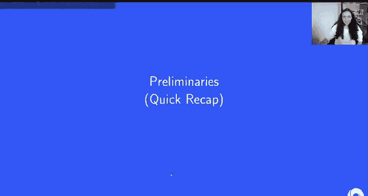

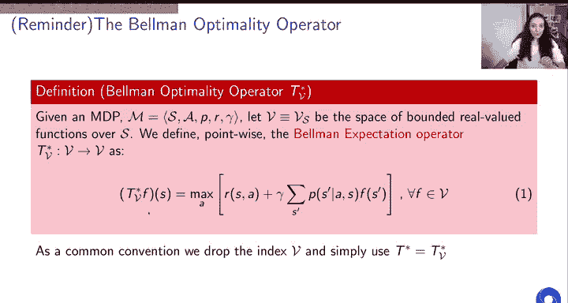

---

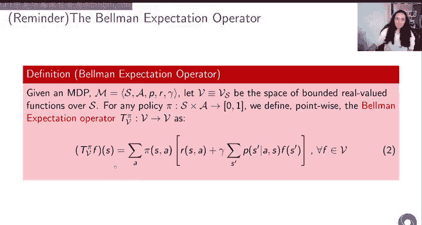

## 背景回顾 🔄

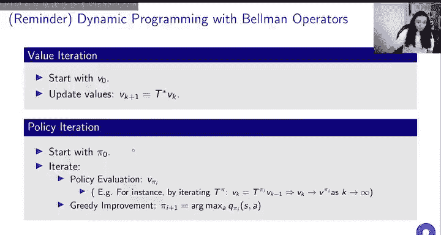

上一讲我们介绍了马尔可夫决策过程、动态编程，并初步接触了近似动态编程，将其作为理解无模型预测与控制的一个框架。我们还回顾了贝尔曼方程及其对应的算子。今天，我们将重新利用这些概念，并结合函数近似来探讨强化学习。

本节课，我们将从两个误差来源重新审视近似动态编程：
1.  **估计误差**：由于无法获得真实的环境模型，我们被迫通过经验采样来近似模型。
2.  **近似误差**：我们不再处于表格化设置中，无法精确表示所有状态-动作的价值函数，而是使用一个函数近似器来完成。

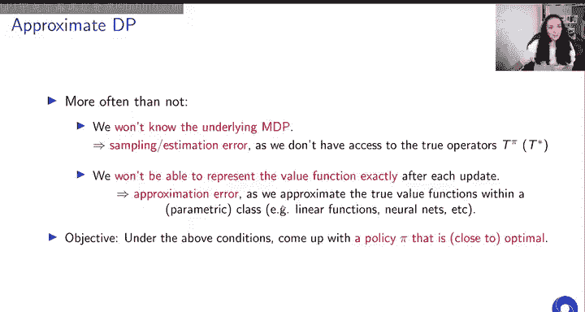

在接下来的课程中，你将看到更多基于此范式的先进研究，特别是放弃对环境完美知识的假设，并转向更流行的函数近似方法——深度神经网络。

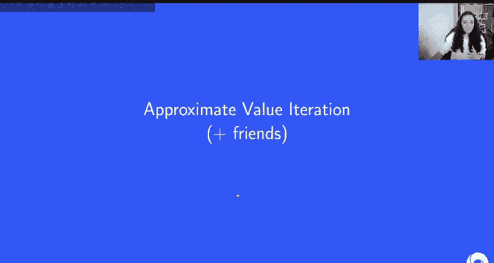

---

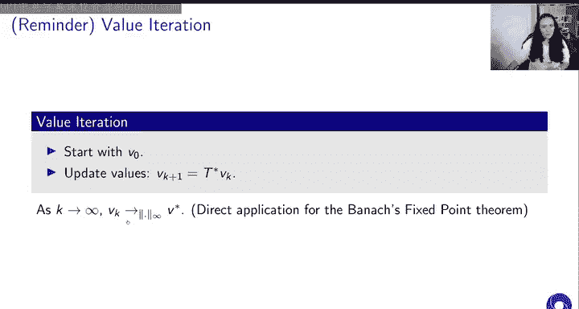

## 预备知识 📚

首先，我们回顾几个之前介绍过的核心概念。

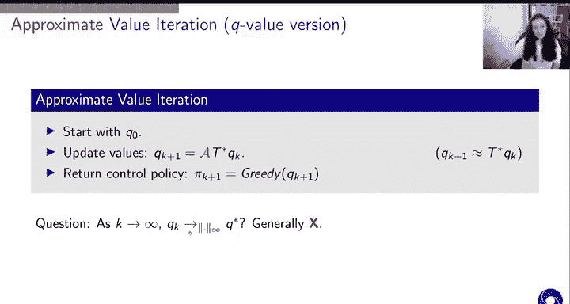

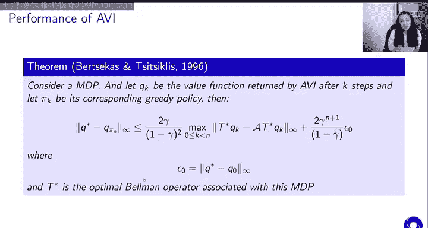

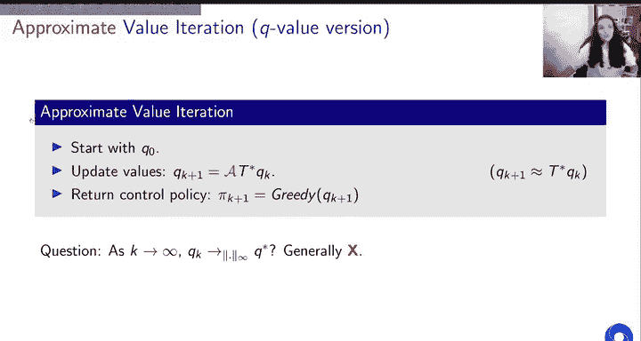

### 贝尔曼最优算子

贝尔曼最优算子由贝尔曼最优方程推导而来，其定义如下：

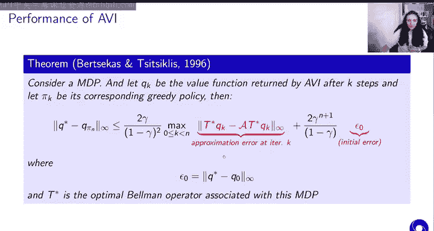

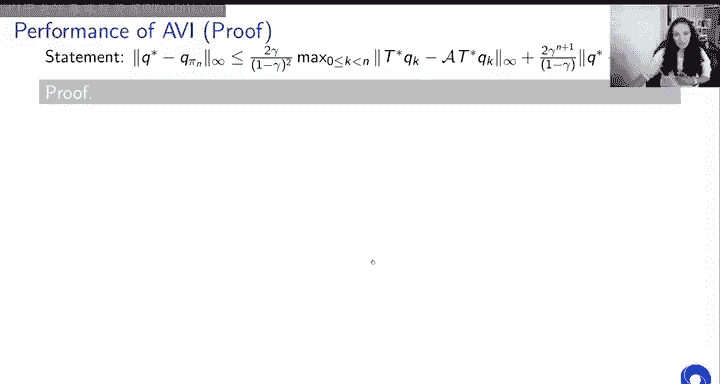

**公式 1：**
\[
(T^*Q)(s, a) = \mathbb{E}_{s' \sim P(\cdot|s,a)} \left[ R(s, a) + \gamma \max_{a'} Q(s', a') \right]
\]

这个算子有一个唯一的**不动点**，即我们寻找的最优价值函数 \(Q^*\)。在完美模型知识且无近似的条件下，迭代应用此算子最终会收敛到最优价值函数。

### 贝尔曼期望算子

贝尔曼期望算子具有类似的性质，它是一个压缩映射，也有一个唯一的不动点。这个不动点就是给定策略 \(\pi\) 的价值函数 \(Q^\pi\)。

### 动态编程视角

从算子视角看，两个流行的动态编程算法是：
*   **值迭代**：多次应用贝尔曼最优算子 \(T^*\)。
*   **策略迭代**：交替进行策略评估（使用贝尔曼期望算子 \(T^\pi\)）和策略改进（通常是贪心改进）。

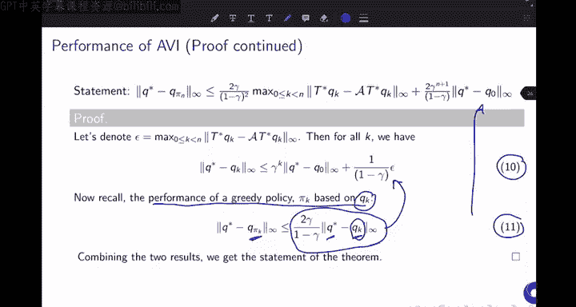

---

## 近似动态编程介绍 🎯

近似动态编程移除了两个关键假设：
1.  完全了解底层的 MDP。
2.  能够精确表示价值函数（即离开表格化设置）。

因此，我们引入了两种误差：
*   **采样/估计误差**：当我们不知道底层 MDP 时，需要通过样本来估计期望值。
*   **近似误差**：由于我们选择的参数化函数类可能无法精确表示我们想要估计的价值函数（包括迭代过程中的中间价值函数）。

即使真实的最优解是可表示的，中间步骤的价值函数也可能无法被参数类表示，从而产生近似误差。强化学习的目标始终是找到一个接近最优行为的策略。

---

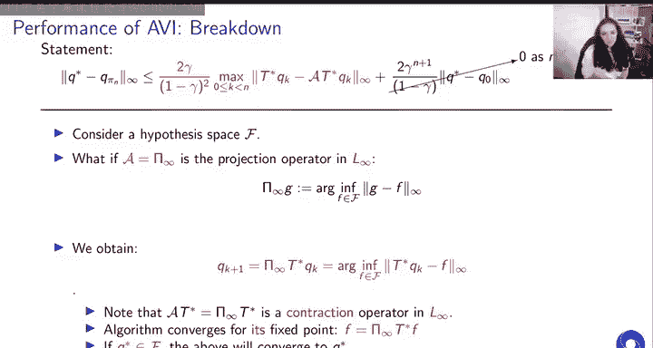

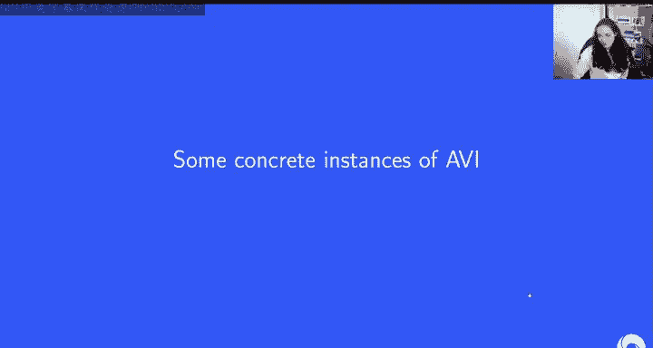

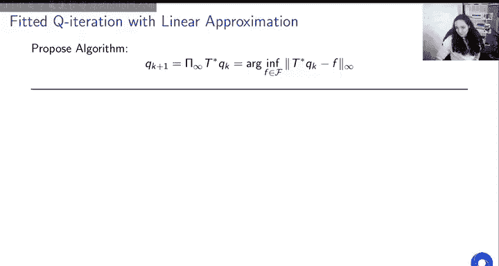

## 近似值迭代 🔄

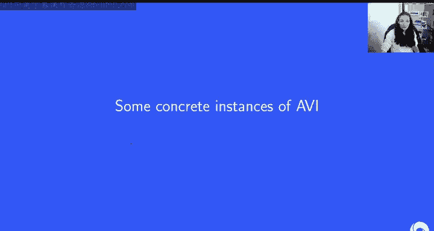

### 精确值迭代回顾

精确值迭代通过贝尔曼最优算子的视角可以表示为：
在每次迭代 \(k\)，我们更新价值函数：
\[
Q_{k+1} = T^* Q_k
\]
当 \(k \to \infty\) 时，序列 \(\{Q_k\}\) 在无穷范数下收敛到 \(Q^*\)。

### 近似值迭代算法

近似版本在每次迭代 \(k\) 中近似地执行这个更新步骤：
\[
Q_{k+1} \approx A(T^* Q_k)
\]
其中 \(A\) 代表近似操作，可能源于函数近似或采样估计。然后，我们基于这个近似值进行贪心策略改进。

通常在实践中，我们使用 **Q 函数的近似值迭代**，因为要推导贪心策略，我们需要动作价值函数。

### 性能保证定理

我们关心经过 \(N\) 步近似值迭代后，所得策略 \(\pi_N\) 的性能。以下定理（1996年的结果）给出了一个保证：

**定理：**
\[
\| Q^* - Q^{\pi_N} \|_\infty \leq \frac{2\gamma}{(1-\gamma)^2} \max_{0 \leq k < N} \| \epsilon_k \|_\infty + \frac{2\gamma^N}{1-\gamma} \| Q^* - Q_0 \|_\infty
\]
其中 \(\epsilon_k = Q_{k+1} - T^* Q_k\) 是在第 \(k\) 次迭代中引入的近似误差。

**含义：**
*   策略 \(\pi_N\) 的性能受两个因素限制：
    1.  整个迭代过程中遇到的最大近似误差（第一项）。
    2.  初始估计的误差，但该项会随着迭代次数 \(N\) 增加而以 \(\gamma^N\) 的速率衰减。
*   当 \(N \to \infty\) 时，第二项趋于零，性能界限不再依赖于初始点。
*   即使我们从最优解 \(Q^*\) 开始初始化，如果近似操作 \(A\) 引入了误差（例如，由于函数类限制或采样噪声），我们仍然可能偏离最优解。

### 收敛算法实例：投影法

如果我们选择一个假设函数空间 \(\mathcal{F}\)，并将近似操作 \(A\) 定义为在 \(\mathcal{F}\) 上关于 \(L_\infty\) 范数的投影：
\[
\Pi_{\mathcal{F}, \infty}(G) = \arg\min_{F \in \mathcal{F}} \| F - G \|_\infty
\]
那么近似值迭代算法变为：
\[
Q_{k+1} = \Pi_{\mathcal{F}, \infty}(T^* Q_k)
\]
这个组合算子 \(( \Pi_{\mathcal{F}, \infty} \circ T^* )\) 仍然是一个压缩映射（压缩系数为 \(\gamma\)），因此该算法保证收敛到一个唯一的不动点 \(Q_{\infty}\)。
*   如果最优价值函数 \(Q^* \in \mathcal{F}\)，那么 \(Q_{\infty} = Q^*\)。
*   如果 \(Q^* \notin \mathcal{F}\)，算法仍然收敛，但可能收敛到一个次优解。

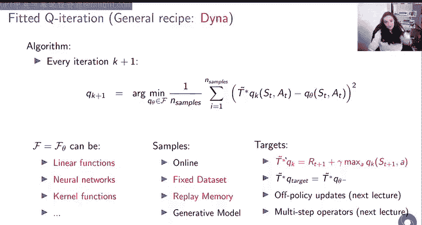

---

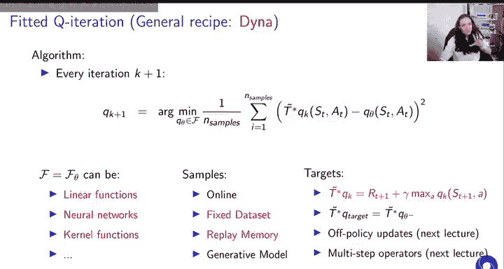

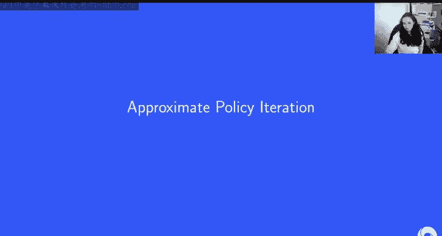

## 近似值迭代的实用算法 🛠️

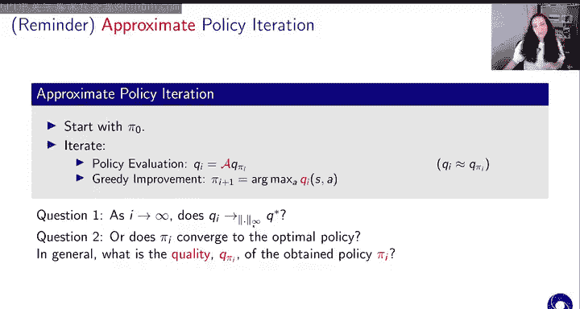

然而，基于 \(L_\infty\) 范数的投影在实践中通常难以优化。因此，我们转向更实用的方法。

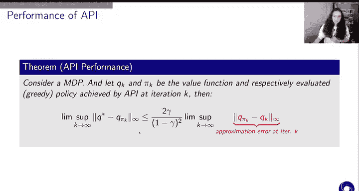

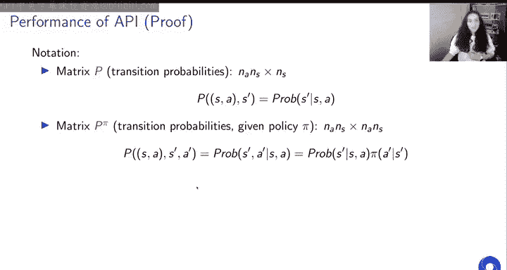

### 通用算法框架

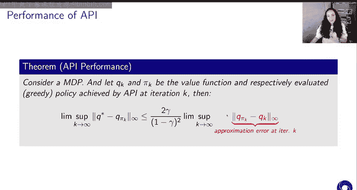

一个更实用的通用框架包含三个可变的维度：
1.  **函数近似器**：参数化函数类 \(\mathcal{F}\)（如线性函数、神经网络）。
2.  **采样机制**：如何生成样本以近似 \(T^*\)（如在线采样、经验回放、固定数据集）。
3.  **目标构造**：如何构建用于回归的目标值（如单步Q学习目标、固定目标网络、多步回报）。

在这个框架下，每次迭代 \(k+1\)，我们寻找参数 \(w_{k+1}\) 以最小化平方损失：
\[
\min_{w} \sum_i \left( Q(s_i, a_i; w) - y_i \right)^2
\]
其中目标 \(y_i\) 是对 \( (T^* Q_k)(s_i, a_i) \) 的近似（例如，\(y_i = r_i + \gamma \max_{a'} Q(s'_i, a'; w_k)\)）。

### 具体算法实例

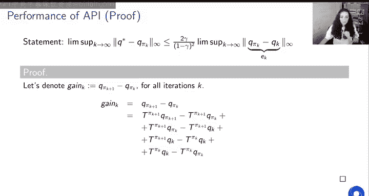

以下是此框架的一些著名实例：

*   **DQN (Deep Q-Network)**：
    *   **函数近似器**：深度神经网络。
    *   **采样机制**：从经验回放缓冲区采样。
    *   **目标构造**：使用固定目标网络。

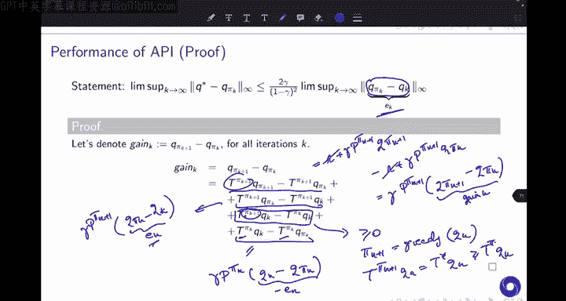

*   **批量强化学习 (Batch RL)**：
    *   **函数近似器**：根据数据集大小和问题特性选择（如线性模型）。
    *   **采样机制**：使用固定的、预先收集的数据集。
    *   **目标构造**：通常使用单步Q学习目标（因为是离策略数据）。

*   **Dyna**：
    *   **函数近似器**：任意选择。
    *   **采样机制**：结合在线交互和从学得的模型（回放）中采样。
    *   **目标构造**：通常使用单步Q学习目标。

大多数现代的无模型控制算法都可以看作是这种“拟合值迭代”范式的变体。

---

## 近似策略迭代 🔄

现在，我们来看看近似动态编程的另一个主要范式：近似策略迭代。

### 精确策略迭代回顾

策略迭代是一个迭代过程：
1.  **策略评估**：评估当前策略 \(\pi_k\) 的价值函数 \(Q^{\pi_k}\)。
2.  **策略改进**：基于 \(Q^{\pi_k}\) 进行贪心改进，得到新策略 \(\pi_{k+1}\)。

在近似设置中，近似主要发生在**策略评估**步骤。我们获得当前策略的一个近似价值函数 \(Q_k \approx Q^{\pi_k}\)，然后基于 \(Q_k\) 进行贪心改进得到 \(\pi_{k+1}\)。

### 性能保证定理

我们关心经过 \(I\) 次迭代后，策略 \(\pi_I\) 的性能。以下定理给出了保证：

**定理：**
\[
\limsup_{I \to \infty} \| Q^* - Q^{\pi_I} \|_\infty \leq \frac{2\gamma}{(1-\gamma)^2} \limsup_{I \to \infty} \| \epsilon_I \|_\infty
\]
其中 \(\epsilon_I = Q^{\pi_I} - Q_I\) 是在第 \(I\) 次迭代的策略评估中产生的近似误差。

**含义：**
*   在极限情况下，所得策略与最优策略的差距，由策略评估误差的极限上界所控制。
*   如果我们能随着迭代进行，将评估误差 \(\| \epsilon_I \|_\infty\) 控制得越来越小，那么最终策略的性能就会越来越接近最优。
*   与近似值迭代不同，这个界限不依赖于初始误差，但强调了持续减小策略评估误差的重要性。

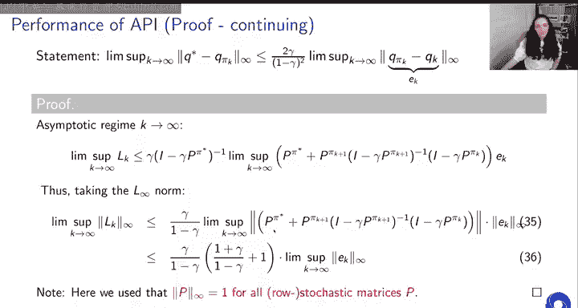

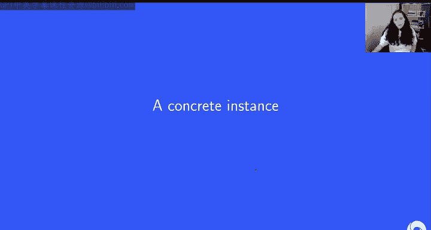

### 策略评估误差可能导致的退化

一个关键点是，在近似情况下，贪心改进步骤**不一定**能保证得到比前一个策略更好的策略。由于近似误差，新策略在某些状态上可能比旧策略更差。这解释了为什么近似策略迭代可能不收敛，或者会在一个策略附近振荡。

### 具体算法实例：线性近似的 TD(λ)

考虑在线性函数近似下使用 TD(λ) 进行策略评估。TD误差定义为：
\[
\delta_t = r_t + \gamma Q(s_{t+1}, a_{t+1}; w) - Q(s_t, a_t; w)
\]
参数更新为：
\[
w \leftarrow w + \alpha \delta_t \phi(s_t, a_t)
\]
在适当的步长条件下，该算法收敛到一个极限 \(w^*\)，对应的价值函数为 \(Q_{w^*}\)。

对于这个算法，有以下误差界限：
\[
\| Q^{\pi} - Q_{w^*} \|_\xi \leq \frac{1 - \gamma \lambda}{1 - \gamma} \| Q^{\pi} - \Pi_{\mathcal{F}, \xi} Q^{\pi} \|_\xi
\]
其中 \(\| \cdot \|_\xi\) 是关于策略 \(\pi\) 的稳态分布 \(\xi\) 的加权范数，\(\Pi_{\mathcal{F}, \xi}\) 是在 \(\mathcal{F}\) 上关于该范数的最佳投影。

**含义：**
*   该界限表明，TD(λ) 的收敛点 \(Q_{w^*}\) 与真实价值函数 \(Q^\pi\) 的差距，受限于函数类 \(\mathcal{F}\) 所能达到的最佳近似误差。
*   当 \(\lambda = 1\)（蒙特卡洛）时，界限最紧。
*   如果 \(Q^\pi \in \mathcal{F}\)，则最佳投影误差为零，从而 \(Q_{w^*} = Q^\pi\)。
*   如果 \(Q^\pi \notin \mathcal{F}\)，则 \(Q_{w^*}\) 通常不是 \(\mathcal{F}\) 中对 \(Q^\pi\) 的最佳近似点。

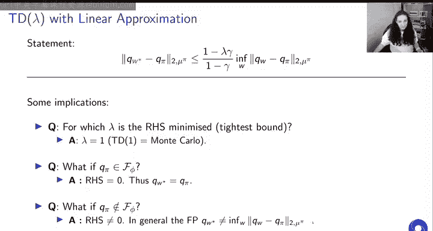

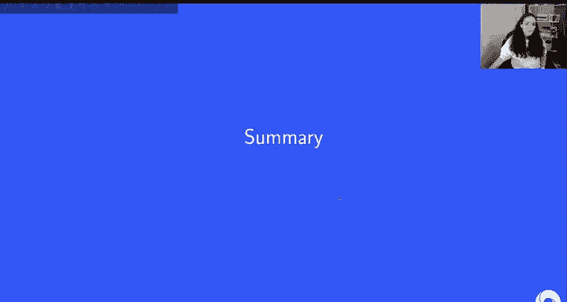

---

## 总结 📝

本节课我们一起学习了近似动态编程的两种主要范式。

### 近似值迭代
*   **核心思想**：直接近似贝尔曼最优算子的迭代应用。
*   **关键定理**：策略性能受迭代中最大近似误差和衰减的初始误差限制。
*   **实践**：通常将难以处理的 \(L_\infty\) 投影替换为基于某个分布（如当前策略的稳态分布）的 \(L_2\) 回归，从而衍生出 DQN 等实用算法。
*   **收敛性**：即使最优解在函数类中，由于中间迭代的误差，收敛到最优解也不被保证，但算法通常表现良好。

### 近似策略迭代
*   **核心思想**：在策略迭代循环中，使用函数近似进行策略评估。
*   **关键定理**：极限策略的性能由策略评估误差的极限上界控制。
*   **实践**：策略评估本身就是一个迭代问题（如 TD(λ)），嵌套在策略迭代循环中，计算成本较高，因此不如值迭代流行。
*   **收敛性**：同样不保证收敛，可能围绕一个由评估误差决定的界限振荡。其收敛点可能不唯一，且不一定是函数类中对真实价值函数的最佳近似。

两种范式都涉及**采样误差**和**函数近似误差**。为了高效优化，我们通常使用 \(L_2\) 范数代替 \(L_\infty\) 范数。控制这些误差是获得高性能策略的关键。