# 11：离策略与多步学习 🎯

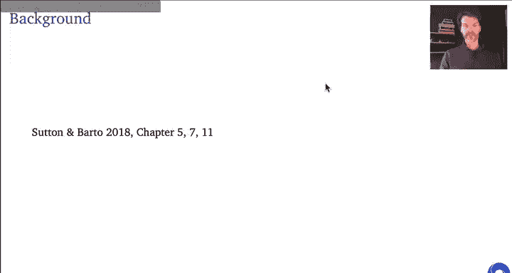

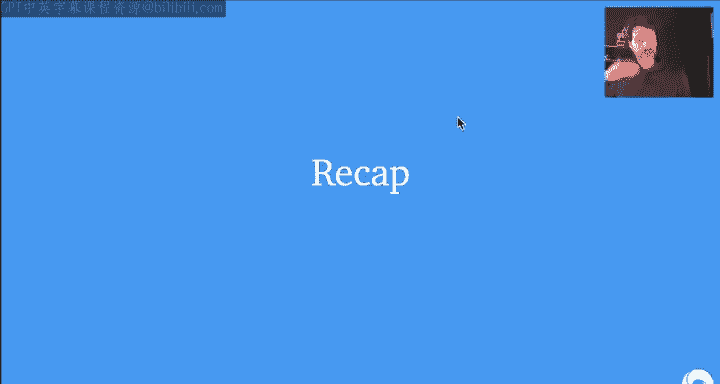

在本节课中，我们将学习离策略学习和多步更新的核心概念，探讨它们如何结合使用，以及在实际应用中可能遇到的问题和解决方案。

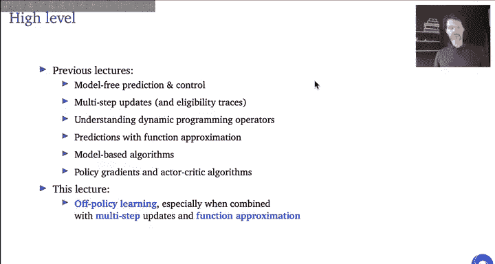

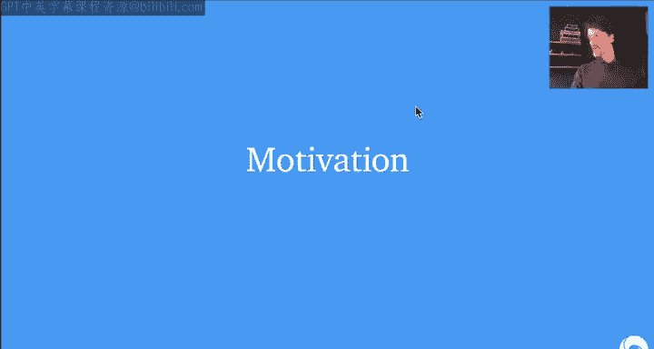

## 概述

强化学习的目标是让智能体通过与环境交互，学习如何采取行动以最大化累积奖励。智能体内部可能包含策略、价值函数或模型。决策不仅影响即时奖励，还可能产生长期后果。

在之前的课程中，我们讨论了模型无关的预测与控制、多步更新与资格迹、动态规划算子、函数近似、基于模型的算法以及策略梯度方法。本节课，我们将重点讨论**离策略学习**，特别是当它与**多步更新**和**函数近似**结合时，在模型无关预测、控制以及策略梯度设置中的重要性。

---

## 动机：为何需要离策略学习？🤔

离策略学习是指从与目标策略不同的行为策略生成的数据中进行学习。这相当于提出“如果...会怎样？”的反事实问题。

**离策略学习有用的原因包括：**
*   **探索与利用的权衡**：你可能想学习最优（贪婪）策略，但不想一直遵循它，因为这可能探索不足。Q学习就是一个典型的离策略算法。
*   **学习多个策略**：你可能关心多个策略，或者想广泛了解环境信息，以便后续复用。
*   **利用观测数据**：例如，从存储的日志或其他智能体收集的数据中学习。这包括从自己过去的策略中学习（经验回放），以提高数据效率。
*   **策略梯度中的分布校正**：在策略梯度方法中，校正数据分布的不匹配至关重要，否则梯度方向可能错误，导致策略性能下降。

---

## 离策略与多步更新的基础回顾

### 离策略的一步更新

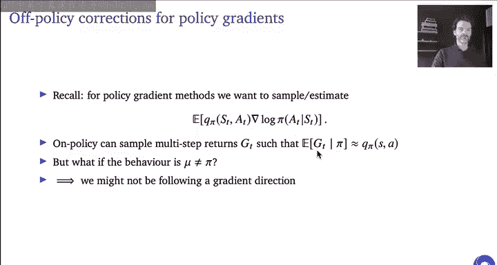

对于一步更新，我们可以使用广义的期望SARSA更新（或Q学习）。其核心是**自举**：在状态 `S_t` 考虑采取动作 `A_t`，然后在下一个状态 `S_{t+1}` 考虑遵循目标策略 `π`（`π` 可以与行为策略 `μ` 不同）。更新目标为：
`R_{t+1} + γ * Q(S_{t+1}, A_{t+1} ~ π)`

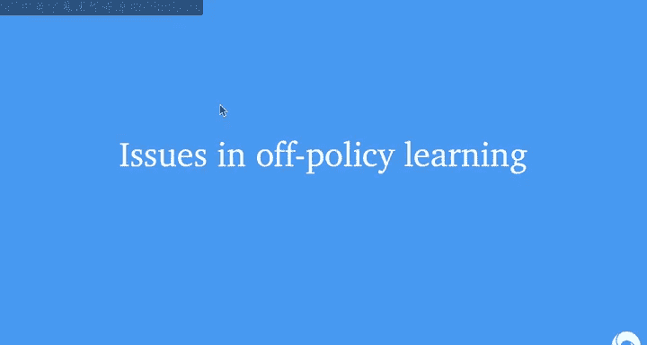

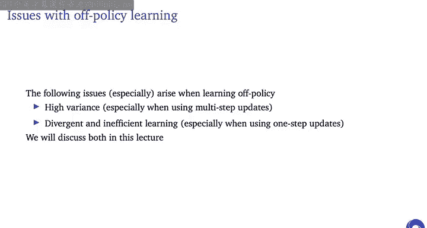

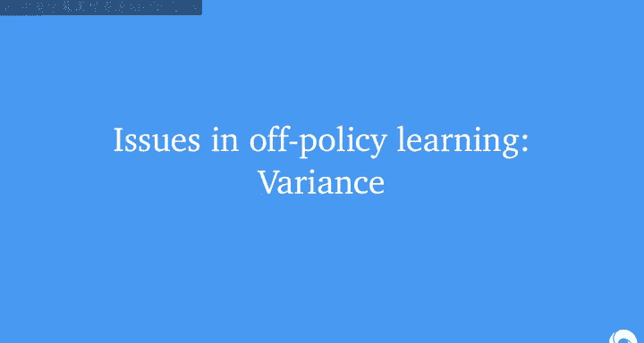

### 多步更新与重要性采样

对于多步更新，我们不能仅靠一步自举。我们需要考虑更长轨迹的回报，并使用**重要性采样**进行校正。

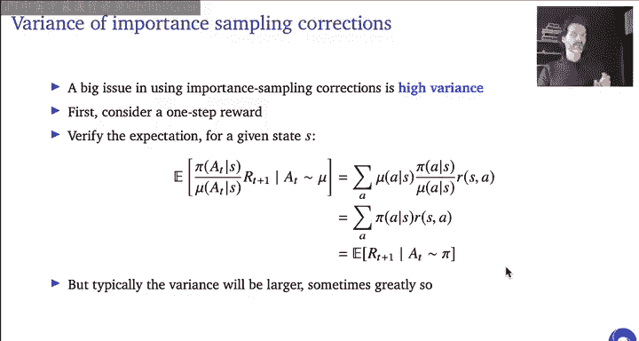

假设有一条从时间 `t` 到 `T` 的轨迹 `τ`。在行为策略 `μ` 下观测到的原始回报为 `G_t`。为了使其成为目标策略 `π` 下回报的无偏估计，我们进行如下校正：
`Ĝ_t = G_t * (Pr(τ|π) / Pr(τ|μ))`

轨迹的概率比可以分解为每一步动作概率比的乘积：
`Pr(τ|π) / Pr(τ|μ) = Π_{k=t}^{T-1} (π(A_k|S_k) / μ(A_k|S_k))`

这样，校正后回报 `Ĝ_t` 在行为策略 `μ` 下的期望，就等于目标策略 `π` 下原始回报 `G_t` 的期望。

**直观理解**：如果某条轨迹在目标策略下很常见但在行为策略下罕见，重要性采样比会很大，从而上调该回报的权重；反之则会下调甚至归零权重。

### 策略梯度中的离策略学习

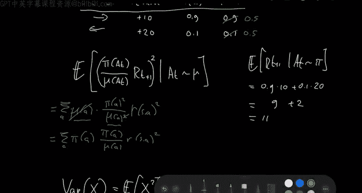

在策略梯度中，我们估计的梯度形式为：
`∇J(θ) ≈ E_{s~d^π, a~π}[Q^π(s, a) * ∇ log π(a|s)]`

在**同策略**下，我们可以用（多步）回报 `G_t` 来近似 `Q^π(s, a)`。但在**离策略**下，我们必须对 `G_t` 进行校正，否则梯度估计会有偏，可能导致策略性能不升反降。

---

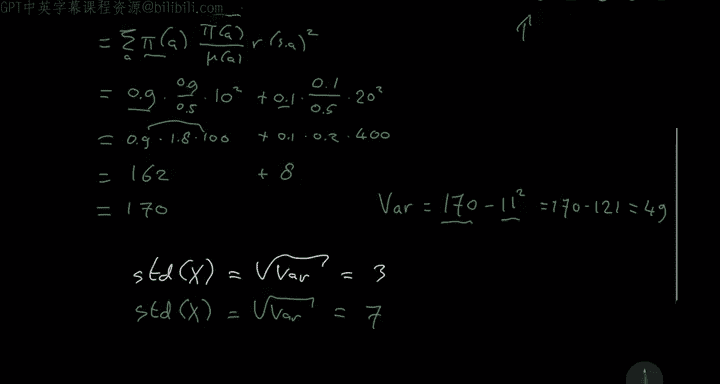

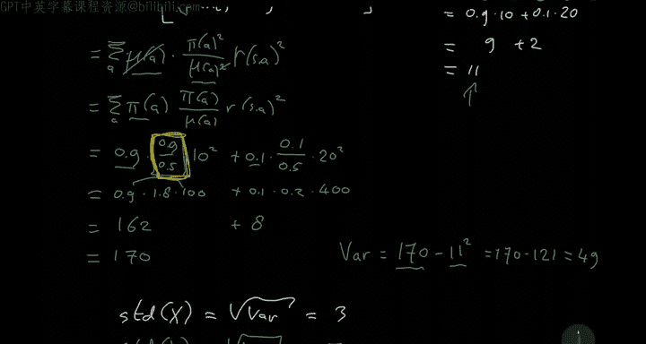

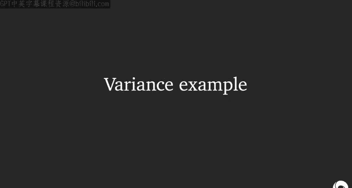

## 离策略学习面临的问题 🚧

离策略学习主要面临两大类问题：

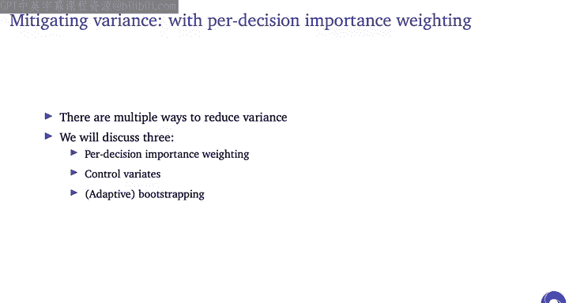

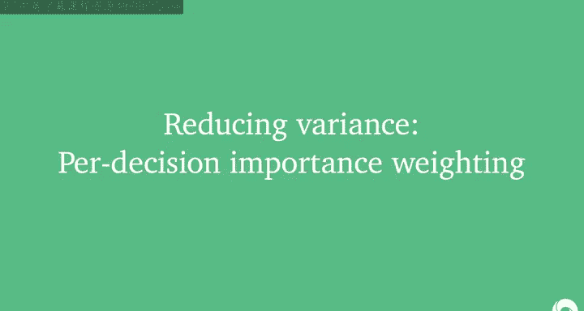

1.  **高方差**：尤其是在使用多步更新和重要性采样校正时，方差可能急剧增加，甚至无穷大。
2.  **发散与低效学习**：当结合**自举**、**函数近似**和**离策略学习**时，可能陷入“致命三要素”，导致学习过程发散。

接下来，我们将深入探讨方差问题及其缓解策略。

---

## 问题一：高方差及其缓解策略

### 方差增大的示例

考虑一个简单的单步奖励例子。有两个动作：右（奖励+10）和左（奖励+20）。目标策略 `π` 以0.9概率选右，0.1概率选左。
*   **同策略情况**（行为策略 `μ = π`）：估计的方差较小。
*   **离策略情况**（行为策略 `μ` 均匀选择，即各0.5概率）：即使期望值不变（通过重要性采样校正后仍为11），估计的方差显著增加（标准差从3增加到7）。

**根本原因**：重要性采样比 `π(a|s)/μ(a|s)` 可能非常大（当目标策略概率高而行为策略概率低时）或非常小，这放大了回报的波动，导致方差增大。

### 缓解策略1：每决策重要性采样

**核心思想**：对于回报中某个时间点的奖励，未来动作的选择不会影响该奖励。因此，在计算该奖励的重要性权重时，只需乘到该奖励发生前为止的动作概率比，而无需乘以之后动作的概率比。

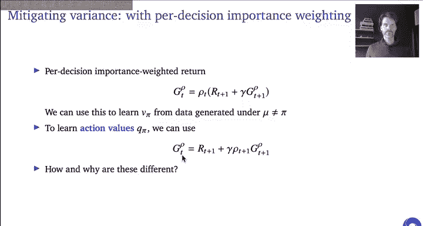

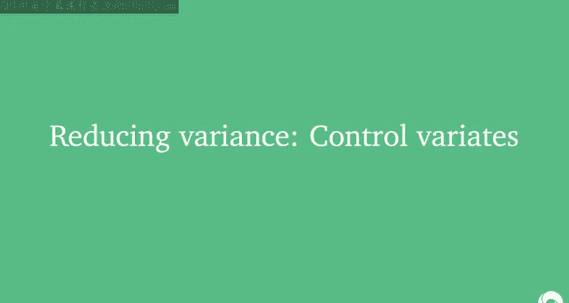

定义重要性采样比 `ρ_t = π(A_t|S_t) / μ(A_t|S_t)`，以及 `ρ_t^{t+n} = Π_{k=t}^{t+n} ρ_k`。

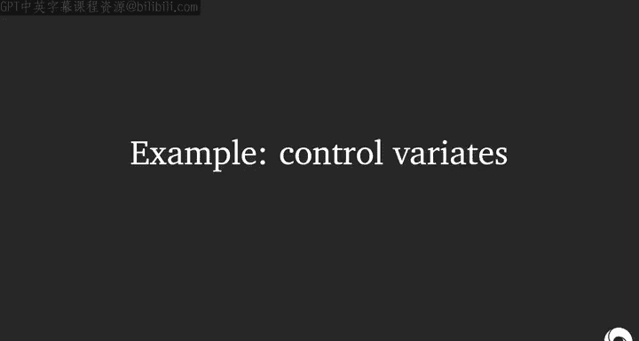

对于蒙特卡洛回报 `G_t = Σ_{k=0}^{T-t-1} γ^k R_{t+k+1}`，朴素的全轨迹校正为 `Ĝ_t = ρ_t^{T-1} * G_t`。

**每决策重要性采样**则将其改写为：
`Ĝ_t^{PD} = Σ_{k=0}^{T-t-1} γ^k * ρ_t^{t+k} * R_{t+k+1}`

这可以递归地定义为：
`Ĝ_t^{PD} = ρ_t * (R_{t+1} + γ * Ĝ_{t+1}^{PD})`

对于动作价值函数 `Q(s, a)` 的估计，由于第一个动作已给定（条件于 `A_t = a`），校正从下一步开始：
`Ĝ_t^{PD-Q} = R_{t+1} + γ * ρ_{t+1} * Ĝ_{t+1}^{PD-Q}`

每决策重要性采样减少了不必要的权重乘积，通常能有效降低方差。

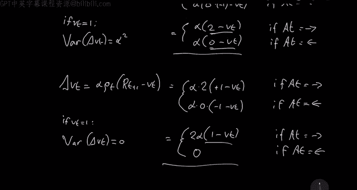

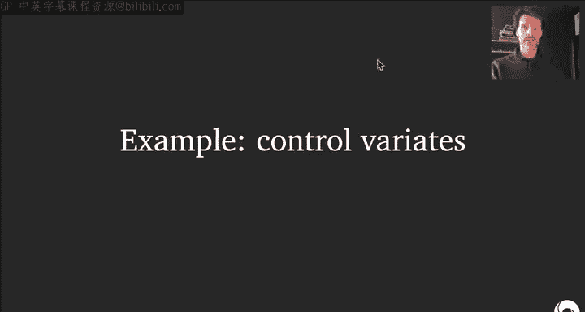

### 缓解策略2：控制变量（误差加权）

**核心思想**：在TD更新中，对误差项进行重要性加权，而非直接对回报进行加权。这相当于在原始重要性采样估计上添加了一个期望为零的项（控制变量），从而在不改变期望的情况下降低方差。

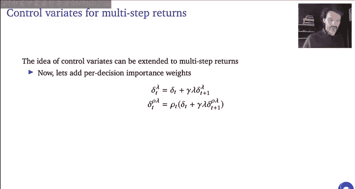

考虑单步TD误差。朴素的重要性采样更新为：
`ΔV(S_t) = α * [ρ_t * R_{t+1} - V(S_t)]`

**误差加权**更新为：
`ΔV(S_t) = α * ρ_t * [R_{t+1} + γ * V(S_{t+1}) - V(S_t)]`

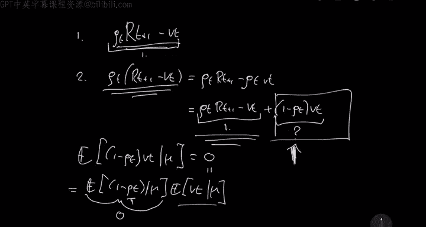

可以证明，后者等于前者加上一个期望为零的项 `(1 - ρ_t) * V(S_t)`。这个附加项与原始估计相关，能够抵消部分方差。在许多实际情况下，误差加权能带来更低的方差。

对于多步情况（λ-回报），我们可以定义离策略的λ-误差 `δ_t^{ρλ}`，并递归地应用误差加权思想。

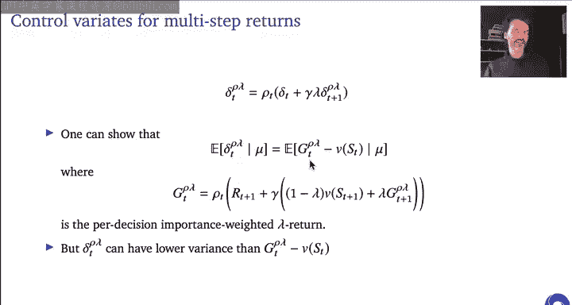

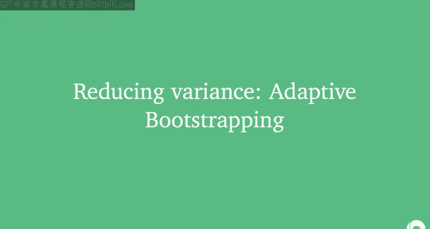

### 缓解策略3：自适应自举

**核心思想**：动态调整自举程度（λ参数），在重要性采样比很大（即严重偏离目标策略）时更多地自举（减小λ），以截断高方差的多步回报；在偏离不大时则使用更长的多步回报（增大λ）。

具体方法是定义时间相关的 `λ_t`，并令其满足：
`λ_t * ρ_t ≤ 1`
即：
`λ_t = min(1, 1/ρ_t)`

这意味着：
*   当 `ρ_t ≤ 1`（行为策略比目标策略更可能采取该动作），我们设 `λ_t = 1`，继续使用后续回报。
*   当 `ρ_t > 1`（行为策略罕见但目标策略常见），我们设 `λ_t = 1/ρ_t < 1`，增加自举，截断回报。

这种方法被称为**V-trace**或**自适应λ TD**，在深度强化学习（特别是策略梯度方法）中非常常用，能有效平衡偏差和方差。

### 另一种思路：树回溯算法

树回溯算法是另一种离策略多步学习方法。它不直接使用重要性采样比，而是基于贝尔曼方程，在更新时，对于实际采样的动作，使用采样到的回报；对于未采样的动作，则使用当前的价值估计值，并按目标策略的概率进行加权。

其递归更新目标为：
`G_t^{TB} = R_{t+1} + γ * Σ_{a ≠ A_{t+1}} π(a|S_{t+1}) * Q(S_{t+1}, a) + γ * π(A_{t+1}|S_{t+1}) * G_{t+1}^{TB}`

树回溯是无偏且低方差的（因为没有重要性采样比中的除法操作）。但当行为策略与目标策略差异很大时，它可能过早自举，同样需要警惕“致命三要素”问题。

---

## 问题二：致命三要素与发散

“致命三要素”指的是当**自举**、**函数近似**和**离策略学习**三者结合时，学习过程可能发散。

**示例**：一个两状态MDP，特征设计不当，使用线性函数近似的TD(0)进行离策略更新，会导致权重无限增长或衰减至无穷。

**解决方案**：
*   **减少自举**：使用更大的λ（更接近蒙特卡洛）可以缓解甚至避免发散。例如，在特定条件下，只要λ大于某个阈值，学习就是收敛的。
*   **算法改进**：诸如V-trace、树回溯、梯度TD等方法都在一定程度上试图解决此问题。如何最好地处理“致命三要素”仍是当前的研究前沿。

---

## 总结

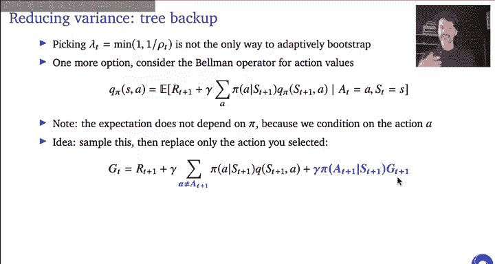

本节课我们一起深入探讨了离策略学习和多步更新：

1.  **动机**：离策略学习允许我们从非目标策略的数据中学习，对于探索、经验回放、策略梯度校正等都至关重要。
2.  **基础方法**：使用重要性采样对多步回报进行校正，以得到目标策略下的无偏估计。
3.  **核心挑战——高方差**：重要性采样会显著增加估计方差。我们介绍了三种主要缓解策略：
    *   **每决策重要性采样**：只为必要的奖励施加重要性权重。
    *   **控制变量（误差加权）**：对TD误差进行加权，而非直接加权回报，以降低方差。
    *   **自适应自举**：根据重要性采样比动态调整λ，在严重离策略时增加自举来截断高方差回报（如V-trace方法）。
4.  **核心挑战——致命三要素**：自举、函数近似和离策略结合可能导致发散。可以通过减少自举程度或使用改进的算法来应对。

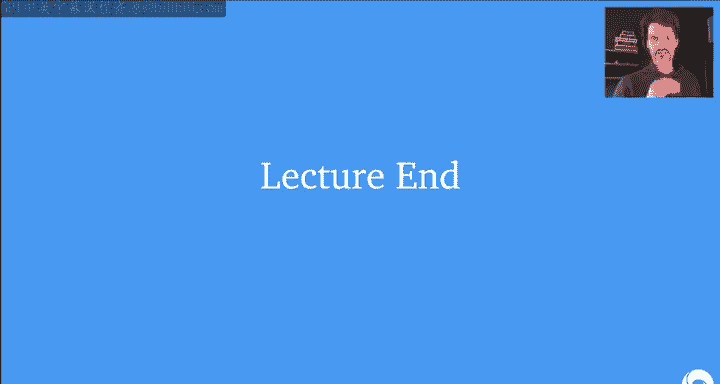

离策略多步学习是构建高效、稳定强化学习算法的关键，理解其原理和挑战有助于我们设计和选择更合适的算法。